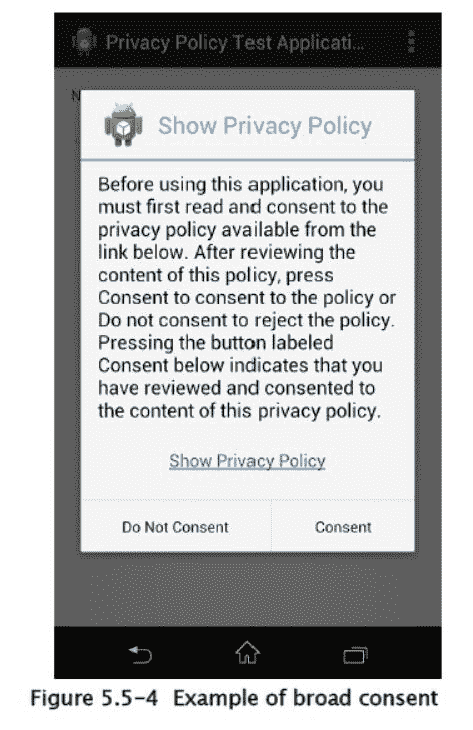
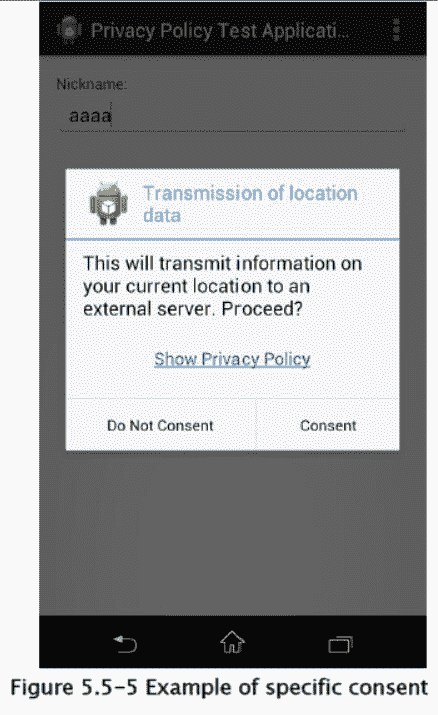
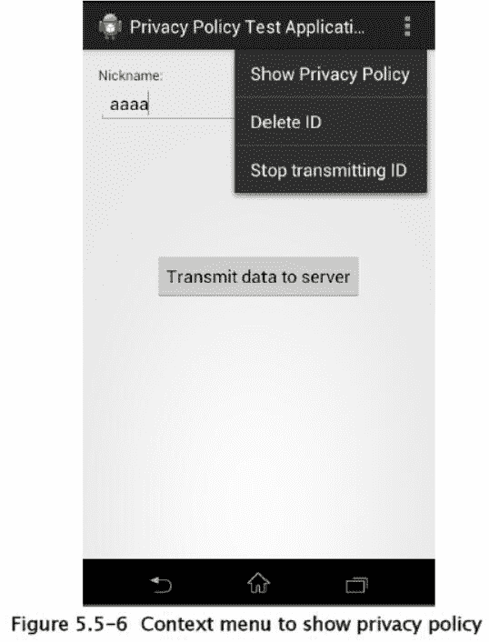
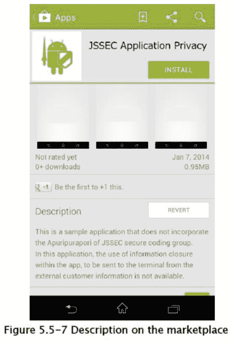

### 5.5.2 处理隐私数据 规则书

> 原书：[Android Application Secure Design/Secure Coding Guidebook](http://www.jssec.org/dl/android_securecoding_en.pdf)
> 
> 译者：[飞龙](https://github.com/wizardforcel)
> 
> 协议：[CC BY-NC-SA 4.0](http://creativecommons.org/licenses/by-nc-sa/4.0/)

处理隐私策略时，遵循以下规则：

#### 5.5.2.1 将用户数据的传输限制为最低需求（必需）

将使用数据传输到外部服务器或其他目标时，将传输限制在提供服务的最低需求。 特别是，你应该设计为，应用只能访问这些用户数据，用户可以根据应用描述来想象它们的使用目的。

例如，用户可以想象，它是个警报应用，但不能访问位置数据。另一方面，如果警报应用可以根据用户的位置发出警报，并将其功能写入应用的描述中，则应用可以访问位置数据。

在只需要在应用中访问信息的情况下，避免将信息传输到外部，并采取其他措施来减少无意中泄漏用户数据的可能性。

#### 5.5.2.2 在首次加载（或应用更新）时，获得广泛同意来传输需要特别细致处理或用户可能难以更改的用户数据（必需）

如果应用向外部服务器，传输用户可能难以更改的任何用户数据，或需要特别细致处理的任何用户数据，则应用必须在用户开始使用之前，获得用户的预先同意（选择性加入） - 通知用户哪些类型的信息将被发送到服务器，以及是否会涉及任何第三方厂商。 更具体地说，首次启动时，应用应显示其应用隐私政策并确认该用户已阅读并同意。 此外，无论何时应用更新，通过将新类型的用户数据传输到外部服务器，它都必须再次确认用户已经阅读并同意这些更改。 如果用户不同意，应用应该终止或以其他方式采取措施，来确保所有需要传输数据的功能都被禁用。

这些步骤可以确保，用户了解他们在使用应用时如何处理数据，为用户提供安全感并增强他们对应用的信任。

MainActivity.java

```
protected void onStart() {
    super.onStart();

    // (some portions omitted)

    if (privacyPolicyAgreed <= VERSION_TO_SHOW_COMPREHENSIVE_AGREEMENT_ANEW) {
        // *** POINT *** On first launch (or application update), obtain broad consent to transmit user data that will be handled by the application.
        // When the application is updated, it is only necessary to renew the user’s grant of broad consent if the updated application will handle new types of user data.
        ConfirmFragment dialog = ConfirmFragment.newInstance(
            R.string.privacyPolicy, R.string.agreePrivacyPolicy,
            DIALOG_TYPE_COMPREHENSIVE_AGREEMENT);
        dialog.setDialogListener(this);
        FragmentManager fragmentManager = getSupportFragmentManager();
        dialog.show(fragmentManager, "dialog");
    }
```



#### 5.5.2.3 在传输需要特殊处理的用户数据之前获得特定的同意（必需）

向外部服务器传输任何需要特别细致处理的用户数据时，除了需要获得一般同意之外，应用必须获得用户对每种这类用户数据（或涉及传输用户数据的每个功能）的预先同意（选择性加入）。 如果用户不同意，则应用不得将相应的数据发送到外部服务器。 这确保用户可以更全面地了解应用的功能（及其提供的服务）和用户对其授予一般同意的，用户数据的传输之间的关系；同时，应用提厂商可以基于更精确的决策，预计获得用户的同意。

MainActivity.java

```
public void onSendToServer(View view) {
    // *** POINT *** Obtain specific consent before transmitting user data that requires particularly delicate handling.
    ConfirmFragment dialog = ConfirmFragment.newInstance(R.string.sendLocation, R.string.cofi
    rmSendLocation, DIALOG_TYPE_PRE_CONFIRMATION);
    dialog.setDialogListener(this);
    FragmentManager fragmentManager = getSupportFragmentManager();
    dialog.show(fragmentManager, "dialog");
}
```



#### 5.5.2.4 向用户提供查看应用隐私策略的方法（必需）

一般来说，Android 应用市场将提供应用隐私策略的链接，供用户在选择安装相应的应用之前进行复查。 除了支持此功能之外，应用还需要提供一些方法，用户在设备上安装应用后，可以查看应用隐私策略。 特别重要的是提供一些方法，用户可以轻易复查应用隐私政策。在同意的情况下，将用户数据传输到外部服务器来协助用户作出适当决定。

MainActivity.java

```
@Override
public boolean onOptionsItemSelected(MenuItem item) {
    switch (item.getItemId()) {
        case R.id.action_show_pp:
            // *** POINT *** Provide methods by which the user can review the application privacy policy.
            Intent intent = new Intent();
            intent.setClass(this, WebViewAssetsActivity.class);
            startActivity(intent);
            return true;
```



#### 5.5.2.5 在素材文件夹中放置应用隐私策略的摘要版本（推荐）

将应用隐私策略的摘要版本放在素材文件夹中，来确保用户可以按需对其进行复查，这是一个不错的主意。 确保素材文件夹中存在应用隐私策略，不仅可以让用户随时轻松访问它，还可以避免用户看到由恶意第三方准备的应用隐私策略的伪造或损坏版本的风险。

#### 5.5.2.6 提供可以删除传输的数据的方法，以及可以通过用户操作停止数据传输的方法（推荐）

提供根据用户需要，删除传输到外部服务器的用户数据的方法，是一个好主意。与之相似，在应用本身已经在设备内存储用户数据（或其副本）的情况下，向用户提供用于删除该数据的方法是一个好主意。而且，提供可以根据用户要求停止用户数据发送的方法，是一个好主意。

这一规则（建议）由欧盟推行的“被遗忘权”编纂而成；更普遍的是，在未来，各种提案将要求进一步加强用户保护其数据的权利，这看起来很明显。为此在这些指导方针中，我们建议提供删除用户数据的方法，除非有一些具体原因不能这样做。并且，停止数据传输，主要由浏览器的对应观点“不追踪（否定追踪）”定义。

MainActivity.java

```
 @Override
public boolean onOptionsItemSelected(MenuItem item) {
    switch (item.getItemId()) {
        (some portions omitted)

        case R.id.action_del_id:
            // *** POINT *** Provide methods by which transmitted data can be deleted by user
            operations.
            new SendDataAsyncTack().execute(DEL_ID_URI, UserId);
            return true;
    }
```

#### 5.5.2.7 从 UUID 和 Cookie 中分离设备特定的 ID（推荐）

不应通过与用户数据绑定的方式传输 IMEI 和其他设备特定 ID。 事实上，如果一个设备特定的 ID 和一段用户数据被捆绑在一起，并发布或泄露给公众 - 即使只有一次 - 随后也不可能改变该设备特定的 ID，因此对于把 ID 和用户数据绑定的服务器来说，这是不可能的（或至少 很难）。 在这种情况下，最好使用 UUID 或 cookie（即每次基于随机数重新生成的变量 ID），与用户数据一起传输时代替设备特定的 ID。 这允许实现上面讨论的“被遗忘的权利”的概念。

MainActivity.java

```
@Override
protected String doInBackground(String... params) {
    // *** POINT *** Use UUIDs or cookies to keep track of user data
    // In this sample we use an ID generated on the server side
    SharedPreferences sp = getSharedPreferences(PRIVACY_POLICY_PREF_NAME, MODE_PRIVATE);
    UserId = sp.getString(ID_KEY, null);
    if (UserId == null) {
        // No token in SharedPreferences; fetch ID from server
        try {
            UserId = NetworkUtil.getCookie(GET_ID_URI, "", "id");
        } catch (IOException e) {
            // Catch exceptions such as certification errors
            extMessage = e.toString();
        }
        // Store the fetched ID in SharedPreferences
        sp.edit().putString(ID_KEY, UserId).commit();
    }
    return UserId;
}
```

#### 5.5.2.8 如果你只在设备内使用用户数据，请通知用户，数据不会传输到外部（推荐）

即使在用户数据只在用户设备中临时访问的情况下，向用户传达这一事实也是一个好主意，来确保用户充分和透明地理解了应用行为。 更具体来说，应该告知用户，应用访问的用户数据只在设备内用于特定的目的，不会被存储或发送。 将此内容传达给用户的可能方法，包括在应用市场上的应用描述中指定它。 仅在设备中临时使用的信息，不需要在应用隐私策略中讨论。

