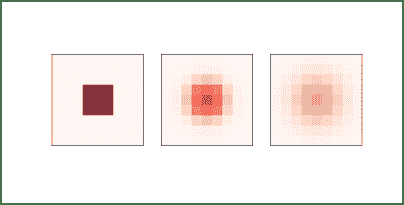
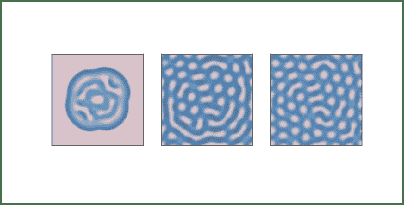
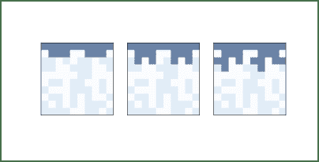
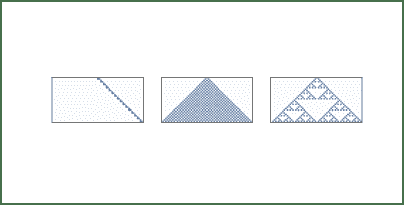
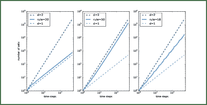
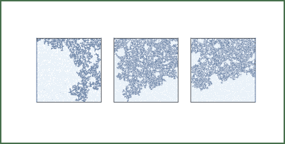
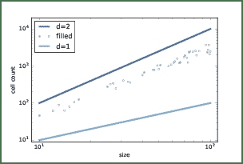

# 七、物理建模

> 原文：[Chapter 7 Physical modeling](http://greenteapress.com/complexity2/html/thinkcomplexity2008.html)
> 
> 译者：[飞龙](https://github.com/wizardforcel)
> 
> 协议：[CC BY-NC-SA 4.0](http://creativecommons.org/licenses/by-nc-sa/4.0/)
> 
> 自豪地采用[谷歌翻译](https://translate.google.cn/)

到目前为止，我们所看到的细胞自动机不是物理模型；也就是说，他们不打算描述现实世界中的系统。 但是一些 CA 用作物理模型。

在本章中，我们考虑一个 CA，它模拟扩散（散开）并相互反应的化学物质，这是 Alan Turing 提出的过程，用于解释一些动物模式如何发展。

我们将试验一种 CA，它模拟通过多孔材料的渗透液体，例如通过咖啡渣的水。 这个模型是展示相变行为和分形几何的几个模型中的第一个，我将解释这两者的含义。

本章的代码位于本书仓库的`chap07.ipynb`中。 使用代码的更多信息，请参见第？节。

## 7.1 扩散

1952 年，艾伦图灵发表了一篇名为“形态发生的化学基础”的论文，该论文描述了涉及两种化学物质的系统行为，它们在空间中扩散并相互反应。 他表明，这些系统根据扩散和反应速率产生了广泛的模式，并推测像这样的系统可能是生物生长过程中的重要机制，特别是动物着色模式的发展。

图灵模型基于微分方程，但也可以使用细胞自动机来实现。

但在我们开始使用图灵模型之前，我们先从简单的事情开始：只有一种化学物质的扩散系统。 我们将使用 2-D CA，其中每个细胞的状态是连续的数量（通常在 0 和 1 之间），表示化学物质的浓度。

我们将通过比较每个细胞与其邻居的均值，来建模扩散过程。 如果中心细胞的浓度超过领域均值，则化学物质从中心流向邻居。 如果中心细胞的浓度较低，则化学物质以另一种方式流动。

以下核计算每个细胞与其邻居均值之间的差异：

```
 kernel = np.array([[0, 1, 0],
                   [1,-4, 1],
                   [0, 1, 0]])
```

使用`np.correlate2d`，我们可以将这个核应用于数组中的每个细胞：

```
 c = correlate2d(array, kernel, mode='same')
```

我们将使用一个扩散常数`r`，它关联了浓度差与流速：

```
array += r * c
```



图 7.1：0，5 和 10 步后的简单扩散模型

图？显示 CA 的结果，其中`n=9, r=0.1`，除了中间的“岛”外，初始浓度为 0。 该图显示了 CA 的启动状态，以及 5 步和 10 步之后的状态。 化学物质从中心向外扩散，直到各处浓度相同。

## 7.2 反应扩散

现在我们添加第二种化学物。 我将定义一个新对象`ReactionDiffusion`，它包含两个数组，每个化学物对应一个：

```
 class ReactionDiffusion(Cell2D):

   def __init__(self, n, m, params):
        self.params = params
        self.array = np.ones((n, m), dtype=float)
        self.array2 = np.zeros((n, m), dtype=float)
        island(self.array2, val=0.1, noise=0.1)
```

`n`和`m`是数组中的行数和列数。 `params`是参数元组，下面我会解释它。

数组代表第一种化学物质`A`的浓度，它最初是无处不在的。

`array2`表示`B`的浓度，除了中间的一个岛屿，它初始为零，并且由`island`初始化：

```
 def island(a, val, noise):
    n, m = a.shape
    r = min(n, m) // 20
    a[n//2-r:n//2+r, m//2-r:m//2+r] = val
    a += noise * np.random.random((n, m))
```

岛的半径`r`是`n`或`m`的二十分之一，以较小者为准。 岛的高度是`val`，在这个例子中是`0.1`。 此外，随机均匀噪声（值为 0 到`noise`）添加到整个数组。

这里是更新数组的`step`函数：

```
def step(self):
    """Executes one time step."""
    A = self.array
    B = self.array2
    ra, rb, f, k = self.params

    cA = correlate2d(A, self.kernel, **self.options)
    cB = correlate2d(B, self.kernel, **self.options)

    reaction = A * B**2
    self.array += ra * cA - reaction + f * (1-A)
    self.array2 += rb * cB + reaction - (f+k) * B
```

参数是

`ra`：

`A`的扩散速率（类似于前一节中的`r`）。

`rb`：

`B`的扩散速率。在该模型的大多数版本中，`rb`约为`ra`的一半。

`f`：

进给速率，控制着`A`添加到系统的速度。

`k`：

移除速率，控制`B`从系统中移除的速度。

现在让我们仔细看看更新语句：

```
 reaction = A * B**2
self.array += ra * cA - reaction + f * (1-A)
self.array2 += rb * cB + reaction - (f+k) * B
```

数组`cA`和`cB`是将扩散核应用于`A`和`B`的结果。乘以`ra`和`rb`得出进入或离开每个细胞的扩散速率。

表达式`A * B ** 2`表示`A`和`B`相互反应的比率。 假设反应消耗`A`并产生`B`，我们在第一个方程中减去这个项并在第二个方程中加上它。

表达式`f * (1-A)`决定`A`加入系统的速率。 当`A`接近 0 时，最大进给速率为`f`。 当`A`接近 1 时，进给速率下降到零。

最后，表达式`(f+k) * B`决定`B`从系统中移除的速率。 当`B`接近 0 时，该比率变为零。

只要速率参数不太高，`A`和`B`的值通常保持在 0 和 1 之间。



图 7.2：1000，2000 和 4000 步之后的反应扩散模型，参数为`f=0.035`和`k=0.057`

使用不同的参数，该模型可以产生类似于各种动物身上的条纹和斑点的图案。 在某些情况下，相似性是惊人的，特别是当进给和移除参数在空间上变化时。

对于本节中的所有模拟，`ra = 0.5`，`rb = 0.25`。

图？显示了`f=0.035`和`k=0.057`的结果，`B`的浓度以较暗的颜色显示。 有了这些参数，系统就向稳定状态演化，在`B`的黑色背景上有`A`的光点。


图 7.3：1000，2000 和 4000 步之后的反应扩散模型，参数为`f=0.055`和`k=0.062`

图？显示了`f = 0.055`和`k = 0.062`的结果，在`A`的背景上产生了珊瑚样的`B`。


图 7.4：1000，2000 和 4000 步之后的反应扩散模型，参数为`f=0.039`和`k=0.065`

图？显示了`f = 0.039`和`k = 0.065`的结果。 在类似于有丝分裂的过程中，这些参数产生的`B`点生长和分裂，最后形成稳定的等距点图案。

1952 年以来，观察和实验为图灵猜想提供了一些支持。 目前为止，看起来许多动物图案实际上由某种反应扩散过程形成，但尚未证实。

## 7.3 渗流

渗流是流体流过半多孔材料的过程。 实例包括岩层中的油，纸中的水和微孔中的氢气。 渗流模型也用于研究不是严格渗滤的系统，包括流行病和电阻网络。 请见 [http://en.wikipedia.org/wiki/Percolation_theory](http://en.wikipedia.org/wiki/Percolation_theory)。

渗流模型常常用随机图来表示，就像我们在第？章中看到的那样，但它们也可以用细胞自动机表示。 在接下来的几节中，我们将探索模拟渗流的 2-D CA。

在这个模型中：

*   最初，每个细胞是概率为`p`的“多孔”或者“无孔”，并且除了顶部那行是“湿的”之外，所有单元都是“干的”。
*   在每个时间步骤中，如果多孔细胞至少有一个湿的邻居，它会变湿。 非多孔细胞保持干燥。
*   模拟运行直至达到不再有细胞改变状态的“固定点”。

如果存在从顶部到底部的湿细胞路径，我们说 CA 具有“渗流簇”。

渗流的一个主要问题是，找到渗流簇的概率以及它如何依赖于`p`。 这个问题可能会让你想起第？节，其中我们计算了随机 ER 图连接的概率。 我们会看到这两个模型之间的几个关系。

我定义了一个新类来表示渗流模型：

```
 class Percolation(Cell2D):

    def __init__(self, n, m, p):
        self.p = p
        self.array = np.random.choice([0, 1], (n, m), p=[1-p, p])
        self.array[0] = 5
```

`n`和`m`是 CA 中的行数和列数。 `p`是细胞为多孔的概率。

CA 的状态存储在数组中，该数组使用`np.random.choice`初始化，以概率`p`选择 1（多孔），以概率`1-p`选择 0（无孔）。 顶部那行的状态设置为 5，表示一个湿细胞。

在每个时间步骤中，我们使用 4 细胞邻域（不包括对角线）来检查任何多孔细胞是否拥有湿的邻居。 这是核：

```
 kernel = np.array([[0, 1, 0],
                   [1, 0, 1],
                   [0, 1, 0]])
```

这里是`step`函数：

`correlate2d`将邻居的状态相加，如果至少有一个邻居是湿的，那么至少大于 5。 最后一行寻找多孔的细胞，`a == 1`，并且至少有一个湿邻居，`c >= 5`，并将它们的状态设置为 5，这代表湿的。



图 7.5：渗流模型的前三个步骤，其中`n=10`和`p=0.5`

图？显示了`n = 10`和`p = 0.5`的渗流模型的前几个步骤。 非多孔细胞为白色，多孔细胞为浅色，湿细胞为深色。

## 7.4 相变

现在让我们测试 CA 是否包含渗流簇。

```
 def test_perc(perc):
    num_wet = perc.num_wet()

    num_steps = 0
    while True:
        perc.step()
        num_steps += 1

        if perc.bottom_row_wet():
            return True, num_steps

        new_num_wet = perc.num_wet()
        if new_num_wet == num_wet:
            return False, num_steps

        num_wet = new_num_wet
```

`test_perc`接受`Percolation`对象作为参数。 每次循环中，它都会使 CA 前进一个时间步骤。 它检查底部那行，看看有没有湿的细胞；如果有，它返回`True`，表示存在渗透簇，以及`num_steps`，它是到达底部所需的时间步数。

在每个时间步骤中，它还计算湿细胞的数量并检查自上一步以来数量是否增加。 如果没有，我们已经到达了固定点，而没有找到一个渗流簇，所以我们返回`False`。

为了估计渗流簇的概率，我们生成许多随机初始状态并测试它们：

```
 def estimate_prob_percolating(p=0.5, n=100, iters=100):
    count = 0
    for i in range(iters):
        perc = Percolation(n, p=p)
        flag, _ = test_perc(perc)
        if flag:
            count += 1

    return count / iters
```

`estimate_prob_percolating`使用给定的`p`和`n`值生成 100 个 CA，并调用`test_perc`来查看其中有多少个具有渗流簇。 返回值是拥有的 CA 的比例。

当`p = 0.55`时，渗滤簇的概率接近于 0。`p = 0.60`时，它约为 70%，而在`p = 0.65`时，它接近于 1。这种快速转变表明`p`的临界值接近 0.6。

我们可以更精确地使用随机游走来估计临界值。 从`p`的初始值开始，我们构造一个`Percolation`对象并检查它是否具有渗透簇。 如果是这样，`p`可能太高，所以我们减少它。 如果不是，`p`可能太低，所以我们增加它。

这里是代码：

```
 def find_critical(p=0.6, n=100, iters=100):
    ps = [p]
    for i in range(iters):
        perc = Percolation(n=n, p=p)
        flag, _ = test_perc(perc)
        if flag:
            p -= 0.005
        else:
            p += 0.005
        ps.append(p)
    return ps
```

`find_critical`以`p`的给定值开始并上下调整，返回值的列表。 当`n = 100`时，`ps`的平均值约为 0.59，对于从 50 到 400 的`n`值，这个临界值似乎是一样的。

临界值附近的行为的快速变化称为相变，类似于物理系统中的相变，例如水在冰点处从液体变为固体的方式。

在处于或接近临界点时，各种各样的系统展示了一组共同的行为和特征。这些行为被统称为临界现象。 在下一节中，我们将探究其中的一个：分形几何。

## 7.5 分形

为了理解分形，我们必须从维度开始。

对于简单的几何对象，维度根据缩放行为而定义。 例如，如果正方形的边长为`l`，则其面积为`l ** 2`。 指数 2 表示正方形是二维的。 同样，如果立方体的边长为`l`，则其体积为`l ** 3`，这表示立方体是三维的。

更一般来说，我们可以通过测量一个对象的“尺寸”（通过一些定义），将对象的维度估计为线性度量的函数。

例如，我将通过测量一维细胞自动机的面积（“开”细胞的总数），将它的维度估计为行数的函数。



图 7.6：32 个时间步之后，规则为 20，50 和 18 的一维 CA。

图？展示了三个一维 CA，就像我们在第？节中看到的那样。 规则 20（左）产生一组看似线性的细胞，所以我们预计它是一维的。 规则 50（中）产生类似于三角形的东西，所以我们预计它是二维的。 规则 18（右）也产生类似三角形的东西，但密度不均匀，所以其缩放行为并不明显。

我将用以下函数来估计这些 CA 的维度，该函数计算每个时间步之后的细胞数。 它返回一个元组列表，其中每个元组包含`i`和`i ** 2`，用于比较，以及细胞总数。

```
def count_cells(rule, n=500):
    ca = Cell1D(rule, n)
    ca.start_single()

    res = []
    for i in range(1, n):
        cells = np.sum(ca.array)
        res.append((i, i**2, cells))
        ca.step()

    return res
```



图 7.7：规则 20，50 和 18 的“开”细胞的数量与时间步数。

图？展示以双对数刻度绘制的结果。

在每幅图中，顶部虚线表示`y = i ** 2`。 两边取对数，我们得到`logy = 2logi`。 由于该数字在双对数刻度上，因此直线的斜率为2。

同样，底部的虚线表示`y = i`。 在双对数刻度上，直线的斜率为 1。

规则 20（左）每两个时间步骤产生三个细胞，所以`i`步后的细胞总数为`y = 1.5 i`。 两边取对数，我们得到`logy = log1.5 + logi`，所以在双对数刻度上，我们期待一条斜率为 1 的线。实际上，线的估计的斜率为 1.01。

规则 50（中）在第`i`个时间步骤中产生`i + 1`个新细胞，因此`i`步之后的细胞总数为`y = i ** 2 + i`。 如果我们忽略第二项并取两边的对数，我们有`logy ~ 2 logi`，所以当`i`变大时，我们预计看到一条斜率为 2 的线。事实上，估计的斜率为 1.97。

最后，对于规则 18（右），估计的斜率大约是 1.57，这显然不是 1，2 或任何其他整数。 这表明规则 18 生成的图案具有“分数维度”；也就是说，它是一个分形。

## 7.6 分形和渗流模型



图 7.8：`p=0.6`和`n=100, 200, 300`的渗流模型

现在让我们回到渗透模型。 图？展示了`p = 0.6`和`n = 100, 200, 300`的渗流模型中的湿细胞簇。非正式来说，它们类似于在自然界和数学模型中看到的分形模式。

为了估计它们的分形维度，我们可以运行一系列尺寸的 CA，计算每个渗流簇中湿细胞的数量，然后看看随着我们增加 CA 的大小，细胞计数的规模如何增长。

以下循环运行了模拟：

```
 for size in sizes:
    perc = Percolation(size, p=p)
    flag, _ = test_perc(perc)
    if flag:
        num_filled = perc.num_wet() - size
        res.append((size, size**2, num_filled))
```

结果是元组列表，其中每个元组包含`size`和`size ** 2`，用于比较，以及渗流簇中的细胞数（不包括顶行中的初始湿细胞）。



图 7.9：渗流簇中的细胞数量与 CA 大小

图？展示了 10 到 100 范围内的结果。点展示了每个渗流簇中的细胞数。 拟合这些点的线的斜率大约为 1.85，这表明当`p`接近临界值时，渗滤簇实际上是分形的。

当`p`大于临界值时，几乎每个多孔细胞都被填充，因此湿单元的数量仅为`p * size ** 2`，它的维度为 2。

当`p`远小于临界值时，湿细胞的数量与 CA 的线性大小成比例，因此它的维度为 1。

## 7.7 练习

练习 1

在第？节中，我们发现 CA 规则 18 产生了一个分形。 你能找到其他产生分形的一维 CA 吗？

注意：`Cell1D.py`中的`Cell1D`对象不会从左边绕到右边，对于某些规则它在边界上创建了手工艺品 [?]。你可能想要使用`Wrap1D`，它是`Cell1D`的子类。 它也在`Cell1D.py`中定义。

练习 2

1990 年，Bak，Chen 和 Tang 提出了一种细胞自动机，它是一种森林火灾的抽象模型。 每个细胞处于三种状态之一：空，被树占用或着火。

CA 的规则是：

*   空细胞以概率`p`被占用。
*   如果任何一个邻居着火，那么带有树的细胞就会燃烧。
*   即使没有邻居着火，带有树的细胞自发燃烧，概率为`f`。
*   在下一个时间步骤中，着火的细胞变为空细胞。

编写一个实现这个模型的程序。 你可能想要继承`Cell2D`。 参数的常用值为`p = 0.01`和`f = 0.001`，但你可能想要尝试其他值。

从随机初始条件开始，运行 CA 直到它达到稳定状态，树的数量不再持续增加或减少。

在稳定状态下，森林分形的几何形状是什么？ 它的分形维度是多少？