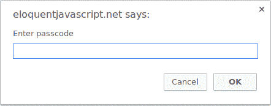

## 二、程序结构

> 原文：[Program Structure](http://eloquentjavascript.net/02_program_structure.html)
> 
> 译者：[飞龙](https://github.com/wizardforcel)
> 
> 协议：[CC BY-NC-SA 4.0](http://creativecommons.org/licenses/by-nc-sa/4.0/)
> 
> 自豪地采用[谷歌翻译](https://translate.google.cn/)
> 
> 部分参考了[《JavaScript 编程精解（第 2 版）》](https://book.douban.com/subject/26707144/)
> 
> And my heart glows bright red under my filmy, translucent skin and they have to administer 10cc of JavaScript to get me to come back. (I respond well to toxins in the blood.) Man, that stuff will kick the peaches right out your gills!
> 
> why，《Why’s (Poignant) Guide to Ruby》


在本章中，我们开始做一些实际上称为编程的事情。 我们将扩展我们对 JavaScript 语言的掌控，超出我们目前所看到的名词和句子片断，直到我们可以表达有意义的散文。

## 表达式和语句

在第 1 章中，我们为它们创建了值，并应用了运算符来获得新的值。 像这样创建值是任何 JavaScript 程序的主要内容。 但是，这种东西必须在更大的结构中构建，才能发挥作用。 这就是我们接下来要做的。

我们把产生值的操作的代码片段称为表达式。按照字面含义编写的值（比如`22`或`"psychoanalysis"`）都是一个表达式。而括号当中的表达式、使用二元运算符连接的表达式或使用一元运算符的表达式，仍然都是表达式。

这展示了一部分基于语言的接口之美。 表达式可以包含其他表达式，其方式非常类似于人类语言的从句嵌套 - 从句可以包含它自己的从句，依此类推。 这允许我们构建描述任意复杂计算的表达式。

如果一个表达式对应一个句子片段，则 JavaScript 语句对应于一个完整的句子。 一个程序是一列语句。

最简单的一条语句由一个表达式和其后的分号组成。比如这就是一个程序：

```
1;
!false;
```

不过，这是一个无用的程序。 表达式可以仅仅满足于产生一个值，然后可以由闭合的代码使用。 一个声明是独立存在的，所以它只有在影响到世界的时候才会成立。 它可以在屏幕上显示某些东西 - 这可以改变世界 - 或者它可以改变机器的内部状态，从而影响后面的语句。 这些变化被称为副作用。 前面例子中的语句仅仅产生值`1`和`true`，然后立即将它们扔掉。 这给世界没有留下什么印象。 当你运行这个程序时，什么都不会发生。

在某些情况下，JavaScript 允许您在语句结尾处省略分号。 在其他情况下，它必须在那里，否则下一行将被视为同一语句的一部分。 何时可以安全省略它的规则有点复杂且容易出错。 所以在本书中，每一个需要分号的语句都会有分号。 至少在你更了解省略分号的细节之前，我建议你也这样做。

## 绑定

程序如何保持内部状态？ 它如何记住东西？ 我们已经看到如何从旧值中产生新值，但这并没有改变旧值，新值必须立即使用，否则将会再度消失。 为了捕获和保存值，JavaScript 提供了一种称为绑定或变量的东西：

```
let caught = 5 * 5;
```

这是第二种语句。 关键字（keyword）`let`表示这个句子打算定义一个绑定。 它后面跟着绑定的名称，如果我们想立即给它一个值，使用`=`运算符和一个表达式。

前面的语句创建一个名为`caught`的绑定，并用它来捕获乘以`5 * 5`所产生的数字。

在定义绑定之后，它的名称可以用作表达式。 这种表达式的值是绑定当前所持有的值。 这是一个例子：

```
let ten = 10;
console.log(ten * ten);
// → 100
```

当绑定指向某个值时，并不意味着它永远与该值绑定。 可以在现有的绑定上随时使用`=`运算符，将它们与当前值断开连接，并让它们指向一个新值：

```
var mood = "light";
console.log(mood);
// → light
mood = "dark";
console.log(mood);
// → dark
```

你应该将绑定想象为触手，而不是盒子。 他们不包含值; 他们捕获值 - 两个绑定可以引用相同的值。 程序只能访问它还在引用的值。 当你需要记住某些东西时，你需要长出一个触手来捕获它，或者你重新贴上你现有的触手之一。

我们来看另一个例子。 为了记住 Luigi 欠你的美元数量，你需要创建一个绑定。 然后当他还你 35 美元时，你赋予这个绑定一个新值：

```
let luigisDebt = 140;
luigisDebt = luigisDebt - 35;
console.log(luigisDebt);
// → 105
```

当你定义一个绑定而没有给它一个值时，触手没有任何东西可以捕获，所以它只能捕获空气。 如果你请求一个空绑定的值，你会得到`undefined`值。

一个`let`语句可以同时定义多个绑定，定义必需用逗号分隔。

```
let one = 1, two = 2;
console.log(one + two);
// → 3
```

`var`和`const`这两个词也可以用来创建绑定，类似于`let`。

```
var name = "Ayda";
const greeting = "Hello ";
console.log(greeting + name);
// → Hello Ayda
```

第一个`var`（“variable”的简写）是 JavaScript 2015 之前声明绑定的方式。 我们在下一章中，会讲到它与`let`的确切的不同之处。 现在，请记住它大部分都做同样的事情，但我们很少在本书中使用它，因为它有一些令人困惑的特性。

`const`这个词代表常量。 它定义了一个不变的绑定，只要它存在，它就指向相同的值。 这对于一些绑定很有用，它们向值提供一个名词，以便之后可以很容易地引用它。

## 绑定名称

绑定名称可以是任何单词。 数字可以是绑定名称的一部分，例如`catch22`是一个有效的名称，但名称不能以数字开头。 绑定名称可能包含美元符号（`$`）或下划线（`_`），但不包含其他标点符号或特殊字符。

具有特殊含义的词，如`let`，是关键字，它们不能用作绑定名称。 在未来的 JavaScript 版本中还有一些“保留供使用”的单词，它们也不能用作绑定名称。 关键字和保留字的完整列表相当长：

```
break case catch class const continue debugger default
delete do else enum export extends false finally for
function if implements import interface in instanceof let
new package private protected public return static super
switch this throw true try typeof var void while with yield
```

不要担心记住这些东西。 创建绑定时会产生意外的语法错误，请查看您是否尝试定义保留字。

## 环境

给定时间中存在的绑定及其值的集合称为环境。 当一个程序启动时，这个环境不是空的。 它总是包含作为语言标准一部分的绑定，并且在大多数情况下，它还具有一些绑定，提供与周围系统交互的方式。 例如，在浏览器中，有一些功函数能可以与当前加载的网站交互并读取鼠标和键盘输入。

## 函数

在默认环境中提供的许多值的类型为函数。 函数是包裹在值中的程序片段。 为了运行包裹的程序，可以将这些值应用于它们。 例如，在浏览器环境中，绑定`prompt`包含一函数，个显示一个小对话框，请求用户输入。 它是这样使用的：

```
prompt("Enter passcode");
```



执行一个函数被称为调用，或应用它（invoke，call，apply）。您可以通过在生成函数值的表达式之后放置括号来调用函数。 通常你会直接使用持有该函数的绑定名称。 括号之间的值被赋予函数内部的程序。 在这个例子中，`prompt`函数使用我们提供的字符串作为文本来显示在对话框中。 赋予函数的值称为参数。 不同的函数可能需要不同的数量或不同类型的参数。

`prompt`函数在现代 Web 编程中用处不大，主要是因为你无法控制所得对话框的外观，但可以在玩具程序和实验中有所帮助。

## `console.log`函数

在例子中，我使用`console.log`来输出值。 大多数 JavaScript 系统（包括所有现代 Web 浏览器和 Node.js）都提供了`console.log`函数，将其参数写入一个文本输出设备。 在浏览器中，输出出现在 JavaScript 控制台中。 浏览器界面的这一部分在默认情况下是隐藏的，但大多数浏览器在您按 F12 或在 Mac 上按 Command-Option-I 时打开它。 如果这不起作用，请在菜单中搜索名为“开发人员工具”或类似的项目。

> 在英文版页面上运行示例（或自己的代码）时，会在示例之后显示`console.log`输出，而不是在浏览器的 JavaScript 控制台中显示。

```
let x = 30;
console.log("the value of x is", x);
// → the value of x is 30
```

尽管绑定名称不能包含句号字符，但是`console.log`确实拥有。 这是因为`console.log`不是一个简单的绑定。 它实际上是一个表达式，它从`console`绑定所持有的值中检索`log`属性。 我们将在第 4 章中弄清楚这意味着什么。

## 返回值

显示对话框或将文字写入屏幕是一个副作用。 由于它们产生的副作用，很多函数都很有用。 函数也可能产生值，在这种情况下，他们不需要有副作用就有用。 例如，函数`Math.max`可以接受任意数量的参数并返回最大值。

```
console.log(Math.max(2, 4));
// → 4
```

当一个函数产生一个值时，它被称为返回该值。 任何产生值的东西都是 JavaScript 中的表达式，这意味着可以在较大的表达式中使用函数调用。 在这里，`Math.min`的调用（与`Math.max`相反）用作加法表达式的一部分：

```
console.log(Math.min(2, 4) + 100);
// → 102
```

我们会在下一章当中讲解如何编写自定义函数。

## 控制流

当你的程序包含多个语句时，这些语句就像是一个故事一样从上到下执行。 这个示例程序有两个语句。 第一个要求用户输入一个数字，第二个在第一个之后执行，显示该数字的平方。

```
let theNumber = Number(prompt("Pick a number"));
console.log("Your number is the square root of " +
            theNumber * theNumber);
```

`Number`函数将一个值转换为一个数字。 我们需要这种转换，因为`prompt`的结果是一个字符串值，我们需要一个数字。 有类似的函数叫做`String`和`Boolean`，它们将值转换为这些类型。

以下是直线控制流程的相当简单的示意图：


## 条件执行

并非所有的程序都是直路。 例如，我们可能想创建一条分叉路，在那里该程序根据当前的情况采取适当的分支。 这被称为条件执行。


在 JavaScript 中，条件执行使用`if`关键字创建。 在简单的情况下，当且仅当某些条件成立时，我们才希望执行一些代码。 例如，仅当输入实际上是一个数字时，我们可能打算显示输入的平方。

```
let theNumber = Number(prompt("Pick a number", ""));
if (!isNaN(theNumber))
  alert("Your number is the square root of " +
        theNumber * theNumber);
```

修改之后，如果您输入`"parrot"`，则不显示输出。

`if`关键字根据布尔表达式的值执行或跳过语句。 决定性的表达式写在关键字之后，括号之间，然后是要执行的语句。

`Number.isNaN`函数是一个标准的 JavaScript 函数，仅当它给出的参数是`NaN`时才返回`true`。 当你给它一个不代表有效数字的字符串时，`Number`函数恰好返回`NaN`。 因此，条件翻译为“如果`theNumber`是一个数字，那么这样做”。

在这个例子中，`if`下面的语句被大括号（`{`和`}`）括起来。 它们可用于将任意数量的语句分组到单个语句中，称为代码块。 在这种情况下，你也可以忽略它们，因为它们只包含一个语句，但为了避免必须考虑是否需要，大多数 JavaScript 程 序员在每个这样的被包裹的语句中使用它们。 除了偶尔的一行，我们在本书中大多会遵循这个约定。

```
if (1 + 1 == 2) console.log("It's true");
// → It's true
```

您通常不会只执行条件成立时代码，还会处理其他情况的代码。 该替代路径由图中的第二个箭头表示。 可以一起使用`if`和`else`关键字，创建两个单独的替代执行路径。

```
let theNumber = Number(prompt("Pick a number"));
if (!Number.isNaN(theNumber)) {
  console.log("Your number is the square root of " +
              theNumber * theNumber);
} else {
  console.log("Hey. Why didn't you give me a number?");
}
```

如果我们需要执行的路径多于两条，可以将多个`if/else`对链接在一起使用。如下所示例子：

```
let num = Number(prompt("Pick a number", "0"));

if (num < 10) {
  console.log("Small");
} else if (num < 100) {
  console.log("Medium");
} else {
  console.log("Large");
}
```

该程序首先会检查`num`是否小于 10。如果条件成立，则执行显示`"Small"`的这条路径；如果不成立，则选择`else`分支，`else`分支自身包含了第二个`if`。如果第二个条件即`num`小于 100 成立，且数字的范围在 10 到 100 之间，则执行显示`"Medium"`的这条路径。如果上述条件均不满足，则执行最后一条`else`分支路径。

这个程序的模式看起来像这样：


## `while`和`do`循环

现考虑编写一个程序，输出 0 到 12 之间的所有偶数。其中一种编写方式如下所示：

```
console.log(0);
console.log(2);
console.log(4);
console.log(6);
console.log(8);
console.log(10);
console.log(12);
```

该程序确实可以工作，但编程的目的在于减少工作量，而非增加。如果我们需要小于 1000 的偶数，上面的方式是不可行的。我们现在所需的是重复执行某些代码的方法，我们将这种控制流程称为循环。


我们可以使用循环控制流来让程序执行回到之前的某个位置，并根据程序状态循环执行代码。如果我们在循环中使用一个绑定计数，那么就可以按照如下方式编写代码：

```
let number = 0;
while (number <= 12) {
  console.log(number);
  number = number + 2;
}
// → 0
// → 2
//   … etcetera
```

循环语句以关键字`while`开头。在关键字`while`后紧跟一个用括号括起来的表达式，括号后紧跟一条语句，这种形式与`if`语句类似。只要表达式产生的值转换为布尔值后为`true`，该循环会持续进入括号后面的语句。

`number`绑定演示了绑定可以跟踪程序进度的方式。 每次循环重复时，`number`的值都比以前的值多 2。 在每次重复开始时，将其与数字 12 进行比较来决定程序的工作是否完成。

作为一个实际上有用的例子，现在我们可以编写一个程序来计算并显示`2**10`（2 的 10 次方）的结果。 我们使用两个绑定：一个用于跟踪我们的结果，一个用来计算我们将这个结果乘以 2 的次数。 该循环测试第二个绑定是否已达到 10，如果不是，则更新这两个绑定。

```
let result = 1;
let counter = 0;
while (counter < 10) {
  result = result * 2;
  counter = counter + 1;
}
console.log(result);
// → 1024
```

计数器也可以从`1`开始并检查`<= 10`，但是，由于一些在第 4 章中澄清的原因，从 0 开始计数是个好主意。

`do`循环控制结构类似于`while`循环。两者之间只有一个区别：`do`循环至少执行一遍循环体，只有第一次执行完循环体之后才会开始检测循环条件。`do`循环中将条件检测放在循环体后面，正反映了这一点：

```
let yourName;
do {
  yourName = prompt("Who are you?");
} while (!yourName);
console.log(yourName);
```

这个程序会强制你输入一个名字。 它会一再询问，直到它得到的东西不是空字符串。 `!`运算符会将值转换为布尔类型再取反，除了`""`之外的所有字符串都转换为`true`。 这意味着循环持续进行，直到您提供了非空名称。

## 代码缩进

在这些例子中，我一直在语句前添加空格，它们是一些大型语句的一部分。 这些都不是必需的 - 没有它们，计算机也会接受该程序。 实际上，即使是程序中的换行符也是可选的。 如果你喜欢，你可以将程序编写为很长的一行。

块内缩进的作用是使代码结构显而易见。 在其他块内开启新的代码块中，可能很难看到块的结束位置，和另一个块开始位置。 通过适当的缩进，程序的视觉形状对应其内部块的形状。 我喜欢为每个开启的块使用两个空格，但风格不同 - 有些人使用四个空格，而有些人使用制表符。 重要的是，每个新块添加相同的空格量。

```
if (false != true) {
  console.log("That makes sense.");
  if (1 < 2) {
    console.log("No surprise there.");
  }
}
```

大多数代码编辑器程序（包括本书中的那个）将通过自动缩进新行来提供帮助。

## `for`循环

许多循环遵循`while`示例中看到的规律。 首先，创建一个计数器绑定来跟踪循环的进度。 然后出现一个`while`循环，通常用一个测试表达式来检查计数器是否已达到其最终值。 在循环体的末尾，更新计数器来跟踪进度。

由于这种规律非常常见，JavaScript 和类似的语言提供了一个稍短而且更全面的形式，`for`循环：

```
for (let number = 0; number <= 12; number = number + 2)
  console.log(number);
// → 0
// → 2
//   … etcetera
```

该程序与之前的偶数打印示例完全等价。 唯一的变化是，所有与循环“状态”相关的语句，在`for`之后被组合在一起。

关键字`for`后面的括号中必须包含两个分号。第一个分号前面的是循环的初始化部分，通常是定义一个绑定。第二部分则是判断循环是否继续进行的检查表达式。最后一部分则是用于每个循环迭代后更新状态的语句。绝大多数情况下，`for`循环比`while`语句更简短清晰。

下面的代码中使用了`for`循环代替`while`循环，来计算`2**10`：

```
var result = 1;
for (var counter = 0; counter < 10; counter = counter + 1)
  result = result * 2;
console.log(result);
// → 1024
```

## 跳出循环

除了循环条件为`false`时循环会结束以外，我们还可以使用一个特殊的`break`语句来立即跳出循环。

下面的程序展示了`break`语句的用法。该程序的作用是找出第一个大于等于 20 且能被 7 整除的数字。

```
for (let current = 20; ; current++) {
  if (current % 7 == 0) 
    break;
  }
}
// → 21
```

我们可以使用余数运算符（`%`）来判断一个数是否能被另一个数整除。如果可以整除，则余数为 0。

本例中的`for`语句省略了检查循环终止条件的表达式。这意味着除非执行了内部的`break`语句，否则循环永远不会结束。

如果你要删除这个`break`语句，或者你不小心写了一个总是产生`true`的结束条件，你的程序就会陷入死循环中。 死循环中的程序永远不会完成运行，这通常是一件坏事。

> 如果您在（英文版）这些页面的其中一个示例中创建了死限循环，则通常会询问您是否要在几秒钟后停止该脚本。 如果失败了，您将不得不关闭您正在处理的选项卡，或者在某些浏览器中关闭整个浏览器，以便恢复。

`continue`关键字与`break`类似，也会对循环执行过程产生影响。循环体中的`continue`语句可以跳出循环体，并进入下一轮循环迭代。

## 更新绑定的简便方法

程序经常需要根据绑定的原值进行计算并更新值，特别是在循环过程中，这种情况更加常见。

```
counter = counter + 1;
```

JavaScript 提供了一种简便写法：

```
counter += 1;
```

JavaScript 还为其他运算符提供了类似的简便方法，比如`result*=2`可以将`result`变为原来的两倍，而`counter-=1`可以将`counter`减 1。

这样可以稍微简化我们的计数示例代码。

```
for (let number = 0; number <= 12; number += 2)
  console.log(number);
```

对于`counter+=1`和`counter-=1`，还可以进一步简化代码，`counter+=1`可以修改为`counter++`，`counter-=1`可以修改为`counter--`。

## `switch`条件分支

我们很少会编写如下所示的代码。

```
if (x == "value1") action1();
else if (x == "value2") action2();
else if (x == "value3") action3();
else defaultAction();
```

有一种名为`switch`的结构，为了以更直接的方式表达这种“分发”。 不幸的是，JavaScript 为此所使用的语法（它从 C/Java 语言中继承而来）有些笨拙 - `if`语句链看起来可能更好。 这里是一个例子：

```
switch (prompt("What is the weather like?")) {
  case "rainy":
    console.log("Remember to bring an umbrella.");
    break;
  case "sunny":
    console.log("Dress lightly.");
  case "cloudy":
    console.log("Go outside.");
    break;
  default:
    console.log("Unknown weather type!");
    break;
}
```

你可以在`switch`打开的块内放置任意数量的`case`标签。 程序会在对应向`switch`提供的值的标签处开始执行，或者如果没有找到匹配值，则在`default`处开始。 甚至跨越了其他标签，它也会继续执行，直到达到了`break`声明。 在某些情况下，例如在示例中的`"sunny"`的情况下，这可以用来在不同情况下共享一些代码（它建议在晴天和多云天气外出）。 但要小心 - 很容易忘记这样的`break`，这会导致程序执行你不想执行的代码。

## 大写

绑定名中不能包含空格，但很多时候使用多个单词有助于清晰表达绑定的实际用途。当绑定名中包含多个单词时可以选择多种写法，以下是可以选择的几种绑定名书写方式：

```
fuzzylittleturtle
fuzzy_little_turtle
FuzzyLittleTurtle
fuzzyLittleTurtle
```

第一种风格可能很难阅读。 我更喜欢下划线的外观，尽管这种风格有点痛苦。 标准的 JavaScript 函数和大多数 JavaScript 程序员都遵循最底下的风格 - 除了第一个词以外，它们都会将每个词的首字母大写。 要习惯这样的小事并不困难，而且混合命名风格的代码可能会让人反感，所以我们遵循这个约定。

在极少数情况下，绑定名首字母也会大写，比如Number函数。这种方式用来表示该函数是构造函数。我们会在第6章详细讲解构造函数的概念。现在，我们没有必要纠结于表面上的风格不一致性。

## 注释

通常，原始代码并不能传达你让一个程序传达给读者的所有信息，或者它以神秘的方式传达信息，人们可能不了解它。 在其他时候，你可能只想包含一些相关的想法，作为你程序的一部分。 这是注释的用途。

注释是程序中的一段文本，而在程序执行时计算机会完全忽略掉这些文本。JavaScript 中编写注释有两种方法，写单行注释时，使用两个斜杠字符开头，并在后面添加文本注释。

```
let accountBalance = calculateBalance(account);
// It's a green hollow where a river sings
accountBalance.adjust();
// Madly catching white tatters in the grass.
let report = new Report();
// Where the sun on the proud mountain rings:
addToReport(accountBalance, report);
// It's a little valley, foaming like light in a glass.
```

`//`注释只能到达行尾。 `/*`和`*/`之间的一段文本将被忽略，不管它是否包含换行符。 这对添加文件或程序块的信息块很有用。

```
/*
 I first found this number scrawled on the back of one of
 an old notebook. Since then, it has often dropped by,
 showing up in phone numbers and the serial numbers of
 products that I've bought. It obviously likes me, so I've
 decided to keep it.
*/
const myNumber = 11213;
```

## 本章小结

在本章中，我们学习并了解了程序由语句组成，而每条语句又有可能包含了更多语句。在语句中往往包含了表达式，而表达式还可以由更小的表达式组成。

程序中的语句按顺序编写，并从上到下执行。你可以使用条件语句（`if`、`else`和`switch`）或循环语句（`while`、`do`和`for`）来改变程序的控制流。

绑定可以用来保存任何数据，并用一个绑定名对其引用。而且在记录你的程序执行状态时十分有用。环境是一组定义好的绑定集合。JavaScript 的运行环境中总会包含一系列有用的标准绑定。

函数是一种特殊的值，用于封装一段程序。你可以通过`functionName(arg1, arg2）`这种写法来调用函数。函数调用可以是一个表达式，也可以用于生成一个值。

## 习题

如果你不清楚在哪里可以找到习题的提示，请参考本书的简介部分。

每个练习都以问题描述开始。 阅读并尝试解决这个练习。 如果遇到问题，请考虑阅读练习后的提示。 本书不包含练习的完整解决方案，但您可以在 [eloquentjavascript.net/code](https://eloquentjavascript.net/code#2) 上在线查找它们。 如果你想从练习中学到一些东西，我建议仅在你解决了这个练习之后，或者至少在你努力了很长时间而感到头疼之后，再看看这些解决方案。

### LoopingaTriangle

编写一个循环，调用 7 次`console.log`函数，打印出如下的三角形：

```
#
##
##
###
###
####
#####
```

这里给出一个小技巧，在字符串后加上`.length`可以获取字符串的长度。

```
let abc = "abc";
console.log(abc.length);
// → 3
```

### FizzBuzz

编写一个程序，使用`console.log`打印出从 1 到 100 的所有数字。不过有两种例外情况：当数字能被 3 整除时，不打印数字，而打印`"Fizz"`。当数字能被 5 整除时（但不能被 3 整除），不打印数字，而打印`"Buzz"`。

当以上程序可以正确运行后，请修改你的程序，让程序在遇到能同时被 3 与 5 整除的数字时，打印出`"FizzBuzz"`。

（这实际上是一个面试问题，据说剔除了很大一部分程序员候选人，所以如果你解决了这个问题，你的劳动力市场价值就会上升。）

### 棋盘

编写一个程序，创建一个字符串，用于表示`8×8`的网格，并使用换行符分隔行。网格中的每个位置可以是空格或字符`"#"`。这些字符组成了一张棋盘。

将字符串传递给`console.log`将会输出以下结果：

```
 # # # #
# # # #
 # # # #
# # # #
 # # # #
# # # #
 # # # #
# # # #
```

当程序可以产生这样的输出后，请定义绑定`size=8`，并修改程序，使程序可以处理任意尺寸（长宽由`size`确定）的棋盘，并输出给定宽度和高度的网格。