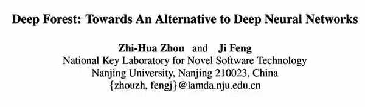

这篇文章背后的思路实际上是这样的：

DNN（或者说 MLP）其实就是堆起来的广义线性模型（比如 logistic，但也有其他激活函数）。它能够自动发现特征与标签之间的非线性关系，当决策边界非线性，并且你懒得手动去找非线性关系时，可以用它一把梭。

既然广义线性模型能这么玩，为何随机森林，或其它回归器/预测器能不能也这么玩？随机森林本身就是集成了，为何要再集成一次，不要关心这个，这个模型的好处就是，随机森林可以无缝替换为任何预测器。

答案当然是可以，但有个小的变化。要注意广义线性模型是参数模型，所以在 DNN 中，我们采用非贪婪式（也就是所谓的端到端）训练（除了自编码器）。但如果把随机森林堆起来，就不能这样，因为没有所谓的正向和反向传播过程。只能将每个森林训练完毕，再把输出扔给下一层。

后来它就成为了 Kaggle 上常用的 Stacking，或者 Blending 集成：

原理大致是这样：

将输入分成互斥的 K 份，对于每一份训练一个预测器，使用其它几份用于训练，当前的那份用于预测。将这些预测器放进一组，并连接预测结果。之后，重复这个操作来训练几组其它的预测器（最好是不同类型的），并得到其它一些预测结果。将这些预测结果叠起来作为新的特征，重复这个过程。在最后一轮重复中进行常规的分类或者回归操作。

以上是训练过程，对于预测过程，将输入依次扔给每一轮的每组预测器，每组的结果取平均（或众数），不同组的结果堆叠起来扔给下一层。

要注意两点：1）对于任何一个预测器，训练集和测试集都是不相交的，这样保证了它的质量。2）经过一轮之后，下一轮的输入还是个数据集，也就是说这个过程可以反复进行下去。不出现过拟合的情况下，你想进行多少轮就进行多少轮，每轮想创建几组就创建几组。

的确这样很有效，不仅仅根据论文里的数据，这种方法长期占据 Kaggle 的前 10% 就足以说明这一点。

除了有效之外，这种方法实现了非参数预测器的堆叠。众所周知，非参数预测器的开销比参数预测器小的多，所以 Stacking 开销据说也比 DNN 小。

但我不得不说，从思路上来看的确很水，于是就变了谁先把数据跑对了谁能发 paper。据说我这边一个师兄也提前想出来了，并且做出来了，效果不错，但是他发在了 bioinfo 的相关期刊上，根本没人注意。可见选对领域很重要，跟着生物真是倒八辈子霉。

以上。