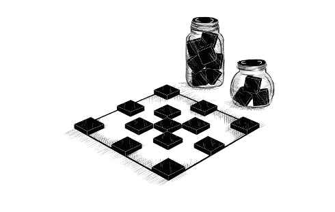
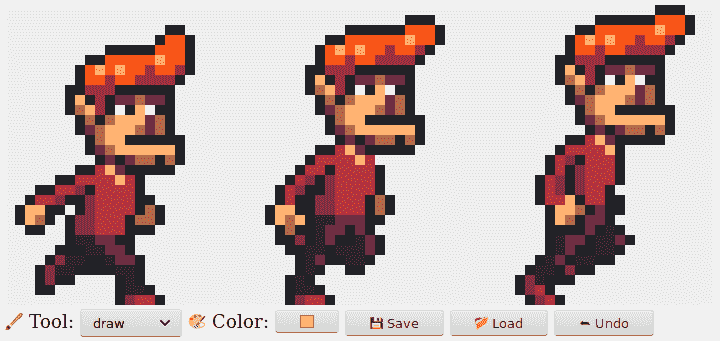

# 十九、项目：像素艺术编辑器

> 原文：[Project: A Pixel Art Editor](http://eloquentjavascript.net/19_paint.html)
> 
> 译者：[飞龙](https://github.com/wizardforcel)
> 
> 协议：[CC BY-NC-SA 4.0](http://creativecommons.org/licenses/by-nc-sa/4.0/)
> 
> 自豪地采用[谷歌翻译](https://translate.google.cn/)
> 
> 部分参考了[《JavaScript 编程精解（第 2 版）》](https://book.douban.com/subject/26707144/)
> 
> 我看着眼前的许多颜色。 我看着我的空白画布。 然后，我尝试使用颜色，就像形成诗歌的词语，就像塑造音乐的音符。
> 
> Joan Miro



前面几章的内容为你提供了构建基本的 Web 应用所需的所有元素。 在本章中，我们将实现一个。

我们的应用将是像素绘图程序，你可以通过操纵放大视图（正方形彩色网格），来逐像素修改图像。 你可以使用它来打开图像文件，用鼠标或其他指针设备在它们上面涂画并保存。 这是它的样子：



在电脑上绘画很棒。 你不需要担心材料，技能或天赋。 你只需要开始涂画。

## 组件

应用的界面在顶部显示大的`<canvas>`元素，在它下面有许多表单字段。 用户通过从`<select>`字段中选择工具，然后单击，触摸或拖动画布来绘制图片。 有用于绘制单个像素或矩形，填充区域以及从图片中选取颜色的工具。

我们将编辑器界面构建为多个组件和对象，负责 DOM 的一部分，并可能在其中包含其他组件。

应用的状态由当前图片，所选工具和所选颜色组成。 我们将建立一些东西，以便状态存在于单一的值中，并且界面组件总是基于当前状态下他们看上去的样子。

为了明白为什么这很重要，让我们考虑替代方案：将状态片段分配给整个界面。 直到某个时期，这更容易编写。 我们可以放入颜色字段，并在需要知道当前颜色时读取其值。

但是，我们添加了颜色选择器。它是一种工具，可让你单击图片来选择给定像素的颜色。 为了保持颜色字段显示正确的颜色，该工具必须知道它存在，并在每次选择新颜色时对其进行更新。 如果你添加了另一个让颜色可见的地方（也许鼠标光标可以显示它），你必须更新你的改变颜色的代码来保持同步。

实际上，这会让你遇到一个问题，即界面的每个部分都需要知道所有其他部分，它们并不是非常模块化的。 对于本章中的小应用，这可能不成问题。 对于更大的项目，它可能变成真正的噩梦。

所以为了在原则上避免这种噩梦，我们将对数据流非常严格。 存在一个状态，界面根据该状态绘制。 界面组件可以通过更新状态来响应用户动作，此时组件有机会与新的状态进行同步。

在实践中，每个组件的建立，都是为了在给定一个新的状态时，它还会通知它的子组件，只要这些组件需要更新。 建立这个有点麻烦。 让这个更方便是许多浏览器编程库的主要卖点。 但对于像这样的小应用，我们可以在没有这种基础设施的情况下完成。

状态更新表示为对象，我们将其称为动作。 组件可以创建这样的动作并分派它们 - 将它们给予中央状态管理函数。 该函数计算下一个状态，之后界面组件将自己更新为这个新状态。

我们正在执行一个混乱的任务，运行一个用户界面并对其应用一些结构。 尽管与 DOM 相关的部分仍然充满了副作用，但它们由一个概念上简单的主干支撑 - 状态更新循环。 状态决定了 DOM 的外观，而 DOM 事件可以改变状态的唯一方法，是向状态分派动作。

这种方法有许多变种，每个变种都有自己的好处和问题，但它们的中心思想是一样的：状态变化应该通过明确定义的渠道，而不是遍布整个地方。

我们的组件将是与界面一致的类。 他们的构造器被赋予一个状态，它可能是整个应用状态，或者如果它不需要访问所有东西，是一些较小的值，并使用它构建一个`dom`属性，也就是表示组件的 DOM。 大多数构造器还会接受一些其他值，这些值不会随着时间而改变，例如它们可用于分派操作的函数。

每个组件都有一个`setState`方法，用于将其同步到新的状态值。 该方法接受一个参数，该参数的类型与构造器的第一个参数的类型相同。

## 状态

应用状态将是一个带有图片，工具和颜色属性的对象。 图片本身就是一个对象，存储图片的宽度，高度和像素内容。 像素逐行存储在一个数组中，方式与第 6 章中的矩阵类相同，按行存储，从上到下。

```
class Picture {
  constructor(width, height, pixels) {
    this.width = width;
    this.height = height;
    this.pixels = pixels;
  }
  static empty(width, height, color) {
    let pixels = new Array(width * height).fill(color);
    return new Picture(width, height, pixels);
  }
  pixel(x, y) {
    return this.pixels[x + y * this.width];
  }
  draw(pixels) {
    let copy = this.pixels.slice();
    for (let {x, y, color} of pixels) {
      copy[x + y * this.width] = color;
    }
    return new Picture(this.width, this.height, copy);
  }
}
```

我们希望能够将图片当做不变的值，我们将在本章后面回顾其原因。 但是我们有时也需要一次更新大量像素。 为此，该类有`draw`方法，接受更新后的像素（具有`x`，`y`和`color`属性的对象）的数组，并创建一个覆盖这些像素的新图像。 此方法使用不带参数的`slice`来复制整个像素数组 - 切片的起始位置默认为 0，结束位置为数组的长度。

`empty`方法使用我们以前没有见过的两个数组功能。 可以使用数字调用`Array`构造器来创建给定长度的空数组。 然后`fill`方法可以用于使用给定值填充数组。 这些用于创建一个数组，所有像素具有相同颜色。

颜色存储为字符串，包含传统 CSS 颜色代码 - 一个井号（`#`），后跟六个十六进制数字，两个用于红色分量，两个用于绿色分量，两个用于蓝色分量。这是一种有点神秘而不方便的颜色编写方法，但它是 HTML 颜色输入字段使用的格式，并且可以在`canva`s绘图上下文的`fillColor`属性中使用，所以对于我们在程序中使用颜色的方式，它足够实用。

所有分量都为零的黑色写成`"#000000"`，亮粉色看起来像`#ff00ff"`，其中红色和蓝色分量的最大值为 255，以十六进制数字写为`ff`（`a`到`f`用作数字 10 到 15）。

我们将允许界面将动作分派为对象，它是属性覆盖先前状态的属性。当用户改变颜色字段时，颜色字段可以分派像`{color: field.value}`这样的对象，从这个对象可以计算出一个新的状态。

```
function updateState(state, action) {
  return Object.assign({}, state, action);
}
```

这是相当麻烦的模式，其中`Object.assign`用于首先将状态属性添加到空对象，然后使用来自动作的属性覆盖其中的一些属性，这在使用不可变对象的 JavaScript 代码中很常见。 一个更方便的表示法处于标准化的最后阶段，也就是在对象表达式中使用三点运算符来包含另一个对象的所有属性。 有了这个补充，你可以写出`{...state, ...action}`。 在撰写本文时，这还不适用于所有浏览器。

## DOM 的构建

界面组件做的主要事情之一是创建 DOM 结构。 我们再也不想直接使用冗长的 DOM 方法，所以这里是`elt`函数的一个稍微扩展的版本。

```
function elt(type, props, ...children) {
  let dom = document.createElement(type);
  if (props) Object.assign(dom, props);
  for (let child of children) {
    if (typeof child != "string") dom.appendChild(child);
    else dom.appendChild(document.createTextNode(child));
  }
  return dom;
}
```

这个版本与我们在第 16 章中使用的版本之间的主要区别在于，它将属性（property）分配给 DOM 节点，而不是属性（attribute）。 这意味着我们不能用它来设置任意属性（attribute），但是我们可以用它来设置值不是字符串的属性（property），比如`onclick`，可以将它设置为一个函数，来注册点击事件处理器。

这允许这种注册事件处理器的方式：

```
<body>
  <script> document.body.appendChild(elt("button", {
      onclick: () => console.log("click")
    }, "The button")); </script>
</body>
```

## 画布

我们要定义的第一个组件是界面的一部分，它将图片显示为彩色框的网格。 该组件负责两件事：显示图片并将该图片上的指针事件传给应用的其余部分。

因此，我们可以将其定义为仅了解当前图片，而不是整个应用状态的组件。 因为它不知道整个应用是如何工作的，所以不能直接发送操作。 相反，当响应指针事件时，它会调用创建它的代码提供的回调函数，该函数将处理应用的特定部分。

```
const scale = 10;

class PictureCanvas {
  constructor(picture, pointerDown) {
    this.dom = elt("canvas", {
      onmousedown: event => this.mouse(event, pointerDown),
      ontouchstart: event => this.touch(event, pointerDown)
    });
    drawPicture(picture, this.dom, scale);
  }
  setState(picture) {
    if (this.picture == picture) return;
    this.picture = picture;
    drawPicture(this.picture, this.dom, scale);
  }
}
```

我们将每个像素绘制成一个`10x10`的正方形，由比例常数决定。 为了避免不必要的工作，该组件会跟踪其当前图片，并且仅当将`setState`赋予新图片时才会重绘。

实际的绘图功能根据比例和图片大小设置画布大小，并用一系列正方形填充它，每个像素一个。

```
function drawPicture(picture, canvas, scale) {
  canvas.width = picture.width * scale;
  canvas.height = picture.height * scale;
  let cx = canvas.getContext("2d");

  for (let y = 0; y < picture.height; y++) {
    for (let x = 0; x < picture.width; x++) {
      cx.fillStyle = picture.pixel(x, y);
      cx.fillRect(x * scale, y * scale, scale, scale);
    }
  }
}
```

当鼠标悬停在图片画布上，并且按下鼠标左键时，组件调用`pointerDown`回调函数，提供被点击图片坐标的像素位置。 这将用于实现鼠标与图片的交互。 回调函数可能会返回另一个回调函数，以便在按下按钮并且将指针移动到另一个像素时得到通知。

```
PictureCanvas.prototype.mouse = function(downEvent, onDown) {
  if (downEvent.button != 0) return;
  let pos = pointerPosition(downEvent, this.dom);
  let onMove = onDown(pos);
  if (!onMove) return;
  let move = moveEvent => {
    if (moveEvent.buttons == 0) {
      this.dom.removeEventListener("mousemove", move);
    } else {
      let newPos = pointerPosition(moveEvent, this.dom);
      if (newPos.x == pos.x && newPos.y == pos.y) return;
      pos = newPos;
      onMove(newPos);
    }
  };
  this.dom.addEventListener("mousemove", move);
};

function pointerPosition(pos, domNode) {
  let rect = domNode.getBoundingClientRect();
  return {x: Math.floor((pos.clientX - rect.left) / scale),
          y: Math.floor((pos.clientY - rect.top) / scale)};
}
```

由于我们知道像素的大小，我们可以使用`getBoundingClientRect`来查找画布在屏幕上的位置，所以可以将鼠标事件坐标（`clientX`和`clientY`）转换为图片坐标。 它们总是向下取舍，以便它们指代特定的像素。

对于触摸事件，我们必须做类似的事情，但使用不同的事件，并确保我们在`"touchstart"`事件中调用`preventDefault`以防止滑动。

```
PictureCanvas.prototype.touch = function(startEvent,
                                         onDown) {
  let pos = pointerPosition(startEvent.touches[0], this.dom);
  let onMove = onDown(pos);
  startEvent.preventDefault();
  if (!onMove) return;
  let move = moveEvent => {
    let newPos = pointerPosition(moveEvent.touches[0],
                                 this.dom);
    if (newPos.x == pos.x && newPos.y == pos.y) return;
    pos = newPos;
    onMove(newPos);
  };
  let end = () => {
    this.dom.removeEventListener("touchmove", move);
    this.dom.removeEventListener("touchend", end);
  };
  this.dom.addEventListener("touchmove", move);
  this.dom.addEventListener("touchend", end);
};
```

对于触摸事件，`clientX`和`clientY`不能直接在事件对象上使用，但我们可以在`touches`属性中使用第一个触摸对象的坐标。

## 应用

为了能够逐步构建应用，我们将主要组件实现为画布周围的外壳，以及一组动态工具和控件，我们将其传递给其构造器。

控件是出现在图片下方的界面元素。 它们为组件构造器的数组而提供。

工具是绘制像素或填充区域的东西。 该应用将一组可用工具显示为`<select>`字段。 当前选择的工具决定了，当用户使用指针设备与图片交互时，发生的事情。 它们作为一个对象而提供，该对象将出现在下拉字段中的名称，映射到实现这些工具的函数。 这个函数接受图片位置，当前应用状态和`dispatch`函数作为参数。 它们可能会返回一个移动处理器，当指针移动到另一个像素时，使用新位置和当前状态调用该函数。

```
class PixelEditor {
  constructor(state, config) {
    let {tools, controls, dispatch} = config;
    this.state = state;

    this.canvas = new PictureCanvas(state.picture, pos => {
      let tool = tools[this.state.tool];
      let onMove = tool(pos, this.state, dispatch);
      if (onMove) return pos => onMove(pos, this.state);
    });
    this.controls = controls.map(
      Control => new Control(state, config));
    this.dom = elt("div", {}, this.canvas.dom, elt("br"),
                   ...this.controls.reduce(
                     (a, c) => a.concat(" ", c.dom), []));
  }
  setState(state) {
    this.state = state;
    this.canvas.setState(state.picture);
    for (let ctrl of this.controls) ctrl.setState(state);
  }
}
```

指定给`PictureCanvas`的指针处理器，使用适当的参数调用当前选定的工具，如果返回了移动处理器，使其也接收状态。

所有控件在`this.controls`中构造并存储，以便在应用状态更改时更新它们。 `reduce`的调用会在控件的 DOM 元素之间引入空格。 这样他们看起来并不那么密集。

第一个控件是工具选择菜单。 它创建`<select>`元素，每个工具带有一个选项，并设置`"change"`事件处理器，用于在用户选择不同的工具时更新应用状态。

```
class ToolSelect {
  constructor(state, {tools, dispatch}) {
    this.select = elt("select", {
      onchange: () => dispatch({tool: this.select.value})
    }, ...Object.keys(tools).map(name => elt("option", {
      selected: name == state.tool
    }, name)));
    this.dom = elt("label", null, "�� Tool: ", this.select);
  }
  setState(state) { this.select.value = state.tool; }
}
```

通过将标签文本和字段包装在`<label>`元素中，我们告诉浏览器该标签属于该字段，例如，你可以点击标签来聚焦该字段。

我们还需要能够改变颜色 - 所以让我们添加一个控件。 `type`属性为颜色的 HTML `<input>`元素为我们提供了专门用于选择颜色的表单字段。 这种字段的值始终是`"#RRGGBB"`格式（红色，绿色和蓝色分量，每种颜色两位数字）的 CSS 颜色代码。 当用户与它交互时，浏览器将显示一个颜色选择器界面。

该控件创建这样一个字段，并将其连接起来，与应用状态的`color`属性保持同步。

```
class ColorSelect {
  constructor(state, {dispatch}) {
    this.input = elt("input", {
      type: "color",
      value: state.color,
      onchange: () => dispatch({color: this.input.value})
    });
    this.dom = elt("label", null, "�� Color: ", this.input);
  }
  setState(state) { this.input.value = state.color; }
}
```

## 绘图工具

在我们绘制任何东西之前，我们需要实现一些工具，来控制画布上的鼠标或触摸事件的功能。

最基本的工具是绘图工具，它可以将你点击或轻触的任何像素，更改为当前选定的颜色。 它分派一个动作，将图片更新为一个版本，其中所指的像素赋为当前选定的颜色。

```
function draw(pos, state, dispatch) {
  function drawPixel({x, y}, state) {
    let drawn = {x, y, color: state.color};
    dispatch({picture: state.picture.draw([drawn])});
  }
  drawPixel(pos, state);
  return drawPixel;
}
```

该函数立即调用`drawPixel`函数，但也会返回它，以便在用户在图片上拖动或滑动时，再次为新的所触摸的像素调用。

为了绘制较大的形状，可以快速创建矩形。 矩形工具在开始拖动的点和拖动到的点之间画一个矩形。

```
function rectangle(start, state, dispatch) {
  function drawRectangle(pos) {
    let xStart = Math.min(start.x, pos.x);
    let yStart = Math.min(start.y, pos.y);
    let xEnd = Math.max(start.x, pos.x);
    let yEnd = Math.max(start.y, pos.y);
    let drawn = [];
    for (let y = yStart; y <= yEnd; y++) {
      for (let x = xStart; x <= xEnd; x++) {
        drawn.push({x, y, color: state.color});
      }
    }
    dispatch({picture: state.picture.draw(drawn)});
  }
  drawRectangle(start);
  return drawRectangle;
}
```

此实现中的一个重要细节是，拖动时，矩形将从原始状态重新绘制在图片上。 这样，你可以在创建矩形时将矩形再次放大和缩小，中间的矩形不会在最终图片中残留。 这是不可变图片对象实用的原因之一 - 稍后我们会看到另一个原因。

实现洪水填充涉及更多东西。 这是一个工具，填充和指针下的像素，和颜色相同的所有相邻像素。 “相邻”是指水平或垂直直接相邻，而不是对角线。 此图片表明，在标记像素处使用填充工具时，着色的一组像素：


有趣的是，我们的实现方式看起来有点像第 7 章中的寻路代码。那个代码搜索图来查找路线，但这个代码搜索网格来查找所有“连通”的像素。 跟踪一组可能的路线的问题是类似的。

```
const around = [{dx: -1, dy: 0}, {dx: 1, dy: 0},
                {dx: 0, dy: -1}, {dx: 0, dy: 1}];

function fill({x, y}, state, dispatch) {
  let targetColor = state.picture.pixel(x, y);
  let drawn = [{x, y, color: state.color}];
  for (let done = 0; done < drawn.length; done++) {
    for (let {dx, dy} of around) {
      let x = drawn[done].x + dx, y = drawn[done].y + dy;
      if (x >= 0 && x < state.picture.width &&
          y >= 0 && y < state.picture.height &&
          state.picture.pixel(x, y) == targetColor &&
          !drawn.some(p => p.x == x && p.y == y)) {
        drawn.push({x, y, color: state.color});
      }
    }
  }
  dispatch({picture: state.picture.draw(drawn)});
}
```

绘制完成的像素的数组可以兼作函数的工作列表。 对于每个到达的像素，我们必须看看任何相邻的像素是否颜色相同，并且尚未覆盖。 随着新像素的添加，循环计数器落后于绘制完成的数组的长度。 任何前面的像素仍然需要探索。 当它赶上长度时，没有剩下未探测的像素，并且该函数就完成了。

最终的工具是一个颜色选择器，它允许你指定图片中的颜色，来将其用作当前的绘图颜色。

```
function pick(pos, state, dispatch) {
  dispatch({color: state.picture.pixel(pos.x, pos.y)});
}
```

我们现在可以测试我们的应用了！

```
<div></div>
<script> let state = {
    tool: "draw",
    color: "#000000",
    picture: Picture.empty(60, 30, "#f0f0f0")
  };
  let app = new PixelEditor(state, {
    tools: {draw, fill, rectangle, pick},
    controls: [ToolSelect, ColorSelect],
    dispatch(action) {
      state = updateState(state, action);
      app.setState(state);
    }
  });
  document.querySelector("div").appendChild(app.dom); </script>
```

## 保存和加载

当我们画出我们的杰作时，我们会想要保存它以备后用。 我们应该添加一个按钮，用于将当前图片下载为图片文件。 这个控件提供了这个按钮：

```
class SaveButton {
  constructor(state) {
    this.picture = state.picture;
    this.dom = elt("button", {
      onclick: () => this.save()
    }, "\u{1f4be} Save");
  }
  save() {
    let canvas = elt("canvas");
    drawPicture(this.picture, canvas, 1);
    let link = elt("a", {
      href: canvas.toDataURL(),
      download: "pixelart.png"
    });
    document.body.appendChild(link);
    link.click();
    link.remove();
  }
  setState(state) { this.picture = state.picture; }
}
```

组件会跟踪当前图片，以便在保存时可以访问它。 为了创建图像文件，它使用`<canvas>`元素来绘制图片（一比一的像素比例）。

`canvas`元素上的`toDataURL`方法创建一个以`data:`开头的 URL。 与`http:`和`https:`的 URL 不同，数据 URL 在 URL 中包含整个资源。 它们通常很长，但它们允许我们在浏览器中，创建任意图片的可用链接。

为了让浏览器真正下载图片，我们将创建一个链接元素，指向此 URL 并具有`download`属性。 点击这些链接后，浏览器将显示一个文件保存对话框。 我们将该链接添加到文档，模拟点击它，然后再将其删除。

你可以使用浏览器技术做很多事情，但有时候做这件事的方式很奇怪。

并且情况变得更糟了。 我们也希望能够将现有的图像文件加载到我们的应用中。 为此，我们再次定义一个按钮组件。

```
class LoadButton {
  constructor(_, {dispatch}) {
    this.dom = elt("button", {
      onclick: () => startLoad(dispatch)
    }, "\u{1f4c1} Load");
  }
  setState() {}
}

function startLoad(dispatch) {
  let input = elt("input", {
    type: "file",
    onchange: () => finishLoad(input.files[0], dispatch)
  });
  document.body.appendChild(input);
  input.click();
  input.remove();
}
```

为了访问用户计算机上的文件，我们需要用户通过文件输入字段选择文件。 但我不希望加载按钮看起来像文件输入字段，所以我们在单击按钮时创建文件输入，然后假装它自己被单击。

当用户选择一个文件时，我们可以使用`FileReader`访问其内容，并再次作为数据 URL。 该 URL 可用于创建``元素，但由于我们无法直接访问此类图像中的像素，因此我们无法从中创建`Picture`对象。

```
function finishLoad(file, dispatch) {
  if (file == null) return;
  let reader = new FileReader();
  reader.addEventListener("load", () => {
    let image = elt("img", {
      onload: () => dispatch({
        picture: pictureFromImage(image)
      }),
      src: reader.result
    });
  });
  reader.readAsDataURL(file);
}
```

为了访问像素，我们必须先将图片绘制到`<canvas>`元素。 `canvas`上下文有一个`getImageData`方法，允许脚本读取其像素。 所以一旦图片在画布上，我们就可以访问它并构建一个`Picture`对象。

```
function pictureFromImage(image) {
  let width = Math.min(100, image.width);
  let height = Math.min(100, image.height);
  let canvas = elt("canvas", {width, height});
  let cx = canvas.getContext("2d");
  cx.drawImage(image, 0, 0);
  let pixels = [];
  let {data} = cx.getImageData(0, 0, width, height);

  function hex(n) {
    return n.toString(16).padStart(2, "0");
  }
  for (let i = 0; i < data.length; i += 4) {
    let [r, g, b] = data.slice(i, i + 3);
    pixels.push("#" + hex(r) + hex(g) + hex(b));
  }
  return new Picture(width, height, pixels);
}
```

我们将图像的大小限制为`100×100`像素，因为任何更大的图像在我们的显示器上看起来都很大，并且可能会拖慢界面。

`getImageData`返回的对象的`data`属性，是一个颜色分量的数组。 对于由参数指定的矩形中的每个像素，它包含四个值，分别表示像素颜色的红色，绿色，蓝色和 alpha 分量，数字介于 0 和 255 之间。alpha 分量表示不透明度 - 当它是零时像素是完全透明的，当它是 255 时，它是完全不透明的。出于我们的目的，我们可以忽略它。

在我们的颜色符号中，为每个分量使用的两个十六进制数字，正好对应于 0 到 255 的范围 - 两个十六进制数字可以表示`16**2 = 256`个不同的数字。 数字的`toString`方法可以传入进制作为参数，所以`n.toString(16)`将产生十六进制的字符串表示。我们必须确保每个数字都占用两位数，所以十六进制的辅助函数调用`padStart`，在必要时添加前导零。

我们现在可以加载并保存了！ 在完成之前剩下一个功能。

## 撤销历史

编辑过程的一半是犯了小错误，并再次纠正它们。 因此，绘图程序中的一个非常重要的功能是撤消历史。

为了能够撤销更改，我们需要存储以前版本的图片。 由于这是一个不可变的值，这很容易。 但它确实需要应用状态中的额外字段。

我们将添加`done`数组来保留图片的以前版本。 维护这个属性需要更复杂的状态更新函数，它将图片添加到数组中。

但我们不希望存储每一个更改，而是一定时间量之后的更改。 为此，我们需要第二个属性`doneAt`，跟踪我们上次在历史中存储图片的时间。

```
function historyUpdateState(state, action) {
  if (action.undo == true) {
    if (state.done.length == 0) return state;
    return Object.assign({}, state, {
      picture: state.done[0],
      done: state.done.slice(1),
      doneAt: 0
    });
  } else if (action.picture &&
             state.doneAt < Date.now() - 1000) {
    return Object.assign({}, state, action, {
      done: [state.picture, ...state.done],
      doneAt: Date.now()
    });
  } else {
    return Object.assign({}, state, action);
  }
}
```

当动作是撤消动作时，该函数将从历史中获取最近的图片，并生成当前图片。

或者，如果动作包含新图片，并且上次存储东西的时间超过了一秒（1000 毫秒），会更新`done`和`doneAt`属性来存储上一张图片。

撤消按钮组件不会做太多事情。 它在点击时分派撤消操作，并在没有任何可以撤销的东西时禁用自身。

```
class UndoButton {
  constructor(state, {dispatch}) {
    this.dom = elt("button", {
      onclick: () => dispatch({undo: true}),
      disabled: state.done.length == 0
    }, "⮪ Undo");
  }
  setState(state) {
    this.dom.disabled = state.done.length == 0;
  }
}
```

## 让我们绘图吧

为了建立应用，我们需要创建一个状态，一组工具，一组控件和一个分派函数。 我们可以将它们传递给`PixelEditor`构造器来创建主要组件。 由于我们需要在练习中创建多个编辑器，因此我们首先定义一些绑定。

```
const startState = {
  tool: "draw",
  color: "#000000",
  picture: Picture.empty(60, 30, "#f0f0f0"),
  done: [],
  doneAt: 0
};

const baseTools = {draw, fill, rectangle, pick};

const baseControls = [
  ToolSelect, ColorSelect, SaveButton, LoadButton, UndoButton
];

function startPixelEditor({state = startState,
                           tools = baseTools,
                           controls = baseControls}) {
  let app = new PixelEditor(state, {
    tools,
    controls,
    dispatch(action) {
      state = historyUpdateState(state, action);
      app.setState(state);
    }
  });
  return app.dom;
}
```

解构对象或数组时，可以在绑定名称后面使用`=`，来为绑定指定默认值，该属性在缺失或未定义时使用。 `startPixelEditor`函数利用它来接受一个对象，包含许多可选属性作为参数。 例如，如果你未提供`tools`属性，则`tools`将绑定到`baseTools`。

这就是我们在屏幕上获得实际的编辑器的方式：

```
<div></div>
<script> document.querySelector("div")
    .appendChild(startPixelEditor({})); </script>
```

来吧，画一些东西。 我会等着你。

## 为什么这个很困难

浏览器技术是惊人的。 它提供了一组强大的界面积木，排版和操作方法，以及检查和调试应用的工具。 你为浏览器编写的软件可以在几乎所有电脑和手机上运行。

与此同时，浏览器技术是荒谬的。 你必须学习大量愚蠢的技巧和难懂的事实才能掌握它，而它提供的默认编程模型非常棘手，大多数程序员喜欢用几层抽象来封装它，而不是直接处理它。

虽然情况肯定有所改善，但它以增加更多元素来解决缺点的方式，改善了它 - 也创造了更多复杂性。 数百万个网站使用的特性无法真正被取代。 即使可能，也很难决定它应该由什么取代。

技术从不存在于真空中 - 我们受到我们的工具，以及产生它们的社会，经济和历史因素的制约。 这可能很烦人，但通常更加有效的是，试图理解现有的技术现实如何发挥作用，以及为什么它是这样 - 而不是对抗它，或者转向另一个现实。

新的抽象可能会有所帮助。 我在本章中使用的组件模型和数据流约定，是一种粗糙的抽象。 如前所述，有些库试图使用户界面编程更愉快。 在编写本文时，React 和 Angular 是主流选择，但是这样的框架带有整个全家桶。 如果你对编写 Web 应用感兴趣，我建议调查其中的一些内容，来了解它们的原理，以及它们提供的好处。

## 练习

我们的程序还有提升空间。让我们添加一些更多特性作为练习。

### 键盘绑定

将键盘快捷键添加到应用。 工具名称的第一个字母用于选择工具，而`control-Z`或`command-Z`激活撤消工作。

通过修改`PixelEditor`组件来实现它。 为`<div>`元素包装添加`tabIndex`属性 0，以便它可以接收键盘焦点。 请注意，与`tabindex`属性对应的属性称为`tabIndex`，`I`大写，我们的`elt`函数需要属性名称。 直接在该元素上注册键盘事件处理器。 这意味着你必须先单击，触摸或按下 TAB 选择应用，然后才能使用键盘与其交互。

请记住，键盘事件具有`ctrlKey`和`metaKey`（用于 Mac 上的`Command`键）属性，你可以使用它们查看这些键是否被按下。

```
<div></div>
<script> // The original PixelEditor class. Extend the constructor.
  class PixelEditor {
    constructor(state, config) {
      let {tools, controls, dispatch} = config;
      this.state = state;

      this.canvas = new PictureCanvas(state.picture, pos => {
        let tool = tools[this.state.tool];
        let onMove = tool(pos, this.state, dispatch);
        if (onMove) {
          return pos => onMove(pos, this.state, dispatch);
        }
      });
      this.controls = controls.map(
        Control => new Control(state, config));
      this.dom = elt("div", {}, this.canvas.dom, elt("br"),
                     ...this.controls.reduce(
                       (a, c) => a.concat(" ", c.dom), []));
    }
    setState(state) {
      this.state = state;
      this.canvas.setState(state.picture);
      for (let ctrl of this.controls) ctrl.setState(state);
    }
  }

  document.querySelector("div")
    .appendChild(startPixelEditor({})); </script>
```

### 高效绘图

绘图过程中，我们的应用所做的大部分工作都发生在`drawPicture`中。 创建一个新状态并更新 DOM 的其余部分的开销并不是很大，但重新绘制画布上的所有像素是相当大的工作量。

找到一种方法，通过重新绘制实际更改的像素，使`PictureCanvas`的`setState`方法更快。

请记住，`drawPicture`也由保存按钮使用，所以如果你更改它，请确保更改不会破坏旧用途，或者使用不同名称创建新版本。

另请注意，通过设置其`width`或`height`属性来更改`<canvas>`元素的大小，将清除它，使其再次完全透明。

```
<div></div>
<script> // Change this method
  PictureCanvas.prototype.setState = function(picture) {
    if (this.picture == picture) return;
    this.picture = picture;
    drawPicture(this.picture, this.dom, scale);
  };

  // You may want to use or change this as well
  function drawPicture(picture, canvas, scale) {
    canvas.width = picture.width * scale;
    canvas.height = picture.height * scale;
    let cx = canvas.getContext("2d");

    for (let y = 0; y < picture.height; y++) {
      for (let x = 0; x < picture.width; x++) {
        cx.fillStyle = picture.pixel(x, y);
        cx.fillRect(x * scale, y * scale, scale, scale);
      }
    }
  }

  document.querySelector("div")
    .appendChild(startPixelEditor({})); </script>
```

### 圆

定义一个名为`circle`的工具，当你拖动时绘制一个实心圆。 圆的中心位于拖动或触摸手势开始的位置，其半径由拖动的距离决定。

```
<div></div>
<script> function circle(pos, state, dispatch) {
    // Your code here
  }

  let dom = startPixelEditor({
    tools: Object.assign({}, baseTools, {circle})
  });
  document.querySelector("div").appendChild(dom); </script>
```

### 合适的直线

这是比前两个更高级的练习，它将要求你设计一个有意义的问题的解决方案。 在开始这个练习之前，确保你有充足的时间和耐心，并且不要因最初的失败而感到气馁。

在大多数浏览器上，当你选择绘图工具并快速在图片上拖动时，你不会得到一条闭合直线。 相反，由于`"mousemove"`或`"touchmove"`事件没有快到足以命中每个像素，因此你会得到一些点，在它们之间有空隙。

改进绘制工具，使其绘制完整的直线。 这意味着你必须使移动处理器记住前一个位置，并将其连接到当前位置。

为此，由于像素可以是任意距离，所以你必须编写一个通用的直线绘制函数。

两个像素之间的直线是连接像素的链条，从起点到终点尽可能直。对角线相邻的像素也算作连接。 所以斜线应该看起来像左边的图片，而不是右边的图片。


如果我们有了代码，它在两个任意点间绘制一条直线，我们不妨继续，并使用它来定义`line`工具，它在拖动的起点和终点之间绘制一条直线。

```
<div></div>
<script> // The old draw tool. Rewrite this.
  function draw(pos, state, dispatch) {
    function drawPixel({x, y}, state) {
      let drawn = {x, y, color: state.color};
      dispatch({picture: state.picture.draw([drawn])});
    }
    drawPixel(pos, state);
    return drawPixel;
  }

  function line(pos, state, dispatch) {
    // Your code here
  }

  let dom = startPixelEditor({
    tools: {draw, line, fill, rectangle, pick}
  });
  document.querySelector("div").appendChild(dom); </script>
```