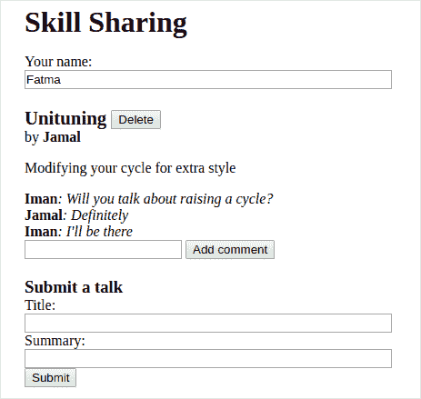

# 二十一、项目：技能分享网站

> 原文：[Project: Skill-Sharing Website](http://eloquentjavascript.net/21_skillsharing.html)
> 
> 译者：[飞龙](https://github.com/wizardforcel)
> 
> 协议：[CC BY-NC-SA 4.0](http://creativecommons.org/licenses/by-nc-sa/4.0/)
> 
> 自豪地采用[谷歌翻译](https://translate.google.cn/)
> 
> 部分参考了[《JavaScript 编程精解（第 2 版）》](https://book.douban.com/subject/26707144/)
> 
> If you have knowledge, let others light their candles at it.
> 
> Margaret Fuller


技能分享会是一个活动，其中兴趣相同的人聚在一起，针对他们所知的事情进行小型非正式的展示。在园艺技能分享会上，可以解释如何耕作芹菜。如果在编程技能分享小组中，你可以顺便给每个人讲讲 Node.js。

在计算机领域中，这类聚会往往名为用户小组，是开阔眼界、了解行业新动态或仅仅接触兴趣相同的人的好方法。许多大城市都会有 JavaScript 聚会。这类聚会往往是可以免费参加的，而且我发现我参加过的那些聚会都非常友好热情。

在最后的项目章节中，我们的目标是建立网站，管理特定技能分享会的讨论内容。假设一个小组的人会在成员办公室中定期举办关于独轮车的聚会。上一个组织者搬到了另一个城市，并且没人可以站出来接下来他的任务。我们需要一个系统，让参与者可以在系统中发言并相互讨论，这样就不需要一个中心组织人员了。

就像上一章一样，本章中的一些代码是为 Node.js 编写的，并且直接在你正在查看的 HTML页面中运行它不太可行。 该项目的完整代码可以从[`eloquentjavascript.net/code/skillsharing.zip`](https://eloquentjavascript.net/code/skillsharing.zip)下载。

## 设计

本项目的服务器部分为 Node.js 编写，客户端部分则为浏览器编写。服务器存储系统数据并将其提供给客户端。它也提供实现客户端系统的文件。

服务器保存了为下次聚会提出的对话列表。每个对话包括参与人员姓名、标题和该对话的相关评论。客户端允许用户提出新的对话（将对话添加到列表中）、删除对话和评论已存在的对话。每当用户做了修改时，客户端会向服务器发送关于更改的 HTTP 请求。



我们创建应用来展示一个实时视图，来展示目前已经提出的对话和评论。每当某些人在某些地点提交了新的对话或添加新评论时，所有在浏览器中打开页面的人都应该立即看到变化。这个特性略有挑战，网络服务器无法建立到客户端的连接，也没有好方法来知道有哪些客户端现在在查看特定网站。

该问题的一个解决方案叫作长时间轮询，这恰巧是 Node 的设计动机之一。

## 长轮询

为了能够立即提示客户端某些信息发生了改变，我们需要建立到客户端的连接。由于通常浏览器无法接受连接，而且客户端通常在路由后面，它无论如何都会拒绝这类连接，因此由服务器初始化连接是不切实际的。

我们可以安排客户端来打开连接并保持该连接，因此服务器可以使用该连接在必要时传送信息。

但 HTTP 请求只是简单的信息流：客户端发送请求，服务器返回一条响应，就是这样。有一种名为 WebSocket 的技术，受到现代浏览器的支持，是的我们可以建立连接并进行任意的数据交换。但如何正确运用这项技术是较为复杂的。

本章我们将会使用一种相对简单的技术：长轮询（Long Polling）。客户端会连续使用定时的 HTTP 请求向服务器询问新信息，而当没有新信息需要报告时服务器会简单地推迟响应。

只要客户端确保其可以持续不断地建立轮询请求，就可以在信息可用之后，从服务器快速地接收到信息。例如，若 Fatma 在浏览器中打开了技能分享程序，浏览器会发送请求询问是否有更新，且等待请求的响应。当 Iman 在自己的浏览器中提交了关于“极限降滑独轮车”的对话之后。服务器发现 Fatma 在等待更新请求，并将新的对话作为响应发送给待处理的请求。Fatma 的浏览器将会接收到数据并更新屏幕展示对话内容。

为了防止连接超时（因为连接一定时间不活跃后会被中断），长轮询技术常常为每个请求设置一个最大等待时间，只要超过了这个时间，即使没人有任何需要报告的信息也会返回响应，在此之后，客户端会建立一个新的请求。定期重新发送请求也使得这种技术更具鲁棒性，允许客户端从临时的连接失败或服务器问题中恢复。

使用了长轮询技术的繁忙的服务器，可以有成百上千个等待的请求，因此也就有这么多个 TCP 连接处于打开状态。Node简化了多连接的管理工作，而不是建立单独线程来控制每个连接，这对这样的系统是非常合适的。

## HTTP 接口

在我们设计服务器或客户端的代码之前，让我们先来思考一下两者均会涉及的一点：双方通信的 HTTP 接口。

我们会使用 JSON 作为请求和响应正文的格式，就像第二十章中的文件服务器一样，我们尝试充分利用 HTTP 方法。所有接口均以`/talks`路径为中心。不以`/talks`开头的路径则用于提供静态文件服务，即用于实现客户端系统的 HTML 和 JavaScript 代码。

访问`/talks`的`GET`请求会返回如下所示的 JSON 文档。

```
[{"title": "Unituning",
  "presenter": "Jamal",
  "summary": "Modifying your cycle for extra style",
  "comment": []}]
```

我们可以发送`PUT`请求到类似于`/talks/Unituning`之类的 URL 上来创建新对话，在第二个斜杠后的那部分是对话的名称。`PUT`请求正文应当包含一个 JSON 对象，其中有一个`presenter`属性和一个`summary`属性。

因为对话标题可以包含空格和其他无法正常出现在 URL 中的字符，因此我们必须使用`encodeURIComponent`函数来编码标题字符串，并构建 URL。

```
console.log("/talks/" + encodeURIComponent("How to Idle"));
// → /talks/How%20to%20Idle
```

下面这个请求用于创建关于“空转”的对话。

```
PUT /talks/How%20to%20Idle HTTP/1.1
Content-Type: application/json
Content-Length: 92

{"presenter": "Maureen",
 "summary": "Standing still on a unicycle"}
```

我们也可以使用`GET`请求通过这些 URL 获取对话的 JSON 数据，或使用`DELETE`请求通过这些 URL 删除对话。

为了在对话中添加一条评论，可以向诸如`/talks/Unituning/comments`的 URL 发送`POST`请求，JSON 正文包含`author`属性和`message`属性。

```
POST /talks/Unituning/comments HTTP/1.1
Content-Type: application/json
Content-Length: 72

{"author": "Iman",
 "message": "Will you talk about raising a cycle?"}
```

为了支持长轮询，如果没有新的信息可用，发送到`/talks`的`GET`请求可能会包含额外的标题，通知服务器延迟响应。 我们将使用通常用于管理缓存的一对协议头：`ETag`和`If-None-Match`。

服务器可能在响应中包含`ETag`（“实体标签”）协议头。 它的值是标识资源当前版本的字符串。 当客户稍后再次请求该资源时，可以通过包含一个`If-None-Match`头来进行条件请求，该头的值保存相同的字符串。 如果资源没有改变，服务器将响应状态码 304，这意味着“未修改”，告诉客户端它的缓存版本仍然是最新的。 当标签与服务器不匹配时，服务器正常响应。

我们需要这样的东西，通过它客户端可以告诉服务器它有哪个版本的对话列表，仅当列表发生变化时，服务器才会响应。 但服务器不是立即返回 304 响应，它应该停止响应，并且仅当有新东西的可用，或已经过去了给定的时间时才返回。 为了将长轮询请求与常规条件请求区分开来，我们给他们另一个标头`Prefer: wait=90`，告诉服务器客户端最多等待 90 秒的响应。

服务器将保留版本号，每次对话更改时更新，并将其用作`ETag`值。 客户端可以在对话变更时通知此类要求：

```
GET /talks HTTP/1.1
If-None-Match: "4"
Prefer: wait=90

(time passes)

HTTP/1.1 200 OK
Content-Type: application/json
ETag: "5"
Content-Length: 295

[....]
```

这里描述的协议并没有任何访问控制。每个人都可以评论、修改对话或删除对话。因为因特网中充满了流氓，因此将这类没有进一步保护的系统放在网络上最后可能并不是很好。

## 服务器

让我们开始构建程序的服务器部分。本节的代码可以在 Node.js 中执行。

### 路由

我们的服务器会使用`createServer`来启动 HTTP 服务器。在处理新请求的函数中，我们必须区分我们支持的请求的类型（根据方法和路径确定）。我们可以使用一长串的`if`语句完成该任务，但还存在一种更优雅的方式。

路由可以作为帮助把请求调度传给能处理该请求的函数。路径匹配正则表达式`/^\/talks\/([^\/]+)$/`（`/talks/`带着对话名称）的`PUT`请求，应当由指定函数处理。此外，路由可以帮助我们提取路径中有意义的部分，在本例中会将对话的标题（包裹在正则表达式的括号之中）传递给处理器函数。

在 NPM 中有许多优秀的路由包，但这里我们自己编写一个路由来展示其原理。

这里给出`router.js`，我们随后将在服务器模块中使用`require`获取该模块。

```
const {parse} = require("url");

module.exports = class Router {
  constructor() {
    this.routes = [];
  }
  add(method, url, handler) {
    this.routes.push({method, url, handler});
  }
  resolve(context, request) {
    let path = parse(request.url).pathname;

    for (let {method, url, handler} of this.routes) {
      let match = url.exec(path);
      if (!match || request.method != method) continue;
      let urlParts = match.slice(1).map(decodeURIComponent);
      return handler(context, ...urlParts, request);
    }
    return null;
  }
};
```

该模块导出`Router`类。我们可以使用路由对象的`add`方法来注册一个新的处理器，并使用`resolve`方法解析请求。

找到处理器之后，后者会返回一个响应，否则为`null`。它会逐个尝试路由（根据定义顺序排序），当找到一个匹配的路由时返回`true`。

路由会使用`context`值调用处理器函数（这里是服务器实例），将请求对象中的字符串，与已定义分组中的正则表达式匹配。传递给处理器的字符串必须进行 URL 解码，因为原始 URL 中可能包含`%20`风格的代码。

### 文件服务

当请求无法匹配路由中定义的任何请求类型时，服务器必须将其解释为请求位于`public`目录下的某个文件。服务器可以使用第二十章中定义的文件服务器来提供文件服务，但我们并不需要也不想对文件支持 PUT 和 DELETE 请求，且我们想支持类似于缓存等高级特性。因此让我们使用 NPM 中更为可靠且经过充分测试的静态文件服务器。

我选择了`ecstatic`。它并不是 NPM 中唯一的此类服务，但它能够完美工作且符合我们的意图。`ecstatic`模块导出了一个函数，我们可以调用该函数，并传递一个配置对象来生成一个请求处理函数。我们使用`root`选项告知服务器文件搜索位置。

```
const {createServer} = require("http");
const Router = require("./router");
const ecstatic = require("ecstatic");

const router = new Router();
const defaultHeaders = {"Content-Type": "text/plain"};

class SkillShareServer {
  constructor(talks) {
    this.talks = talks;
    this.version = 0;
    this.waiting = [];

    let fileServer = ecstatic({root: "./public"});
    this.server = createServer((request, response) => {
      let resolved = router.resolve(this, request);
      if (resolved) {
        resolved.catch(error => {
          if (error.status != null) return error;
          return {body: String(error), status: 500};
        }).then(({body,
                  status = 200,
                  headers = defaultHeaders}) => {
          response.writeHead(status, headers);
          response.end(body);
        });
      } else {
        fileServer(request, response);
      }
    });
  }
  start(port) {
    this.server.listen(port);
  }
  stop() {
    this.server.close();
  }
}
```

它使用上一章中的文件服务器的类似约定来处理响应 - 处理器返回`Promise`，可解析为描述响应的对象。 它将服务器包装在一个对象中，它也维护它的状态。

### 作为资源的对话

已提出的对话存储在服务器的`talks`属性中，这是一个对象，属性名称是对话标题。这些对话会展现为`/talks/[title]`下的 HTTP 资源，因此我们需要将处理器添加我们的路由中供客户端选择，来实现不同的方法。

获取（`GET`）单个对话的请求处理器，必须查找对话并使用对话的 JSON 数据作为响应，若不存在则返回 404 错误响应码。

```
const talkPath = /^\/talks\/([^\/]+)$/;

router.add("GET", talkPath, async (server, title) => {
  if (title in server.talks) {
    return {body: JSON.stringify(server.talks[title]),
            headers: {"Content-Type": "application/json"}};
  } else {
    return {status: 404, body: `No talk '${title}' found`};
  }
});
```

删除对话时，将其从`talks`对象中删除即可。

```
router.add("DELETE", talkPath, async (server, title) => {
  if (title in server.talks) {
    delete server.talks[title];
    server.updated();
  }
  return {status: 204};
});
```

我们将在稍后定义`updated`方法，它通知等待有关更改的长轮询请求。

为了获取请求正文的内容，我们定义一个名为`readStream`的函数，从可读流中读取所有内容，并返回解析为字符串的`Promise`。

```
function readStream(stream) {
  return new Promise((resolve, reject) => {
    let data = "";
    stream.on("error", reject);
    stream.on("data", chunk => data += chunk.toString());
    stream.on("end", () => resolve(data));
  });
}
```

需要读取响应正文的函数是`PUT`的处理器，用户使用它创建新对话。该函数需要检查数据中是否有`presenter`和`summary`属性，这些属性都是字符串。任何来自外部的数据都可能是无意义的，我们不希望错误请求到达时会破坏我们的内部数据模型，或者导致服务崩溃。

若数据看起来合法，处理器会将对话转化为对象，存储在`talks`对象中，如果有标题相同的对话存在则覆盖，并再次调用`updated`。

```
router.add("PUT", talkPath,
           async (server, title, request) => {
  let requestBody = await readStream(request);
  let talk;
  try { talk = JSON.parse(requestBody); }
  catch (_) { return {status: 400, body: "Invalid JSON"}; }

  if (!talk ||
      typeof talk.presenter != "string" ||
      typeof talk.summary != "string") {
    return {status: 400, body: "Bad talk data"};
  }
  server.talks[title] = {title,
                         presenter: talk.presenter,
                         summary: talk.summary,
                         comments: []};
  server.updated();
  return {status: 204};
});
```

在对话中添加评论也是类似的。我们使用`readStream`来获取请求内容，验证请求数据，若看上去合法，则将其存储为评论。

```
router.add("POST", /^\/talks\/([^\/]+)\/comments$/,
           async (server, title, request) => {
  let requestBody = await readStream(request);
  let comment;
  try { comment = JSON.parse(requestBody); }
  catch (_) { return {status: 400, body: "Invalid JSON"}; }

  if (!comment ||
      typeof comment.author != "string" ||
      typeof comment.message != "string") {
    return {status: 400, body: "Bad comment data"};
  } else if (title in server.talks) {
    server.talks[title].comments.push(comment);
    server.updated();
    return {status: 204};
  } else {
    return {status: 404, body: `No talk '${title}' found`};
  }
});
```

尝试向不存在的对话中添加评论会返回 404 错误。

### 长轮询支持

服务器中最值得探讨的方面是处理长轮询的部分代码。当 URL 为`/talks`的`GET`请求到来时，它可能是一个常规请求或一个长轮询请求。

我们可能在很多地方，将对话列表发送给客户端，因此我们首先定义一个简单的辅助函数，它构建这样一个数组，并在响应中包含`ETag`协议头。

```
SkillShareServer.prototype.talkResponse = function() {
  let talks = [];
  for (let title of Object.keys(this.talks)) {
    talks.push(this.talks[title]);
  }
  return {
    body: JSON.stringify(talks),
    headers: {"Content-Type": "application/json",
              "ETag": `"${this.version}"`}
  };
};
```

处理器本身需要查看请求头，来查看是否存在`If-None-Match`和`Prefer`标头。 Node 在其小写名称下存储协议头，根据规定其名称是不区分大小写的。

```
router.add("GET", /^\/talks$/, async (server, request) => {
  let tag = /"(.*)"/.exec(request.headers["if-none-match"]);
  let wait = /\bwait=(\d+)/.exec(request.headers["prefer"]);
  if (!tag || tag[1] != server.version) {
    return server.talkResponse();
  } else if (!wait) {
    return {status: 304};
  } else {
    return server.waitForChanges(Number(wait[1]));
  }
});
```

如果没有给出标签，或者给出的标签与服务器的当前版本不匹配，则处理器使用对话列表来响应。 如果请求是有条件的，并且对话没有变化，我们查阅`Prefer`标题来查看，是否应该延迟响应或立即响应。

用于延迟请求的回调函数存储在服务器的`waiting`数组中，以便在发生事件时通知它们。 `waitForChanges`方法也会立即设置一个定时器，当请求等待了足够长时，以 304 状态来响应。

```
SkillShareServer.prototype.waitForChanges = function(time) {
  return new Promise(resolve => {
    this.waiting.push(resolve);
    setTimeout(() => {
      if (!this.waiting.includes(resolve)) return;
      this.waiting = this.waiting.filter(r => r != resolve);
      resolve({status: 304});
    }, time * 1000);
  });
};
```

使用`updated`注册一个更改，会增加`version`属性并唤醒所有等待的请求。

```
var changes = [];

SkillShareServer.prototype.updated = function() {
  this.version++;
  let response = this.talkResponse();
  this.waiting.forEach(resolve => resolve(response));
  this.waiting = [];
};
```

服务器代码这样就完成了。 如果我们创建一个`SkillShareServer`的实例，并在端口 8000 上启动它，那么生成的 HTTP 服务器，将服务于`public`子目录中的文件，以及`/ talks`URL 下的一个对话管理界面。

```
new SkillShareServer(Object.create(null)).start(8000);
```

## 客户端

技能分享网站的客户端部分由三个文件组成：微型 HTML 页面、样式表以及 JavaScript 文件。

### HTML

在网络服务器提供文件服务时，有一种广为使用的约定是：当请求直接访问与目录对应的路径时，返回名为`index.html`的文件。我们使用的文件服务模块`ecstatic`就支持这种约定。当请求路径为/时，服务器会搜索文件`./public/index.html`（`./public`是我们赋予的根目录），若文件存在则返回文件。

因此，若我们希望浏览器指向我们服务器时展示某个特定页面，我们将其放在`public/index.html`中。这就是我们的`index`文件。

```
<!doctype html>
<meta charset="utf-8">
<title>Skill Sharing</title>
<link rel="stylesheet" href="skillsharing.css">

<h1>Skill Sharing</h1>

<script src="skillsharing_client.js"></script>
```

它定义了文档标题并包含一个样式表，除了其它东西，它定义了几种样式，确保对话之间有一定的空间。

最后，它在页面顶部添加标题，并加载包含客户端应用的脚本。

### 动作

应用状态由对话列表和用户名称组成，我们将它存储在一个`{talks, user}`对象中。 我们不允许用户界面直接操作状态或发送 HTTP 请求。 反之，它可能会触发动作，它描述用户正在尝试做什么。

```
function handleAction(state, action) {
  if (action.type == "setUser") {
    localStorage.setItem("userName", action.user);
    return Object.assign({}, state, {user: action.user});
  } else if (action.type == "setTalks") {
    return Object.assign({}, state, {talks: action.talks});
  } else if (action.type == "newTalk") {
    fetchOK(talkURL(action.title), {
      method: "PUT",
      headers: {"Content-Type": "application/json"},
      body: JSON.stringify({
        presenter: state.user,
        summary: action.summary
      })
    }).catch(reportError);
  } else if (action.type == "deleteTalk") {
    fetchOK(talkURL(action.talk), {method: "DELETE"})
      .catch(reportError);
  } else if (action.type == "newComment") {
    fetchOK(talkURL(action.talk) + "/comments", {
      method: "POST",
      headers: {"Content-Type": "application/json"},
      body: JSON.stringify({
        author: state.user,
        message: action.message
      })
    }).catch(reportError);
  }
  return state;
}
```

我们将用户的名字存储在`localStorage`中，以便在页面加载时恢复。

需要涉及服务器的操作使用`fetch`，将网络请求发送到前面描述的 HTTP 接口。 我们使用包装函数`fetchOK`，它确保当服务器返回错误代码时，拒绝返回的`Promise`。

```
function fetchOK(url, options) {
  return fetch(url, options).then(response => {
    if (response.status < 400) return response;
    else throw new Error(response.statusText);
  });
}
```

这个辅助函数用于为某个对话，使用给定标题建立 URL。

```
function talkURL(title) {
  return "talks/" + encodeURIComponent(title);
}
```

当请求失败时，我们不希望我们的页面丝毫不变，不给予任何提示。因此我们定义一个函数，名为`reportError`，至少在发生错误时向用户展示一个对话框。

```
function reportError(error) {
  alert(String(error));
}
```

### 渲染组件

我们将使用一个方法，类似于我们在第十九章中所见，将应用拆分为组件。 但由于某些组件不需要更新，或者在更新时总是完全重新绘制，所以我们不将它们定义为类，而是直接返回 DOM 节点的函数。 例如，下面是一个组件，显示用户可以向它输入名称的字段的：

```
function renderUserField(name, dispatch) {
  return elt("label", {}, "Your name: ", elt("input", {
    type: "text",
    value: name,
    onchange(event) {
      dispatch({type: "setUser", user: event.target.value});
    }
  }));
}
```

用于构建 DOM 元素的`elt`函数是我们在第十九章中使用的函数。

类似的函数用于渲染对话，包括评论列表和添加新评论的表单。

```
function renderTalk(talk, dispatch) {
  return elt(
    "section", {className: "talk"},
    elt("h2", null, talk.title, " ", elt("button", {
      type: "button",
      onclick() {
        dispatch({type: "deleteTalk", talk: talk.title});
      }
    }, "Delete")),
    elt("div", null, "by ",
        elt("strong", null, talk.presenter)),
    elt("p", null, talk.summary),
    ...talk.comments.map(renderComment),
    elt("form", {
      onsubmit(event) {
        event.preventDefault();
        let form = event.target;
        dispatch({type: "newComment",
                  talk: talk.title,
                  message: form.elements.comment.value});
        form.reset();
      }
    }, elt("input", {type: "text", name: "comment"}), " ",
       elt("button", {type: "submit"}, "Add comment")));
}
```

`submit`事件处理器调用`form.reset`，在创建`"newComment"`动作后清除表单的内容。

在创建适度复杂的 DOM 片段时，这种编程风格开始显得相当混乱。 有一个广泛使用的（非标准的）JavaScript 扩展叫做 JSX，它允许你直接在你的脚本中编写 HTML，这可以使这样的代码更漂亮（取决于你认为漂亮是什么）。 在实际运行这种代码之前，必须在脚本上运行一个程序，将伪 HTML 转换为 JavaScript 函数调用，就像我们在这里用的东西。

评论更容易渲染。

```
function renderComment(comment) {
  return elt("p", {className: "comment"},
             elt("strong", null, comment.author),
             ": ", comment.message);
}
```

最后，用户可以使用表单创建新对话，它渲染为这样。

```
function renderTalkForm(dispatch) {
  let title = elt("input", {type: "text"});
  let summary = elt("input", {type: "text"});
  return elt("form", {
    onsubmit(event) {
      event.preventDefault();
      dispatch({type: "newTalk",
                title: title.value,
                summary: summary.value});
      event.target.reset();
    }
  }, elt("h3", null, "Submit a Talk"),
     elt("label", null, "Title: ", title),
     elt("label", null, "Summary: ", summary),
     elt("button", {type: "submit"}, "Submit"));
}
```

### 轮询

为了启动应用，我们需要对话的当前列表。 由于初始加载与长轮询过程密切相关 – 轮询时必须使用来自加载的`ETag` – 我们将编写一个函数来不断轮询服务器的`/ talks`，并且在新的对话集可用时，调用回调函数。

```
async function pollTalks(update) {
  let tag = undefined;
  for (;;) {
    let response;
    try {
      response = await fetchOK("/talks", {
        headers: tag && {"If-None-Match": tag,
                         "Prefer": "wait=90"}
      });
    } catch (e) {
      console.log("Request failed: " + e);
      await new Promise(resolve => setTimeout(resolve, 500));
      continue;
    }
    if (response.status == 304) continue;
    tag = response.headers.get("ETag");
    update(await response.json());
  }
}
```

这是一个`async`函数，因此循环和等待请求更容易。 它运行一个无限循环，每次迭代中，通常检索对话列表。或者，如果这不是第一个请求，则带有使其成为长轮询请求的协议头。

当请求失败时，函数会等待一会儿，然后再次尝试。 这样，如果你的网络连接断了一段时间然后又恢复，应用可以恢复并继续更新。 通过`setTimeout`解析的`Promise`，是强制`async`函数等待的方法。

当服务器回复 304 响应时，这意味着长轮询请求超时，所以函数应该立即启动下一个请求。 如果响应是普通的 200 响应，它的正文将当做 JSON 而读取并传递给回调函数，并且它的`ETag`协议头的值为下一次迭代而存储。

### 应用

以下组件将整个用户界面结合在一起。

```
class SkillShareApp {
  constructor(state, dispatch) {
    this.dispatch = dispatch;
    this.talkDOM = elt("div", {className: "talks"});
    this.dom = elt("div", null,
                   renderUserField(state.user, dispatch),
                   this.talkDOM,
                   renderTalkForm(dispatch));
    this.setState(state);
  }

  setState(state) {
    if (state.talks != this.talks) {
      this.talkDOM.textContent = "";
      for (let talk of state.talks) {
        this.talkDOM.appendChild(
          renderTalk(talk, this.dispatch));
      }
      this.talks = state.talks;
    }
  }
}
```

当对话改变时，这个组件重新绘制所有这些组件。 这很简单，但也是浪费。 我们将在练习中回顾一下。

我们可以像这样启动应用：

```
function runApp() {
  let user = localStorage.getItem("userName") || "Anon";
  let state, app;
  function dispatch(action) {
    state = handleAction(state, action);
    app.setState(state);
  }

  pollTalks(talks => {
    if (!app) {
      state = {user, talks};
      app = new SkillShareApp(state, dispatch);
      document.body.appendChild(app.dom);
    } else {
      dispatch({type: "setTalks", talks});
    }
  }).catch(reportError);
}

runApp();
```

若你执行服务器并同时为`localhost:8000/`打开两个浏览器窗口，你可以看到在一个窗口中执行动作时，另一个窗口中会立即做出反应。

## 习题

下面的习题涉及修改本章中定义的系统。为了使用该系统进行工作，请确保首先下载[代码](http://eloquentjavascript.net/code/skillshare.zip)，安装了 [Node](http://nodejs.org/)，并使用`npm install`安装了项目的所有依赖。

### 磁盘持久化

技能分享服务只将数据存储在内存中。这就意味着当服务崩溃或以为任何原因重启时，所有的对话和评论都会丢失。

扩展服务使得其将对话数据存储到磁盘上，并在程序重启时自动重新加载数据。不要担心效率，只要用最简单的代码让其可以工作即可。

### 重置评论字段

由于我们常常无法在 DOM 节点中找到唯一替换的位置，因此整批地重绘对话是个很好的工作机制。但这里有个例外，若你开始在对话的评论字段中输入一些文字，而在另一个窗口向同一条对话添加了一条评论，那么第一个窗口中的字段就会被重绘，会移除掉其内容和焦点。

在激烈的讨论中，多人同时添加评论，这将是非常烦人的。 你能想出办法解决它吗？