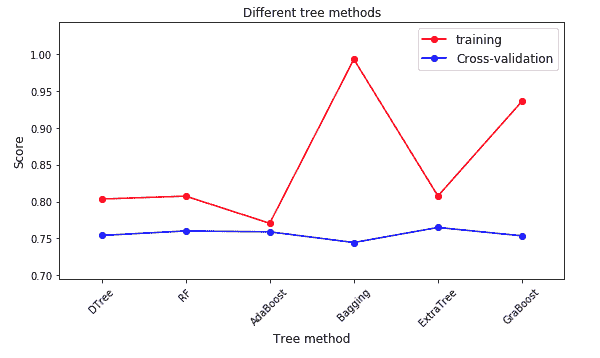

摘要
本文主要根据对Airbnb 新用户的民宿预定结果进行预测，完整的陈述了从`数据探索`到`特征工程`到`构建模型`的整个过程。
其中：
`1 数据探索`部分主要基于`pandas库`，利用常见的:`head()`，`value_counts()`，`describe()`，`isnull()`，`unique()`等函数以及通过`matplotlib`作图对数据进行理解和探索；
`2\. 特征工程`部分主要是通过从日期中提取`年月日`，`季节`，`weekday`，对年龄进行`分段`，计算相关特征之间的`差值`，根据用户id进行分组，从而统计一些特征变量的`次数`，`平均值`，`标准差`等等，以及通过`one hot encoding`和`labels encoding`对数据进行编码来提取特征；
`3\. 构建模型`部分主要基于`sklearn包`，`xgboost包`，通过调用不同的模型进行预测，其中涉及到的模型有，逻辑回归模型`Logistic Regression`，树模型：`DecisionTree，RandomForest，AdaBoost，Bagging，ExtraTree，GraBoost`，SVM模型：`SVM-rbf，SVM-poly，SVM-linear`，`xgboost`，以及通过改变`模型的参数`和`数据量大小`，来观察`NDCG`的评分结果，从而了解不同模型，不同参数和不同数据量大小对预测结果的影响.

# 1\. 背景

About this Dataset,In this challenge, you are given a list of users along with their demographics, web session records, and some summary statistics. You are asked to predict which country a new user’s first booking destination will be. All the users in this dataset are from the USA.

There are 12 possible outcomes of the destination country: ‘US’, ‘FR’, ‘CA’, ‘GB’, ‘ES’, ‘IT’, ‘PT’, ‘NL’,‘DE’, ‘AU’, ‘NDF’ (no destination found), and ‘other’. Please note that ‘NDF’ is different from ‘other’ because ‘other’ means there was a booking, but is to a country not included in the list, while ‘NDF’ means there wasn’t a booking.

# 2\. 数据描述

**总共包含6个csv文件**

1.  **train_users_2.csv** - the training set of users （训练数据）
2.  **test_users.csv** - the test set of users （测试数据）
    *   id: user id （用户id）
    *   date_account_created（帐号注册时间）: the date of account creation
    *   timestamp_first_active（首次活跃时间）: timestamp of the first activity, note that it can be earlier than date_account_created or date_first_booking because a user can search before signing up
    *   date_first_booking（首次订房时间）: date of first booking
    *   gender（性别）
    *   age（年龄）
    *   signup_method（注册方式）
    *   signup_flow（注册页面）: the page a user came to signup up from
    *   language（语言）: international language preference
    *   affiliate_channel（付费市场渠道）: what kind of paid marketing
    *   affiliate_provider（付费市场渠道名称）: where the marketing is e.g. google, craigslist, other
    *   first_affiliate_tracked（注册前第一个接触的市场渠道）: whats the first marketing the user interacted with before the signing up
    *   signup_app（注册app）
    *   first_device_type(设备类型)
    *   first_browser（浏览器类型）
    *   **country_destination**（**订房国家**-需要预测的量）: this is the target variable you are to predict
3.  **sessions.csv** - web sessions log for users（网页浏览数据）
    *   user_id（用户id）: to be joined with the column ‘id’ in users table
    *   action(用户行为)
    *   action_type（用户行为类型）
    *   action_detail（用户行为具体）
    *   device_type（设备类型）
    *   secs_elapsed（停留时长）
4.  **sample_submission.csv** - correct format for submitting your predictions

*   数据下载地址
    [Airbnb 新用户的民宿预定预测-数据集](https://download.csdn.net/download/datawhale/10488654)

# 3\. 数据探索

*   基于jupyter notebook 和 python3

## 3.1 train_users_2和test_users文件

**读取文件**

```
train = pd.read_csv("train_users_2.csv")
test = pd.read_csv("test_users.csv") 
```

**导包**

```
import numpy as np
import pandas as pd
import matplotlib.pyplot as plt
import sklearn as sk
%matplotlib inline
import datetime
import os
import seaborn as sns#数据可视化
from datetime import date
from sklearn.preprocessing import LabelEncoder
from sklearn.preprocessing import StandardScaler
from sklearn.preprocessing import LabelBinarizer
import pickle #用于存储模型
import seaborn as sns
from sklearn.metrics import *
from sklearn.model_selection import * 
```

**查看数据包含的特征**

```
print('the columns name of training dataset:\n',train.columns)
print('the columns name of test dataset:\n',test.columns) 
```


分析：

1.  train文件比test文件多了特征-country_destination
2.  country_destination是需要预测的目标变量
3.  数据探索时着重分析train文件，test文件类似

**查看数据信息**

```
print(train.info()) 
```


分析：

1.  trian文件包含213451行数据，16个特征
2.  每个特征的数据类型和非空数值
3.  date_first_booking空值较多，在特征提取时可以考虑删除

**特征分析：**
**1\. date_account_created**

**1.1 查看date_account_created前几行数据**

```
print(train.date_account_created.head()) 
```


**1.2 对date_account_created数据进行统计**

```
print(train.date_account_created.value_counts().head())
print(train.date_account_created.value_counts().tail()) 
```


**1.3获取date_account_created信息**

```
print(train.date_account_created.describe()) 
```


**1.4观察用户增长情况**

```
dac_train = train.date_account_created.value_counts()
dac_test = test.date_account_created.value_counts()
#将数据类型转换为datatime类型
dac_train_date = pd.to_datetime(train.date_account_created.value_counts().index)
dac_test_date = pd.to_datetime(test.date_account_created.value_counts().index)
#计算离首次注册时间相差的天数
dac_train_day = dac_train_date - dac_train_date.min()
dac_test_day = dac_test_date - dac_train_date.min()
#motplotlib作图
plt.scatter(dac_train_day.days, dac_train.values, color = 'r', label = 'train dataset')
plt.scatter(dac_test_day.days, dac_test.values, color = 'b', label = 'test dataset')

plt.title("Accounts created vs day")
plt.xlabel("Days")
plt.ylabel("Accounts created")
plt.legend(loc = 'upper left') 
```


分析：

1.  x轴：离首次注册时间相差的天数
2.  y轴：当天注册的用户数量
3.  随着时间的增长,用户注册的数量在急剧上升

**2\. timestamp_first_active**
**2.1查看头几行数据**

```
print(train.timestamp_first_active.head()) 
```


**2.2对数据进行统计看非重复值的数量**

```
print(train.timestamp_first_active.value_counts().unique()) 
```

[1]
分析： 结果[1]表明timestamp_first_active没有重复数据

**2.3将时间戳转成日期形式并获取数据信息**

```
tfa_train_dt = train.timestamp_first_active.astype(str).apply(lambda x:  
                                                                    datetime.datetime(int(x[:4]),
                                                                                      int(x[4:6]), 
                                                                                      int(x[6:8]), 
                                                                                      int(x[8:10]), 
                                                                                      int(x[10:12]),
                                                                                      int(x[12:])))
print(tfa_train_dt.describe()) 
```


**3\. date_first_booking**
**获取数据信息**

```
print(train.date_first_booking.describe())
print(test.date_first_booking.describe()) 
```


分析：

1.  train文件中date_first_booking有大量缺失值
2.  test文件中date_first_booking全是缺失值
3.  可以删除特征date_first_booking

**4.age**
**4.1对数据进行统计**

```
print(train.age.value_counts().head()) 
```


分析：用户年龄主要集中在30左右
**4.2柱状图统计**

```
#首先将年龄进行分成4组missing values, too small age, reasonable age, too large age
age_train =[train[train.age.isnull()].age.shape[0],
            train.query('age < 15').age.shape[0],
            train.query("age >= 15 & age <= 90").age.shape[0],
            train.query('age > 90').age.shape[0]]

age_test = [test[test.age.isnull()].age.shape[0],
            test.query('age < 15').age.shape[0],
            test.query("age >= 15 & age <= 90").age.shape[0],
            test.query('age > 90').age.shape[0]]

columns = ['Null', 'age < 15', 'age', 'age > 90']

# plot
fig, (ax1,ax2) = plt.subplots(1,2,sharex=True, sharey = True,figsize=(10,5))

sns.barplot(columns, age_train, ax = ax1)
sns.barplot(columns, age_test, ax = ax2)

ax1.set_title('training dataset')
ax2.set_title('test dataset')
ax1.set_ylabel('counts') 
```


分析：异常年龄较少，且有一定数量的缺失值

**5.其他特征**

*   train文件中其他特征由于labels较少，我们可以在特征工程中直接进行one hot encoding即可

**统一使用柱状图进行统计**

```
def feature_barplot(feature, df_train = train, df_test = test, figsize=(10,5), rot = 90, saveimg = False): 
    feat_train = df_train[feature].value_counts()
    feat_test = df_test[feature].value_counts()
    fig_feature, (axis1,axis2) = plt.subplots(1,2,sharex=True, sharey = True, figsize = figsize)
    sns.barplot(feat_train.index.values, feat_train.values, ax = axis1)
    sns.barplot(feat_test.index.values, feat_test.values, ax = axis2)
    axis1.set_xticklabels(axis1.xaxis.get_majorticklabels(), rotation = rot)
    axis2.set_xticklabels(axis1.xaxis.get_majorticklabels(), rotation = rot)
    axis1.set_title(feature + ' of training dataset')
    axis2.set_title(feature + ' of test dataset')
    axis1.set_ylabel('Counts')
    plt.tight_layout()
    if saveimg == True:
        figname = feature + ".png"
        fig_feature.savefig(figname, dpi = 75) 
```

**5.1 gender**

```
feature_barplot('gender', saveimg = True) 
```


**5.2 signup_method**

```
feature_barplot('signup_method') 
```


**5.3 signup_flow**

```
feature_barplot('signup_flow') 
```


**5.4 language**

```
feature_barplot('language') 
```


**5.5 affiliate_channel**

```
feature_barplot('affiliate_channel') 
```


**5.6 first_affiliate_tracked**

```
feature_barplot('first_affiliate_tracked') 
```


**5.7 signup_app**

```
feature_barplot('signup_app') 
```


**5.8 first_device_type**

```
feature_barplot('first_device_type') 
```


**5.9 first_browser**

```
feature_barplot('first_browser') 
```


##3.2 sesion文件
**获取数据并查看头10行数据**

```
df_sessions = pd.read_csv('sessions.csv')
df_sessions.head(10) 
```


**将user_id改名为id**

```
#这是为了后面的数据合并
df_sessions['id'] = df_sessions['user_id']
df_sessions = df_sessions.drop(['user_id'],axis=1) #按行删除 
```

**查看数据的shape**

```
df_sessions.shape 
```

(10567737, 6)
分析：session文件有10567737行数据，6个特征

**查看缺失值**

```
df_sessions.isnull().sum() 
```


分析：action，action_type，action_detail， secs_elapsed缺失值较多

**填充缺失值**

```
df_sessions.action = df_sessions.action.fillna('NAN')
df_sessions.action_type = df_sessions.action_type.fillna('NAN')
df_sessions.action_detail = df_sessions.action_detail.fillna('NAN')
df_sessions.isnull().sum() 
```


分析：

1.  填充后缺失值已经为0了
2.  secs_elapsed 在后续做填充处理

#4\. 特征提取

*   在对数据有一定了解后，我们进行特征提取工作

## 4.1 对session文件特征提取

**1.action**

```
df_sessions.action.head() 
```


```
df_sessions.action.value_counts().min() 
```

1
分析：对action进行统计，我们可以发现用户action有多种，且最少的发生次数只有1，接下来我们可以对用户发生次数较少的行为列为OTHER一类

**1.1 将特征action次数低于阈值100的列为OTHER**

```
#Action values with low frequency are changed to 'OTHER'
act_freq = 100  #Threshold of frequency
act = dict(zip(*np.unique(df_sessions.action, return_counts=True)))
df_sessions.action = df_sessions.action.apply(lambda x: 'OTHER' if act[x] < act_freq else x)
#np.unique(df_sessions.action, return_counts=True) 取以数组形式返回非重复的action值和它的数量
#zip（*（a,b））a,b种元素一一对应，返回zip object 
```

**2\. 对特征action，action_detail，action_type，device_type，secs_elapsed进行细化**

*   首先将用户的特征根据**用户id**进行分组
*   **特征action：**统计每个用户总的action出现的次数，各个action类型的数量，平均值以及标准差
*   **特征action_detail：**统计每个用户总的action_detail出现的次数，各个action_detail类型的数量，平均值以及标准差
*   **特征action_type：**统计每个用户总的action_type出现的次数，各个action_type类型的数量，平均值，标准差以及总的停留时长（进行log处理）
*   **特征device_type：**统计每个用户总的device_type出现的次数，各个device_type类型的数量，平均值以及标准差
*   **特征secs_elapsed：**对缺失值用0填充，统计每个用户secs_elapsed时间的总和，平均值，标准差以及中位数（进行log处理），（总和/平均数），secs_elapsed（log处理后）各个时间出现的次数

```
#对action特征进行细化
f_act = df_sessions.action.value_counts().argsort()
f_act_detail = df_sessions.action_detail.value_counts().argsort()
f_act_type = df_sessions.action_type.value_counts().argsort()
f_dev_type = df_sessions.device_type.value_counts().argsort()

#按照id进行分组
dgr_sess = df_sessions.groupby(['id'])
#Loop on dgr_sess to create all the features.
samples = [] #samples列表
ln = len(dgr_sess) #计算分组后df_sessions的长度

for g in dgr_sess:  #对dgr_sess中每个id的数据进行遍历
    gr = g[1]   #data frame that comtains all the data for a groupby value 'zzywmcn0jv'

    l = []  #建一个空列表，临时存放特征

    #the id    for example:'zzywmcn0jv'
    l.append(g[0]) #将id值放入空列表中

    # number of total actions
    l.append(len(gr))#将id对应数据的长度放入列表

    #secs_elapsed 特征中的缺失值用0填充再获取具体的停留时长值
    sev = gr.secs_elapsed.fillna(0).values   #These values are used later.

    #action features 特征-用户行为 
    #每个用户行为出现的次数，各个行为类型的数量，平均值以及标准差
    c_act = [0] * len(f_act)
    for i,v in enumerate(gr.action.values): #i是从0-1对应的位置，v 是用户行为特征的值
        c_act[f_act[v]] += 1
    _, c_act_uqc = np.unique(gr.action.values, return_counts=True)
    #计算用户行为行为特征各个类型数量的长度，平均值以及标准差
    c_act += [len(c_act_uqc), np.mean(c_act_uqc), np.std(c_act_uqc)]
    l = l + c_act

    #action_detail features 特征-用户行为具体
    #(how many times each value occurs, numb of unique values, mean and std)
    c_act_detail = [0] * len(f_act_detail)
    for i,v in enumerate(gr.action_detail.values):
        c_act_detail[f_act_detail[v]] += 1
    _, c_act_det_uqc = np.unique(gr.action_detail.values, return_counts=True)
    c_act_detail += [len(c_act_det_uqc), np.mean(c_act_det_uqc), np.std(c_act_det_uqc)]
    l = l + c_act_detail

    #action_type features  特征-用户行为类型 click等
    #(how many times each value occurs, numb of unique values, mean and std
    #+ log of the sum of secs_elapsed for each value)
    l_act_type = [0] * len(f_act_type)
    c_act_type = [0] * len(f_act_type)
    for i,v in enumerate(gr.action_type.values):
        l_act_type[f_act_type[v]] += sev[i] #sev = gr.secs_elapsed.fillna(0).values ，求每个行为类型总的停留时长
        c_act_type[f_act_type[v]] += 1  
    l_act_type = np.log(1 + np.array(l_act_type)).tolist() #每个行为类型总的停留时长，差异比较大，进行log处理
    _, c_act_type_uqc = np.unique(gr.action_type.values, return_counts=True)
    c_act_type += [len(c_act_type_uqc), np.mean(c_act_type_uqc), np.std(c_act_type_uqc)]
    l = l + c_act_type + l_act_type    

    #device_type features 特征-设备类型
    #(how many times each value occurs, numb of unique values, mean and std)
    c_dev_type  = [0] * len(f_dev_type)
    for i,v in enumerate(gr.device_type .values):
        c_dev_type[f_dev_type[v]] += 1 
    c_dev_type.append(len(np.unique(gr.device_type.values))) 
    _, c_dev_type_uqc = np.unique(gr.device_type.values, return_counts=True)
    c_dev_type += [len(c_dev_type_uqc), np.mean(c_dev_type_uqc), np.std(c_dev_type_uqc)]        
    l = l + c_dev_type    

    #secs_elapsed features  特征-停留时长     
    l_secs = [0] * 5 
    l_log = [0] * 15
    if len(sev) > 0:
        #Simple statistics about the secs_elapsed values.
        l_secs[0] = np.log(1 + np.sum(sev))
        l_secs[1] = np.log(1 + np.mean(sev)) 
        l_secs[2] = np.log(1 + np.std(sev))
        l_secs[3] = np.log(1 + np.median(sev))
        l_secs[4] = l_secs[0] / float(l[1]) #

        #Values are grouped in 15 intervals. Compute the number of values
        #in each interval.
        #sev = gr.secs_elapsed.fillna(0).values 
        log_sev = np.log(1 + sev).astype(int)
        #np.bincount():Count number of occurrences of each value in array of non-negative ints.  
        l_log = np.bincount(log_sev, minlength=15).tolist()                    
    l = l + l_secs + l_log

    #The list l has the feature values of one sample.
    samples.append(l)

#preparing objects    
samples = np.array(samples) 
samp_ar = samples[:, 1:].astype(np.float16) #取除id外的特征数据
samp_id = samples[:, 0]   #取id，id位于第一列

#为提取的特征创建一个dataframe     
col_names = []    #name of the columns
for i in range(len(samples[0])-1):  #减1的原因是因为有个id
    col_names.append('c_' + str(i))  #起名字的方式    
df_agg_sess = pd.DataFrame(samp_ar, columns=col_names)
df_agg_sess['id'] = samp_id
df_agg_sess.index = df_agg_sess.id #将id作为index 
```

```
df_agg_sess.head() 
```


分析：经过特征提取后，session文件由6个特征变为458个特征

## 4.2 对trian和test文件进行特征提取

**标记train文件的行数和存储我们进行预测的目标变量**

*   labels存储了我们进行预测的目标变量country_destination

```
train = pd.read_csv("train_users_2.csv")
test = pd.read_csv("test_users.csv")
#计算出train的行数，便于之后对train和test数据进行分离操作
train_row = train.shape[0]  

# The label we need to predict
labels = train['country_destination'].values 
```

**删除date_first_booking和train文件中的country_destination**

*   数据探索时我们发现date_first_booking在train和test文件中缺失值太多，故删除
*   删除country_destination，用模型预测country_destination，再与已经存储country_destination的labels进行比较，从而判断模型优劣

```
train.drop(['country_destination', 'date_first_booking'], axis = 1, inplace = True)
test.drop(['date_first_booking'], axis = 1, inplace = True) 
```

**合并train和test文件**

*   便于进行相同的特征提取操作

```
#连接test 和 train
df = pd.concat([train, test], axis = 0, ignore_index = True) 
```

**1\. timestamp_first_active**
**1.1 转换为datetime类型**

```
tfa = df.timestamp_first_active.astype(str).apply(lambda x: datetime.datetime(int(x[:4]),
                                                                          int(x[4:6]), 
                                                                          int(x[6:8]),
                                                                          int(x[8:10]),
                                                                          int(x[10:12]),
                                                                          int(x[12:]))) 
```

**1.2 提取特征：年，月，日**

```
# create tfa_year, tfa_month, tfa_day feature
df['tfa_year'] = np.array([x.year for x in tfa])
df['tfa_month'] = np.array([x.month for x in tfa])
df['tfa_day'] = np.array([x.day for x in tfa]) 
```

**1.3 提取特征：weekday**

*   对结果进行[one hot encoding](https://blog.csdn.net/taotiezhengfeng/article/details/73692239)编码

```
#isoweekday() 可以返回一周的星期几，e.g.星期日：0；星期一：1
df['tfa_wd'] = np.array([x.isoweekday() for x in tfa]) 
df_tfa_wd = pd.get_dummies(df.tfa_wd, prefix = 'tfa_wd')  # one hot encoding 
df = pd.concat((df, df_tfa_wd), axis = 1) #添加df['tfa_wd'] 编码后的特征
df.drop(['tfa_wd'], axis = 1, inplace = True)#删除原有未编码的特征 
```

**1.4 提取特征：季节**

*   因为判断季节关注的是月份，故对年份进行统一

```
Y = 2000
seasons = [(0, (date(Y,  1,  1),  date(Y,  3, 20))),  #'winter'
           (1, (date(Y,  3, 21),  date(Y,  6, 20))),  #'spring'
           (2, (date(Y,  6, 21),  date(Y,  9, 22))),  #'summer'
           (3, (date(Y,  9, 23),  date(Y, 12, 20))),  #'autumn'
           (0, (date(Y, 12, 21),  date(Y, 12, 31)))]  #'winter'

def get_season(dt):
    dt = dt.date() #获取日期
    dt = dt.replace(year=Y) #将年统一换成2000年
    return next(season for season, (start, end) in seasons if start <= dt <= end)

df['tfa_season'] = np.array([get_season(x) for x in tfa])
df_tfa_season = pd.get_dummies(df.tfa_season, prefix = 'tfa_season') # one hot encoding 
df = pd.concat((df, df_tfa_season), axis = 1)
df.drop(['tfa_season'], axis = 1, inplace = True) 
```

**2\. date_account_created**
**2.1 将date_account_created转换为datetime类型**

```
dac = pd.to_datetime(df.date_account_created) 
```

**2.2 提取特征：年，月，日**

```
# create year, month, day feature for dac

df['dac_year'] = np.array([x.year for x in dac])
df['dac_month'] = np.array([x.month for x in dac])
df['dac_day'] = np.array([x.day for x in dac]) 
```

**2.3 提取特征：weekday**

```
# create features of weekday for dac

df['dac_wd'] = np.array([x.isoweekday() for x in dac])
df_dac_wd = pd.get_dummies(df.dac_wd, prefix = 'dac_wd')
df = pd.concat((df, df_dac_wd), axis = 1)
df.drop(['dac_wd'], axis = 1, inplace = True) 
```

**2.4 提取特征：季节**

```
# create season features fro dac

df['dac_season'] = np.array([get_season(x) for x in dac])
df_dac_season = pd.get_dummies(df.dac_season, prefix = 'dac_season')
df = pd.concat((df, df_dac_season), axis = 1)
df.drop(['dac_season'], axis = 1, inplace = True) 
```

**2.5提取特征：date_account_created和timestamp_first_active之间的差值**

*   即用户在airbnb平台活跃到正式注册所花的时间

```
dt_span = dac.subtract(tfa).dt.days 
```

*   dt_span的头十行数据

```
dt_span.value_counts().head(10) 
```


分析：数据主要集中在-1，可以猜测，用户当天注册dt_span值便是-1

*   从差值提取特征：差值为一天，一月，一年和其他
*   即用户活跃到注册花费的时间为一天，一月，一年或其他

```
# create categorical feature: span = -1; -1 < span < 30; 31 < span < 365; span > 365
def get_span(dt):
    # dt is an integer
    if dt == -1:
        return 'OneDay'
    elif (dt < 30) & (dt > -1):
        return 'OneMonth'
    elif (dt >= 30) & (dt <= 365):
        return 'OneYear'
    else:
        return 'other'

df['dt_span'] = np.array([get_span(x) for x in dt_span])
df_dt_span = pd.get_dummies(df.dt_span, prefix = 'dt_span')
df = pd.concat((df, df_dt_span), axis = 1)
df.drop(['dt_span'], axis = 1, inplace = True) 
```

**2.6 删除原有的特征**

*   对timestamp_first_active，date_account_created进行特征提取后，从特征列表中删除原有的特征

```
df.drop(['date_account_created','timestamp_first_active'], axis = 1, inplace = True) 
```

**3\. age**

```
#Age 获取年龄
av = df.age.values 
```

*   在数据探索阶段，我们发现大部分数据是集中在（15，90）区间的，但有部分年龄分布在（1900，2000）区间，我们猜测用户是把出生日期误填为年龄，故进行预处理

```
#This are birthdays instead of age (estimating age by doing 2014 - value)
#数据来自2014年，故用2014-value
av = np.where(np.logical_and(av<2000, av>1900), 2014-av, av) 
df['age'] = av 
```

**3.1 将年龄进行分段**

```
# Age has many abnormal values that we need to deal with. 
age = df.age
age.fillna(-1, inplace = True) #空值填充为-1
div = 15
def get_age(age):
    # age is a float number  将连续型转换为离散型
    if age < 0:
        return 'NA' #表示是空值
    elif (age < div):
        return div #如果年龄小于15岁，那么返回15岁
    elif (age <= div * 2):
        return div*2 #如果年龄大于15小于等于30岁，则返回30岁
    elif (age <= div * 3):
        return div * 3
    elif (age <= div * 4):
        return div * 4
    elif (age <= div * 5):
        return div * 5
    elif (age <= 110):
        return div * 6
    else:
        return 'Unphysical' #非正常年龄 
```

*   将分段后的年龄作为新的特征放入特征列表中

```
df['age'] = np.array([get_age(x) for x in age])
df_age = pd.get_dummies(df.age, prefix = 'age')
df = pd.concat((df, df_age), axis = 1)
df.drop(['age'], axis = 1, inplace = True) 
```

**4\. 其他特征**

*   在数据探索时，我们发现剩余的特征lables都比较少，故不进一步进行特征提取，只进行one-hot-encoding处理

```
feat_toOHE = ['gender', 
             'signup_method', 
             'signup_flow', 
             'language', 
             'affiliate_channel', 
             'affiliate_provider', 
             'first_affiliate_tracked', 
             'signup_app', 
             'first_device_type', 
             'first_browser']
#对其他特征进行one-hot-encoding处理
for f in feat_toOHE:
    df_ohe = pd.get_dummies(df[f], prefix=f, dummy_na=True)
    df.drop([f], axis = 1, inplace = True)
    df = pd.concat((df, df_ohe), axis = 1) 
```

## 4.3 整合提取的所有特征

*   我们将对session以及train，test文件中提取的特征进行合并

```
#将对session提取的特征整合到一起
df_all = pd.merge(df, df_agg_sess, how='left')
df_all = df_all.drop(['id'], axis=1) #删除id
df_all = df_all.fillna(-2)  #对没有sesssion data的特征进行缺失值处理

#加了一列，表示每一行总共有多少空值，这也作为一个特征
df_all['all_null'] = np.array([sum(r<0) for r in df_all.values]) 
```

#5\. 模型构建

## 5.1 数据准备

**1\. 将train和test数据进行分离操作**

*   train_row是之前记录的train数据行数

```
Xtrain = df_all.iloc[:train_row, :]
Xtest = df_all.iloc[train_row:, :] 
```

**2\. 将提取的特征生成csv文件**

```
Xtrain.to_csv("Airbnb_xtrain_v2.csv")
Xtest.to_csv("Airbnb_xtest_v2.csv")
#labels.tofile（）：Write array to a file as text or binary (default)
labels.tofile("Airbnb_ytrain_v2.csv", sep='\n', format='%s') #存放目标变量 
```

*   读取特征文件

```
xtrain = pd.read_csv("Airbnb_xtrain_v2.csv",index_col=0)
ytrain = pd.read_csv("Airbnb_ytrain_v2.csv", header=None) 
```

```
xtrain.head() 
```


```
ytrain.head() 
```


分析：可以发现经过特征提取后特征文件xtrain扩展为665个特征，ytrain中包含训练集中的目标变量
**3\. 将目标变量进行labels encoding**

```
le = LabelEncoder()
ytrain_le = le.fit_transform(ytrain.values) 
```

*   labels encoding前：
    [‘AU’, ‘CA’, ‘DE’, ‘ES’, ‘FR’, ‘GB’, ‘IT’, ‘NDF’, ‘NL’, ‘PT’, ‘US’,‘other’]
*   labels encoding后：
    [0, 1, 2, 3, 4, 5, 6, 7, 8, 9, 10, 11]

**4\. 提取10%的数据进行模型训练**

*   减少训练模型花费的时间

```
# Let us take 10% of the data for faster training. 
n = int(xtrain.shape[0]*0.1)
xtrain_new = xtrain.iloc[:n, :]  #训练数据
ytrain_new = ytrain_le[:n]       #训练数据的目标变量 
```

**5\. StandardScaling the dataset**

*   Standardization of a dataset is a common requirement for many machine learning estimators: they might behave badly if the individual feature do not more or less look like standard normally distributed data (e.g. Gaussian with 0 mean and unit variance)

```
X_scaler = StandardScaler()
xtrain_new = X_scaler.fit_transform(xtrain_new) 
```

## 5.2 评分模型：[NDCG](https://blog.csdn.net/zhouwenyuan1015/article/details/68072431)

*   NDCG是一种衡量排序质量的评价指标，该指标考虑了所有元素的相关性
*   由于我们预测的目标变量并不是二分类变量，故我们用NDGG模型来进行模型评分，判断模型优劣
*   一般二分类变量: 我们习惯于使用 f1 score, precision, recall, auc score来进行模型评分

```
from sklearn.metrics import make_scorer

def dcg_score(y_true, y_score, k=5):

    """
    y_true : array, shape = [n_samples] #数据
        Ground truth (true relevance labels).
    y_score : array, shape = [n_samples, n_classes] #预测的分数
        Predicted scores.
    k : int
    """
    order = np.argsort(y_score)[::-1] #分数从高到低排序
    y_true = np.take(y_true, order[:k]) #取出前k[0,k）个分数

    gain = 2 ** y_true - 1   

    discounts = np.log2(np.arange(len(y_true)) + 2)
    return np.sum(gain / discounts)

def ndcg_score(ground_truth, predictions, k=5):   

    """
    Parameters
    ----------
    ground_truth : array, shape = [n_samples]
        Ground truth (true labels represended as integers).
    predictions : array, shape = [n_samples, n_classes] 
        Predicted probabilities. 预测的概率
    k : int
        Rank.
    """
    lb = LabelBinarizer()
    lb.fit(range(len(predictions) + 1))
    T = lb.transform(ground_truth)    
    scores = []
    # Iterate over each y_true and compute the DCG score
    for y_true, y_score in zip(T, predictions):
        actual = dcg_score(y_true, y_score, k)
        best = dcg_score(y_true, y_true, k)
        score = float(actual) / float(best)
        scores.append(score)

    return np.mean(scores) 
```

# 6\. 构建模型

## 6.1 Logistic Regression

```
from sklearn.linear_model import LogisticRegression
from sklearn.model_selection import KFold
from sklearn.model_selection import cross_val_score
from sklearn.model_selection import train_test_split
lr = LogisticRegression(C = 1.0, penalty='l2', multi_class='ovr')
RANDOM_STATE = 2017  #随机种子

#k-fold cross validation（k-折叠交叉验证）
kf = KFold(n_splits=5, random_state=RANDOM_STATE) #分成5个组
train_score = [] 
cv_score = []

# select a k  (value how many y):
k_ndcg = 3 
# kf.split: Generate indices to split data into training and test set.
for train_index, test_index in kf.split(xtrain_new, ytrain_new):
    #训练集数据分割为训练集和测试集，y是目标变量
    X_train, X_test = xtrain_new[train_index, :], xtrain_new[test_index, :]
    y_train, y_test = ytrain_new[train_index], ytrain_new[test_index]

    lr.fit(X_train, y_train)

    y_pred = lr.predict_proba(X_test)
    train_ndcg_score = ndcg_score(y_train, lr.predict_proba(X_train), k = k_ndcg)
    cv_ndcg_score = ndcg_score(y_test, y_pred, k=k_ndcg)

    train_score.append(train_ndcg_score)
    cv_score.append(cv_ndcg_score)

print ("\nThe training score is: {}".format(np.mean(train_score)))
print ("\nThe cv score is: {}".format(np.mean(cv_score))) 
```

The training score is: 0.7595244143892934
The cv score is: 0.7416926026958558

**learning curve of logistic regression**

*   观察逻辑回归模型学习曲线的变化
    **1\. 改变逻辑回归参数iteration**

```
# set the iterations
iteration = [1,5,10,15,20, 50, 100]

kf = KFold(n_splits=3, random_state=RANDOM_STATE)

train_score = []
cv_score = []

# select a k:
k_ndcg = 5

for i, item in enumerate(iteration): 

    lr = LogisticRegression(C=1.0, max_iter=item, tol=1e-5, solver='newton-cg', multi_class='ovr') 
    train_score_iter = []
    cv_score_iter = []

    for train_index, test_index in kf.split(xtrain_new, ytrain_new):
        X_train, X_test = xtrain_new[train_index, :], xtrain_new[test_index, :]
        y_train, y_test = ytrain_new[train_index], ytrain_new[test_index]

        lr.fit(X_train, y_train)

        y_pred = lr.predict_proba(X_test)
        train_ndcg_score = ndcg_score(y_train, lr.predict_proba(X_train), k = k_ndcg)
        cv_ndcg_score = ndcg_score(y_test, y_pred, k=k_ndcg)

        train_score_iter.append(train_ndcg_score)
        cv_score_iter.append(cv_ndcg_score)

    train_score.append(np.mean(train_score_iter))
    cv_score.append(np.mean(cv_score_iter)) 
```

```
ymin = np.min(cv_score)-0.05
ymax = np.max(train_score)+0.05

plt.figure(figsize=(9,4))
plt.plot(iteration, train_score, 'ro-', label = 'training')
plt.plot(iteration, cv_score, 'b*-', label = 'Cross-validation')
plt.xlabel("iterations")
plt.ylabel("Score")
plt.xlim(-5, np.max(iteration)+10)
plt.ylim(ymin, ymax)
plt.plot(np.linspace(20,20,50), np.linspace(ymin, ymax, 50), 'g--')
plt.legend(loc = 'lower right', fontsize = 12)
plt.title("Score vs iteration learning curve")

plt.tight_layout() 
```


分析：随着iteration的增大，逻辑回归模型的评分在不断升高，当iteration超过20的时候，模型的评分基本不变

**2\. 改变数据量大小**

```
# Chaning the sampling size
# set the iter to the best iteration: iter = 20

perc = [0.01,0.02,0.05,0.1,0.2,0.5,1]

kf = KFold(n_splits=3, random_state=RANDOM_STATE)

train_score = []
cv_score = []

# select a k:
k_ndcg = 5

for i, item in enumerate(perc):

    lr = LogisticRegression(C=1.0, max_iter=20, tol=1e-6, solver='newton-cg', multi_class='ovr')
    train_score_iter = []
    cv_score_iter = []

    n = int(xtrain_new.shape[0]*item)
    xtrain_perc = xtrain_new[:n, :]
    ytrain_perc = ytrain_new[:n]

    for train_index, test_index in kf.split(xtrain_perc, ytrain_perc):

        X_train, X_test = xtrain_perc[train_index, :], xtrain_perc[test_index, :]
        y_train, y_test = ytrain_perc[train_index], ytrain_perc[test_index]

        print(X_train.shape, X_test.shape)

        lr.fit(X_train, y_train)

        y_pred = lr.predict_proba(X_test)
        train_ndcg_score = ndcg_score(y_train, lr.predict_proba(X_train), k = k_ndcg)
        cv_ndcg_score = ndcg_score(y_test, y_pred, k=k_ndcg)

        train_score_iter.append(train_ndcg_score)
        cv_score_iter.append(cv_ndcg_score)

    train_score.append(np.mean(train_score_iter))
    cv_score.append(np.mean(cv_score_iter)) 
```

```
ymin = np.min(cv_score)-0.1
ymax = np.max(train_score)+0.1

plt.figure(figsize=(9,4))
plt.plot(np.array(perc)*100, train_score, 'ro-', label = 'training')
plt.plot(np.array(perc)*100, cv_score, 'bo-', label = 'Cross-validation')
plt.xlabel("Sample size (unit %)")
plt.ylabel("Score")
plt.xlim(-5, np.max(perc)*100+10)
plt.ylim(ymin, ymax)

plt.legend(loc = 'lower right', fontsize = 12)
plt.title("Score vs sample size learning curve")

plt.tight_layout() 
```


分析：随着数据量的增加，逻辑回归模型对测试集的预测评分（蓝色线）在不断上升，因为我们在训练模型时只用了10%的数据，如果使用全部的数据，效果可能会更好

## 6.2 树模型

*   其中的模型包括DecisionTree，RandomForest，AdaBoost，Bagging，ExtraTree，GraBoost

```
from sklearn.ensemble import AdaBoostClassifier, BaggingClassifier, ExtraTreesClassifier
from sklearn.ensemble import GradientBoostingClassifier, RandomForestClassifier
from sklearn.tree import DecisionTreeClassifier
from sklearn.ensemble import *
from sklearn.svm import SVC, LinearSVC, NuSVC
LEARNING_RATE = 0.1
N_ESTIMATORS = 50
RANDOM_STATE = 2017
MAX_DEPTH = 9

#建了一个tree字典
clf_tree ={
    'DTree': DecisionTreeClassifier(max_depth=MAX_DEPTH,
                                    random_state=RANDOM_STATE),

    'RF': RandomForestClassifier(n_estimators=N_ESTIMATORS,
                                 max_depth=MAX_DEPTH,
                                 random_state=RANDOM_STATE),

    'AdaBoost': AdaBoostClassifier(n_estimators=N_ESTIMATORS,
                                   learning_rate=LEARNING_RATE,
                                   random_state=RANDOM_STATE),

    'Bagging': BaggingClassifier(n_estimators=N_ESTIMATORS,
                                 random_state=RANDOM_STATE),

    'ExtraTree': ExtraTreesClassifier(max_depth=MAX_DEPTH,
                                      n_estimators=N_ESTIMATORS,
                                      random_state=RANDOM_STATE),

    'GraBoost': GradientBoostingClassifier(learning_rate=LEARNING_RATE,
                                           max_depth=MAX_DEPTH,
                                           n_estimators=N_ESTIMATORS,
                                           random_state=RANDOM_STATE)
}
train_score = []
cv_score = []

kf = KFold(n_splits=3, random_state=RANDOM_STATE)

k_ndcg = 5

for key in clf_tree.keys():

    clf = clf_tree.get(key)

    train_score_iter = []
    cv_score_iter = []

    for train_index, test_index in kf.split(xtrain_new, ytrain_new):

        X_train, X_test = xtrain_new[train_index, :], xtrain_new[test_index, :]
        y_train, y_test = ytrain_new[train_index], ytrain_new[test_index]

        clf.fit(X_train, y_train)

        y_pred = clf.predict_proba(X_test)
        train_ndcg_score = ndcg_score(y_train, clf.predict_proba(X_train), k = k_ndcg)
        cv_ndcg_score = ndcg_score(y_test, y_pred, k=k_ndcg)

        train_score_iter.append(train_ndcg_score)
        cv_score_iter.append(cv_ndcg_score)

    train_score.append(np.mean(train_score_iter))
    cv_score.append(np.mean(cv_score_iter)) 
```

```
train_score_tree = train_score
cv_score_tree = cv_score

ymin = np.min(cv_score)-0.05
ymax = np.max(train_score)+0.05

x_ticks = clf_tree.keys()

plt.figure(figsize=(8,5))
plt.plot(range(len(x_ticks)), train_score_tree, 'ro-', label = 'training')
plt.plot(range(len(x_ticks)),cv_score_tree, 'bo-', label = 'Cross-validation')

plt.xticks(range(len(x_ticks)),x_ticks,rotation = 45, fontsize = 10)
plt.xlabel("Tree method", fontsize = 12)
plt.ylabel("Score", fontsize = 12)
plt.xlim(-0.5, 5.5)
plt.ylim(ymin, ymax)

plt.legend(loc = 'best', fontsize = 12)
plt.title("Different tree methods")

plt.tight_layout() 
```



## 6.3 SVM模型

*   根据核函数的不同，又分为：SVM-rbf，SVM-poly，SVM-linear等

```
TOL = 1e-4
MAX_ITER = 1000

clf_svm = {

    'SVM-rbf': SVC(kernel='rbf',
                   max_iter=MAX_ITER,
                   tol=TOL, random_state=RANDOM_STATE,
                   decision_function_shape='ovr'),     

    'SVM-poly': SVC(kernel='poly',
                   max_iter=MAX_ITER,
                   tol=TOL, random_state=RANDOM_STATE,
                   decision_function_shape='ovr'),     

    'SVM-linear': SVC(kernel='linear',
                      max_iter=MAX_ITER,
                      tol=TOL, 
                      random_state=RANDOM_STATE,
                      decision_function_shape='ovr'),  

    'LinearSVC': LinearSVC(max_iter=MAX_ITER,
                            tol=TOL,
                            random_state=RANDOM_STATE,
                            multi_class = 'ovr')  

}     

train_score_svm = []
cv_score_svm = []

kf = KFold(n_splits=3, random_state=RANDOM_STATE)

k_ndcg = 5

for key in clf_svm.keys():

    clf = clf_svm.get(key)

    train_score_iter = []
    cv_score_iter = []

    for train_index, test_index in kf.split(xtrain_new, ytrain_new):

        X_train, X_test = xtrain_new[train_index, :], xtrain_new[test_index, :]
        y_train, y_test = ytrain_new[train_index], ytrain_new[test_index]

        clf.fit(X_train, y_train)

        y_pred = clf.decision_function(X_test)
        train_ndcg_score = ndcg_score(y_train, clf.decision_function(X_train), k = k_ndcg)
        cv_ndcg_score = ndcg_score(y_test, y_pred, k=k_ndcg)

        train_score_iter.append(train_ndcg_score)
        cv_score_iter.append(cv_ndcg_score)

    train_score_svm.append(np.mean(train_score_iter))
    cv_score_svm.append(np.mean(cv_score_iter)) 
```

```
ymin = np.min(cv_score_svm)-0.05
ymax = np.max(train_score_svm)+0.05

x_ticks = clf_svm.keys()

plt.figure(figsize=(8,5))
plt.plot(range(len(x_ticks)), train_score_svm, 'ro-', label = 'training')
plt.plot(range(len(x_ticks)),cv_score_svm, 'bo-', label = 'Cross-validation')

plt.xticks(range(len(x_ticks)),x_ticks,rotation = 45, fontsize = 10)
plt.xlabel("Tree method", fontsize = 12)
plt.ylabel("Score", fontsize = 12)
plt.xlim(-0.5, 3.5)
plt.ylim(ymin, ymax)

plt.legend(loc = 'best', fontsize = 12)
plt.title("Different SVM methods")

plt.tight_layout() 
```


## 6.4 xgboost

*   kaggle比赛中常用的一个模型

```
import xgboost as xgb

def customized_eval(preds, dtrain):
    labels = dtrain.get_label()
    top = []
    for i in range(preds.shape[0]):
        top.append(np.argsort(preds[i])[::-1][:5])
    mat = np.reshape(np.repeat(labels,np.shape(top)[1]) == np.array(top).ravel(),np.array(top).shape).astype(int)
    score = np.mean(np.sum(mat/np.log2(np.arange(2, mat.shape[1] + 2)),axis = 1))
    return 'ndcg5', score
# xgboost parameters

NUM_XGB = 200

params = {}
params['colsample_bytree'] = 0.6
params['max_depth'] = 6
params['subsample'] = 0.8
params['eta'] = 0.3
params['seed'] = RANDOM_STATE
params['num_class'] = 12
params['objective'] = 'multi:softprob'   # output the probability instead of class. 
train_score_iter = []
cv_score_iter = []

kf = KFold(n_splits = 3, random_state=RANDOM_STATE)

k_ndcg = 5

for train_index, test_index in kf.split(xtrain_new, ytrain_new):

    X_train, X_test = xtrain_new[train_index, :], xtrain_new[test_index, :]
    y_train, y_test = ytrain_new[train_index], ytrain_new[test_index]

    train_xgb = xgb.DMatrix(X_train, label= y_train)
    test_xgb = xgb.DMatrix(X_test, label = y_test)

    watchlist = [ (train_xgb,'train'), (test_xgb, 'test') ]

    bst = xgb.train(params, 
                     train_xgb,
                     NUM_XGB,
                     watchlist,
                     feval = customized_eval,
                     verbose_eval = 3,
                     early_stopping_rounds = 5)

    #bst = xgb.train( params, dtrain, num_round, evallist )

    y_pred = np.array(bst.predict(test_xgb))
    y_pred_train = np.array(bst.predict(train_xgb))
    train_ndcg_score = ndcg_score(y_train, y_pred_train , k = k_ndcg)
    cv_ndcg_score = ndcg_score(y_test, y_pred, k=k_ndcg)

    train_score_iter.append(train_ndcg_score)
    cv_score_iter.append(cv_ndcg_score)

train_score_xgb = np.mean(train_score_iter)
cv_score_xgb = np.mean(cv_score_iter)

print ("\nThe training score is: {}".format(train_score_xgb))
print ("The cv score is: {}\n".format(cv_score_xgb)) 
```

The training score is: 0.803445955699075
The cv score is: 0.7721491602424301

# 7\. 模型比较

```
model_cvscore = np.hstack((cv_score_lr, cv_score_tree, cv_score_svm, cv_score_xgb))
model_name = np.array(['LinearReg','ExtraTree','DTree','RF','GraBoost','Bagging','AdaBoost','LinearSVC','SVM-linear','SVM-rbf','SVM-poly','Xgboost'])
fig = plt.figure(figsize=(8,4))

sns.barplot(model_cvscore, model_name, palette="Blues_d")

plt.xticks(rotation=0, size = 10)
plt.xlabel("CV score", fontsize = 12)
plt.ylabel("Model", fontsize = 12)
plt.title("Cross-validation score for different models")

plt.tight_layout() 
```


# 8.总结

1.  对数据的理解和探索很重要
2.  可以通过特征工程，进一步提取特征
3.  模型评估的方法有很多种，选取适宜的模型评估方法
4.  目前只用了10%的数据进行模型训练，用全部的数据集进行训练，效果可能会更好
5.  需要深入学习模型算法，学会调参