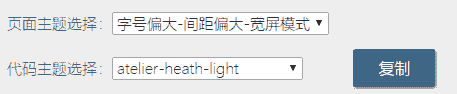

**步骤**
1\. 点开markdown[在线编辑器](http://blog.didispace.com/tools/online-markdown/)
2\. 将markdown格式的文章复制到[在线编辑器](http://blog.didispace.com/tools/online-markdown/)编辑栏，或者直接在编辑栏写markdown文章
3\. 文章编辑好后，点击复制按钮，粘贴到[微信公众号](https://mp.weixin.qq.com/)即可
