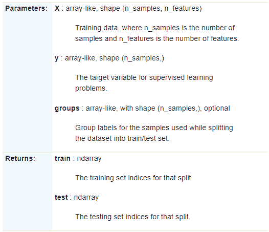

**1\. 描述**
KFold divides all the samples in k groups of samples, called folds (if k = n, this is equivalent to the Leave One Out strategy), of equal sizes (if possible). The prediction function is learned using k - 1 folds, and the fold left out is used for test.

**2\. 语法**
sklearn.model_selection.KFold(n_splits=3, shuffle=False, random_state=None)

**3\. 参数:**
1\. `n_splits:` int, default=3
Number of folds. Must be at least 2\.
将训练/测试数据集划分n_splits个互斥子集，每次用n_splits-1个子集的并集作为训练集，余下的子集作为测试集
2\. `shuffle:`boolean, optional
Whether to shuffle the data before splitting into batches.
shuffle= False:不洗牌，每次运行结果相同，相当于random_state=整数
shuffle=True:洗牌，每次运行结果不同
shuffle=True和random_state=整数: 每次运行结果相同
3\. `random_state:` int, RandomState instance or None, optional, default=None
If int, random_state is the seed used by the random number generator;
If RandomState instance, random_state is the random number generator;
If None, the random number generator is the RandomState instance used by np.random. Used when shuffle == True.

**4\. 方法**
1\. get_n_splits([X, y, groups])
Returns the number of splitting iterations in the cross-validator
2\. split(X[, y, groups])
Generate indices to split data into training and test set.


`注：`Randomized CV splitters may return different results for each call of split. You can make the results identical by setting random_state to an integer.

**5\. 实例**

```
X = np.array([[1, 2], [3, 4], [1, 2], [3, 4]])
y = np.array([1, 2, 3, 4])
kf = KFold(n_splits=3)
kf.get_n_splits(X)

print(kf)  

for train_index, test_index in kf.split(X):
   print("TRAIN:", train_index, "TEST:", test_index)
   X_train, X_test = X[train_index], X[test_index]
   y_train, y_test = y[train_index], y[test_index]
print(X_train,y_train)
print(X_test,y_test) 
```

KFold(n_splits=3, random_state=None, shuffle=False)
TRAIN: [2 3] TEST: [0 1]
TRAIN: [0 1 3] TEST: [2]
TRAIN: [0 1 2] TEST: [3]
[[1 2]
[3 4]
[1 2]] [1 2 3]
[[3 4]] [4]

`注：`
The first `n_samples % n_splits` folds have size `n_samples // n_splits + 1`, other folds have size `n_samples // n_splits`, where `n_samples` is the number of samples.

**拓展**
`StratifiedKFold`
Takes group information into account to avoid building folds with imbalanced class distributions (for binary or multiclass classification tasks).
`GroupKFold`
K-fold iterator variant with non-overlapping groups.
`RepeatedKFold`
Repeats K-Fold n times.