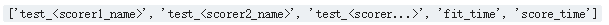

Learning the parameters of a prediction function and testing it on the same data is a methodological mistake: a model that would just repeat the labels of the samples that it has just seen would have a perfect score but would fail to predict anything useful on yet-unseen data. This situation is called overfitting. To avoid it, it is common practice when performing a (supervised) machine learning experiment to hold out part of the available data as a test set X_test, y_test. Note that the word “experiment” is not intended to denote academic use only, because even in commercial settings machine learning usually starts out experimentally.

In scikit-learn a random split into training and test sets can be quickly computed with the train_test_split helper function. Let’s load the iris data set to fit a linear support vector machine on it:

```
import numpy as np
from sklearn.model_selection import train_test_split
from sklearn import datasets
from sklearn import svm

iris = datasets.load_iris()
iris.data.shape, iris.target.shape
```

((150, 4), (150,))

We can now quickly sample a training set while holding out 40% of the data for testing (evaluating) our classifier:

```
X_train, X_test, y_train, y_test = train_test_split(
    iris.data, iris.target, test_size=0.4, random_state=0)
X_train.shape, y_train.shape
X_test.shape, y_test.shape
clf = svm.SVC(kernel='linear', C=1).fit(X_train, y_train)
clf.score(X_test, y_test) 
```

0.96…

When evaluating different settings (“hyperparameters”) for estimators, such as the C setting that must be manually set for an SVM, there is still a risk of overfitting on the test set because the parameters can be tweaked until the estimator performs optimally. This way, knowledge about the test set can “leak” into the model and evaluation metrics no longer report on generalization performance. To solve this problem, yet another part of the dataset can be held out as a so-called “validation set”: training proceeds on the training set, after which evaluation is done on the validation set, and when the experiment seems to be successful, final evaluation can be done on the test set.

However, by partitioning the available data into three sets, we drastically reduce the number of samples which can be used for learning the model, and the results can depend on a particular random choice for the pair of (train, validation) sets.

A solution to this problem is a procedure called cross-validation (CV for short). A test set should still be held out for final evaluation, but the validation set is no longer needed when doing CV. In the basic approach, called k-fold CV, the training set is split into k smaller sets (other approaches are described below, but generally follow the same principles). The following procedure is followed for each of the k “folds”:

1.  A model is trained using k-1 of the folds as training data;
2.  The resulting model is validated on the remaining part of the data (i.e., it is used as a test set to compute a performance measure such as accuracy).

The performance measure reported by k-fold cross-validation is then the average of the values computed in the loop. This approach can be computationally expensive, but does not waste too much data (as it is the case when fixing an arbitrary test set), which is a major advantage in problem such as inverse inference where the number of samples is very small.

## 1\. Computing cross-validated metrics

The simplest way to use cross-validation is to call the [cross_val_score](http://scikit-learn.org/stable/modules/generated/sklearn.model_selection.cross_val_score.html#sklearn.model_selection.cross_val_score) helper function on the estimator and the dataset.

The following example demonstrates how to estimate the accuracy of a linear kernel support vector machine on the iris dataset by splitting the data, fitting a model and computing the score 5 consecutive times (with different splits each time):

```
from sklearn.model_selection import cross_val_score
clf = svm.SVC(kernel='linear', C=1)
scores = cross_val_score(clf, iris.data, iris.target, cv=5)
scores 
```

array([ 0.96…, 1\. …, 0.96…, 0.96…, 1\. ])

The mean score and the 95% confidence interval of the score estimate are hence given by:

```
print("Accuracy: %0.2f (+/- %0.2f)" % (scores.mean(), scores.std() * 2))
```

Accuracy: 0.98 (+/- 0.03)

By default, the score computed at each CV iteration is the score method of the estimator. It is possible to change this by using the [scoring parameter](http://scikit-learn.org/stable/modules/model_evaluation.html#scoring-parameter):

```
from sklearn import metrics
cross_val_score(clf, iris.data, iris.target, cv=5, scoring='f1_macro')
scores.mean()
```

0.98…

In the case of the Iris dataset, the samples are balanced across target classes hence the accuracy and the F1-score are almost equal.

When the `cv` argument is an integer, cross_val_score uses the [KFold](http://scikit-learn.org/stable/modules/generated/sklearn.model_selection.KFold.html#sklearn.model_selection.KFold) or [StratifiedKFold](http://scikit-learn.org/stable/modules/generated/sklearn.model_selection.StratifiedKFold.html#sklearn.model_selection.StratifiedKFold) strategies by default, the latter being used if the estimator derives from [ClassifierMixin](http://scikit-learn.org/stable/modules/generated/sklearn.base.ClassifierMixin.html#sklearn.base.ClassifierMixin).

It is also possible to use other cross validation strategies by passing a cross validation iterator instead, for instance:

```
from sklearn.model_selection import ShuffleSplit
n_samples = iris.data.shape[0]
cv = ShuffleSplit(n_splits=3, test_size=0.3, random_state=0)
scores = cross_val_score(clf, iris.data, iris.target, cv=cv)
scores.mean()
```

0.98518518518518527

`Data transformation` with held out data
Just as it is important to test a predictor on data held-out from training, preprocessing (such as standardization, feature selection, etc.) and similar [data transformations](http://scikit-learn.org/stable/data_transforms.html#data-transforms) similarly should be learnt from a training set and applied to held-out data for prediction:

```
from sklearn import preprocessing
X_train, X_test, y_train, y_test = train_test_split(iris.data, iris.target, test_size=0.4, random_state=0)
#scaler = preprocessing.StandardScaler()
#X_train_transformed = scaler.fit_transform(X_train)
scaler = preprocessing.StandardScaler().fit(X_train)
X_train_transformed = scaler.transform(X_train)
clf = svm.SVC(C=1).fit(X_train_transformed, y_train)
X_test_transformed = scaler.transform(X_test)
clf.score(X_test_transformed, y_test)
```

0.933…

A [Pipeline](http://scikit-learn.org/stable/modules/generated/sklearn.pipeline.Pipeline.html#sklearn.pipeline.Pipeline) makes it easier to compose estimators, providing this behavior under cross-validation:

```
from sklearn.pipeline import make_pipeline
clf = make_pipeline(preprocessing.StandardScaler(), svm.SVC(C=1))
scores = cross_val_score(clf, iris.data, iris.target, cv=cv)
scores.mean()
```

0.9555…

### 1.1 The `cross_validate function` and multiple metric evaluation

The `cross_validate` function differs from `cross_val_score` in two ways :
1\. It allows specifying multiple metrics for evaluation.
2\. It returns a dict containing training scores, fit-times and score-times in addition to the test score.

For single metric evaluation, where the scoring parameter is a string, callable or None, the keys will be ：

And for multiple metric evaluation, the return value is a dict with the following keys -

`return_train_score` is set to `True` by default. It adds train score keys for all the scorers. If train scores are not needed, this should be set to `False` explicitly.
The multiple metrics can be specified either as a list, tuple or set of predefined scorer names:

```
from sklearn.model_selection import cross_validate
from sklearn.metrics import recall_score
scoring = ['precision_macro', 'recall_macro']
clf = svm.SVC(kernel='linear', C=1, random_state=0)
scores = cross_validate(clf, iris.data, iris.target, scoring=scoring,
                        cv=5, return_train_score=False)
print(sorted(scores.keys()))
print(scores['test_precision_macro'].mean())
print(scores['test_recall_macro'].mean())
```

[‘fit_time’, ‘score_time’, ‘test_precision_macro’, ‘test_recall_macro’]
0.981818181818
0.98

Or as a dict mapping scorer name to a predefined or custom scoring function:

```
from sklearn.metrics.scorer import make_scorer
scoring = {'prec_macro': 'precision_macro',
           'rec_micro':  make_scorer(recall_score, average='macro')}# 'recall_macro'
scores = cross_validate(clf, iris.data, iris.target, scoring=scoring,
                        cv=5, return_train_score=True)
print(sorted(scores.keys()))                 
print(scores['train_rec_micro'],scores['train_rec_micro'].mean())   
print(scores['test_rec_micro'],scores['test_rec_micro'].mean())
```

[‘fit_time’, ‘score_time’, ‘test_prec_macro’, ‘test_rec_micro’, ‘train_prec_macro’, ‘train_rec_micro’]
[ 0.975 0.975 0.99166667 0.98333333 0.98333333] 0.981666666667
[ 0.96666667 1\. 0.96666667 0.96666667 1\. ] 0.98

Here is an example of `cross_validate` using a single metric:

```
scores = cross_validate(clf, iris.data, iris.target,
                        scoring='precision_macro')
sorted(scores.keys())
print(scores['test_score'],scores['test_score'].mean())
```

[ 1\. 0.96491228 0.98039216] 0.981768145855

### 1.2 Obtaining predictions by cross-validation

The function [cross_val_predict](http://scikit-learn.org/stable/modules/generated/sklearn.model_selection.cross_val_predict.html#sklearn.model_selection.cross_val_predict) has a similar interface to [cross_val_score](http://scikit-learn.org/stable/modules/generated/sklearn.model_selection.cross_val_score.html#sklearn.model_selection.cross_val_score), but returns, for each element in the input, the prediction that was obtained for that element when it was in the test set. Only cross-validation strategies that assign all elements to a test set exactly once can be used (otherwise, an exception is raised).

```
from sklearn import datasets, linear_model
from sklearn.model_selection import cross_val_predict
diabetes = datasets.load_diabetes()
X = diabetes.data[:150]
y = diabetes.target[:150]
lasso = linear_model.Lasso()
y_pred = cross_val_predict(lasso, X, y)
```

```
from sklearn import datasets, linear_model
from sklearn.model_selection import cross_val_score
diabetes = datasets.load_diabetes()
X = diabetes.data[:150]
y = diabetes.target[:150]
lasso = linear_model.Lasso()
print(cross_val_score(lasso, X, y)) 
```

[ 0.33150734 0.08022311 0.03531764]

These prediction can then be used to evaluate the classifier:

```
from sklearn.model_selection import cross_val_predict
from sklearn.metrics import accuracy_score 
predicted = cross_val_predict(clf, iris.data, iris.target, cv=10)
accuracy_score(iris.target, predicted) 
```

0.97333333333333338

Note that the result of this computation may be slightly different from those obtained using [cross_val_score](http://scikit-learn.org/stable/modules/generated/sklearn.model_selection.cross_val_score.html#sklearn.model_selection.cross_val_score) as the elements are grouped in different ways.

The available cross validation iterators are introduced in the following section.

Examples：

1.  [Receiver Operating Characteristic (ROC) with cross validation](http://scikit-learn.org/stable/auto_examples/model_selection/plot_roc_crossval.html#sphx-glr-auto-examples-model-selection-plot-roc-crossval-py)
2.  [Recursive feature elimination with cross-validation](http://scikit-learn.org/stable/auto_examples/feature_selection/plot_rfe_with_cross_validation.html#sphx-glr-auto-examples-feature-selection-plot-rfe-with-cross-validation-py)
3.  [Parameter estimation using grid search with cross-validation](http://scikit-learn.org/stable/auto_examples/model_selection/plot_grid_search_digits.html#sphx-glr-auto-examples-model-selection-plot-grid-search-digits-py)
4.  Sample pipeline for text feature extraction and evaluation
5.  Plotting Cross-Validated Predictions
6.  Nested versus non-nested cross-validation

## 2\. Cross validation iterators

The following sections list utilities to generate indices that can be used to generate dataset splits according to different cross validation strategies.

### 2.1 Cross-validation iterators for i.i.d. data

Assuming that some data is Independent and Identically Distributed (i.i.d.) is making the assumption that all samples stem from the same generative process and that the generative process is assumed to have no memory of past generated samples.

The following cross-validators can be used in such cases.

NOTE

While i.i.d. data is a common assumption in machine learning theory, it rarely holds in practice. If one knows that the samples have been generated using a time-dependent process, it’s safer to use a `time-series aware cross-validation scheme` Similarly if we know that the generative process has a group structure (samples from collected from different subjects, experiments, measurement devices) it safer to use `group-wise cross-validation`.

#### 2.1.1 K-fold k折交叉验证

[KFold](http://scikit-learn.org/stable/modules/generated/sklearn.model_selection.KFold.html#sklearn.model_selection.KFold) divides all the samples in k groups of samples, called folds (if k = n, this is equivalent to the Leave One Out strategy), of equal sizes (if possible). The prediction function is learned using k - 1 folds, and the fold left out is used for test.

1.  将训练集S分成K个互斥的子集{S1,S2,…,Sk}，假设S中的训练样本个数为M，那么每个子集中有M/K个训练样本
2.  在分好的子集中，取出K-1个作为训练集，剩余的一个作为测试集
3.  在K-1个训练集上训练模型
4.  将训练好的模型对测试集进行预测，得到分类率
5.  计算K次得到的分类率的平均值，作为该模型的真实分类率

这个方法充分利用了所有样本，但是计算比较繁琐，需要训练K次，测试K次

Example of 2-fold cross-validation on a dataset with 4 samples:

```
import numpy as np
from sklearn.model_selection import KFold

X = ["a", "b", "c", "d"]
kf = KFold(n_splits=4)
for train_index, test_index in kf.split(X):
    print("%s %s" % (train_index, test_index))
```

[1 2 3] [0]
[0 2 3] [1]
[0 1 3] [2]
[0 1 2] [3]

Each fold is constituted by two arrays: the first one is related to the training set, and the second one to the test set. Thus, one can create the training/test sets using numpy indexing:

```
import numpy as np
from sklearn.model_selection import KFold

X = np.array([[0., 0.], [1., 1.], [-1., -1.], [2., 2.]])
y = np.array([0, 1, 0, 1])
kf = KFold(n_splits=2)
for train_index, test_index in kf.split(X):
    print("%s %s" % (train_index, test_index ))  
    X_train, X_test, y_train, y_test = X[train_index], X[test_index ], y[train_index], y[test_index ]
    print(X_train,y_train)
    print(X_test,y_test)
```

[2 3] [0 1]
[[-1\. -1.] [ 2\. 2.]] [0 1]
[[ 0\. 0.] [ 1\. 1.]] [0 1]
[0 1] [2 3]
[[ 0\. 0.] [ 1\. 1.]] [0 1]
[[-1\. -1.] [ 2\. 2.]] [0 1]

#### 2.1.2 Repeated K-Fold

[RepeatedKFold](http://scikit-learn.org/stable/modules/generated/sklearn.model_selection.RepeatedKFold.html#sklearn.model_selection.RepeatedKFold) repeats K-Fold n times. It can be used when one requires to run KFold n times, producing different splits in each repetition.

Example of 2-fold K-Fold repeated 2 times:

```
import numpy as np
from sklearn.model_selection import RepeatedKFold
X = np.array([[1, 2], [3, 4], [1, 2], [3, 4]])
rkf = RepeatedKFold(n_splits=2, n_repeats=2, random_state=2)
for train_index, test_index in rkf.split(X):
    print("%s %s" % (train_index, test_index))
```

[0 1] [2 3]
[2 3] [0 1]
[2 3] [0 1]
[0 1] [2 3]

Similarly, [RepeatedStratifiedKFold](http://scikit-learn.org/stable/modules/generated/sklearn.model_selection.RepeatedStratifiedKFold.html#sklearn.model_selection.RepeatedStratifiedKFold) repeats Stratified K-Fold n times with different randomization in each repetition.

#### 2.1.3 Leave One Out (LOO) 留一法

[LeaveOneOut (or LOO)](http://scikit-learn.org/stable/modules/generated/sklearn.model_selection.LeaveOneOut.html#sklearn.model_selection.LeaveOneOut) is a simple cross-validation. Each learning set is created by taking all the samples except one, the test set being the sample left out. Thus, for n samples, we have n different training sets and n different tests set. This cross-validation procedure does not waste much data as only one sample is removed from the training set:

```
from sklearn.model_selection import LeaveOneOut

X = [1, 2, 3, 4]
loo = LeaveOneOut()
for train, test in loo.split(X):
    print("%s %s" % (train, test))
```

[1 2 3] [0]
[0 2 3] [1]
[0 1 3] [2]
[0 1 2] [3]

Note: `LeaveOneOut()` is equivalent to `KFold(n_splits=n) and LeavePOut(p=1)` where n is the number of samples.

#### 2.1.4 Leave P Out (LPO)

[LeavePOut](http://scikit-learn.org/stable/modules/generated/sklearn.model_selection.LeavePOut.html#sklearn.model_selection.LeavePOut) is very similar to `LeaveOneOut` as it creates all the possible training/test sets by removing p samples from the complete set. For n samples, this produces {n \choose p} train-test pairs. Unlike LeaveOneOut and KFold, the test sets will overlap for p > 1.

Provides train/test indices to split data in train/test sets. This results in testing on all distinct samples of size p, while the remaining n - p samples form the training set in each iteration.

Due to the high number of iterations which grows combinatorically with the number of samples this cross-validation method can be very costly. For large datasets one should favor `KFold, StratifiedKFold or ShuffleSplit`.

Example of Leave-2-Out on a dataset with 4 samples:

```
from sklearn.model_selection import LeavePOut

X = np.ones(4)
lpo = LeavePOut(p=2)
for train, test in lpo.split(X):
    print("%s %s" % (train, test))
```

[2 3] [0 1]
[1 3] [0 2]
[1 2] [0 3]
[0 3] [1 2]
[0 2] [1 3]
[0 1] [2 3]

#### 2.1.5 Random permutations cross-validation a.k.a. Shuffle & Split

The [ShuffleSplit](http://scikit-learn.org/stable/modules/generated/sklearn.model_selection.ShuffleSplit.html#sklearn.model_selection.ShuffleSplit) iterator will generate a user defined number of independent train / test dataset splits. Samples are first shuffled and then split into a pair of train and test sets.

It is possible to control the randomness for reproducibility of the results by explicitly seeding the random_state pseudo random number generator.

Here is a usage example:

```
from sklearn.model_selection import ShuffleSplit
X = np.arange(5)
ss = ShuffleSplit(n_splits=3, test_size=0.25,
    random_state=0)
for train_index, test_index in ss.split(X):
    print("%s %s" % (train_index, test_index))
```

[1 3 4] [2 0]
[1 4 3] [0 2]
[4 0 2] [1 3]

`ShuffleSplit` is thus a good alternative to `KFold` cross validation that allows a finer control on the number of iterations and the proportion of samples on each side of the train / test split.

### 2.2 Cross-validation iterators with stratification based on class labels

Some classification problems can exhibit a large imbalance in the distribution of the target classes: for instance there could be several times more negative samples than positive samples. In such cases it is recommended to use stratified sampling as implemented in [StratifiedKFold](http://scikit-learn.org/stable/modules/generated/sklearn.model_selection.StratifiedKFold.html#sklearn.model_selection.StratifiedKFold) and [StratifiedShuffleSplit](http://scikit-learn.org/stable/modules/generated/sklearn.model_selection.StratifiedShuffleSplit.html#sklearn.model_selection.StratifiedShuffleSplit) to ensure that relative class frequencies is approximately preserved in each train and validation fold.

#### 2.2.1 StratifiedKFold

`StratifiedKFold` is a variation of k-fold which returns stratified folds: each set contains approximately the same percentage of samples of each target class as the complete set.

Example of stratified 3-fold cross-validation on a dataset with 10 samples from two slightly unbalanced classes:

```
from sklearn.model_selection import StratifiedKFold

X = np.ones(10)
y = [0, 0, 0, 0, 1, 1, 1, 1, 1, 1]
skf = StratifiedKFold(n_splits=3)
for train_index, test_index in skf.split(X, y):
    print("%s %s" % (train_index, test_index ))
```

[2 3 6 7 8 9] [0 1 4 5]
[0 1 3 4 5 8 9] [2 6 7]
[0 1 2 4 5 6 7] [3 8 9]

[RepeatedStratifiedKFold](http://scikit-learn.org/stable/modules/generated/sklearn.model_selection.RepeatedStratifiedKFold.html#sklearn.model_selection.RepeatedStratifiedKFold) can be used to repeat Stratified K-Fold n times with different randomization in each repetition.

#### 2.2.2 Stratified Shuffle Split

[StratifiedShuffleSplit](http://scikit-learn.org/stable/modules/generated/sklearn.model_selection.StratifiedShuffleSplit.html#sklearn.model_selection.StratifiedShuffleSplit) is a variation of ShuffleSplit, which returns stratified splits, i.e which creates splits by preserving the same percentage for each target class as in the complete set.

### 2.3 Cross-validation iterators for grouped data.

The i.i.d. assumption is broken if the underlying generative process yield groups of dependent samples.
Such a grouping of data is domain specific. An example would be when there is medical data collected from multiple patients, with multiple samples taken from each patient. And such data is likely to be dependent on the individual group. In our example, the patient id for each sample will be its group identifier.
In this case we would like to know if a model trained on a particular set of groups generalizes well to the unseen groups. To measure this, we need to ensure that all the samples in the validation fold come from groups that are not represented at all in the paired training fold.
The following cross-validation splitters can be used to do that. The grouping identifier for the samples is specified via the `groups`parameter.

#### 2.3.1 Group k-fold

[GroupKFold](http://scikit-learn.org/stable/modules/generated/sklearn.model_selection.GroupKFold.html#sklearn.model_selection.GroupKFold) is a variation of k-fold which ensures that the same group is not represented in both testing and training sets. For example if the data is obtained from different subjects with several samples per-subject and if the model is flexible enough to learn from highly person specific features it could fail to generalize to new subjects. GroupKFold makes it possible to detect this kind of overfitting situations.

Imagine you have three subjects, each with an associated number from 1 to 3:

```
from sklearn.model_selection import GroupKFold
X = [0.1, 0.2, 2.2, 2.4, 2.3, 4.55, 5.8, 8.8, 9, 10]
y = ["a", "b", "b", "b", "c", "c", "c", "d", "d", "d"]
groups = [1, 1, 1, 2, 2, 2, 3, 3, 3, 3]
gkf = GroupKFold(n_splits=3)
for train_index, test_index in gkf.split(X, y, groups=groups):
    print("%s %s" % (train_index, test_index))
```

[0 1 2 3 4 5] [6 7 8 9]
[0 1 2 6 7 8 9] [3 4 5]
[3 4 5 6 7 8 9] [0 1 2]

Each subject is in a different testing fold, and the same subject is never in both testing and training. Notice that the folds do not have exactly the same size due to the imbalance in the data.

`参考：`
1\. [『Sklearn』数据划分方法](https://www.cnblogs.com/hellcat/p/7045585.html)
2\. [机器学习–>sklearn.Cross-validation](https://blog.csdn.net/Mr_tyting/article/details/73440712)