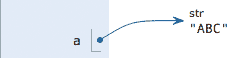

## 1\. 静态语言和动态语言中的变量表示

静态语言在定义变量时必须指定变量类型，如果赋值的时候类型不匹配，就会报错。例如Java是静态语言，赋值语句如下：

```
int a = 123; // a是整数类型变量
a = "mooc"; // 错误：不能把字符串赋给整型变量
```

和静态语言相比，动态语言更灵活。

## 2\. 变量在计算机中的内存表示

最后，理解变量在计算机内存中的表示也非常重要。当我们写：a = ‘ABC’时，Python解释器干了两件事情：

1.  在内存中创建了一个’ABC’的字符串；

2.  在内存中创建了一个名为a的变量，并把它指向’ABC’。

也可以把一个变量a赋值给另一个变量b，这个操作实际上是把变量b指向变量a所指向的数据，例如下面的代码：

```
a = 'ABC'
b = a
a = 'XYZ'
print(b)
```

最后一行打印出变量b的内容到底是’ABC’呢还是’XYZ’？如果从数学意义上理解，就会错误地得出b和a相同，也应该是’XYZ’，但实际上b的值是’ABC’：
执行·a = ‘ABC’，解释器创建了字符串 ‘ABC’和变量 a，并把a指向 ‘ABC’：

执行a
执行b = a，解释器创建了变量 b，并把b指向 a 指向的字符串’ABC’：

执行a = ‘XYZ’，解释器创建了字符串’XYZ’，并把a的指向改为’XYZ’，但b并没有更改：


所以，最后打印变量b的结果自然是’ABC’了。