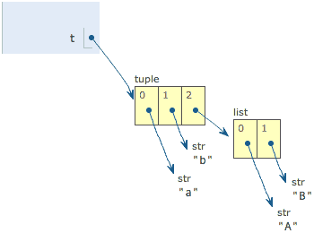
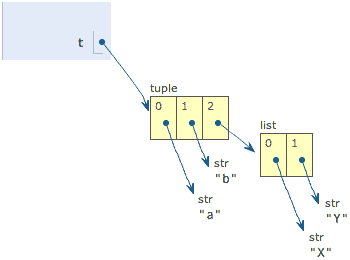

前面我们看到了tuple一旦创建就不能修改。现在，我们来看一个“可变”的tuple：

```
 t = ('a', 'b', ['A', 'B'])
```

注意到 t 有 3 个元素：’a’，’b’和一个list：[‘A’, ‘B’]。list作为一个整体是tuple的第3个元素。list对象可以通过 t[2] 拿到：

```
 L = t[2]
```

然后，我们把list的两个元素改一改：

```
L[0] = 'X'
L[1] = 'Y'
```

再看看tuple的内容：

```
print t
('a', 'b', ['X', 'Y'])
```

不是说tuple一旦定义后就不可变了吗？怎么现在又变了？

别急，我们先看看定义的时候tuple包含的3个元素：


当我们把list的元素’A’和’B’修改为’X’和’Y’后，tuple变为：


表面上看，tuple的元素确实变了，但其实变的`不是` tuple 的元素，而是list的元素。

tuple一开始指向的list并没有改成别的list，所以，tuple所谓的`“不变”`是说，tuple的`每个元素`，`指向`永远不变。即指向’a’，就不能改成指向’b’，指向一个list，就不能改成指向其他对象，但指向的这个list本身是可变的！

理解了“指向不变”后，要创建一个`内容也不变的tuple`怎么做？那就必须保证tuple的`每一个元素`本身也不能变。