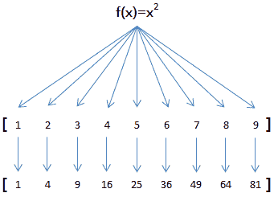

## 1\. 高阶函数

高阶函数就是可以把函数作为参数的函数，下面我们看一个简单的高阶函数：

```
def add(x, y, f):
    return f(x) + f(y)
```

如果传入abs作为参数f的值：

```
add(-5, 9, abs)
```

根据函数的定义，函数执行的代码实际上是：

```
abs(-5) + abs(9)
```

由于参数 x, y 和 f 都可以任意传入，如果 f 传入`其他函数`，就可以得到不同的返回值。

## 2\. map()函数

map()是 Python `内置`的高阶函数，它接收一个`函数` f 和一个 `list`，并通过把函数 f 依次作用在 list 的每个元素上，得到一个`新的 list` 并返回。

例如，对于list [1, 2, 3, 4, 5, 6, 7, 8, 9]

如果希望把list的每个元素都作平方，就可以用map()函数：

因此，我们只需要传入函数f(x)=x*x，就可以利用map()函数完成这个计算：

```
def f(x):
    return x*x
print map(f, [1, 2, 3, 4, 5, 6, 7, 8, 9])
```

输出结果：

[1, 4, 9, 10, 25, 36, 49, 64, 81]

注意：map()函数`不改变`原有的 list，而是返回一个新的 list。

利用map()函数，可以把一个 list 转换为另一个 list，只需要传入`转换函数`。

由于list包含的元素可以是任何类型，因此，map() 不仅仅可以处理只包含数值的 list，事实上它可以处理包含任意类型的 list，只要传入的函数f可以处理这种数据类型。

## 3\. reduce()函数

`reduce()`函数也是Python内置的一个高阶函数。reduce()函数接收的参数和 map()类似，一个`函数` f，一个`list`，但行为和 map()不同，reduce()传入的函数 f 必须接收`两个`参数，reduce()对list的每个元素`反复调用`函数f，并返回最终结果值。

例如，编写一个f函数，接收x和y，返回x和y的和：

```
def f(x, y):
    return x + y
```

调用 reduce(f, [1, 3, 5, 7, 9])时，reduce函数将做如下计算：

先计算头两个元素：f(1, 3)，结果为4；
再把结果和第3个元素计算：f(4, 5)，结果为9；
再把结果和第4个元素计算：f(9, 7)，结果为16；
再把结果和第5个元素计算：f(16, 9)，结果为25；
由于没有更多的元素了，计算结束，返回结果25。

上述计算实际上是对 list 的所有元素求和。虽然Python内置了求和函数sum()，但是，利用reduce()求和也很简单。

reduce()还可以接收`第3个可选参数`，作为计算的`初始值`。如果把初始值设为100，计算：

reduce(f, [1, 3, 5, 7, 9], 100)
结果将变为125，因为第一轮计算是：

计算初始值和第一个元素：f(100, 1)，结果为101。

## 4\. filter()函数

`filter()`函数是 Python 内置的另一个有用的高阶函数，filter()函数接收一个`函数`f 和一个`list`，这个函数 f 的作用是对`每个元素`进行判断，返回 True或 False，filter()根据判断结果自动`过滤`掉不符合条件的元素，返回由符合条件元素组成的新list。

例如，要从一个list [1, 4, 6, 7, 9, 12, 17]中删除偶数，保留奇数，首先，要编写一个判断奇数的函数：

```
def is_odd(x):
    return x % 2 == 1
```

然后，利用filter()过滤掉偶数：

```
>>>filter(is_odd, [1, 4, 6, 7, 9, 12, 17])
[1, 7, 9, 17]
```

利用filter()，可以完成很多有用的功能，例如，`删除` None 或者空字符串：

```
def is_not_empty(s):
    return s and len(s.strip()) > 0
```

```
>>>filter(is_not_empty, ['test', None, '', 'str', '  ', 'END'])
['test', 'str', 'END']
```

注意: `s.strip(rm)` 删除 s 字符串中开头、结尾处的 rm 序列的字符。

当rm为`空`时，默认删除空白符（包括’\n’, ‘\r’, ‘\t’, ’ ‘)，如下：

```
a = '     123'
a.strip()
```

结果： ‘123’

```
a='\t\t123\r\n'
a.strip()
```

结果：’123’

**实列**

```
import math
def is_sqr(x):
    r = int(math.sqrt(x))
    return r*r==x
print filter(is_sqr, range(1, 101))
```

## 5\. sorted()函数

Python内置的 `sorted()`函数可对list进行排序：

```
>>>sorted([36, 5, 12, 9, 21])

[5, 9, 12, 21, 36]
```

但 sorted()也是一个高阶函数，它可以接收一个`比较函数`来实现`自定义排序`，比较函数的定义是，传入两个待比较的元素 x, y，如果 x 应该排在 y 的`前面`，返回 `-1`，如果 x 应该排在 y 的`后面`，返回`1`。如果 x 和 y `相等`，返回 `0`。

因此，如果我们要实现`倒序排序`，只需要编写一个reversed_cmp函数：

```
def reversed_cmp(x, y):
    if x > y:
        return -1
    if x < y:
        return 1
    return 0
```

这样，调用 sorted() 并传入 reversed_cmp 就可以实现倒序排序：

```
>>> sorted([36, 5, 12, 9, 21], reversed_cmp)
[36, 21, 12, 9, 5]
```

sorted()也可以对`字符串`进行排序，字符串默认按照`ASCII大小`来比较：

```
>>> sorted(['bob', 'about', 'Zoo', 'Credit'])
['Credit', 'Zoo', 'about', 'bob']
```

‘Zoo’排在’about’之前是因为’Z’的ASCII码比’a’小。

## 6\. 返回函数

Python的函数不但可以返回int、str、list、dict等数据类型，还可以`返回函数`！

例如，定义一个函数 f()，我们让它返回一个函数 g，可以这样写：

```
def f():
    print 'call f()...'
    # 定义函数g:
    def g():
        print 'call g()...'
    # 返回函数g:
    return g
```

仔细观察上面的函数定义，我们在函数 f 内部又定义了一个函数 g。由于函数 g 也是一个对象，函数名 g 就是指向函数 g 的变量，所以，最外层函数 f 可以返回变量 g，也就是函数 g 本身。

调用函数 f，我们会得到 f 返回的一个函数：

```
>>> x = f()   # 调用f()
call f()...
>>> x   # 变量x是f()返回的函数：
<function g at 0x1037bf320>
>>> x()   # x指向函数，因此可以调用
call g()...   # 调用x()就是执行g()函数定义的代码
```

请注意区分返回函数和返回值：

```
def myabs():
    return abs   # 返回函数
def myabs2(x):
    return abs(x)   # 返回函数调用的结果，返回值是一个数值
```

返回函数可以把一些计算`延迟执行`。例如，如果定义一个普通的求和函数：

```
def calc_sum(lst):
    return sum(lst)
```

调用calc_sum()函数时，将立刻计算并得到结果：

```
>>> calc_sum([1, 2, 3, 4])
10
```

但是，如果返回一个函数，就可以“延迟计算”：

```
def calc_sum(lst):
    def lazy_sum():
        return sum(lst)
    return lazy_sum
```

```
# 调用calc_sum()并没有计算出结果，而是返回函数:
>>> f = calc_sum([1, 2, 3, 4])
>>> f
<function lazy_sum at 0x1037bfaa0>
# 对返回的函数进行调用时，才计算出结果:
>>> f()
10
```

由于可以返回函数，我们在后续代码里就可以决定到底要不要调用该函数。

**实例**
请编写一个函数calc_prod(lst)，它接收一个list，返回一个函数，返回函数可以计算参数的乘积。

```
def calc_prod(lst):
    def lazy_prod():
        def f(x, y):
            return x * y
        return reduce(f, lst, 1)
    return lazy_prod
f = calc_prod([1, 2, 3, 4])
print f()
```

## 7\. 闭包

在函数内部定义的函数和外部定义的函数是一样的，只是他们无法被外部访问：

```
def g():
    print 'g()...'

def f():
    print 'f()...'
    return g
```

将 g 的定义移入函数 f 内部，防止其他代码调用 g：

```
def f():
    print 'f()...'
    def g():
        print 'g()...'
    return g
```

但是，考察上一小节定义的 calc_sum 函数：

```
def calc_sum(lst):
    def lazy_sum():
        return sum(lst)
    return lazy_sum
```

注意: 发现没法把 lazy_sum 移到 calc_sum 的外部，因为它引用了 calc_sum 的参数 lst。

像这种`内层函数`引用了`外层函数`的变量（参数也算变量），然后`返回`内层函数的情况，称为`闭包`（Closure）。

闭包的`特点`是返回的函数还引用了外层函数的`局部变量`，所以，要正确使用闭包，就要`确保`引用的局部变量在函数返回后不能变。举例如下：

```
# 希望一次返回3个函数，分别计算1x1,2x2,3x3:
def count():
    fs = []
    for i in range(1, 4):
        def f():
             return i*i
        fs.append(f)
    return fs

f1, f2, f3 = count()
```

你可能认为调用f1()，f2()和f3()结果应该是1，4，9，但实际结果全部都是 9（请自己动手验证）。

原因就是当count()函数返回了3个函数时，这3个函数所引用的变量 i 的值已经变成了3。由于f1、f2、f3并没有被调用，所以，此时他们并未计算 i*i，当 f1 被调用时：

```
>>> f1()
9     # 因为f1现在才计算i*i，但现在i的值已经变为3
```

因此，返回函数`不要`引用任何`循环变量`，或者后续会发生变化的变量。

**实例**
返回闭包不能引用循环变量，请改写count()函数，让它正确返回能计算1x1、2x2、3x3的函数。

考察下面的函数 f:

```
def f(j):
    def g():
        return j*j
    return g
```

它可以正确地返回一个闭包g，g所引用的变量j不是循环变量，因此将正常执行。

在count函数的循环内部，如果借助f函数，就可以避免引用循环变量i。

参考代码:

```
def count():
    fs = []
    for i in range(1, 4):
        def f(j):
            def g():
                return j*j
            return g
        r = f(i)
        fs.append(r)
    return fs
f1, f2, f3 = count()
print f1(), f2(), f3()
```

## 8\. 匿名函数

`高阶函数`可以接收函数做参数，有些时候，我们不需要显式地定义函数，直接传入`匿名函数`更方便。

在Python中，对匿名函数提供了有限支持。还是以map()函数为例，计算 f(x)=x2 时，除了定义一个f(x)的函数外，还可以直接传入匿名函数：

```
>>> map(lambda x: x * x, [1, 2, 3, 4, 5, 6, 7, 8, 9])
[1, 4, 9, 16, 25, 36, 49, 64, 81]
```

通过对比可以看出，匿名函数 lambda x: x * x 实际上就是：

```
def f(x):
    return x * x
```

关键字`lambda` 表示匿名函数，`冒号前面`的 x 表示`函数参数`。

匿名函数有个`限制`，就是只能有`一个`表达式，`不写`return，`返回值`就是该表达式的结果。

使用匿名函数，可以`不必定义`函数名，直接创建一个函数对象，很多时候可以简化代码：

```
>>> sorted([1, 3, 9, 5, 0], lambda x,y: -cmp(x,y))
[9, 5, 3, 1, 0]
```

返回函数的时候，也可以返回匿名函数：

```
>>> myabs = lambda x: -x if x < 0 else x 
>>> myabs(-1)
1
>>> myabs(1)
1
```

## 9\. 装饰器decorator

问题：
1\. 定义了一个函数
2\. 想在运行时动态增加功能
3\. 又不想改动函数本身的代码

python内置的@语法就是为了简化装饰器的调用

装饰器的作用：
1\. 可以极大地简化代码，避免每个函数编写重复性的代码
打印日志：@log
检测性能：@performance
数据库事务：@transaction
URL路由：@post（’/register’）

## 10\. 编写无参数decorator

Python的 decorator `本质`上就是一个高阶函数，它接收一个`函数`作为参数，然后，返回一个`新函数`。

使用 decorator 用Python提供的`@ 语法`，这样可以避免手动编写 f = decorate(f) 这样的代码。

考察一个`@log`的定义：

```
def log(f):
    def fn(x):
        print 'call ' + f.__name__ + '()...'
        return f(x)
    return fn
```

对于阶乘函数，@log工作得很好：

```
@log
def factorial(n):
    return reduce(lambda x,y: x*y, range(1, n+1))
print factorial(10)
```

结果：

```
call factorial()...
3628800
```

但是，对于参数不是一个的函数，调用将报错：

```
@log
def add(x, y):
    return x + y
print add(1, 2)
```

结果：

```
Traceback (most recent call last):
  File "test.py", line 15, in <module>
    print add(1,2)
```

TypeError: fn() takes exactly 1 argument (2 given)
因为 add() 函数需要传入两个参数，但是 @log 写死了只含一个参数的返回函数。

要让`@log` 自适应任何参数定义的函数，可以利用Python的 `*args` 和 `**kw`，保证任意个数的参数总是能正常调用：

```
def log(f):
    def fn(*args, **kw):
        print 'call ' + f.__name__ + '()...'
        return f(*args, **kw)
    return fn
```

现在，对于任意函数，@log 都能正常工作。

**实例**
请编写一个@performance，它可以打印出函数调用的时间。
计算函数调用的时间可以记录调用前后的当前时间戳，然后计算两个时间戳的差。

```
import time

def performance(f):
    def g(*args,**kw):
        t1 = time.time()
        r = f(*args,**kw)
        t2 = time.time()
        print 'call %s() in %fs' %(f.__name__,t2-t1)
        return r
    return g

@performance
def factorial(n):
    return reduce(lambda x,y: x*y, range(1, n+1))

print factorial(10)
```

## 11\. 编写带参数decorator

考察上一节的 @log 装饰器：

```
def log(f):
    def fn(x):
        print 'call ' + f.__name__ + '()...'
        return f(x)
    return fn
```

发现对于被装饰的函数，log打印的语句是不能变的（除了函数名）。

如果有的函数非常重要，希望打印出’[INFO] call xxx()…’，有的函数不太重要，希望打印出’[DEBUG] call xxx()…’，这时，log函数本身就需要传入’INFO’或’DEBUG’这样的参数，类似这样：

```
@log('DEBUG')
def my_func():
    pass
```

把上面的定义翻译成高阶函数的调用，就是：

```
my_func = log('DEBUG')(my_func)
```

上面的语句看上去还是比较绕，再展开一下：

```
log_decorator = log('DEBUG')
my_func = log_decorator(my_func)
```

上面的语句又相当于：

```
log_decorator = log('DEBUG')
@log_decorator
def my_func():
    pass
```

所以，带参数的log函数首先返回一个decorator函数，再让这个decorator函数接收my_func并返回新函数：

```
def log(prefix):
    def log_decorator(f):
        def wrapper(*args, **kw):
            print '[%s] %s()...' % (prefix, f.__name__)
            return f(*args, **kw)
        return wrapper
    return log_decorator

@log('DEBUG')
def test():
    pass
print test()
```

执行结果：

```
[DEBUG] test()...
None
```

对于这种3层嵌套的decorator定义，你可以先把它拆开：

```
# 标准decorator:
def log_decorator(f):
    def wrapper(*args, **kw):
        print '[%s] %s()...' % (prefix, f.__name__)
        return f(*args, **kw)
    return wrapper
return log_decorator
```

```
# 返回decorator:
def log(prefix):
    return log_decorator(f)
```

拆开以后会发现，调用会失败，因为在3层嵌套的decorator定义中，最内层的wrapper引用了最外层的参数prefix，所以，把一个闭包拆成普通的函数调用会比较困难。不支持闭包的编程语言要实现同样的功能就需要更多的代码。

**实例**
上一节的@performance只能打印秒，请给 @performace 增加一个参数，允许传入’s’或’ms’：

@performance(‘ms’)
def factorial(n):
return reduce(lambda x,y: x*y, range(1, n+1))
`分析`
要实现带参数的@performance，就需要实现：
my_func = performance(‘ms’)(my_func)
需要3层嵌套的decorator来实现。

```
import time
def performance(unit):
    def perf_decorator(f):
        def wrapper(*args, **kw):
            t1 = time.time()
            r = f(*args, **kw)
            t2 = time.time()
            t = (t2 - t1) * 1000 if unit=='ms' else (t2 - t1)
            print 'call %s() in %f %s' % (f.__name__, t, unit)
            return r
        return wrapper
    return perf_decorator

@performance('ms')
def factorial(n):
    return reduce(lambda x,y: x*y, range(1, n+1))
print factorial(10)
```

## 12.完善decorator

@decorator可以`动态实现函数功能的增加`，但是，经过@decorator“改造”后的函数，和原函数相比，除了功能多一点外，有没有其它不同的地方？

在没有decorator的情况下，打印函数名：

```
def f1(x):
    pass
print f1.__name__
#输出： f1
```

有decorator的情况下，再打印函数名：

```
def log(f):
    def wrapper(*args, **kw):
        print 'call...'
        return f(*args, **kw)
    return wrapper
@log
def f2(x):
    pass
print f2.__name__
#输出： wrapper
```

可见，由于decorator返回的新函数函数名已经不是’f2’，而是@log内部定义的’wrapper’。这对于那些依赖函数名的代码就会失效。decorator还改变了函数的`__doc__`等其它属性。如果要让调用者`看不出`一个函数经过了@decorator的“改造”，就需要把原函数的一些属性`复制`到新函数中：

```
def log(f):
    def wrapper(*args, **kw):
        print 'call...'
        return f(*args, **kw)
    wrapper.__name__ = f.__name__
    wrapper.__doc__ = f.__doc__
    return wrapper
```

这样写decorator很不方便，因为我们也很难把原函数的所有必要属性都一个一个复制到新函数上，所以Python内置的`functools`可以用来自动化完成这个“复制”的任务：

```
import functools
def log(f):
    @functools.wraps(f)
    def wrapper(*args, **kw):
        print 'call...'
        return f(*args, **kw)
    return wrapper
```

最后需要指出，由于我们把原函数签名改成了`(*args, **kw)`，因此，无法获得原函数的原始参数信息。即便我们采用固定参数来装饰只有一个参数的函数：

```
def log(f):
    @functools.wraps(f)
    def wrapper(x):
        print 'call...'
        return f(x)
    return wrapper
```

也可能改变原函数的`参数名`，因为新函数的参数名始终是 ‘x’，原函数定义的参数名不一定叫 ‘x’。

**实例**
请思考带参数的@decorator，@functools.wraps应该放置在哪：

注意@functools.wraps应该作用在返回的新函数上。

参考代码:

```
import time, functools
def performance(unit):
    def perf_decorator(f):
        @functools.wraps(f)
        def wrapper(*args, **kw):
            t1 = time.time()
            r = f(*args, **kw)
            t2 = time.time()
            t = (t2 - t1) * 1000 if unit=='ms' else (t2 - t1)
            print 'call %s() in %f %s' % (f.__name__, t, unit)
            return r
        return wrapper
    return perf_decorator

@performance('ms')
def factorial(n):
    return reduce(lambda x,y: x*y, range(1, n+1))
print factorial.__name__
```

## 13\. 偏函数

当一个函数有很多参数时，调用者就需要提供多个参数。如果`减少`参数个数，就可以简化调用者的负担。

比如，int()函数可以把字符串转换为整数，当仅传入字符串时，int()函数默认按十进制转换：

```
>>> int('12345')
12345
```

但int()函数还提供额外的`base`参数，默认值为10。如果传入base参数，就可以做 N 进制的转换：

```
>>> int('12345', base=8)
5349
>>> int('12345', 16)
74565
```

假设要转换大量的二进制字符串，每次都传入int(x, base=2)非常麻烦，于是，我们想到，可以定义一个int2()的函数，默认把base=2传进去：

```
def int2(x, base=2):
    return int(x, base)
```

这样，我们转换二进制就非常方便了：

```
>>> int2('1000000')
64
>>> int2('1010101')
85
```

`functools.partial`就是帮助我们创建一个偏函数的，不需要我们自己定义int2()，可以直接使用下面的代码创建一个新的函数int2：

```
>>> import functools
>>> int2 = functools.partial(int, base=2)
>>> int2('1000000')
64
>>> int2('1010101')
85
```

所以，functools.partial可以`把一个参数多的函数变成一个参数少的新函数`，少的参数需要在创建时指定默认值，这样，新函数调用的难度就降低了。
**实例**
在第7节中，我们在sorted这个高阶函数中传入自定义排序函数就可以实现忽略大小写排序。请用functools.partial把这个复杂调用变成一个简单的函数：
`分析`
要固定sorted()的cmp参数，需要传入一个排序函数作为cmp的默认值。

```
import functools
sorted_ignore_case = functools.partial(sorted, cmp=lambda s1, s2: cmp(s1.upper(), s2.upper()))
print sorted_ignore_case(['bob', 'about', 'Zoo', 'Credit'])
```