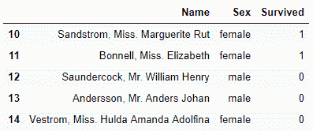

## 1\. 创建DataFrame

可以通过以下方式进行创建
1\. list
2\. dictionary
3\. ndarrays
4\. 2d ndnarrays等

**通过dictionary**
key默认为列名

```
#  索引自动添加
df = pd.DataFrame({'Student_1':[90,100, 95], 'Student_2':[60, 80, 100]})

# 索引主动添加
df = pd.DataFrame({'Student_1':[90,100, 95], 'Student_2':[60, 80, 100]}, index=['Monday', 'Wednesday', 'Friday'])

# 索引和列名主动添加
df1 = pd.DataFrame([[1, 2, 3], [4, 5, 6]], index=['A', 'B'], columns=['C1', 'C2', 'C3'])
```


```
>>>df1.values
array([[1, 2, 3],
       [4, 5, 6]], dtype=int64)
>>>df1.index
Index(['A', 'B'], dtype='object')
>>>df1.columns
Index(['C1', 'C2', 'C3'], dtype='object')
>>>df1.shape
(2, 3)
>>>df1.size
6
>>>df1.T # 维度变化
```


```
>>>df1.head() # 查看头部数据
>>>df1.tail() # 产看尾部数据
>>>df1.describe() # 查看描述信息
>>>df1.loc['B'] # 按名称查索引
C1    4
C2    5
C3    6
Name: B, dtype: int64
```

**通过list**

```
>>>df = pd.DataFrame([[1, 2, 3], [4, 5, 6]], index=['A', 'B'], columns=['C1', 'C2', 'C3'])
```


```
>>>df.loc['B'].loc['C2']  # loc works on index
5
>>>df['C2'].loc['B'] 
5
>>>df.loc['B', 'C2']
5
>>>df.iloc[1, 1] # iloc works on position (only take integers)
5
```

```
>>>df + 10 # df中每个元素加10
>>>df['C2'] = df.apply(lambda x: x['C2'] ** 2 + 10, axis=1) # axis=1行操作
```


```
df.assign(C2 = lambda x: x['C2'] + 10, C3 = lambda x: x['C3'] * 2 - 10) # df未改变
```


```
>>>df.assign(C2 = lambda x: x['C2'] ** 2 + 10, C3 = lambda x: x['C3'] * 2 - 10).loc['A'] .max()
206
```

**实例-kaggle泰坦尼克号幸存者数据**

**基本操作**

```
>>>df = pd.read_csv('train.csv') # 读取文件
>>>df.shape # (891, 12)
>>>df.head()
>>>df.tail(2)
>>>df.isnull().head()
>>>df.isnull().sum()
>>>df.dtypes 
>>>df.Survived.value_counts() # 对Survived特征进行数值统计
>>>df.Survived.value_counts().plot(kind='bar') # 画柱状图
>>>df.isnull().sum().plot(kind='bar') # 统计缺失值
```

**处理缺失值**

```
>>>df1 = df.drop('Cabin', axis=1) # 删除Cabin列
>>>df1['Age'] = df1['Age'].fillna(20) #也可以填充中位数，平均数，众数等
```

```
>>>df2 = df1[df1['Embarked'].notnull()]
>>>df3 = df.drop('Cabin', axis=1).assign(Age = lambda x: x['Age'].fillna(20)) #复合操作
>>>df1.loc[10:14, ['Name', 'Sex', 'Survived']]
```



```
df3.pivot_table(values='PassengerId', index='Survived', columns='Sex', aggfunc='count') # 作表
```


```
>>>df4 = df3.loc[df3['Survived'] == 1]
>>>df3 = df1.loc[df1['Age'] > 30]
```

```
>>>df4 = df2[['PassengerId', 'Name']].merge(df3[['PassengerId', 'Age']], on='PassengerId', how='outer')
```

```
>>>df['Pclass'].value_counts().plot.bar() # 画柱状图
>>>df['Embarked'].value_counts().plot.bar()
```

```
>>>df['Survived'].corr(df['Pclass']) # 求皮尔逊关系
-0.33848103596101475
>>>df['Survived'].corr(df['Age'])
-0.077221094572177643
```