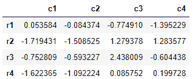

## 1\. Reindex

**Series Reindex**

```
import numpy as np
import pandas as pd
```

```
>>>s1 = pd.Series(np.random.randn(1, 4).tolist()[0], index=['A', 'B','C','D']) #先将数组转成list
A    0.523862
B   -0.341507
C   -0.368576
D    0.335503
dtype: float64

>>>s2 = s1.reindex(['A', 'B','C','D','E','F','G'])
A    0.523862
B   -0.341507
C   -0.368576
D    0.335503
E         NaN
F         NaN
G         NaN
dtype: float64

>>>s = s1.reindex(['A', 'B','C','D','E','F','G'],fill_value=0)
A    0.523862
B   -0.341507
C   -0.368576
D    0.335503
E    0.000000
F    0.000000
G    0.000000
dtype: float64

>>>s3 = s2.reindex(['A', 'B','C','D','E','F','G','H'],fill_value=0)
A    0.523862
B   -0.341507
C   -0.368576
D    0.335503
E         NaN
F         NaN
G         NaN
H    0.000000
dtype: float64
# 总结
# reindex是重新重新设置索引，原有索引没有的，用空值处理
```

**Pandas Reindex**

```
df = pd.DataFrame(np.random.randn(4, 4), index = ['r1','r2','r3','r4'], columns=['c1','c2','c3','c4'])
```



```
df.reindex(['r1','r2','r3','r6','r4','r5'])
```


```
df.reindex(columns=['c1','c2','c3','c4','c5'])
```


```
df.reindex(index=['r1','r2','r3','r6','r4','r5'],columns=['c1','c2','c3','c4','c5'])
```


## 2\. Drop Data

**Drop Series**

```
>>>s1 = pd.Series(np.arange(5),index=[1,2,3,4,5])
>>>s1.drop(4)
1    0
2    1
3    2
5    4
dtype: int32
```

**Drop DataFrame**

```
df1 = pd.DataFrame(np.random.randn(4,5),index=['r1','r2','r3','r4'],columns=['c1','c2','c3','c4','c5'])
```


```
>>>df1.drop('r1') # 删除行
>>>df1.drop('c5',axis=1) # 删除列
# 实际上df1没有发生改变
>>>df1.drop('c5',axis=1,inplace=True) # 如果想改变，加inplace
```

## 3\. Slice data

`注意`
One thing importance When slicing we are creating a VIEW so it will change the origin value

**Series slicing**

```
>>>s1 = pd.Series(np.arange(5),index=['A','B','C','D','E']) #np.arange(5)创建数组
A    0
B    1
C    2
D    3
E    4

>>>s1[(s1>2)&(s1<5)]=6
A    0
B    1
C    2
D    6
E    6

>>>s2=s1[:3]
A    0
B    1
C    2

>>>s2['A']=2018
A    2018
B       1
C       2

>>>s1  #改变s2,s1也会发生改变
A    2018
B       1
C       2
D       3
E       4

>>>s1['B']
1
>>>s1[['A','B','C']]
A    2018
B       1
C       2
>>>s1[0:3]
A    2018
B       1
C       2
>>>s1[s1>2]
A    2018
D       6
E       6
>>>s1[s1>3] = 10
A    10
B     1
C     2
D    10
E    10
```

**Dataframe Slicing**

```
df1 = pd.DataFrame(np.random.randn(4,5),index=['r1','r2','r3','r4'],columns=['c1','c2','c3','c4','c5'])
```


```
>>>df1['c1']
r1   -0.438361
r2   -0.120464
r3    1.047887
r4   -1.750577
Name: c1, dtype: float64

>>>df1[['c1','c4','c3']]

       c1           c4         c3
r1  -0.438361   0.882839    0.198042
r2  -0.120464   0.195229    0.961653
r3  1.047887    0.631334    2.136962
r4  -1.750577   -0.032042   0.110478

>>>df1[df1['c2']>0]  
        c1         c2          c3          c4          c5
r1  -0.438361   0.017712    0.198042    0.882839    -0.577667

>>>df1<0

     c1     c2       c3      c4      c5
r1  True    False   False   False   True
r2  True    True    False   False   False
r3  False   True    False   False   True
r4  True    True    False   True    True

>>>df1.ix['r2']  # 先按标号（名字）找，没有再按位置找
c1   -0.120464
c2   -0.795219
c3    0.961653
c4    0.195229
c5    2.187513
Name: r2, dtype: float64

>>>df1.iloc[1] # 按索引位置
c1   -0.120464
c2   -0.795219
c3    0.961653
c4    0.195229
c5    2.187513
Name: r2, dtype: float64

>>>df1.loc['r2'] # 按索引名
c1   -0.120464
c2   -0.795219
c3    0.961653
c4    0.195229
c5    2.187513
Name: r2, dtype: float64

>>>df1.iloc[[0,2,3],[0,2]]

       c1          c3
r1  -0.438361   0.198042
r3  1.047887    2.136962
r4  -1.750577   0.110478
```

```
>>>df2 = df1.copy()
>>>df2['c6'] = ['one', 'one','two','three']
```


```
>>>df2['c6'].isin(['two','three'])
r1    False
r2    False
r3     True
r4     True
Name: c6, dtype: bool

>>>df2[df2['c6'].isin(['two','three'])]
```


## 4\. Data Alignment

```
>>>s1 = pd.Series(np.arange(5),index=['A','B','C','D','E'])
>>>s2 = pd.Series(np.arange(3),index=['A','B','C'])
>>>s1 + s2
A    0.0
B    2.0
C    4.0
D    NaN
E    NaN
dtype: float64
>>>df1 = pd.DataFrame(np.random.randn(4,5),index=['r1','r2','r3','r4'],columns=['c1','c2','c3','c4','c5'])
>>>df2 = pd.DataFrame(np.random.randn(3,4),index=['r1','r2','r3'],columns=['c1','c2','c3','c4'])
>>>df1+df2
>>>df1.add(df2,fill_value=0)   #use fill_value +df1
```


## 5\. Rank and Sort

```
>>>s1 = pd.Series(np.arange(5),index=['B','D','C','A','E'])
B    0
D    1
C    2
A    3
E    4
>>>s1.sort_index()
A    3
B    0
C    2
D    1
E    4
>>>s1.sort_values(ascending=False) #False 表示从大到小
E    4
A    3
C    2
D    1
B    0
>>>s1.sort_values(ascending=True)
B    0
D    1
C    2
A    3
E    4
>>>s1.rank() #对应索引的排名
B    1.0
D    2.0
C    3.0
A    4.0
E    5.0
```