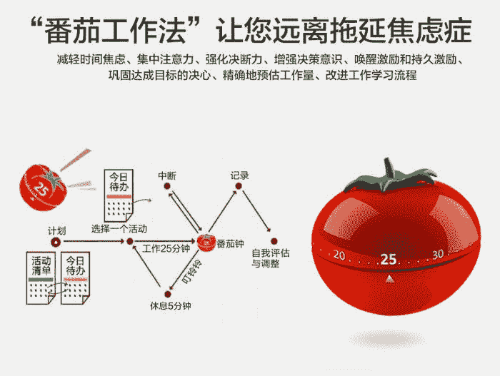
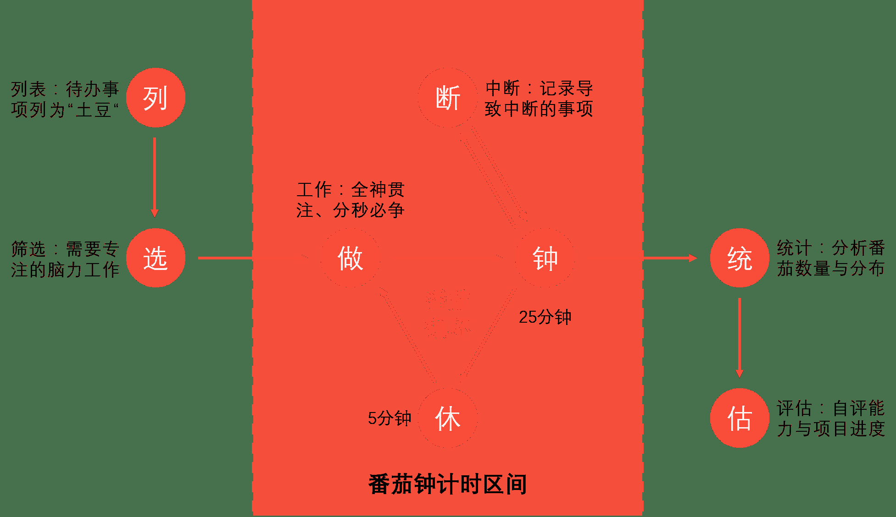
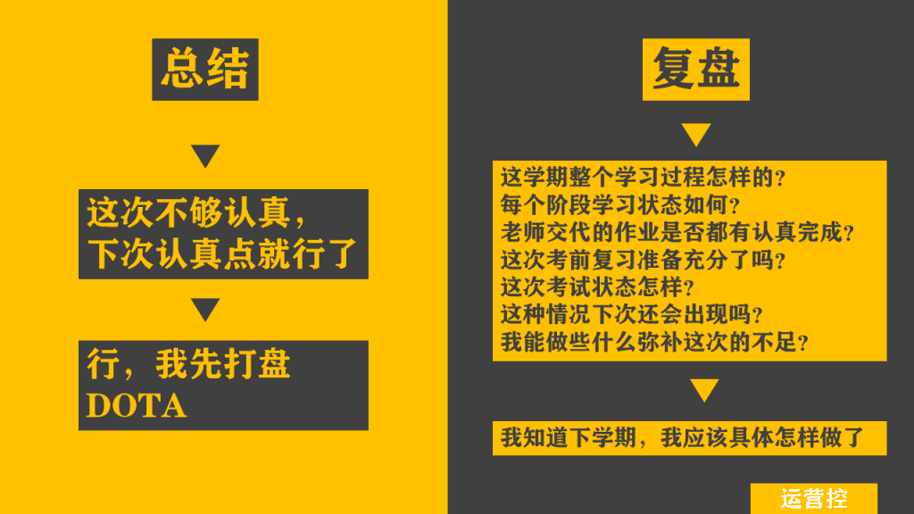
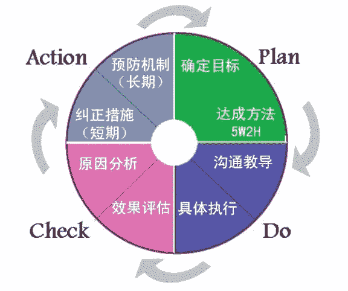
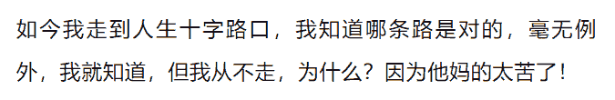

## 1\. 什么是番茄工作法

1.  番茄工作法的发明者
    意大利人弗朗西斯科·西里洛于1992年创立了番茄工作法。他和我们大多数人一样，是一个重度拖延症患者。他在大学生活的头几年，曾一度苦于学习效率低下，于是他做了个简单的实验：我就不信我不能专注10分钟。他找来形状像番茄的厨房定时器，调到10分钟来督促自己专注。后来，他把这个方法加以改进，形成了番茄工作法。
2.  番茄工作法的一句话描述
    列出每天工作任务，并分解成为一个个25分钟的任务，然后逐个执行完成。



## 2\. 如何执行番茄工作法



#### 2.1 前期准备

```
列出今天必须完成的任务
预估每个任务要花的番茄钟。
```

1.  两张计划表：一张待办任务清单表，另一张是番茄种工作表。`待办任务清单`上记录下脑海中所有要做的任务，清空大脑。而`番茄种工作表`就是专门列出今天要完成的任务。
2.  和以往做工作计划表的两个差别：一，以往工作计划表，列出的是准备完成的任务，而番茄工作法列出的是两张`任务清单`；二，以往工作计划表以完成每个任务为推进标志，而番茄工作表以`完成番茄钟为准`。
3.  以番茄钟为标准的两个好处：一是把大`任务拆解`为番茄钟，有效化解大任务带给人的压迫感，缓解拖延症；二是以一个标准的番茄钟计时，能建立完成一个任务要花多长时间的“`时间概念`”，从而有效反馈工作效率。

#### 2.2 中期执行

```
专注工作
保证休息
```


**专注工作:**
无论是内部打断还是外部打断，番茄工作法都着重强调要保证在25分钟的时间内专注做同一件事情。

1.  **内部打断**: 被自己的念头和想法所打断。解决方法是将这些想法列入待办清单，不立即去做。
2.  **外部打断**：被外界因素打断。用告知、协商、计划、答复四个步骤去解决。

**保证休息:**
番茄工作法特别强调休息的作用，学会休息才能形成工作休息的节奏感，保证大脑有精力完成后续的番茄钟。高效工作的大脑，会丧失全局思考的能力。

1.  每个番茄钟之后要保证休息。
2.  正处在心流状态，番茄钟结束同样需要休息。
3.  休息的两个建议：一，休息的时候尽量不要动用脑力思考，可选择冥想、睡觉，或者喝杯咖啡等；二，尽量让自己的休息形成节奏感，即25分钟的专注，然后5分钟的休息。

#### 2.3 后期回顾

```
复盘
优化
```


1\. 复盘：回顾一天的学习，将预估的工作时长和实际番茄钟进行对比，找出差距的原因
2\. 优化：把经验和总结应用到下一次的番茄工作法中，持续改进。

## 3\. 番茄工作法的原理与适用范围

1.  从设计上看：用倒计时的方法，巧妙地调动了人们的紧迫感，提升了专注力。
2.  从学习周期的角度来看，一个倒计时番茄钟时间和一段休息时间相配合，有助于大脑的专注思维和发散思维的交替使用。
3.  从学习视角看，番茄工作法的原理来自于戴明环理论。
    **戴明环理论**:PDCA循环又叫质量环，是管理学中的一个通用模型，最早由休哈特于1930年构想，后来被美国质量管理专家戴明博士在1950年再度挖掘出来，并加以广泛宣传和运用于持续改善产品质量的过程。PDCA，P是plan，制定计划，D是do，实施行动，C 是check，检查成果，A是Adjust，调整改进。也就是不断制定计划，实施计划，反馈检查，改进完善，再制定改进后的新计划，这是一个不断完善和自我进化的过程。
    

**番茄钟工作法真的有效么？**
