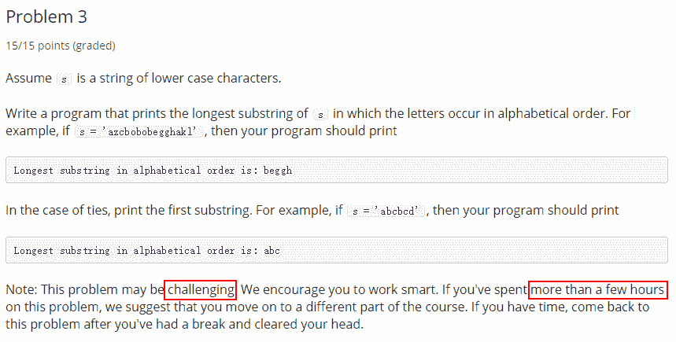
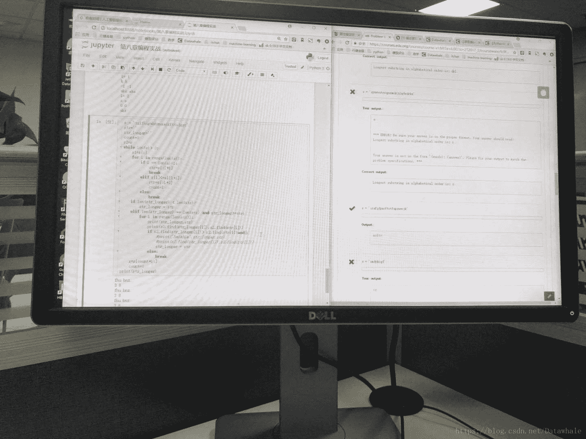
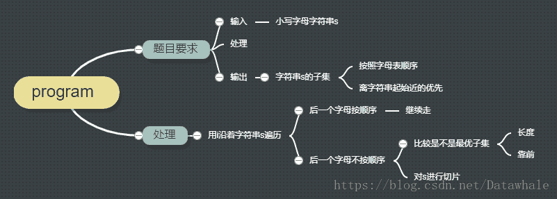
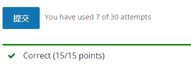

## 1\. 题目来源

麻省理工的编程导论：
[Introduction to Computer Science and Programming Using Python](https://www.edx.org/course/introduction-computer-science-mitx-6-00-1x-11)
第一周课程的第三个编程题
[Week 1: Python Basics Problem Set 1 Problem 3](https://courses.edx.org/courses/course-v1:MITx+6.00.1x+2T2017_2/courseware/fc8f42302c644118adfcfa720f9f403e/ca19e125470846f2a36ad1225410e39a/2?activate_block_id=block-v1%3AMITx%2B6.00.1x%2B2T2017_2%2Btype%40vertical%2Bblock%402ad818f0770d449d873328eb7cb35122)

## 2\. 题目内容

Assume s is a string of lower case characters.
Write a program that prints the longest substring of s in which the letters occur in alphabetical order. For example, if `s = 'azcbobobegghakl'`, then your program should print

```
Longest substring in alphabetical order is: beggh
```

In the case of ties, print the first substring. For example, if s = ‘abcbcd’, then your program should print

```
Longest substring in alphabetical order is: abc
```

用白话来说，我们现在有个字符串，我们希望得到字符串中按26个字母表顺序的最长字符串子集。
注意哦，aab也是按字母表顺序的。附：

从官网题目介绍的最下角的`Note`中，它已经温馨的给予**提示**：如果你花了几个小时都没做出来的话，亲爱的，你还是继续学习后续内容吧。

## 3\. 解题经过

虽然我是一个编程小白，但看完题目，依然迷の自信地觉得，我应该不是大多数那一类。
一个小时过去，程序感觉写的差不多了，运行了一个用例`s = 'azcbobobegghakl'`，没毛病。

1.  赶紧提交程序，`10.5/15分`，原来部分用例无法通过，观察后发现，原来题目部分理解错误
2.  再改，再不通过，原来有细节没考虑
3.  再改，再不通过
4.  再改，各种报错


九点，十点，十一点，总感觉再改改应该能改好的，再一看表，已经快十二点了，只好收拾回去，心里却特别的不甘心。

**为什么我写的程序总是有各种细节没有考虑完全？**
**为什么总感觉自己写程序很被动，哪里有错改哪里？**

离开公司后拍了一张照片。凌晨的路上，格外地寂静，我满脑子都是问题出现在了哪里


## 4\. 程序是逻辑的实现

今天公司团建，大部分人都出去了。我坐下来开始思考自己的问题出现了哪里。不是程序，而是写程序的过程。

作为一个小白，我一般看完题目要求，便立即去实现，然后遇到问题，就去改问题，直到没有报错为止。

慢慢地我发现，我写程序总是有各种遗漏点，对于复杂的编程，不断纠错的过程花费时间过多。

我决定换一个思路，开始重新编写昨天的程序。

### 4.1 实现逻辑

首先我用思维导图梳理了我对题目的理解和实现逻辑，这里特别感谢Jane推荐我的[百度脑图](http://naotu.baidu.com/)，真的特别好用。

### 4.2 根据逻辑编写程序

我边分析逻辑，边写程序，按照逻辑模块，一块一块地去分析实现。
你大可不必去理解每个实现过程，这也不是我的目的，我更多地是想完整地记录下我的程序是怎样一步一步地去实现的。

和之前写程序相比：

1.  我差不都花了一个半小时，完整地记录和实现了整个程序。
2.  思路特别清晰，很有逻辑。
3.  整个过程，心情很愉悦。

```
1.首先我用一个循环while len(s)> 1，进行切片，直到字符串的长度小于1的时候，我们就不进行切片了
问题：
如果一开始字符串就一个呢
解决：
我们将条件改为len(s)> 0,也就是说为0的时候，我们就结束了
问题：
正常情况下，对字符串进行切片s[start:end]，是不可能为0的,至少有个start元素，
除非字符串本身就是空，那也不会进入循环。还有就是当切片长度为1的时候，直接将
下一个切片设为空
2.对s进行遍历
3.设置遍历条件s[i]<=s[i+1]
这里涉及临界点的问题s[i+1]会不会越界，所以我需要对特殊情况进行判断
遍历到最后一个元素也就是i==len(s)-1是不存在s[i+1]的，这个时候：
说明字符串进行不断的切片，已经到了无法切的地步。
这个时候我想分析走到这一步有几种情形：
1）如果是新切片按照顺序走到最后一个元素
2）如果是新切片的第一个元素
我们要添加一个str(存储每一轮遍历切片到进行切片前的字符串子集)
再添加一个str_best(存储满足条件的最优子集)
继续考虑两种情形：
如果是新切片按照顺序走到最后一个元素：
str=s[:i+1]字符串子集
对该子集和已有的最优子集进行比较，所以我还要写一个函数喽,暂且叫is_best_str(str,str_best)
s=''切片设置为空
break结束循环了
如果是新切片的第一个元素：
str=s[:i+1]字符串子集，只包含一个元素
s=''切片设置为空
break结束循环了
所以两种情况代码可以是一样的

那我们继续写正常时候的遍历，也就是我们需要对前后字母进行比较
s[i]<=s[i+1]否
如果False，说明后面字母不是按顺序的，那就结束遍历，进行切片吧
str=s[:i+1]
s=[i+1:]
str_best=is_best_str(str,str_best)
break 结束当前遍历
如果True,说明后面一个字母是按顺序的，那就继续遍历：
既然是这样的话我们把判断条件改一下s[i]>s[i+1]
如果True,说明后面字母不是按照顺序的：
str=s[:i+1]
s=[i+1:]
str_best=is_best_str(str,str_best)
否则False，我们继续遍历不做处理

那主程序写完了，也不知道有没有bug，写is_best_str(str,str_best)函数吧
这个函数主要是判断当前字符串子集是不是最优子集
最优子集有两个条件：
1.长度最长
2.长度等的话，看不是靠近字符串起始端
第一中情况如果当前字符串比最优字符串长的话，明人不说暗话，快上位吧，这片江山都是你的
if len(str)> len(str_best)
    str_best = str
第二种情况就是相等了,那我们用字符串的find函数，返回索引位置来判断谁靠前
因为这时候我们要用到原始的字符串s,当是现在的s已经是切片后的了
所以我们事先对s进行复制 s_copy=s
elif len(str)== len(str_best)：
如果最优索引的位置大于当前字符串子集，那说明当前的更靠近，快上位
    if s_copy.find(str_best)> s_copy.find(str):
        str_best=str
最后我们将结果返回：
return str_best

s = 'mfktakscto'
s_copy=s
str=''
str_best=''
"""判断当前字符串子集是不是最优子集"""
def is_best_str(str,str_best):
    if len(str) > len(str_best):
        str_best=str
    elif len(str) == len(str_best):
        if s_copy.find(str_best)>s_copy.find(str):
            str_best=str
    return str_best

while len(s)> 0 :
    """对s进行遍历"""
    for i in range(len(s)):
        """设置遍历条件：后一个字母是不是按顺序"""
        """如果变量到切片的最后一个元素或者切片只有一个元素时"""
        if i == len(s)-1：
            """存储字符串子集并将新的切片设置为空，程序终于可以结束啦"""
            """存储该轮字符串子集和设置切片"""
            str=s[:i+1]
            s=''
            """该轮字符串和最优字符串进行比较，得到当前最优字符串"""
            str_best = is_best_str(str,str_best)
            break
        """后一个字母不是按照字母表顺序"""
        elif s[i]>s[i+1]:
            str=s[:i+1]
            s=s[i+1:]
            str_best=is_best_str(str,str_best)
            break
```

### 4.3 完整程序

```
s_copy=s
str=''
str_best=''
def is_best_str(str,str_best):
    if len(str) > len(str_best):
        str_best=str
    elif len(str) == len(str_best):
        if s_copy.find(str_best)>s_copy.find(str):
            str_best=str
    return str_best

while len(s)> 0:
    for i in range(len(s)):
        if i == len(s)-1:
            str=s[:i+1]
            s=''
            str_best=is_best_str(str,str_best)
            break
        elif s[i]>s[i+1]:
            str=s[:i+1]
            s=s[i+1:]
            str_best=is_best_str(str,str_best)
            break
print(str_best)
```

除了修改部分因为标识符出现的语法错误，提交程序后，这次特别顺利地通过了。这一刻，实在是愉悦。


作为一个小白，在编程的路上不断迷茫和徘徊，我之所以去记录自己改善的过程，一方面，如果你和我一样也是小白，希望能让我们一起成长；另一方面，如果你已经度过小白阶段，希望你能同我分享一点编程的心得和建议，让我更快地度过小白阶段。

当然，上述也只是我的摸索过程，如何去写好程序，我也不太了解，如果你有意愿，愿一起探讨交流。