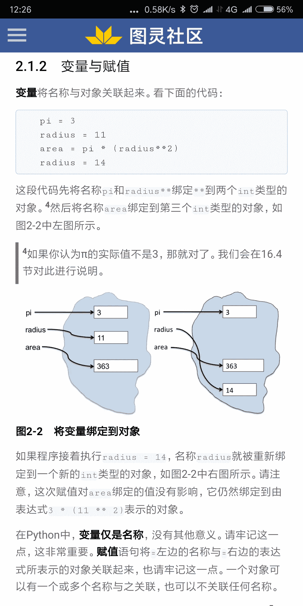
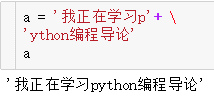
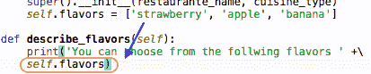
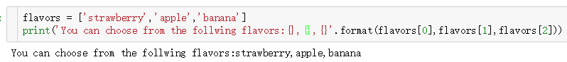
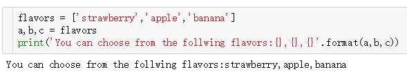
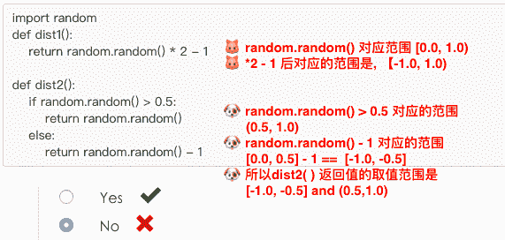
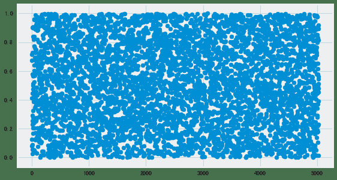
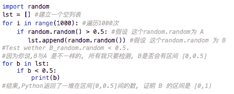
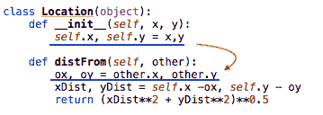

### 问题1

```
[Jane]
课程视频用的是python 2.7并推荐了一个软件
可是书上用的是python 3
所以是安装视频推荐的软件来学习
还是用自己的python 3好呢
```

`Bigjing`
推荐python3考虑到python2终究被淘汰
以python3为主更适合后期的学习

`lmz`
edx是py3, 学堂在线是py2(老版本)
如果能看得进全英文，建议看edx的新版
另外可以用anaconda装虚拟环境
这样可以在在jupyter notebook上使用多版本python
只要简单的切换内核就可以了
具体可以参考[https://www.jianshu.com/p/cd69050a48bf](https://www.jianshu.com/p/cd69050a48bf)
python2可能最让人头疼的应该是他的字符编码问题。。。

### 问题2

```
[Jane]
视频和书讲的内容好像有一点点差异
所以重点应该是刷书还是刷视频呢？
```

`Bigjing`
我今天试着探索了学习方式
仅供借鉴：1\. 先看教材 2\. 再看视频的pdf 3.再看视频

`SY`
我是视频再看书
觉得视频比较好理解点,有些例子书上也没讲到
另外推荐看edx上最新的视频

### 问题3

```
[Jane]
不是很清楚shell，cmd，IDLE和IDE的关系
```

`Bigjing`

1.  shell 是命令窗口，比如python安装后自带的命令窗口
2.  cmd 是window自带的命令窗口，如果把python安装的bin路径放到windowns的环境变量里面 cmd便可以当python shell用，运行python代码
3.  IDE是代码的集成开发环境，比如pycharm,jupyter notebook，比shell功能强大
4.  IDLE是python安装后自带的IDE

`lmz`
这个应该是来自配套教材2.1.3 IDLE(看英文版的会更好理解一点)

1.  Shell:When we speak of the command line, we are really referring to the shell. The shell is a program that takes keyboard commands and passes them to the operating system to carry out.
2.  IDE(Integrated develop environment)
3.  IDLE(just a name, the IDE that comes as part of the standard python installation package),
    专有名词解释可以在配套的英文教材寻找

### 问题4

```
[SY]
----------------------------------
def f(i):    
    return i + 2
def g(i):
    return i > 5
L = [0, -10, 5, 6, -4]
def applyF_filterG(L,f,g):
    newL = []
    for i in L:
        if g(f(i)) == True:
            newL.append(i)
    L[:] = newL
    if len(L) == 0:
        return -1
    else:
        return max(L)
print(applyF_filterG(L, f, g))
print(L)
----------------------------------
在applyF_filterG函数中对L进行mutate的时候
只有L[:]=newL，返回的才是[5, 6]
用newL.copy()，list(newL)都是返回原先的L
是因为newL只存在函数里，而不是全局变量？
```

`lmz`
除了声明globle外，在函数内新增的变量都是局部变量。另外需要注意的是L[:]其实直接对内存的value进行原地更新操作(再延伸，比如在函数内对pandas的Dataframe进行操作也是直接作用在对应内存的df上)，类似于L.sort().
如果不加[:], 用L=newL或者L=newL.copy(), 本质上只是对局部变量名L重新赋值而已，不会影响到全局变量L(可以参考编程导论第2章，’在Python中，变量仅是名称，没有其他意义。请牢记这一点，这非常重要。’)

建议关注3个定义:
变量名
变量值
变量名在内存中的映射值


### 问题5

```
[Aris]
在一个file中, 如何只 run 一段我想run 的代码，而不是整个文件的所有代码?
```

`lmz`

1.  spyder中 选中代码，然后按快捷键F9
2.  使用juypter notebook，除了支持ipynb格式外，其实还支持md格式运行代码，不过md支持代码运行需要额外的设置(用 Jupyter Notebook 读写 GitHub 源文件)。

### 问题6

```
[Aris]
换行问题, 代码过长时, 怎样换行呢？
```

`Bigjing`
加 \ 表换行，比如


### 问题7

```
[Aris]
如何将列表中的元素，一一列举出来?
问题描述：self.flavors 是一个存储“冰激凌口味”的列表
但是我要打印一段话 “你可以从下面的口味中选取”。
需要脱去self.flavors的列表外衣
散落出它的“口味元素”。
这个print( ) 该如何写好呢？
```


`Bigjing`
如果是一定要去掉列表的【】,本质上就是对列表进行遍历

1.  索引:
    
2.  写flavors太麻烦，可以多重赋值
    

`SY`

可以用join()的方法，将list转为str，str.join(list)

### 问题8

```
[Aris]
下面这道是:
判断2种定义下的 distritution 的取值范围是否相同. 
我认为不同, 但答案是相同.
红色部分是我的思路, 请问我❌在哪里了? 
```



`lmz`
你可以不看判断条件，直接看return的内容，里面的random.random()是新的随机值！
`Aris`
You mean, if 后的那个是 [0.0, 1.0), else后的那个是 [-1.0, 0.0). so 合起来是 [-1.0, 1.0)
但是从计算机运行的角度讲, 那个判断条件, 有限定它的范围. 所以, 无法苟同啊.
`lmz`
是的，你上面的意思就是我想表达的！

```
if random.random() > 0.5:     # 第1个random(标记为A)
    return random.random()    # 第2个random(标记为B)
```

第1个random和第2个random是不一样的！
A取值为0.7，则进入对应的return
你可以分2步：

1.  step1: B = random.random() # 新的随机取数
2.  step2: return B

除了思考答案以外，你还可以让计算机回答你的问题！
（在jupyter notebook运行该代码）

```
import matplotlib.pyplot as plt
plt.style.use('fivethirtyeight')
%matplotlib inline
plt.rc('figure', figsize = (8.4,5))
plt.rcParams['font.family'] = ['SimHei'] 
plt.rcParams['axes.unicode_minus'] = False 

import random
lst = []
for i in range(10000):
    if random.random() > 0.5:
        lst.append(random.random())

# len_lst会在5000左右，由if条件控制
len_lst = len(lst)
x = list(range(len_lst))
y = lst
plt.scatter(x, y)
plt.show() 
```


`Aris`
你是对滴!
你的检验思路：横轴=随机取值第n次, 纵轴=该次返回的 B_random.random() 的值.
纵轴的范围是 [0,1), 所以 B_random.random() 的取值范围真的是 [0,1) ?.
我的检验思路：


### 问题9

```
[Aris]
self.variable 代表该变量,可以用于整个类。
other.x 这个表达式,不懂它是什么语法,什么含义. 应该和 self. 不同. 
```


`lmz`
感觉缺少了实际应用场景，需要和实际代码结合起来看！我的猜想other应该是一个类的初始化值，应该是：

```
other = Location(A,B) # 初始化类
```

这样子，other.x 和 other.y里的x和y就是初始化后的属性值，分别为A和B.