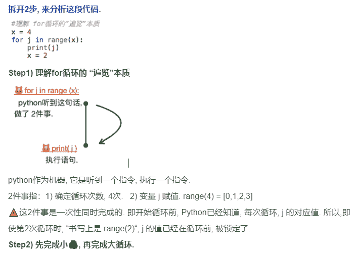

### 问题1

```
[lmz]
为什么说计算机储存整数（int）是精确的
而储存小数(float)则是不精确的? 
```

`Aris`
我举2个例子, 还原计算机如何表示 0.625, 0.1


### 问题2

```
[lmz]
Guess and Check methods中，产生guess的有：
Exhaustive Enumeration 穷举法
Bisection search 二分法
Newton-Raphson 计算根（for root finding）
可以简述一下Guess and Check的流程关键要素吗？上述3种方法有什么特点？
```

`Bigjing`
关键要素：1.初始值；2.精确度 3.初始值变更的方式

### 问题3

```
[Bigjing]
关于如何去写程序，一直在摸索
昨天在edx上week1的第三题，从死磕到逻辑地写程序
有坎坷也有收获，在此希望了解你拿到编程题，是如何去实现的，有没有比较好的心得和建议，求分享。
```

`lmz`
最重要的应该是解决问题的思路吧，只要思路清晰了，剩下的堆代码就ok了，熟练度只能靠多码代码提高了。关于这道题，我解题时想到的办法是：

1.  初始设置目标字符串longest_substring为s[0]
2.  设置一个临时字符串tmp_string, 初始也设置为s[0]
3.  依次遍历s[1:]（即使s只有一个字符串，s[1:]是不会报错的，其值为”）, 每次取一个字符(标记为i)，与上一个字符(即tmp_string[-1])做比较，然后做判断
    a. 假如 “i >= tmp_string[-1]”，说明满足字母表排序，tmp_string += i, 继续遍历
    b. 假如 “i < tmp_string[-1]” , 说明不满足字母表顺序，此时做一个断点，比较 tmp_string 和 longest_substring 的长度，更新longest_substring，然后重新初始化tmp_string为i, 继续遍历
4.  最后再比较一下 tmp_string 和 longest_substring 的长度，更新longest_substring，得出长度
    以上代码实现,应该可以在15行内完成~
    Btw, don’t use the keyword( i.e. sum, str) as a variable name. It’s a bad habit and may encounter some unexpected result.

### 问题4

```
[Jane]
为什么对字符串调用.strip()时对原变量是没有影响的
而对list调用.pop()时原list却变了？
```

`lmz`
help(str.strip)和help(list.pop)
或者看一下官方的文档，data structures, 这些属于预定义。
`Jane`
看了一下官方文档
Strings are immutable sequences of Unicode code points.
1\. str.strip() return a copy of the string with the leading and trailing characters removed.
2\. list.pop() remove the item at the given position in the list, and return it.

### 问题5

```
[lqx]
书中第三章23页的一串代码如下：
x = 4
for j in range(x):
    for i in range(x):
        print(i)
        x = 2
输出是：
0
1
2
3
0
1
0
1
0
1
作为编程菜鸟还是不理解这个过程是怎么样的
求各路大大指教
```

`Jane`
可以在在每循环一次后面加个换行符看看每次打印的结果分别是什么。
外层循环中range只被求值一次，因此j依次取值为0,1,2,3执行四次循环。
内层循环range函数则在每次执行内层for语句时都被求值，因此内层循环中第一次执行range(4)，随后x被赋值为2，第二次循环时内层循环执行range(2)，第三四次循环也是执行range(2)。

```
x = 4
for j in range(x):
    for i in range(x):
        print(i)
        x = 2
    print('\n')

输出：
0
1
2
3

0
1

0
1

0
1
```

`Aris`
拆开2步, 来分析这段代码.


### 问题6

```
[Jane]
The range type represents an immutable sequence of numbers and is commonly used for looping a specific number of times in for loops.
所以range结果直接打印不能看到所有数字，需要将其转换为list才可以么？

>>>r = range(0,20,2)
>>>r
range(0,20,2)
>>>r=list(range(0,20,2))
[2,4,6,8,10,12,14,16,18] 
```

`lmz`
python3的一个特点是，将next关键字设置为内置函数，可迭代对象都是以类似生成器的形式存在，也就是惰性的取数，每次响应只返回一个数，节省内存。
所以若使用range(6), 不会马上在内存生成0, 1, 2, 3, 4, 5的list, 而是构造一个生成器，你只有去取数的时候才会一次一次的给你返回一个数字。
你若直接print(range(0,20,2)), 其实是调用了range类的**str**方法，给你打印出了一段信息(感觉python的数据结构都是用类封装的)。
若想直接获取list, 只能用list函数一次性迭代取出迭代器里的内容！(不知以上有没有解释清楚)
插一页课件:
