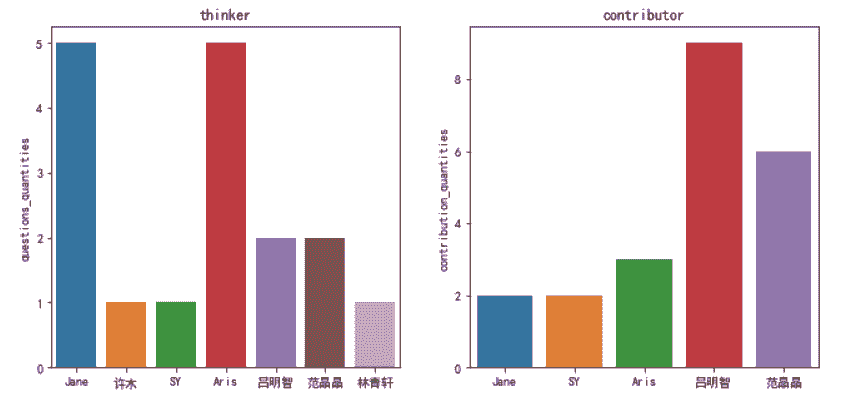
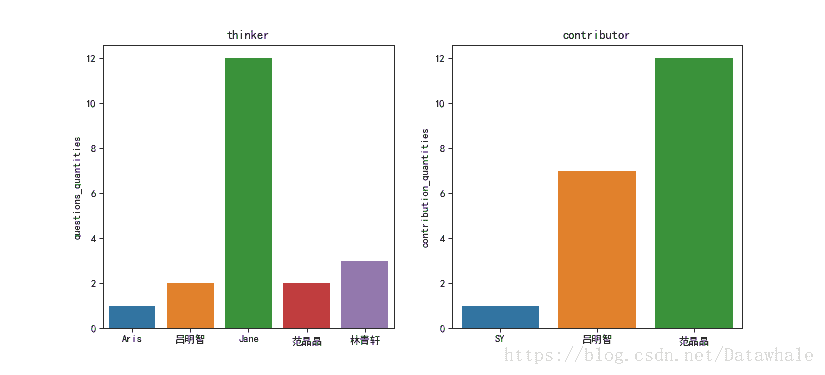

## 第一周

```
# 第一周
import matplotlib.pyplot as plt
import seaborn as sns
plt.rcParams['font.family'] = ['SimHei']  # Microsoft YaHei
plt.rcParams['axes.unicode_minus'] = False 
%matplotlib inline

thinker = ['Jane', '许木', 'SY', 'Aris','吕明智','范晶晶','林青轩']
questions_quantity =[5,1,1,5,2,2,1]
contributor=['Jane','SY','Aris','吕明智','范晶晶']
contribution_quantity =[2,2,3,9,6]

# plot
fig, (ax1,ax2) = plt.subplots(1,2,sharex=False,sharey = False,figsize=(11,5))

sns.barplot(thinker, questions_quantity, ax = ax1)
sns.barplot(contributor, contribution_quantity, ax = ax2)

ax1.set_title('thinker')
ax2.set_title('contributor')
ax1.set_ylabel('questions_quantities')
ax2.set_ylabel('contribution_quantities')
fig.savefig("data_count.png", dpi = 75)
```



## 第二周

```
thinker = ['Aris','吕明智','Jane','范晶晶','林青轩']
questions_quantity =[1,2,12,2,3]
contributor=['SY','吕明智','范晶晶']
contribution_quantity =[1,7,12]

# plot
fig, (ax1,ax2) = plt.subplots(1,2,sharex=False,sharey = False,figsize=(11,5))

sns.barplot(thinker, questions_quantity, ax = ax1)
sns.barplot(contributor, contribution_quantity, ax = ax2)

ax1.set_title('thinker')
ax2.set_title('contributor')
ax1.set_ylabel('questions_quantities')
ax2.set_ylabel('contribution_quantities')
```

