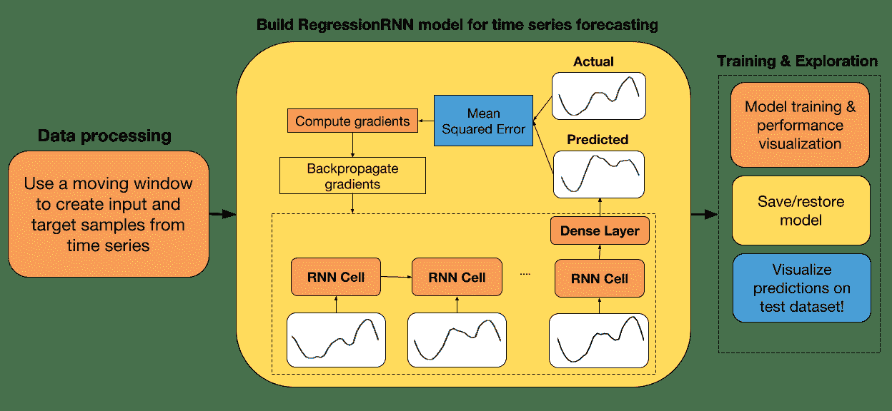
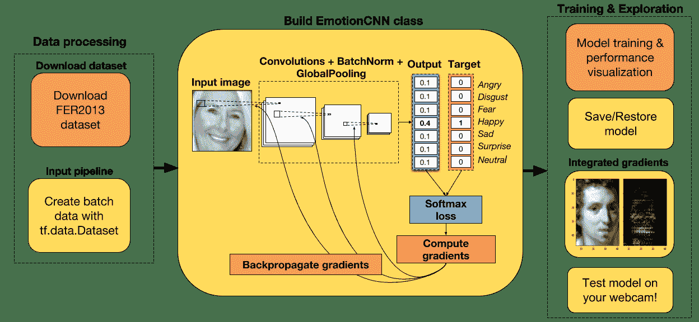

# TensorFlow Eager 教程

> 来源：[madalinabuzau/tensorflow-eager-tutorials](https://github.com/madalinabuzau/tensorflow-eager-tutorials)
> 
> 译者：[飞龙](https://github.com/wizardforcel)
> 
> 协议：[CC BY-NC-SA 4.0](http://creativecommons.org/licenses/by-nc-sa/4.0/)

# 一、如何使用 TensorFlow Eager 构建简单的神经网络

大家好！ 在本教程中，我们将使用 TensorFlow 的命令模式构建一个简单的前馈神经网络。 希望你会发现它很有用！ 如果你对如何改进代码有任何建议，请告诉我。

教程步骤：


使用的版本：TensorFlow 1.7

## 第一步：导入有用的库并启用 Eager 模式

```
# 导入 TensorFlow 和 TensorFlow Eager
import tensorflow as tf
import tensorflow.contrib.eager as tfe

# 导入函数来生成玩具分类问题
from sklearn.datasets import make_moons
import numpy as np

# 导入绘图库
import matplotlib.pyplot as plt
%matplotlib inline

# 开启 Eager 模式。一旦开启不能撤销！只执行一次。
tfe.enable_eager_execution()
```

## 第二步：为二分类生成玩具数据集

我们将生成一个玩具数据集，来训练我们的网络。 我从`sklearn`中选择了`make_moons`函数。 我相信它对我们的任务来说是完美的，因为类不是线性可分的，因此神经网络将非常有用。

```
# 为分类生成玩具数据集
# X 是 n_samples x n_features 的矩阵，表示输入特征
# y 是 长度为 n_samples 的向量，表示我们的标签
X, y = make_moons(n_samples=100, noise=0.1, random_state=2018)
```

## 第三步：展示生成的数据集

```
plt.scatter(X[:,0], X[:,1], c=y, cmap=plt.cm.autumn)
plt.xlabel('First feature')
plt.ylabel('Second feature')
plt.title('Toy classification problem')
plt.show()
```


## 第四步：构建单隐层神经网络（线性 -> ReLU -> 线性输出）

我们的第一个试验是一个简单的神经网络，只有一个隐层。 使用 TensorFlow Eager 构建神经网络模型的最简单方法是使用类。 在初始化期间，你可以定义执行模型正向传播所需的层。

由于这是一个分类问题，我们将使用`softmax`交叉熵损失。 通常，我们必须对标签进行单热编码。 为避免这种情况，我们将使用稀疏`softmax`损失，它以原始标签作为输入。 无需进一步处理！

```
class simple_nn(tf.keras.Model):
    def __init__(self):
        super(simple_nn, self).__init__()
        """ 在这里定义正向传播期间
            使用的神经网络层
        """   
        # 隐层
        self.dense_layer = tf.layers.Dense(10, activation=tf.nn.relu)
        # 输出层，无激活函数
        self.output_layer = tf.layers.Dense(2, activation=None)

    def predict(self, input_data):
        """ 在神经网络上执行正向传播
            Args:
                input_data: 2D tensor of shape (n_samples, n_features).   
            Returns:
                logits: unnormalized predictions.
        """
        hidden_activations = self.dense_layer(input_data)
        logits = self.output_layer(hidden_activations)
        return logits

    def loss_fn(self, input_data, target):
        """ 定义训练期间使用的损失函数
        """
        logits = self.predict(input_data)
        loss = tf.losses.sparse_softmax_cross_entropy(labels=target, logits=logits)
        return loss

    def grads_fn(self, input_data, target):
        """ 在每个正向步骤中，
            动态计算损失值对模型参数的梯度
        """
        with tfe.GradientTape() as tape:
            loss = self.loss_fn(input_data, target)
        return tape.gradient(loss, self.variables)

    def fit(self, input_data, target, optimizer, num_epochs=500, verbose=50):
        """ 用于训练模型的函数，
            使用所选的优化器，执行所需数量的迭代
        """
        for i in range(num_epochs):
            grads = self.grads_fn(input_data, target)
```

## 第五步：使用梯度下降训练模型

使用反向传播来训练我们模型的变量。 随意玩玩学习率和迭代数。

```
X_tensor = tf.constant(X)
y_tensor = tf.constant(y)

optimizer = tf.train.GradientDescentOptimizer(5e-1)
model = simple_nn()
model.fit(X_tensor, y_tensor, optimizer, num_epochs=500, verbose=50)

optimizer.apply_gradients(zip(grads, self.variables))
if (i==0) | ((i+1)%verbose==0):
    print('Loss at epoch %d: %f' %(i+1, self.loss_fn(input_data, target).numpy())) '''

Loss at epoch 1: 0.653288
Loss at epoch 50: 0.283921
Loss at epoch 100: 0.260529
Loss at epoch 150: 0.244092
Loss at epoch 200: 0.221653
Loss at epoch 250: 0.186211
Loss at epoch 300: 0.139418
Loss at epoch 350: 0.103654
Loss at epoch 400: 0.078874
Loss at epoch 450: 0.062550
Loss at epoch 500: 0.051096
'''
```

## 第六步：绘制决策边界

用于绘制模型决策边界的代码受到[本教程](http://scikit-learn.org/stable/auto_examples/svm/plot_iris.html#sphx-glr-auto-examples-svm-plot-iris-py)的启发。

```
# 创建 mesh ，在其中绘制
x_min, x_max = X[:, 0].min() - 1, X[:, 0].max() + 1
y_min, y_max = X[:, 1].min() - 1, X[:, 1].max() + 1
xx, yy = np.meshgrid(np.arange(x_min, x_max, 0.01),
                     np.arange(y_min, y_max, 0.01))

# 为每个样本 xx, yy 预测标签
Z = np.argmax(model.predict(tf.constant(np.c_[xx.ravel(), yy.ravel()])).numpy(), axis=1)

# 将结果放进彩色绘图
Z = Z.reshape(xx.shape)
fig = plt.figure()
plt.contourf(xx, yy, Z, cmap=plt.cm.autumn, alpha=0.8)

# 绘制我们的训练样本
plt.scatter(X[:, 0], X[:, 1], c=y, s=40, cmap=plt.cm.autumn, edgecolors='k')
plt.xlim(xx.min(), xx.max())
plt.ylim(yy.min(), yy.max())
plt.xlabel('First feature', fontsize=15)
plt.ylabel('Second feature', fontsize=15)
plt.title('Toy classification problem', fontsize=15)
```


# 二、在 Eager 模式中使用指标

大家好！ 在本教程中，我们将学习如何使用各种指标来评估在 TensorFlow 中使用 Eager 模式时神经网络的表现。

我玩了很久 TensorFlow Eager 模式，我喜欢它。对我来说，与使用声明模式相比，API 看起来非常直观，现在一切看起来都更容易构建。 我现在发现的主要不便之处（我使用的是 1.7 版）是使用 Eager 模式时，`tf.metrics`还不兼容。 尽管如此，我已经构建了几个函数，可以帮助你评估网络的表现，同时仍然享受凭空构建网络的强大之处。

教程步骤：


我选择了三个案例：

多分类

对于此任务，我们将使用准确率，混淆矩阵和平均精度以及召回率，来评估我们模型的表现。

不平衡的二分类

当我们处理不平衡的数据集时，模型的准确率不是可靠的度量。 因此，我们将使用 ROC-AUC 分数，这似乎是一个更适合不平衡问题的指标。

回归

为了评估我们的回归模型的性能，我们将使用 R ^ 2 分数（确定系数）。

我相信这些案例的多样性足以帮助你进一步学习任何机器学习项目。 如果你希望我添加下面未遇到的任何额外指标，请告知我们，我会尽力在以后添加它们。 那么，让我们开始吧！

TensorFlow 版本 - 1.7

## 导入重要的库并开启 Eager 模式

```
# 导入 TensorFlow 和 TensorFlow Eager
import tensorflow as tf
import tensorflow.contrib.eager as tfe

# 导入函数来生成玩具分类问题
from sklearn.datasets import load_wine
from sklearn.datasets import make_classification
from sklearn.datasets import make_regression

# 为数据预处理导入 numpy
import numpy as np

# 导入绘图库
import matplotlib.pyplot as plt
%matplotlib inline

# 为降维导入 PCA
from sklearn.decomposition import PCA

# 开启 Eager 模式。一旦开启不能撤销！只执行一次。
tfe.enable_eager_execution()
```

## 第一部分：用于多分类的的数据集

```
wine_data = load_wine()

print('Type of data in the wine_data dictionary: ', list(wine_data.keys()))
'''
Type of data in the wine_data dictionary:  ['data', 'target', 'target_names', 'DESCR', 'feature_names']
'''

print('Number of classes: ', len(np.unique(wine_data.target)))
# Number of classes:  3

print('Distribution of our targets: ', np.unique(wine_data.target, return_counts=True)[1])
# Distribution of our targets:  [59 71 48]

print('Number of features in the dataset: ', wine_data.data.shape[1])
# Number of features in the dataset:  13
```

### 特征标准化

每个特征的比例变化很大，如下面的单元格所示。 为了加快训练速度，我们将每个特征标准化为零均值和单位标准差。 这个过程称为标准化，它对神经网络的收敛非常有帮助。

```
# 数据集标准化
wine_data.data = (wine_data.data - np.mean(wine_data.data, axis=0))/np.std(wine_data.data, axis=0)

print('Standard deviation of each feature after standardization: ', np.std(wine_data.data, axis=0))
# Standard deviation of each feature after standardization:  [1\. 1\. 1\. 1\. 1\. 1\. 1\. 1\. 1\. 1\. 1\. 1\. 1.]
```

### 数据可视化：使用 PCA 降到二维

我们将使用 PCA，仅用于可视化目的。 我们将使用所有 13 个特征来训练我们的神经网络。

让我们看看这三个类如何在 2D 空间中表示。

```
X_pca = PCA(n_components=2, random_state=2018).fit_transform(wine_data.data)

plt.scatter(X_pca[:,0], X_pca[:,1], c=wine_data.target, cmap=plt.cm.spring)
plt.xlabel('First PCA component', fontsize=15)
plt.ylabel('Second PCA component', fontsize=15)
plt.title('Multi-classification problem', fontsize=15)
plt.show()
```


好的，所以这些类看起来很容易分开。 顺便说一句，我实际上在特征标准化之前尝试使用 PCA，粉色和黄色类重叠。 通过在降维之前标准化特征，我们设法在它们之间获得了清晰的界限。

### 让我们使用 TensorFlow Eager API 构建双层神经网络

你可能已经注意到，使用 TensorFlow Eager 构建模型的最方便方法是使用类。 我认为，为模型使用类可以更容易地组织和添加新组件。 你只需定义初始化期间要使用的层，然后在预测期间使用它们。 它使得在预测阶段更容易阅读模型的架构。

```
class two_layer_nn(tf.keras.Model):
    def __init__(self, output_size=2, loss_type='cross-entropy'):
        super(two_layer_nn, self).__init__()
        """ 在这里定义正向传播期间
            使用的神经网络层     
            Args:
                output_size: int (default=2). 
                loss_type: string, 'cross-entropy' or 'regression' (default='cross-entropy')
        """   
        # 第一个隐层
        self.dense_1 = tf.layers.Dense(20, activation=tf.nn.relu)
        # 第二个隐层
        self.dense_2 = tf.layers.Dense(10, activation=tf.nn.relu)
        # 输出层，未缩放的对数概率
        self.dense_out = tf.layers.Dense(output_size, activation=None)     
        # 初始化损失类型
        self.loss_type = loss_type

    def predict(self, input_data):
        """ 在神经网络上执行正向传播     
            Args:
                input_data: 2D tensor of shape (n_samples, n_features).   
            Returns:
                logits: unnormalized predictions.
        """
        layer_1 = self.dense_1(input_data)
        layer_2 = self.dense_2(layer_1)
        logits = self.dense_out(layer_2)
        return logits

    def loss_fn(self, input_data, target):
        """ 定义训练期间使用的损失函数
        """
        preds = self.predict(input_data)
        if self.loss_type=='cross-entropy':
            loss = tf.losses.sparse_softmax_cross_entropy(labels=target, logits=preds)
        else:
            loss = tf.losses.mean_squared_error(target, preds)
        return loss

    def grads_fn(self, input_data, target):
        """ 在每个正向步骤中，
            动态计算损失值对模型参数的梯度
        """
        with tfe.GradientTape() as tape:
            loss = self.loss_fn(input_data, target)
        return tape.gradient(loss, self.variables)

    def fit(self, input_data, target, optimizer, num_epochs=500, 
            verbose=50, track_accuracy=True):
        """ 用于训练模型的函数，
            使用所选的优化器，执行所需数量的迭代
        """   

        if track_accuracy:
            # Initialize list to store the accuracy of the model
            self.hist_accuracy = []     
            # Initialize class to compute the accuracy metric
            accuracy = tfe.metrics.Accuracy()

        for i in range(num_epochs):
            # Take a step of gradient descent
            grads = self.grads_fn(input_data, target)
            optimizer.apply_gradients(zip(grads, self.variables))
            if track_accuracy:
                # Predict targets after taking a step of gradient descent
                logits = self.predict(X)
                preds = tf.argmax(logits, axis=1)
                # Compute the accuracy
                accuracy(preds, target)
                # Get the actual result and add it to our list
                self.hist_accuracy.append(accuracy.result())
                # Reset accuracy value (we don't want to track the running mean accuracy)
                accuracy.init_variables()
```

### 准确率指标

为了使用准确率指标评估模型的表现，我们将使用`tfe.metrics.Accuracy`类。 在批量训练模型时，此指标非常有用，因为它会在每次调用时计算批量的平均精度。 当我们在每个步骤中使用整个数据集训练模型时，我们将重置此指标，因为我们不希望它跟踪运行中的平均值。

```
# 创建输入特征和标签。将数据从 numpy 转换为张量
X = tf.constant(wine_data.data)
y = tf.constant(wine_data.target)

# 定义优化器
optimizer = tf.train.GradientDescentOptimizer(5e-1)

# 初始化模型
model = two_layer_nn(output_size=3)

# 在这里选择迭代数量
num_epochs = 5

# 使用梯度下降训练模型
model.fit(X, y, optimizer, num_epochs=num_epochs)

plt.plot(range(num_epochs), model.hist_accuracy);
plt.xlabel('Epoch number', fontsize=15);
plt.ylabel('Accuracy', fontsize=15);
plt.title('Training accuracy history', fontsize=15);
```


### 混淆矩阵

在训练完算法后展示混淆矩阵是一种很好的方式，可以全面了解网络表现。 TensorFlow 具有内置函数来计算混淆矩阵，幸运的是它与 Eager 模式兼容。 因此，让我们可视化此数据集的混淆矩阵。

```
# 获得整个数据集上的预测
logits = model.predict(X)
preds = tf.argmax(logits, axis=1)

# 打印混淆矩阵
conf_matrix = tf.confusion_matrix(y, preds, num_classes=3)
print('Confusion matrix: \n', conf_matrix.numpy())
'''
Confusion matrix: 
 [[56  3  0]
 [ 2 66  3]
 [ 0  1 47]]
'''
```

对角矩阵显示真正例，而矩阵的其它地方显示假正例。

### 精准率得分

上面计算的混淆矩阵使得计算平均精确率非常容易。 我将在下面实现一个函数，它会自动为你计算。 你还可以指定每个类的权重。 例如，由于某些原因，第二类的精确率可能对你来说更重要。

```
def precision(labels, predictions, weights=None):
    conf_matrix = tf.confusion_matrix(labels, predictions, num_classes=3)
    tp_and_fp = tf.reduce_sum(conf_matrix, axis=0)
    tp = tf.diag_part(conf_matrix)
    precision_scores = tp/(tp_and_fp)
    if weights:
        precision_score = tf.multiply(precision_scores, weights)/tf.reduce_sum(weights)
    else:
        precision_score = tf.reduce_mean(precision_scores)        
    return precision_score

precision_score = precision(y, preds, weights=None)
print('Average precision: ', precision_score.numpy())
# Average precision:  0.9494581280788177
```

### 召回率得分

平均召回率的计算与精确率非常相似。 我们不是对列进行求和，而是对行进行求和，来获得真正例和假负例的总数。

```
def recall(labels, predictions, weights=None):
    conf_matrix = tf.confusion_matrix(labels, predictions, num_classes=3)
    tp_and_fn = tf.reduce_sum(conf_matrix, axis=1)
    tp = tf.diag_part(conf_matrix)
    recall_scores = tp/(tp_and_fn)
    if weights:
        recall_score = tf.multiply(recall_scores, weights)/tf.reduce_sum(weights)
    else:
        recall_score = tf.reduce_mean(recall_scores)        
    return recall_score

recall_score = recall(y, preds, weights=None)
print('Average precision: ', recall_score.numpy())
# Average precision:  0.9526322246094269
```

## 第二部分：不平衡二分类

当你开始使用真实数据集时，你会很快发现大多数问题都是不平衡的。 例如，考虑到异常样本与正常样本的比例，异常检测问题严重不平衡。 在这些情况下，评估网络性能的更合适的指标是 ROC-AUC 得分。 那么，让我们构建我们的不平衡数据集并开始研究它！

```
 XX,,  yy  ==  make_classificationmake_cla (n_samples=1000, n_features=2, n_informative=2, 
 n_redundant=0, n_classes=2, n_clusters_per_class=1,
 flip_y=0.1, class_sep=4, hypercube=False, 
 shift=0.0, scale=1.0, random_state=2018)

# 减少标签为 1 的样本数
X = np.vstack([X[y==0], X[y==1][:50]])
y = np.hstack([y[y==0], y[y==1][:50]])
```


我们将使用相同的神经网络架构。 我们只需用`num_classes = 2`初始化模型，因为我们正在处理二分类问题。

```
# Numpy 数组变为张量
X = tf.constant(X)
y = tf.constant(y)
```

让我们将模型只训练几个迭代，来避免过拟合。

```
# 定义优化器
optimizer = tf.train.GradientDescentOptimizer(5e-1)

# 初始化模型
model = two_layer_nn(output_size=2)

# 在这里选择迭代数量
num_epochs = 5

# 使用梯度下降训练模型
model.fit(X, y, optimizer, num_epochs=num_epochs)
```

### 如何计算 ROC-AUC 得分

为了计算 ROC-AUC 得分，我们将使用`tf.metric.auc`的相同方法。 对于每个概率阈值，我们将计算真正例，真负例，假正例和假负例的数量。 在计算这些统计数据后，我们可以计算每个概率阈值的真正例率和真负例率。

为了近似 ROC 曲线下的面积，我们将使用黎曼和和梯形规则。 如果你想了解更多信息，请点击[此处](https://www.khanacademy.org/math/ap-calculus-ab/ab-accumulation-riemann-sums/ab-midpoint-trapezoid/a/understanding-the-trapezoid-rule)。

### ROC-AUC 函数

```
def roc_auc(labels, predictions, thresholds, get_fpr_tpr=True):
    tpr = []
    fpr = []
    for th in thresholds:    
        # 计算真正例数量
        tp_cases = tf.where((tf.greater_equal(predictions, th)) & 
                            (tf.equal(labels, 1)))
        tp = tf.size(tp_cases)

        # 计算真负例数量
        tn_cases = tf.where((tf.less(predictions, th)) & 
                            (tf.equal(labels, 0)))
        tn = tf.size(tn_cases)

        # 计算假正例数量
        fp_cases = tf.where((tf.greater_equal(predictions, th)) & 
                            (tf.equal(labels,0)))
        fp = tf.size(fp_cases)

        # 计算假负例数量
        fn_cases = tf.where((tf.less(predictions, th)) & 
                            (tf.equal(labels,1)))
        fn = tf.size(fn_cases)

        # 计算该阈值的真正例率
        tpr_th = tp/(tp + fn)

        # 计算该阈值的假正例率
        fpr_th = fp/(fp + tn)

        # 附加到整个真正例率列表
        tpr.append(tpr_th)

        # 附加到整个假正例率列表
        fpr.append(fpr_th)

    # 使用黎曼和和梯形法则，计算曲线下的近似面积
    auc_score = 0
    for i in range(0, len(thresholds)-1):
        height_step = tf.abs(fpr[i+1]-fpr[i])
        b1 = tpr[i]
        b2 = tpr[i+1]
        step_area = height_step*(b1+b2)/2
        auc_score += step_area
    return auc_score, fpr, tpr
```

### 为我们训练的模型计算 ROC-AUC 得分并绘制 ROC 曲线

```
# 阈值更多意味着曲线下的近似面积的粒度更高
# 随意尝试阈值的数量
num_thresholds = 1000 
thresholds = tf.lin_space(0.0, 1.0, num_thresholds).numpy()

# 将Softmax应用于我们的预测，因为模型的输出是非标准化的
# 选择我们的正类的预测（样本较少的类）
preds = tf.nn.softmax(model.predict(X))[:,1] 

# 计算 ROC-AUC 得分并获得每个阈值的 TPR 和 FPR
auc_score, fpr_list, tpr_list = roc_auc(y, preds, thresholds)

print('ROC-AUC score of the model: ', auc_score.numpy())
# ROC-AUC score of the model:  0.93493986

plt.plot(fpr_list, tpr_list, label='AUC score: %.2f' %auc_score);
plt.xlabel('False Positive Rate', fontsize=15);
plt.ylabel('True Positive Rate', fontsize=15);
plt.title('ROC curve');
plt.legend(fontsize=15);
```


## 第三部分：用于回归的数据集

我们最终的数据集为简单的回归任务而创建。 在前两个问题中，网络的输出表示样本所属的类。这里网络的输出是连续的，是一个实数。

我们的输入数据集仅包含一个特征，以便使绘图保持简单。 标签`y`是实数向量。

让我们创建我们的玩具数据集！

```
X, y = make_regression(n_samples=100, n_features=1, n_informative=1, noise=30, 
                       random_state=2018)
```

### 展示输入特征和标签

为了更好地了解我们正在处理的问题，让我们绘制标签和输入特征。

```
 pltplt..scatterscatter((XX,,  yy););
 pltplt..xlabelxlabel(('Input''Input',,  fontsizefontsize=15);
plt.ylabel('Target', fontsize=15);
plt.title('Toy regression problem', fontsize=15);
```


```
 # Numpy 数组转为张量
X = tf.constant(X)
y = tf.constant(y)
y = tf.reshape(y, [-1,1]) # 从行向量变为列向量
```

### 用于回归任务的神经网络

我们可以重复使用上面创建的双层神经网络。 由于我们只需要预测一个实数，因此网络的输出大小为 1。

我们必须重新定义我们的损失函数，因为我们无法继续使用`softmax`交叉熵损失。 相反，我们将使用均方误差损失函数。 我们还将定义一个新的优化器，其学习速率比前一个更小。

随意调整迭代的数量。

```
# 定义优化器
optimizer = tf.train.GradientDescentOptimizer(1e-4)

# 初始化模型
model = two_layer_nn(output_size=1, loss_type='regression')

# 选择迭代数量
num_epochs = 300

# 使用梯度下降训练模型
model.fit(X, y, optimizer, num_epochs=num_epochs, 
          track_accuracy=False)
```

### 计算 R^2 得分（决定系数）

如果你曾经处理过回归问题，那么你可能已经听说过这个得分。

这个指标计算输入特征与目标之间的变异百分率，由我们的模型解释。R^2 得分的值范围介于 0 和 1 之间。R^2 得分为 1 意味着该模型可以进行完美的预测。 始终预测目标`y`的平均值，R^2 得分为 0。

R^2 可能为的负值。 在这种情况下，这意味着比起总是预测目标变量的平均值的模型，我们的模型做出更糟糕的预测。

由于此度量标准在 TensorFlow 1.5 中不易获得，因此在 Eager 模式下运行时，我在下面的单元格中为它创建了一个小函数。

```
# 计算 R^2 得分
def r2(labels, predictions):
    mean_labels = tf.reduce_mean(labels)
    total_sum_squares = tf.reduce_sum((labels-mean_labels)**2)
    residual_sum_squares = tf.reduce_sum((labels-predictions)**2)
    r2_score = 1 - residual_sum_squares/total_sum_squares
    return r2_score

preds = model.predict(X)
r2_score = r2(y, preds)
print('R2 score: ', r2_score.numpy())
# R2 score:  0.8249999999348803
```

### 展示最佳拟合直线

为了可视化我们的神经网络的最佳拟合直线，我们简单地选取`X_min`和`X_max`之间的线性空间。

```
# 创建 X_min 和 X_max 之间的数据点来显示最佳拟合直线
X_best_fit = np.arange(X.numpy().min(), X.numpy().max(), 0.001)[:,None]

# X_best_fit 的预测
preds_best_fit = model.predict(X_best_fit)

plt.scatter(X.numpy(), y.numpy()); # 原始数据点
plt.plot(X_best_fit, preds_best_fit.numpy(), color='k',
         linewidth=6, label='$R^2$ score: %.2f' %r2_score) # Our predictions
plt.xlabel('Input', fontsize=15);
plt.ylabel('Target', fontsize=15);
plt.title('Toy regression problem', fontsize=15);
plt.legend(fontsize=15);
```


# 三、如何保存和恢复训练模型

滚动浏览`reddit.com/r/learnmachinelearning`的帖子后，我意识到机器学习项目的主要瓶颈，出现于数据输入流水线和模型的最后阶段，你必须保存模型和 对新数据做出预测。 所以我认为制作一个简单直接的教程，向你展示如何保存和恢复使用 Tensorflow Eager 构建的模型会很有用。

教程的流程图


## 导入有用的库

```
# 导入 TensorFlow 和 TensorFlow Eager
import tensorflow as tf
import tensorflow.contrib.eager as tfe

# 导入函数来生成玩具分类问题
from sklearn.datasets import make_moons

# 开启 Eager 模式。一旦开启不能撤销！只执行一次。
tfe.enable_eager_execution()
```

## 第一部分：为二分类构建简单的神经网络

```
class simple_nn(tf.keras.Model):
    def __init__(self):
        super(simple_nn, self).__init__()
        """ 在这里定义正向传播期间
            使用的神经网络层
        """   
        # 隐层
        self.dense_layer = tf.layers.Dense(10, activation=tf.nn.relu)
        # 输出层，无激活
        self.output_layer = tf.layers.Dense(2, activation=None)

    def predict(self, input_data):
        """ 在神经网络上执行正向传播
            Args:
                input_data: 2D tensor of shape (n_samples, n_features).   
            Returns:
                logits: unnormalized predictions.
        """
        hidden_activations = self.dense_layer(input_data)
        logits = self.output_layer(hidden_activations)
        return logits

    def loss_fn(self, input_data, target):
        """ 定义训练期间使用的损失函数
        """
        logits = self.predict(input_data)
        loss = tf.losses.sparse_softmax_cross_entropy(labels=target, logits=logits)
        return loss

    def grads_fn(self, input_data, target):
        """ 在每个正向步骤中，
            动态计算损失值对模型参数的梯度
        """
        with tfe.GradientTape() as tape:
            loss = self.loss_fn(input_data, target)
        return tape.gradient(loss, self.variables)

    def fit(self, input_data, target, optimizer, num_epochs=500, verbose=50):
        """ 用于训练模型的函数，
            使用所选的优化器，执行所需数量的迭代
        """
        for i in range(num_epochs):
            grads = self.grads_fn(input_data, target)
            optimizer.apply_gradients(zip(grads, self.variables))
            if (i==0) | ((i+1)%verbose==0):
                print('Loss at epoch %d: %f' %(i+1, self.loss_fn(input_data, target).numpy()))
```

## 第二部分：训练模型

```
# 为分类生成玩具数据集
# X 是 n_samples x n_features 的矩阵，表示输入特征
# y 是 长度为 n_samples 的向量，表示我们的标签
X, y = make_moons(n_samples=100, noise=0.1, random_state=2018)
X_train, y_train = tf.constant(X[:80,:]), tf.constant(y[:80])
X_test, y_test = tf.constant(X[80:,:]), tf.constant(y[80:])

optimizer = tf.train.GradientDescentOptimizer(5e-1)
model = simple_nn()
model.fit(X_train, y_train, optimizer, num_epochs=500, verbose=50)
'''
Loss at epoch 1: 0.658276
Loss at epoch 50: 0.302146
Loss at epoch 100: 0.268594
Loss at epoch 150: 0.247425
Loss at epoch 200: 0.229143
Loss at epoch 250: 0.197839
Loss at epoch 300: 0.143365
Loss at epoch 350: 0.098039
Loss at epoch 400: 0.070781
Loss at epoch 450: 0.053753
Loss at epoch 500: 0.042401
'''
```

## 第三部分：保存训练模型

```
# 指定检查点目录
checkpoint_directory = 'models_checkpoints/SimpleNN/'
# 创建模型检查点
checkpoint = tfe.Checkpoint(optimizer=optimizer,
                            model=model,
                            optimizer_step=tf.train.get_or_create_global_step())

# 保存训练模型
checkpoint.save(file_prefix=checkpoint_directory)
# 'models_checkpoints/SimpleNN/-1'
```

## 第四部分：恢复训练模型

```
# 重新初始化模型实例
model = simple_nn()
optimizer = tf.train.GradientDescentOptimizer(5e-1)

# 指定检查点目录
checkpoint_directory = 'models_checkpoints/SimpleNN/'
# 创建模型检查点
checkpoint = tfe.Checkpoint(optimizer=optimizer,
                            model=model,
                            optimizer_step=tf.train.get_or_create_global_step())

# 从最近的检查点恢复模型
checkpoint.restore(tf.train.latest_checkpoint(checkpoint_directory))
# <tensorflow.contrib.eager.python.checkpointable_utils.CheckpointLoadStatus at 0x7fcfd47d2048>
```

## 第五部分：检查模型是否正确恢复

```
model.fit(X_train, y_train, optimizer, num_epochs=1)
# Loss at epoch 1: 0.042220
```

损失似乎与我们在之前训练的最后一个迭代中获得的损失一致！

## 第六部分：对新数据做预测

```
logits_test = model.predict(X_test)

print(logits_test)
'''
tf.Tensor(
[[ 1.54352813 -0.83117302]
 [-1.60523365  2.82397487]
 [ 2.87589525 -1.36463485]
 [-1.39461001  2.62404279]
 [ 0.82305161 -0.55651397]
 [ 3.53674391 -2.55593046]
 [-2.97344627  3.46589599]
 [-1.69372442  2.95660466]
 [-1.43226137  2.65357974]
 [ 3.11479995 -1.31765645]
 [-0.65841567  1.60468631]
 [-2.27454367  3.60553595]
 [-1.50170912  2.74410115]
 [ 0.76261479 -0.44574208]
 [ 2.34516959 -1.6859307 ]
 [ 1.92181942 -1.63766352]
 [ 4.06047684 -3.03988941]
 [ 1.00252324 -0.78900484]
 [ 2.79802993 -2.2139734 ]
 [-1.43933035  2.68037059]], shape=(20, 2), dtype=float64)
'''
```

# 四、文本序列到 TFRecords

大家好！ 在本教程中，我将向你展示如何将原始文本数据解析为 TFRecords。 我知道很多人都卡在输入处理流水线，尤其是当你开始着手自己的个人项目时。 所以我真的希望它对你们任何人都有用！

教程的流程图


### 虚拟的IMDB文本数据

在实践中，我从斯坦福大学提供的大型电影评论数据集中选择了一些数据样本。

### 在这里导入有用的库

```
from nltk.tokenize import word_tokenize
import tensorflow as tf
import pandas as pd
import pickle
import random
import glob
import nltk
import re

try:
    nltk.data.find('tokenizers/punkt')
except LookupError:
    nltk.download('punkt')
```

### 将数据解析为 TFRecords

```
def imdb2tfrecords(path_data='datasets/dummy_text/', min_word_frequency=5,
                   max_words_review=700):
    '''
    这个脚本处理数据
    并将其保存为默认的 TensorFlow 文件格式：tfrecords。

    Args:
        path_data: the path where the imdb data is stored.
        min_word_frequency: the minimum frequency of a word, to keep it
                            in the vocabulary.
        max_words_review: the maximum number of words allowed in a review.
    '''
    # 获取正面/负面评论的文件名 
    pos_files = glob.glob(path_data + 'pos/*')
    neg_files = glob.glob(path_data + 'neg/*')

    # 连接正负评论的文件名
    filenames = pos_files + neg_files

    # 列出数据集中的所有评论
    reviews = [open(filenames[i],'r').read() for i in range(len(filenames))]

    # 移除 HTML 标签
    reviews = [re.sub(r'<[^>]+>', ' ', review) for review in reviews]

    # 将每个评论分词
    reviews = [word_tokenize(review) for review in reviews]

    # 计算每个评论的的长度
    len_reviews = [len(review) for review in reviews]

    # 展开嵌套列表
    reviews = [word for review in reviews for word in review]

    # 计算每个单词的频率
    word_frequency = pd.value_counts(reviews)

    # 仅仅保留频率高于最小值的单词
    vocabulary = word_frequency[word_frequency>=min_word_frequency].index.tolist()

    # 添加未知，起始和终止记号
    extra_tokens = ['Unknown_token', 'End_token']
    vocabulary += extra_tokens

    # 创建 word2idx 词典
    word2idx = {vocabulary[i]: i for i in range(len(vocabulary))}

    # 将单词的词汇表写到磁盘
    pickle.dump(word2idx, open(path_data + 'word2idx.pkl', 'wb'))

    def text2tfrecords(filenames, writer, vocabulary, word2idx,
                       max_words_review):
        '''
        用于将每个评论解析为部分，并作为 tfrecord 写入磁盘的函数。

        Args:
            filenames: the paths of the review files.
            writer: the writer object for tfrecords.
            vocabulary: list with all the words included in the vocabulary.
            word2idx: dictionary of words and their corresponding indexes.
        '''
        # 打乱 filenames
        random.shuffle(filenames)
        for filename in filenames:
            review = open(filename, 'r').read()
            review = re.sub(r'<[^>]+>', ' ', review)
            review = word_tokenize(review)
            # 将 review 归约为最大单词
            review = review[-max_words_review:]
            # 将单词替换为来自 word2idx 的等效索引
            review = [word2idx[word] if word in vocabulary else 
                      word2idx['Unknown_token'] for word in review]
            indexed_review = review + [word2idx['End_token']]
            sequence_length = len(indexed_review)
            target = 1 if filename.split('/')[-2]=='pos' else 0
            # Create a Sequence Example to store our data in
            ex = tf.train.SequenceExample()
            # 向我们的示例添加非顺序特性
            ex.context.feature['sequence_length'].int64_list.value.append(sequence_length)
            ex.context.feature['target'].int64_list.value.append(target)
            # 添加顺序特征
            token_indexes = ex.feature_lists.feature_list['token_indexes']
            for token_index in indexed_review:
                token_indexes.feature.add().int64_list.value.append(token_index)
            writer.write(ex.SerializeToString())

    ########################################################################## 
    # Write data to tfrecords.This might take a while.
    ##########################################################################
    writer = tf.python_io.TFRecordWriter(path_data + 'dummy.tfrecords')
    text2tfrecords(filenames, writer, vocabulary, word2idx, 
                   max_words_review)

imdb2tfrecords(path_data='datasets/dummy_text/')
```

### 将 TFRecords 解析为 TF 张量

```
def parse_imdb_sequence(record):
    '''
    解析 imdb tfrecords 的脚本

    Returns:
        token_indexes: sequence of token indexes present in the review.
        target: the target of the movie review.
        sequence_length: the length of the sequence.
    '''
    context_features = {
        'sequence_length': tf.FixedLenFeature([], dtype=tf.int64),
        'target': tf.FixedLenFeature([], dtype=tf.int64),
        }
    sequence_features = {
        'token_indexes': tf.FixedLenSequenceFeature([], dtype=tf.int64),
        }
    context_parsed, sequence_parsed = tf.parse_single_sequence_example(record, 
        context_features=context_features, sequence_features=sequence_features)

    return (sequence_parsed['token_indexes'], context_parsed['target'],
            context_parsed['sequence_length'])
```

如果你希望我在本教程中添加任何内容，请告诉我，我将很乐意进一步改善它。

# 五、如何将原始图片数据转换为 TFRecords

大家好！ 与前一个教程一样，本教程的重点是自动化数据输入流水线。

大多数情况下，我们的数据集太大而无法读取到内存，因此我们必须准备一个流水线，用于从硬盘批量读取数据。 我总是将我的原始数据（文本，图像，表格）处理为 TFRecords，因为它让我的生活变得更加容易。

教程的流程图



本教程将包含以下部分：

*   创建一个函数，读取原始图像并将其转换为 TFRecords 的。
*   创建一个函数，将 TFRecords 解析为 TF 张量。

所以废话不多说，让我们开始吧。

### 导入有用的库

```
import tensorflow as tf
import tensorflow.contrib.eager as tfe
import glob

# 开启 Eager 模式。一旦开启不能撤销！只执行一次。
tfe.enable_eager_execution()
```

### 将原始数据转换为 TFRecords

对于此任务，我们将使用 FER2013 数据集中的一些图像，你可以在`datasets/dummy_images`文件夹中找到这些图像。 情感标签可以在图像的文件名中找到。 例如，图片`id7_3.jpg`情感标签为 3，其对应于状态`'Happy'`（快乐），如下面的字典中所示。

```
# 获取每个情感的下标的含义
emotion_cat = {0:'Angry', 1:'Disgust', 2:'Fear', 3:'Happy', 4:'Sad', 5:'Surprise', 6:'Neutral'}

def img2tfrecords(path_data='datasets/dummy_images/', image_format='jpeg'):
    ''' 用于将原始图像以及它们标签转换为 TFRecords 的函数
        辅助函数的原始的源代码：https://goo.gl/jEhp2B

        Args:
            path_data: the location of the raw images
            image_format: the format of the raw images (e.g. 'png', 'jpeg')
    '''

    def _int64_feature(value):
        '''辅助函数'''
        return tf.train.Feature(int64_list=tf.train.Int64List(value=[value]))

    def _bytes_feature(value):
        '''辅助函数'''
        return tf.train.Feature(bytes_list=tf.train.BytesList(value=[value]))

    # 获取目录中每个图像的文件名
    filenames = glob.glob(path_data + '*' + image_format)

    # 创建 TFRecordWriter
    writer = tf.python_io.TFRecordWriter(path_data + 'dummy.tfrecords')

    # 遍历每个图像，并将其写到 TFrecords 文件中
    for filename in filenames:
        # 读取原始图像
        img = tf.read_file(filename).numpy()
        # 从文件名中解析它的标签
        label = int(filename.split('_')[-1].split('.')[0])
        # 创建样本（图像，标签）
        example = tf.train.Example(features=tf.train.Features(feature={
            'label': _int64_feature(label),
            'image': _bytes_feature(img)}))
        # 向 TFRecords 写出序列化样本
        writer.write(example.SerializeToString())

# 将原始数据转换为 TFRecords
img2tfrecords()
```

### 将 TFRecords 解析为 TF 张量

```
def parser(record):
    '''解析 TFRecords 样本的函数'''

    # 定义你想要解析的特征
    features = {'image': tf.FixedLenFeature((), tf.string),
                'label': tf.FixedLenFeature((), tf.int64)}

    # 解析样本
    parsed = tf.parse_single_example(record, features)

    # 解码图像
    img = tf.image.decode_image(parsed['image'])

    return img, parsed['label'] 
```

如果你希望我在本教程中添加任何内容，请告诉我，我将很乐意进一步改善它。

# 六、如何使用 TensorFlow Eager 从 TFRecords 批量读取数据

大家好，本教程再次关注输入流水线。 这很简单，但我记得当我第一次开始批量读取数据时，我陷入了相当多的细节，所以我想我可能会在这里分享我的方法。 我真的希望它对你们中的一些人有用。

教程的流程图：


我们将研究两种情况：

*   可变序列长度的输入数据 - 在这种情况下，我们将填充批次到最大序列长度。
*   图像数据

两种情况的数据都存储为 TFRecords。 你可以查看教程的第四和第五章，了解如何将原始数转换为 TFRecords。

那么，让我们直接开始编程！

### 导入有用的库

```
# 导入数据可视化库
import matplotlib.pyplot as plt

# 使绘图内嵌在笔记本中
%matplotlib inline

# 导入 TensorFlow 和 TensorFlow Eager
import tensorflow as tf
import tensorflow.contrib.eager as tfe

# 开启 Eager 模式。一旦开启不能撤销！只执行一次。
tfe.enable_eager_execution()
```

## 第一部分：读取可变序列长度的数据

本教程的第一部分向你介绍如何读取不同长度的输入数据。 在我们的例子中，我们使用了大型电影数据库中的虚拟 IMDB 评论。 你可以想象，每个评论都有不同的单词数。 因此，当我们读取一批数据时，我们将序列填充到批次中的最大序列长度。

为了了解我如何获得单词索引序列，以及标签和序列长度，请参阅第四章。

### 创建函数来解析每个 TFRecord

```
def parse_imdb_sequence(record):
    '''
    用于解析 imdb tfrecords 的脚本

    Returns:
        token_indexes: sequence of token indexes present in the review.
        target: the target of the movie review.
        sequence_length: the length of the sequence.
    '''
    context_features = {
        'sequence_length': tf.FixedLenFeature([], dtype=tf.int64),
        'target': tf.FixedLenFeature([], dtype=tf.int64),
        }
    sequence_features = {
        'token_indexes': tf.FixedLenSequenceFeature([], dtype=tf.int64),
        }
    context_parsed, sequence_parsed = tf.parse_single_sequence_example(record, 
        context_features=context_features, sequence_features=sequence_features)

    return (sequence_parsed['token_indexes'], context_parsed['target'],
            context_parsed['sequence_length'])
```

### 创建数据集迭代器

正如你在上面的函数中所看到的，在解析每个记录之后，我们返回一系列单词索引，评论标签和序列长度。 在`padded_batch`方法中，我们只填充记录的第一个元素：单词索引的序列。 在每个示例中，标签和序列长度不需要填充，因为它们只是单个数字。 因此，`padded_shapes`将是：

*   `[None]` -> 将序列填充到最大维度，还不知道，因此是`None`。
*   `[]` -> 标签没有填充。
*   `[]` -> 序列长度没有填充。

```
# 选取批量大小
batch_size = 2

# 从 TFRecords 创建数据集
dataset = tf.data.TFRecordDataset('datasets/dummy_text/dummy.tfrecords')
dataset = dataset.map(parse_imdb_sequence).shuffle(buffer_size=10000)
dataset = dataset.padded_batch(batch_size, padded_shapes=([None],[],[]))
```

### 遍历数据一次

```
for review, target, sequence_length in tfe.Iterator(dataset):
    print(target)
'''
tf.Tensor([0 1], shape=(2,), dtype=int64)
tf.Tensor([1 0], shape=(2,), dtype=int64)
tf.Tensor([0 1], shape=(2,), dtype=int64)
'''

for review, target, sequence_length in tfe.Iterator(dataset):
    print(review.shape)
'''
(2, 145)
(2, 139)
(2, 171)
'''

for review, target, sequence_length in tfe.Iterator(dataset):
    print(sequence_length)
'''
tf.Tensor([137 151], shape=(2,), dtype=int64)
tf.Tensor([139 171], shape=(2,), dtype=int64)
tf.Tensor([145 124], shape=(2,), dtype=int64)
'''
```

## 第二部分：批量读取图像（以及它们的标签）

在本教程的第二部分中，我们将通过批量读取图像,将存储为 TFRecords 的图像可视化。 这些图像是 FER2013 数据集中的一个小型子样本。

### 创建函数来解析每个记录并解码图片

```
def parser(record):
    '''
    解析 TFRecords 样本的函数

    Returns:
        img: decoded image.
        label: the corresponding label of the image.         
    '''

    # 定义你想要解析的特征
    features = {'image': tf.FixedLenFeature((), tf.string),
                'label': tf.FixedLenFeature((), tf.int64)}

    # 解析样本
    parsed = tf.parse_single_example(record, features)

    # 解码图像
    img = tf.image.decode_image(parsed['image'])

    return img, parsed['label']
```

### 创建数据集迭代器

```
# 选取批量大小
batch_size = 5

# 从 TFRecords 创建数据集
dataset = tf.data.TFRecordDataset('datasets/dummy_images/dummy.tfrecords')
dataset = dataset.map(parser).shuffle(buffer_size=10000)
dataset = dataset.batch(batch_size)
```

### 遍历数据集一次。展示图像。

```
# Dictionary that stores the correspondence between integer labels and the emotions
emotion_cat = {0:'Angry', 1:'Disgust', 2:'Fear', 3:'Happy', 4:'Sad', 5:'Surprise', 6:'Neutral'}

# 遍历数据集一次
for image, label in tfe.Iterator(dataset):
    # 为每个图像批量创建子图
    f, axarr = plt.subplots(1, int(image.shape[0]), figsize=(14, 6))
    # 绘制图像
    for i in range(image.shape[0]):
        axarr[i].imshow(image[i,:,:,0], cmap='gray')
        axarr[i].set_title('Emotion: %s' %emotion_cat[label[i].numpy()])
```


如果你希望我在本教程中添加任何内容，请与我们联系。 我会尽力添加它！

# 七、使用 TensorFlow Eager 构建用于情感识别的卷积神经网络（CNN）

对于深度学习，我最喜欢的部分之一就是我可以解决一些问题，其中我自己可以测试神经网络。 到目前为止，我建立的最有趣的神经网络是用于情感识别的 CNN。 我已经设法通过网络传递我的网络摄像头视频，并实时预测了我的情绪（使用 GTX-1070）。 相当容易上瘾！

因此，如果你想将工作与乐趣结合起来，那么你一定要仔细阅读本教程。 另外，这是熟悉 Eager API 的好方法！

教程步骤



*   下载并处理 Kaggle 上提供的 FER2013 数据集。
*   整个数据集上的探索性数据分析。
*   将数据集拆分为训练和开发数据集。
*   标准化图像。
*   使用`tf.data.Dataset` API 遍历训练和开发数据集。
*   在 Eager 模式下为 CNN 创建一个类。
*   能够保存模型或从先前的检查点恢复。
*   创建一个损失函数，一个优化器和一个梯度计算函数。
*   用梯度下降训练模型。
*   从头开始或者从预训练模型开始。
*   在训练期间可视化表现并计算准确率。
*   使用集成梯度可视化样本图像上的 CNN 归属。
*   使用 OpenCV 和 Haar 级联算法在新图像上测试 CNN。

## 导入有用的库

```
# 导入 TensorFlow 和 TensorFlow Eager
import tensorflow as tf
import tensorflow.contrib.eager as tfe

# 导入函数来生成玩具分类问题
from sklearn.datasets import make_moons
import numpy as np

# 导入绘图库
import matplotlib.pyplot as plt
%matplotlib inline

# 开启 Eager 模式。一旦开启不能撤销！只执行一次。
tfe.enable_eager_execution()
```

## 下载数据集

为了训练我们的 CNN，我们将使用 Kaggle 上提供的 FER2013 数据集。 你必须在他们的平台上自己下载数据集，遗憾的是我无法公开分享数据。 尽管如此，数据集只有 96.4 MB，因此你应该能够立即下载它。 你可以在[这里](https://www.kaggle.com/c/challenges-in-representation-learning-facial-expression-recognition-challenge/data)下载。

下载完数据后，将其解压缩并放入名为`datasets`的文件夹中，这样你就不必对下面的代码进行任何修改。

好的，让我们开始探索性数据分析！

## 探索性数据分析

在构建任何机器学习模型之前，建议对数据集进行探索性数据分析。 这使你有机会发现数据集中的任何缺陷，如类之间的强烈不平衡，低质量图像等。

我发现机器学习项目中出现的大多数错误，都是由于数据处理不正确造成的。 如果你在发现模型没有用后才开始调查数据集，那么找到这些错误会更加困难。

所以，我给你的建议是：在构建任何模型之前总是分析数据。

```
# 读取输入数据。假设已经解压了数据集，并放入名为 data 的文件夹中。
path_data = 'datasets/fer2013/fer2013.csv'
data = pd.read_csv(path_data)

print('Number of samples in the dataset: ', data.shape[0])
# Number of samples in the dataset:  35887

# 查看前五行
data.head(5)
```

| emotion | pixels | Usage |
| --- | --- | --- |
| 0 | 0 | 70 80 82 72 58 58 60 63 54 58 60 48 89 115 121… |
| 1 | 0 | 151 150 147 155 148 133 111 140 170 174 182 15… |
| 2 | 2 | 231 212 156 164 174 138 161 173 182 200 106 38… |
| 3 | 4 | 24 32 36 30 32 23 19 20 30 41 21 22 32 34 21 1… |
| 4 | 6 | 4 0 0 0 0 0 0 0 0 0 0 0 3 15 23 28 48 50 58 84… |

```
# 获取每个表情的含义
emotion_cat = {0:'Angry', 1:'Disgust', 2:'Fear', 3:'Happy', 4:'Sad', 5:'Surprise', 6:'Neutral'}

# 查看标签分布（检查不平衡）
target_counts = data['emotion'].value_counts().reset_index(drop=False)
target_counts.columns = ['emotion', 'number_samples']
target_counts['emotion'] = target_counts['emotion'].map(emotion_cat)
target_counts
```

| emotion | number_samples |
| --- | --- |
| 0 | Happy |
| 1 | Neutral |
| 2 | Sad |
| 3 | Fear |
| 4 | Angry |
| 5 | Surprise |
| 6 | Disgust |

如你所见，数据集非常不平衡。 特别是对于情绪`Disgust`。 这将使这个类的训练更加困难，因为网络将有更少的机会来学习这种表情的表示。

在我们训练网络之后，稍后我们会看到这是否会严重影响我们网络的训练。

我们来看看一些图片！

图像当前表示为整数的字符串，每个整数表示一个像素的强度。 我们将处理字符串。将其表示为整数列表。

```
# 将图像从字符串换换位整数列表
data['pixels'] = data['pixels'].apply(lambda x: [int(pixel) for pixel in x.split()])

# 修改这里的种子来查看其它图像
random_seed = 2

# 随机选择十个图像
data_sample = data.sample(10, random_state=random_seed)

# 为图像创建子图
f, axarr = plt.subplots(2, 5, figsize=(20, 10))

# 绘制图像
i, j = 0, 0
for idx, row in data_sample.iterrows():
    img = np.array(row['pixels']).reshape(48,48)
    axarr[i,j].imshow(img, cmap='gray')
    axarr[i,j].set_title(emotion_cat[row['emotion']])
    if j==4:
        i += 1
        j = 0
    else:
        j += 1
```


## 将数据集拆分为训练/开发，并按最大值标准化图像

```
 data_traindata_tra  = data[data['Usage']=='Training']
size_train = data_train.shape[0]
print('Number samples in the training dataset: ', size_train)

data_dev = data[data['Usage']!='Training']
size_dev = data_dev.shape[0]
print('Number samples in the development dataset: ', size_dev)
'''
Number samples in the training dataset:  28709
Number samples in the development dataset:  7178
'''

# 获取训练输入和标签
X_train, y_train = data_train['pixels'].tolist(), data_train['emotion'].as_matrix()
# 将图像形状修改为 4D（样本数，宽，高，通道数）
X_train = np.array(X_train, dtype='float32').reshape(-1,48,48,1)
# 使用最大值标准化图像（最大像素密度为 255）
X_train = X_train/255.0

# 获取开发输入和标签
X_dev, y_dev = data_dev['pixels'].tolist(), data_dev['emotion'].as_matrix()
# 将图像形状修改为 4D（样本数，宽，高，通道数）
X_dev = np.array(X_dev, dtype='float32').reshape(-1,48,48,1)
# 使用最大值标准化图像
X_dev = X_dev/255.0
```

## 使用`tf.data.Dataset` API

为了准备我们的数据集用作 CNN 的输入，我们将使用`tf.data.Dataset` API，将我们刚刚创建的 numpy 数组转换为 TF 张量。 由于此数据集比以前教程中的数据集大得多，因此我们实际上必须将数据批量提供给模型。

通常，为了提高计算效率，你可以选择与内存一样大的批量。 但是，根据我的经验，如果我在训练期间使用较小的批量，我会在测试数据上获得更好的结果。 随意调整批量大小，看看你是否得到了与我相同的结论。

```
# 随意调整批量大小
# 通常较小的批量大小在测试集上获取更好的结果
batch_size = 64
training_data = tf.data.Dataset.from_tensor_slices((X_train, y_train[:,None])).batch(batch_size)
eval_data = tf.data.Dataset.from_tensor_slices((X_dev, y_dev[:,None])).batch(batch_size)
```

## 在 Eager 模式下创建 CNN 模型

CNN 架构在下面的单元格中创建。 如你所见，`EmotionRecognitionCNN`类继承自`tf.keras.Model`类，因为我们想要跟踪包含任何可训练参数的层（例如卷积的权重，批量标准化层的平均值）。 这使我们易于保存这些变量，然后在我们想要继续训练网络时将其恢复。

这个 CNN 的原始架构可以在这里找到（使用 keras 构建）。 我认为如果你开始使用比 ResNet 更简单的架构，那将非常有用。 对于这个网络规模，它的效果非常好。

你可以使用它，添加更多的层，增加层的数量，过滤器等。看看你是否可以获得更好的结果。

有一点可以肯定的是，dropout 越高，网络效果越好。

```
class EmotionRecognitionCNN(tf.keras.Model):

    def __init__(self, num_classes, device='cpu:0', checkpoint_directory=None):
        ''' 定义在正向传播期间使用的参数化层，你要在它上面运行计算的设备，以及检查点目录。

            Args:
                num_classes: the number of labels in the network.
                device: string, 'cpu:n' or 'gpu:n' (n can vary). Default, 'cpu:0'.
                checkpoint_directory: the directory where you would like to save or 
                                      restore a model.
        ''' 
        super(EmotionRecognitionCNN, self).__init__()

        # 初始化层
        self.conv1 = tf.layers.Conv2D(16, 5, padding='same', activation=None)
        self.batch1 = tf.layers.BatchNormalization()
        self.conv2 = tf.layers.Conv2D(16, 5, 2, padding='same', activation=None)
        self.batch2 = tf.layers.BatchNormalization()
        self.conv3 = tf.layers.Conv2D(32, 5, padding='same', activation=None)
        self.batch3 = tf.layers.BatchNormalization()
        self.conv4 = tf.layers.Conv2D(32, 5, 2, padding='same', activation=None)
        self.batch4 = tf.layers.BatchNormalization()
        self.conv5 = tf.layers.Conv2D(64, 3, padding='same', activation=None)
        self.batch5 = tf.layers.BatchNormalization()
        self.conv6 = tf.layers.Conv2D(64, 3, 2, padding='same', activation=None)
        self.batch6 = tf.layers.BatchNormalization()
        self.conv7 = tf.layers.Conv2D(64, 1, padding='same', activation=None)
        self.batch7 = tf.layers.BatchNormalization()
        self.conv8 = tf.layers.Conv2D(128, 3, 2, padding='same', activation=None)
        self.batch8 = tf.keras.layers.BatchNormalization()
        self.conv9 = tf.layers.Conv2D(256, 1, padding='same', activation=None)
        self.batch9 = tf.keras.layers.BatchNormalization()
        self.conv10 = tf.layers.Conv2D(128, 3, 2, padding='same', activation=None)
        self.conv11 = tf.layers.Conv2D(256, 1, padding='same', activation=None)
        self.batch11 = tf.layers.BatchNormalization()
        self.conv12 = tf.layers.Conv2D(num_classes, 3, 2, padding='same', activation=None)

        # 定义设备
        self.device = device

        # 定义检查点目录
        self.checkpoint_directory = checkpoint_directory

    def predict(self, images, training):
        """ 根据输入样本预测每个类的概率。

            Args:
                images: 4D tensor. Either an image or a batch of images.
                training: Boolean. Either the network is predicting in
                          training mode or not.
        """
        x = self.conv1(images)
        x = self.batch1(x, training=training)
        x = self.conv2(x)
        x = self.batch2(x, training=training)
        x = tf.nn.relu(x)
        x = tf.layers.dropout(x, rate=0.4, training=training)
        x = self.conv3(x)
        x = self.batch3(x, training=training)
        x = self.conv4(x)
        x = self.batch4(x, training=training)
        x = tf.nn.relu(x)
        x = tf.layers.dropout(x, rate=0.3, training=training)
        x = self.conv5(x)
        x = self.batch5(x, training=training)
        x = self.conv6(x)
        x = self.batch6(x, training=training)
        x = tf.nn.relu(x)
        x = tf.layers.dropout(x, rate=0.3, training=training)
        x = self.conv7(x)
        x = self.batch7(x, training=training)
        x = self.conv8(x)
        x = self.batch8(x, training=training)
        x = tf.nn.relu(x)
        x = tf.layers.dropout(x, rate=0.3, training=training)
        x = self.conv9(x)
        x = self.batch9(x, training=training)
        x = self.conv10(x)
        x = self.conv11(x)
        x = self.batch11(x, training=training)
        x = self.conv12(x)
        return tf.layers.flatten(x)

    def loss_fn(self, images, target, training):
        """ 定义训练期间使用的损失函数。
        """
        preds = self.predict(images, training)
        loss = tf.losses.sparse_softmax_cross_entropy(labels=target, logits=preds)
        return loss

    def grads_fn(self, images, target, training):
        """ 在每个正向步骤中，
            动态计算损失值对模型参数的梯度
        """
        with tfe.GradientTape() as tape:
            loss = self.loss_fn(images, target, training)
        return tape.gradient(loss, self.variables)

    def restore_model(self):
        """ 用于恢复已训练模型的函数
        """
        with tf.device(self.device):
            # Run the model once to initialize variables
            dummy_input = tf.constant(tf.zeros((1,48,48,1)))
            dummy_pred = self.predict(dummy_input, training=False)
            # Restore the variables of the model
            saver = tfe.Saver(self.variables)
            saver.restore(tf.train.latest_checkpoint
                          (self.checkpoint_directory))

    def save_model(self, global_step=0):
        """ 用于保存已训练模型的函数
        """
        tfe.Saver(self.variables).save(self.checkpoint_directory, 
                                       global_step=global_step)   

    def compute_accuracy(self, input_data):
        """ 在输入数据上计算准确率
        """
        with tf.device(self.device):
            acc = tfe.metrics.Accuracy()
            for images, targets in tfe.Iterator(input_data):
                # Predict the probability of each class
                logits = self.predict(images, training=False)
                # Select the class with the highest probability
                preds = tf.argmax(logits, axis=1)
                # Compute the accuracy
                acc(tf.reshape(targets, [-1,]), preds)
        return acc

    def fit(self, training_data, eval_data, optimizer, num_epochs=500, 
            early_stopping_rounds=10, verbose=10, train_from_scratch=False):
        """ 使用所选优化器和所需数量的迭代来训练模型。 你可以从头开始训练或加载最后训练的模型。 提前停止用于降低过拟合网络的风险。

            Args:
                training_data: the data you would like to train the model on.
                                Must be in the tf.data.Dataset format.
                eval_data: the data you would like to evaluate the model on.
                            Must be in the tf.data.Dataset format.
                optimizer: the optimizer used during training.
                num_epochs: the maximum number of iterations you would like to 
                            train the model.
                early_stopping_rounds: stop training if the loss on the eval 
                                       dataset does not decrease after n epochs.
                verbose: int. Specify how often to print the loss value of the network.
                train_from_scratch: boolean. Whether to initialize variables of the
                                    the last trained model or initialize them
                                    randomly.
        """ 

        if train_from_scratch==False:
            self.restore_model()

        # 初始化最佳损失。 此变量存储评估数据集上的最低损失。
        best_loss = 999

        # 初始化类来更新训练和评估的平均损失
        train_loss = tfe.metrics.Mean('train_loss')
        eval_loss = tfe.metrics.Mean('eval_loss')

        # 初始化字典来存储损失的历史记录
        self.history = {}
        self.history['train_loss'] = []
        self.history['eval_loss'] = []

        # 开始训练
        with tf.device(self.device):
            for i in range(num_epochs):
                # 使用梯度下降来训练
                for images, target in tfe.Iterator(training_data):
                    grads = self.grads_fn(images, target, True)
                    optimizer.apply_gradients(zip(grads, self.variables))

                # 计算一个迭代后的训练数据的损失
                for images, target in tfe.Iterator(training_data):
                    loss = self.loss_fn(images, target, False)
                    train_loss(loss)
                self.history['train_loss'].append(train_loss.result().numpy())
                # 重置指标
                train_loss.init_variables()

                # 计算一个迭代后的评估数据的损失
                for images, target in tfe.Iterator(eval_data):
                    loss = self.loss_fn(images, target, False)
                    eval_loss(loss)
                self.history['eval_loss'].append(eval_loss.result().numpy())
                # 重置指标
                eval_loss.init_variables()

                # 打印训练和评估损失
                if (i==0) | ((i+1)%verbose==0):
                    print('Train loss at epoch %d: ' %(i+1), self.history['train_loss'][-1])
                    print('Eval loss at epoch %d: ' %(i+1), self.history['eval_loss'][-1])

                # 为提前停止而检查
                if self.history['eval_loss'][-1]<best_loss:
                    best_loss = self.history['eval_loss'][-1]
                    count = early_stopping_rounds
                else:
                    count -= 1
                if count==0:
                    break
```

## 使用梯度下降和提前停止来训练模型

我在训练网络 35 个迭代后保存了权重。 你可以在更多的几个迭代中恢复和微调它们。 如果你的计算机上没有 GPU，那么进一步调整模型将比从头开始训练模型容易得多。

如果在`n`个时期之后开发数据集上的损失没有减少，则可以使用提前停止来停止训练网络（可以使用变量`early_stopping_rounds`设置`n`的数量）。

```
 # 指定你打算保存/恢复已训练变量的路径
checkpoint_directory = 'models_checkpoints/EmotionCNN/'

# 如果可用，则使用 GPU
device = 'gpu:0' if tfe.num_gpus()>0 else 'cpu:0'

# 定义优化器
optimizer = tf.train.AdamOptimizer()

# 实例化模型。这不会实例化变量
model = EmotionRecognitionCNN(num_classes=7, device=device, 
                              checkpoint_directory=checkpoint_directory)

# 训练模型 
model.fit(training_data, eval_data, optimizer, num_epochs=500, 
          early_stopping_rounds=5, verbose=10, train_from_scratch=False)

'''
Train loss at epoch 1:  1.5994938561539342
Eval loss at epoch 1:  1.6061641948413006
Train loss at epoch 10:  1.1655063030448947
Eval loss at epoch 10:  1.2517835698296538
Train loss at epoch 20:  1.007327914901725
Eval loss at epoch 20:  1.1543473274306912
Train loss at epoch 30:  0.9942544895184863
Eval loss at epoch 30:  1.1808805191411382
'''

# 保存已训练模型
model.save_model()
```

## 在训练期间展示表现

```
 pltplt..plotplot((rangerange((lenlen((modelmodel..historyhistory[['train_loss''train_l ])), model.history['train_loss'],
         color='b', label='Train loss');
plt.plot(range(len(model.history['eval_loss'])), model.history['eval_loss'], 
         color='r', label='Dev loss');
plt.title('Model performance during training', fontsize=15)
plt.xlabel('Number of epochs', fontsize=15);
plt.ylabel('Loss', fontsize=15);
plt.legend(fontsize=15);
```


## 计算准确率

```
train_acc = model.compute_accuracy(training_data)
eval_acc = model.compute_accuracy(eval_data)

print('Train accuracy: ', train_acc.result().numpy())
print('Eval accuracy: ', eval_acc.result().numpy())
'''
Train accuracy:  0.6615347103695706
Eval accuracy:  0.5728615213151296
'''
```

## 使用集成梯度展示神经网络归属

所以现在我们已经训练了我们的 CNN 模型，让我们看看我们是否可以使用集成梯度来理解它的推理。本文详细解释了这种方法，称为深度网络的 Axiomatic 归属。

通常，你首先尝试理解，模型的预测是直接计算输出类对图像的导数。这可以为你提供提示，图像的哪个部分激活网络。但是，这种技术对图像伪影很敏感。

为了避免这种缺陷，我们将使用集成梯度来计算特定图像的网络归属。该技术简单地采用原始图像，将像素强度缩放到不同的度数（从`1/m`到`m`，其中`m`是步数）并且计算对每个缩放图像的梯度。为了获得该归属，对所有缩放图像的梯度进行平均并与原始图像相乘。

以下是使用 TensorFlow Eager 实现此操作的示例：

```
def get_prob_class(X, idx_class):
    """ 获取所选图像的 softmax 概率

        Args:
            X: 4D tensor image.

        Returns:
            prob_class: the probability of the selected class.  
    """
    logits = model.predict(X, False)
    prob_class = logits[0, idx_class]
    return prob_class

def integrated_gradients(X, m=200):
    """ 为一个图像样本计算集成梯度

        Args:
            X: 4D tensor of the image sample.
            m: number of steps, more steps leads to a better approximation.

        Returns:
            g: integrated gradients.
    """
    perc = (np.arange(1,m+1)/m).reshape(m,1,1,1)
    perc = tf.constant(perc, dtype=tf.float32)
    idx_class = tf.argmax(model.predict(X, False), axis=1).numpy()[0]
    X_tiled = tf.tile(X, [m,1,1,1])
    X_scaled = tf.multiply(X_tiled, perc)
    grad_fn = tfe.gradients_function(get_prob_class, params=[0])
    g = grad_fn(X_scaled, idx_class)
    g = tf.reduce_mean(g, axis=[1])
    g = tf.multiply(X, g)
    return g, idx_class

def visualize_attributions(X, g, idx_class):
    """ 使用集成渐变绘制原始图像以及 CNN 归属。

        Args:
            X: 4D tensor image.
            g: integrated gradients.
            idx_class: the index of the predicted label.
    """
    img_attributions = X*tf.abs(g)
    f, (ax1, ax2) = plt.subplots(1, 2, sharey=True)
    ax1.imshow(X[0,:,:,0], cmap='gray')
    ax1.set_title('Predicted emotion: %s' %emotion_cat[idx_class], fontsize=15)
    ax2.imshow(img_attributions[0,:,:,0], cmap='gray')
    ax2.set_title('Integrated gradients', fontsize=15)
    plt.tight_layout()

with tf.device(device):
    idx_img = 1000 # modify here to change the image
    X = tf.constant(X_train[idx_img,:].reshape(1,48,48,1))
    g, idx_class = integrated_gradients(X, m=200)
    visualize_attributions(X, g, idx_class)
```


集成梯度图像的较亮部分对预测标签的影响最大。

## 网络摄像头测试

最后，你可以在任何新的图像或视频集上测试 CNN 的性能。 在下面的单元格中，我将向你展示如何使用网络摄像头捕获图像帧并对其进行预测。

为此，你必须安装`opencv-python`库。 你可以通过在终端输入这些来轻松完成此操作：

```
pip install opencv-python
```

正如你在笔记本开头看到的那样，FER2013 数据集中的图像已经裁剪了面部。 为了裁剪新图像/视频中的人脸，我们将使用 OpenCV 库中预先训练的 Haar-Cascade 算法。

那么，让我们开始吧！

如果要在实时网络摄像头镜头上运行模型，请使用：

```
cap = cv2.VideoCapture(0)
```

如果你有想要测试的预先录制的视频，可以使用：

```
cap = cv2.VideoCapture(path_video)
```

自己随意尝试网络！ 我保证这会很有趣。

```
 # 导入OpenCV
import cv2

# 创建字符来将文本添加到图像
font = cv2.FONT_HERSHEY_SIMPLEX

# 导入与训练的 Haar 级联算法
face_cascade = cv2.CascadeClassifier(cv2.data.haarcascades + "haarcascade_frontalface_default.xml")
```

网络摄像头捕获的代码受到[本教程](https://docs.opencv.org/3.0-beta/doc/py_tutorials/py_gui/py_video_display/py_video_display.html)的启发。

```
# Open video capture
cap = cv2.VideoCapture(0)

# Uncomment if you want to save the video along with its predictions
# fourcc = cv2.VideoWriter_fourcc(*'mp4v') 
# out = cv2.VideoWriter('test_cnn.mp4', fourcc, 20.0, (720,480))

while(True):
    # 逐帧捕获
    ret, frame = cap.read()

    # 从 RGB 帧转换为灰度
    gray = cv2.cvtColor(frame, cv2.COLOR_BGR2GRAY)

    # 检测帧中的所有人脸
    faces = face_cascade.detectMultiScale(gray, 1.3, 5)

    # 遍历发现的每个人脸
    for (x,y,w,h) in faces:
        # 剪裁灰度帧中的人脸
        face_gray = gray[y:y+h, x:x+w]    
        # 将图像大小改为 48x48 像素
        face_res = cv2.resize(face_gray, (48,48)) 
        face_res = face_res.reshape(1,48,48,1)
        # 按最大值标准化图像
        face_norm = face_res/255.0
        # 模型上的正向传播
        with tf.device(device):
            X = tf.constant(face_norm)
            X = tf.cast(X, tf.float32)
            logits = model.predict(X, False)
            probs = tf.nn.softmax(logits)
            ordered_classes = np.argsort(probs[0])[::-1]
            ordered_probs = np.sort(probs[0])[::-1]
            k = 0
            # 为每个预测绘制帧上的概率
            for cl, prob in zip(ordered_classes, ordered_probs):
                # 添加矩形，宽度与其概率成比例
                cv2.rectangle(frame, (20,100+k),(20+int(prob*100),130+k),(170,145,82),-1)
                # 向绘制的矩形添加表情标签
                cv2.putText(frame,emotion_cat[cl],(20,120+k),font,1,(0,0,0),1,cv2.LINE_AA)
                k += 40

    # 如果你希望将视频写到磁盘，就取消注释
    #out.write(frame)

    # 展示所得帧
    cv2.imshow('frame',frame)
    if cv2.waitKey(1) & 0xFF == ord('q'):
        break

# 一切都完成后，解除捕获
cap.release()
cv2.destroyAllWindows()
```

# 八、用于 TensorFlow Eager 序列分类的动态循坏神经网络

大家好！ 在本教程中，我们将构建一个循环神经网络，用于对 IMDB 电影评论进行情感分析。 我选择了这个数据集，因为它很小，很容易被任何人下载，所以数据采集没有瓶颈。

本教程的主要目的不是教你如何构建一个简单的 RNN，而是如何构建一个 RNN，为你提供模型开发的更大灵活性（例如，使用目前在 Keras 中不可用的新 RNN 单元，更容易访问 RNN 的展开输出，从磁盘批量读取数据）。 我希望能够让你看看，在你可能感兴趣的任何领域中，如何继续建立你自己的模型，不管它们有多复杂。

教程步骤


*   下载原始数据并将其转换为 TFRecords（ TensorFlow 默认文件格式）。
*   准备一个数据集迭代器，它从磁盘中批量读取数据，并自动将可变长度的输入数据填充到批量中的最大大小。
*   使用 LSTM 和 UGRNN 单元构建单词级 RNN 模型。
*   在测试数据集上比较两个单元的性能。
*   保存/恢复训练模型
*   在新评论上测试网络
*   可视化 RNN 激活

如果你想在本教程中添加任何内容，请告诉我们。 此外，我很高兴听到你的任何改进建议。

## 导入实用的库

```
# 导入函数来编写和解析 TFRecords
from data_utils import imdb2tfrecords
from data_utils import parse_imdb_sequence

# 导入 TensorFlow 和 TensorFlow Eager
import tensorflow as tf
import tensorflow.contrib.eager as tfe

# 为数据处理导入 pandas，为数据读取导入  pickle
import pandas as pd
import pickle

# 导入绘图库
import matplotlib.pyplot as plt
%matplotlib inline

# 开启 Eager 模式。一旦开启不能撤销！只执行一次。
tfe.enable_eager_execution(device_policy=tfe.DEVICE_PLACEMENT_SILENT)
```