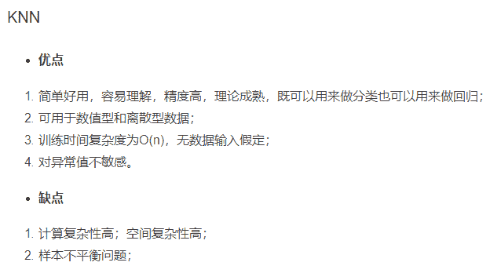
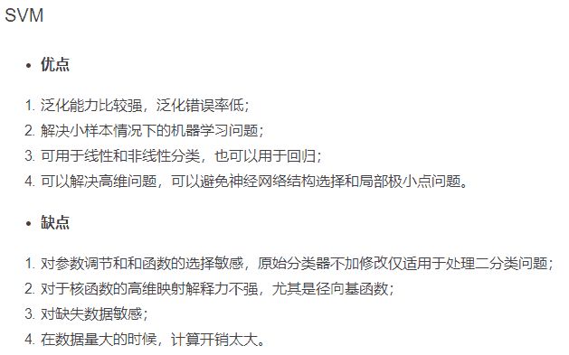

# 算法面试注意细节

算法工程师岗位（机器学习、数据挖掘、数据分析等）面试主要包含两大块：首先是基本的 Coding 能力；其次就是机器学习算法的理论与应用能力。

基本的 Coding 能力考察，主要是让你写一些数据结构与算法设计的常见算法题，比如链表类、二叉树、排序、查找、动态规划等。这方面建议《剑指 Offer》+ LeetCode 结合的方式进行练习。

机器学习算法理论与应用能力不用说，应付面试看本课程就行了。当然师父领进门，修行在个人，想要在这方面深造，还需要大量实践和广泛学习优秀的论文和开源源代码。

# 算法面试常见问题

**1.模型融合方法有哪些**
主要有以下几个：

```
Voting
Averaging
Bagging
Boosting
Stacking
```

**2.特征选择方法**
主要有：

```
去掉取值变化小的特征
递归特征消除法
基于学习模型的特征排序
线性模型和正则化
```

**3.学习项目的一般步骤**
主要包括：

```
问题抽象，模型选择；
数据获取；
特征工程（数据清洗，预处理、采样等）；
模型训练，调优；
模型验证、误差分析；
模型融合；
模型上线。
```

**4.推导 LR 算法**

**5.多参数调参方法**
`网格化搜索`： 对于多个参数，首先根据经验确定大致的参数范围。然后选择较大的步长进行控制变量的方法进行搜索，找到最优解后；然后逐步缩小步长，使用同样的方法在更小的区间内寻找更精确的最优解。

**6.XGBoost 算法的主要参数及其作用**


**7.Bagging 和 Boosting 的区别**


**8.PCA 与 LDA 降维原理**

**9.为什么 L1 正则可以实现参数稀疏，而 L2 正则不可以？**


**10.如何解决数据不平衡问题**

（1）训练集重新采样

有两种方法使不平衡的数据集来建立一个平衡的数据集——欠采样和过采样:

欠采样是通过减少丰富类的大小来平衡数据集，当数据量足够时就该使用此方法。通过保存所有稀有类样本，并在丰富类别中随机选择与稀有类别样本相等数量的样本，可以检索平衡的新数据集以进一步建模；

相反，当数据量不足时就应该使用过采样，它尝试通过增加稀有样本的数量来平衡数据集，而不是去除丰富类别的样本的数量。通过使用重复、自举或合成少数类过采样等方法（SMOTE）来生成新的稀有样本。

（2）设计适用于不平衡数据集的模型

通过设计一个代价函数来惩罚稀有类别的错误分类而不是分类丰富类别，可以设计出许多自然泛化为稀有类别的模型。如下图所示，加大稀有类别分类错误时的惩罚：

（3）聚类丰富类

该方法类似于欠采样，但不同的是，它不是简单地从富有类原始数据中直接选择出 K 个样例，而是采用聚类的思想。首先采用聚类的方法产生 K 个聚类中心，然后用这 K 个聚类中心与稀有类别进行训练。

（4）多模型 Bagging

我本人在随机森林算法思想的启发下，想出了在上述方法的基础上，将不同比例下训练出来的模型进行多模型 Bagging操作，具体的步骤如下：


**11.经验风险最小化与结构风险最小化**

**12.常见数据清洗方法**


**13.机器学习算法评价指标**


**14.欠拟合与过拟合及其解决方法**


**15.GBDT 的原理**

**16.熵、条件熵、信息增益、信息增益比、Gini 指数**


**17.为什么要使用 ROC 和 AUC**
请参阅周志华《机器学习》P33。

**18.XGBoost 是如何进行特征选择和特征重要性计算的**
XGBoost 中计算特征重要性主要使用的是特征`在分裂节点中使用的次数`和`总信息增益`两种方法。

**19.介绍几个在线学习方法**
1\. FTRL（Follow The Regularized Leader）
2\. BPR（Bayesian Probit Regression）
它主要区别于传统算法训练与预测分离，或者说模型更新周期很长。而在线学习方法会实时将用户行为数据返回更新算法参数，使得模型更新很及时准确。

**20.决策树的剪枝策略及其优缺点**

决策树的剪枝方法主要分为两大类：预剪枝和后剪枝两种。

预剪枝： 当最优分裂点对应的增益值为负值是停止分裂。

它的优点是，计算时间上能保证最优；缺点则是将来的某个时刻也许能够获取更高的增益，也就是说它不能保证最优。

后剪枝： 将决策树增长到它的最大深度，递归的进行剪枝，剪去那些使得增益值为负值的叶子节点。

它的优点是能够保证决策树最优；缺点是比预剪枝计算复杂度高很多。

**21.是交叉验证，它的作用是什么**


# 常见机器学习算法优缺点

这个世界上没有完美的事物，机器学习算法也不例外。所有的机器学习或多或少都有其优缺点：

1.  存在即合理，这是每个算法能够广为人知的原因，也就是说它们都有优点；
2.  既然有这么多算法存在，即说明没有哪种算法是万能的，它们又有自身的不足之处。下面我们将常见机器学习算法优缺点总结如下：
    
    
    
    
    
    
    
    
    