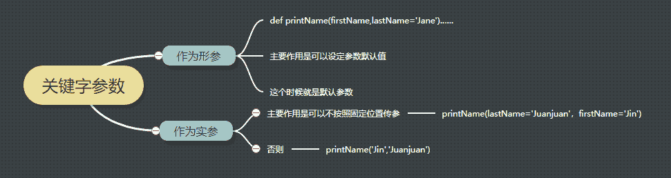

## Q1: week2-3, Ex-guess my number

```
在做week2练习：guess my number时遇到一个小问题。
代码已经写好，结果也和给出的答案一样，但是格式有一点不同，如下：
```

```
# 这是我的output
Please think of a number between 0 and 100!
Is your secret number 50?
Enter 'h' to indicate the guess is too high. Enter 'l' to indicate the guess is too low. Enter 'c' to indicate I guessed correctly.
l
# 这是答案expected output
Please think of a number between 0 and 100!
Is your secret number 50?
Enter 'h' to indicate the guess is too high. Enter 'l' to indicate the guess is too low. Enter 'c' to indicate I guessed correctly. l
```

可以发现区别在于答案的输入l是在“Enter ‘h’ to indicate the guess is too high. Enter ‘l’ to indicate the guess is too low. Enter ‘c’ to indicate I guessed correctly.”的同一行，而我的有一个换行，调整了半天也不知道如何让他们处于同一行，故请教大大们。我的代码如下，比较丑陋…

```
i = 50
low = 0
high = 99
print('Please think of a number between 0 and 100!')
print('Is your secret number: 50?')
while True: 
    print("Enter 'h' to indicate the guess is too high. Enter 'l' to indicate the guess is too low. Enter 'c' to indicate I guessed correctly.")
    a = input() # 问题出在这里，如何能将input和上面的print内容显示在一行里
    if a != 'h' or 'l' or 'c':
        print('Sorry, I did not understand your input.')
        print('Is your secret number:' + str(i) + '?')
        print("Enter 'h' to indicate the guess is too high. Enter 'l' to indicate the guess is too low. Enter 'c' to indicate I guessed correctly.")
        a = input()
    elif a == 'l':
        low = i
        i = int((i+high)/2)
        print('Is your secret number:' + str(i))
    elif a == 'h':
        high = i
        i = int((low+i)/2)
        print('Is your secret number:' + str(i))
    else:
        print('Game over. Your secret number was:' + str(i))
```

`lmz:`

```
a = input("Enter 'h' to indicate the guess is too high. Enter 'l' to indicate the guess is too low. Enter 'c' to indicate I guessed correctly.")
```

此外你的代码如果输入的字符不是‘h，l，c’中的一个，你有没发现，他会要求你输入2次input?
具体实现我倒是做了[笔记](https://www.jianshu.com/p/7f5018d30bd5)

`bigjing:`

你的代码除了在input处存在问题外，运行逻辑上存在一些小问题，在不改变你整体框架的前提下，现做如下修改

```
第9行 if a !='h' or 'l' or 'c'应改为：a != 'h' and a != 'l' and a !='c'
第13行 a = input() 改为 continue
第22行 else: 后需要加 break，否则循环无法终止
```

修改后完整代码：

```
i = 50
low = 0
high = 99
print('Please think of a number between 0 and 100!')
print('Is your secret number: 50?')
while True: 
    a = input("Enter 'h' to indicate the guess is too high. Enter 'l' to indicate the guess is too low. Enter 'c' to indicate I guessed correctly.") # 问题出在这里，如何能将input和上面的print内容显示在一行里
    if a != 'h' and a != 'l' and a !='c':
        print('Sorry, I did not understand your input.')
        print('Is your secret number:' + str(i) + '?')
        continue
    elif a == 'l':
        low = i
        i = int((i+high)/2)
        print('Is your secret number:' + str(i))
    elif a == 'h':
        high = i
        i = int((low+i)/2)
        print('Is your secret number:' + str(i))
    else:
        print('Game over. Your secret number was:' + str(i))
        break
```

根据对题目理解，我重新写了一个，供参考

```
low = 0
high = 100
guess = 50
print('Please think of a number between 0 and 100!')
print('Is your secret number:{}?'.format(guess))
while True: 
    a = input("Enter 'h' to indicate the guess is too high. Enter 'l' to indicate the guess is too low. Enter 'c' to indicate I guessed correctly.") 
    if a == 'c':
        print('Game over. Your secret number was:{}'.format(guess) )
        break
    elif a in ['l','h']:
        if a == 'l':
            low = guess
        else:
            high = guess
        guess = (high+low)//2
        print('Is your secret number:{}'.format(guess))
        continue
    else:
        print('Sorry, I did not understand your input.')  
        continue
```

`lmz:`

```
# week2-3 Exercise: guess my number

print('Please think of a number between 0 and 100!')
low = 0
high = 100

def guess_wrong_ans(ans):
    global high, low
    if ans == 'c':
        print('Game over. Your secret number was: %s' % mid)
        return False 
    elif ans == 'h':
        high = mid
    elif ans == 'l':
        low = mid
    else:
        print('Sorry, I did not understand your input.')
    return True

status = True
while status:
    mid = (low + high)//2   
    print('Is your secret number %s?' % mid)
    ans = input("Enter 'h' to indicate the guess is too high. Enter 'l' to indicate the guess is too low. Enter 'c' to indicate I guessed correctly. ")
    status = guess_wrong_ans(ans)
```

## Q2: 程序运行方法

程序运行方法有三种，比如说print(‘hello world’)：
1\. 在命令行直接运行；
2\. 编写一个 Python 文件，将 print hello world 封装为一个函数，通过 main 函数调用它来运行；
3\. 编写一个 class，将 print hello world 封装为一个 method，通过 main 函数创建 class 实例来运行 method。
后两种方式怎样实现，能举个例子么？

`SY:`

我的理解是第一个是直接运行，第二个是通过函数，第三个是通过类的方法。

`lmz:`

```
# 2.hello.py
def hello():
    print("hello world")

if __name__ == '__main__':
    hello()
```

```
# 3.hello.py
class hello(object):
    def helloworld(self):
        print("hello world")

def main():       
    text = hello()     # 初始化实例
    text.helloworld()  # 调用类的方法

if __name__ == '__main__':
    main()
```

`bigjing:`

```
能解释下python编程中的if __name__ == 'main': 的作用和原理么？
```

`lmz:`

if `__name__ == '__main__'` 的意思是说，只有直接运行python hello.py时，该if条件下的语句才会执行，可以参考廖雪峰的网站[链接](https://www.liaoxuefeng.com/wiki/001374738125095c955c1e6d8bb493182103fac9270762a000/0013868200196665403ac40fac14536939dd5af20810782000)。
当我们在命令行运行hello模块文件时，Python解释器把一个特殊变量`__name__`置为`__main__`，而如果在其他地方导入该hello模块时，if判断将失败，因此，这种if测试可以让一个模块通过命令行运行时执行一些额外的代码，最常见的就是运行测试。

`bigjing:`

凡星的解释已经很完整了，附另一个解释比较好的[连接](http://www.dengfeilong.com/post/60.html)，供大家学习

## Q3: 数组转换

```
经常能看到对数组进行reshape(-1,1)操作
我们知道reshape(2,3)是转成2行3列。
那reshape(-1,1)这个操作实现的功能是什么？
虽然从结果上来看好像是转成多行一列，-1的存在是固定写法么?
```

`lmz:`

```
Parameters: 
    a : array_like, Array to be reshaped.
    newshape : int or tuple of ints
The new shape should be compatible with the original shape. If an integer, then the result will be a 1-D array of that length. One shape dimension can be -1. In this case, the value is inferred from the length of the array and remaining dimensions.
```

案例的话，[知乎](https://www.zhihu.com/question/52684594/answer/297441394)

```
c = np.array([[1,2,3],[4,5,6]])
# python2代码
print '改成2行3列:'
print c.reshape(2,3)
print '改成3行2列:'
print c.reshape(3,2)
print '我也不知道几行，反正是1列:'
print c.reshape(-1,1)
print '我也不知道几列，反正是1行：'
print c.reshape(1,-1)
print '不分行列，改成1串'
print c.reshape(-1)
```

```
输出为：

改成2行3列:
[[1 2 3]
[4 5 6]]
改成3行2列:
[[1 2]
[3 4]
[5 6]]
我也不知道几行，反正是1列:
[[1]
[2]
[3]
[4]
[5]
[6]]
我也不知道几列，反正是1行：
[[1 2 3 4 5 6]]
不分行列，改成1串
[1 2 3 4 5 6]
```

## Q4.函数参数

```
P33：关键字参数与默认参数的区别？
```

`bigjing:`

```
首先一个观点：关键字参数是包含默认参数范畴的
当关键字参数作为形参的时候，就是默认参数
当关键字参数作为实参的时候，可以实现不按位置赋值参数的作用
```



## Q5\. 入栈顺序（函数运行空间）

```
P35：入栈顺序，为什么第1列中x在f之后，第2列中h在g之后入栈？
```

`bigjing:`

拓展一下问题：
什么是[栈](https://segmentfault.com/a/1190000003937981)
什么是[栈帧](https://blog.csdn.net/yxysdcl/article/details/5569351)
[栈和栈帧](https://blog.csdn.net/qchengsj/article/details/37918083)有什么区别
函数调用栈帧的过程

`lmz:`

我就不从概念上去解释了，而是按照我的理解解释：

1.  栈(stack)——一种FILO(先进后出)的数据结构，python里运行函数就是用的这种结构
2.  python执行函数时，会新开一个局部空间（也就是书中的stack frame, 中译文栈帧），函数执行完后，除了返回的数据，该局部空间也就销毁了（即： 你不能再访问该局部空间里的变量了）
3.  由于python每次执行函数，都是先跳到函数内部执行完毕后，再返回原空间继续，所以说这是一种FILO(或LIFO)的执行顺序，然后中间涉及的变量储存就是对应的栈结构了。

书中对应的内容，讲的就是python执行代码过程中，变量的产生和销毁的顺序。