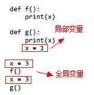
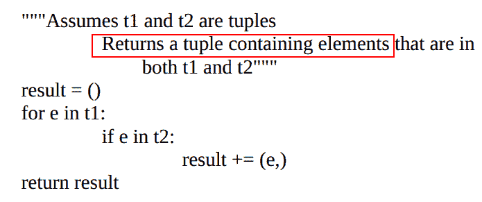
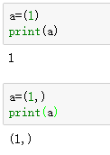

## Q6\. 函数局部变量赋值问题

```
P37：“print语句后面的赋值语句使x成为函数g中的局部变量
执行print语句时还没有被赋值。”报错的原因不是很理解~
```

`bigjing:`


在回答这个问题前，我们先理解一个规则：【全局变量和局部变量同名的时候，局部变量优先】或者说【近的优先】，同理，父类和子类有同名的属性或方法时，子类优先，也就是说先调用子类的，子类没有，再向上调用父类的。
回到正题：
函数 f 和 g 的唯一区别是，函数 g 的声明中有局部变量x ，所以函数体中print(x)的时候，将打印局部变量x，而不会打印全局变量x。但【矛盾】的是，在print(x)时，局部变量x还没有被赋值，所以报错。
而函数 f 中没有局部变量x，所以打印的是全局变量x，故不会报错。

## Q7.print对象类型

```
P37：print('Testing x =', str(x), 'and power = ', power)
为什么要将x转换为string？
```

`bigjing:`

个人觉得转和不转没什么区别
简略证明：

```
>>>x=8
>>>power =3
>>>print('Testing x =', x, 'and power = ', power)
Testing x = 8 and power =  3

>>>x=str(8)
>>>power =3
>>>print('Testing x =', x, 'and power = ', power)
Testing x = 8 and power =  3
```

## Q8.形参列表

```
P38：“如果在编辑器中输入findRoot(，会显示形参列表。”
findRoot(运行失败。
```

## Q9.函数调用

```
P42：“我们不将第一个（本例中是唯一一个）参数放在函数名后面的小括号中,而使用点标记法将这个参数放在函数名之前。”
什么情况下放在括号中，什么情况下使用点标记法？
```

`bigjing:`

我讲下我对这个题目的理解，可能理解有误：

全段内容是这样的：
我们讲到“类”的时候会介绍更多关于方法调用的知识，眼下可以将它看作一种特殊形式的函数调用。调用时，我们不将第一个（本例中是唯一一个）参数放在函数名后面的小括号中，而使用点标记法将这个参数放在函数名之前。

对方强调的可能是python是面向对象的编程语言，函数调用是将参数放在函数名后面，但我们面向对象编程一般将函数写成方法，方法调用用的是点标记。

## Q10.合取项

```
P43：return s[0] == s[-1] and isPal(s[1:-1]) 
“除非第一个合取项取值为True，否则第二个合取项不被求值。”
不是很能理解这种逻辑
```

`bigjing:`

这叫【短路计算】,比如：

```
A or B ，我们知道有一个为真，则为真。所以：
当A为True，则返还A（B真或假对结果无影响）
当A为False，则返还B（因为真假结果取决与B）
A and B , 有一个为假，则为假。所以：
当A为False，则返还A（B真或假对结果无影响）
当A为True，则返还B（因为真假结果取决与B）
```

你有没有发现，短路计算本质上为了提升运行效率，否则，每一次都要对A和B进行逻辑判断才能得到结果

## Q11.None

```
P8+33+52：None可以作为值使用？
```

`bigjing:`

```
None可以作为值来使用，本身就是一个常量，和0，'1'等类似
拓展：
None是一个特殊的常量。
None和False不同。
None不是0。
None不是空字符串。
None和任何其他的数据类型比较永远返回False。
None有自己的数据类型NoneType。
可以将None赋值给任何变量。
```

## Q12.多重赋值

```
P11+51：x,y=2,3与x,y=(3,4)有区别么
两种赋值方式的type结果一样耶~
```

`bigjing:`

```
本质上都是按位置赋值。所以你还可以写成x,y=[3,4] ，x,y= {3,4}
```

`lmz:`
x,y = {3,4}，这结果虽然满足预期，但是并不推荐用这这种方法，set里面的元素是无序的，无法保重每一次的结果都如预期一样！
x,y=2,3与x,y=(3,4)不仅仅本质是一样，他们是完全相同的，只是第一种省略了括号！
比如你输入2,3 python的解释器会给你返回(2,3)

## Q13.公约数

```
P51：t1,t2应该不是正整数而是元组吧
返回的结果应该也不叫t1和t2的公约数，而是交集吧~
def intersect(t1, t2): 
  """假设t1和t2是正整数
    返回一个元组，包含t1和t2的公约数""" 
      both t1 and t2""" 
  result = () 
  for e in t1: 
      if e in t2: 
          result += (e,) 
  return result
```

``bigjing:`
翻译错误，原版的意思就是返还交集


## Q14.单元素元组

```
P50+52：“要想表示包含1的单元素元组，我们应该写成(1,)。”
可是为什么我这样运行(1)没有报错，(1,)里面的,看着好奇怪~
```



`bigjing:`

```
不会报错的原因是：你打印的是数字1，但这不是元组
由于括号() 和元组()在单元素时会发生歧义，故加逗号以区分
```

详解可以看看此[链接](https://blog.csdn.net/datawhale/article/details/80930626)