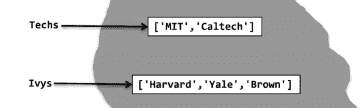
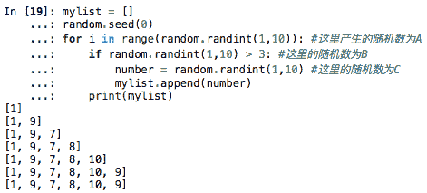

Q15.改变对象与绑定

```
P54：Univs和Univs1被绑定到不同的对象的原理不是很清楚。
```

`bigjing:`


```
Univs = [Techs, Ivys]
Univs1 = [['MIT', 'Caltech'], ['Harvard', 'Yale', 'Brown']] 

Univs绑定的是含有Techs和Ivys的列表。
Univs1绑定的是含有['MIT', 'Caltech']和['Harvard', 'Yale', 'Brown']的列表

所以Univs和Univs1被绑定到不同的对象
书上有解释【Univs中的元素不是Techs和Ivys绑定的列表的复制，而是这些列表本身】
```

## Q16.遇到TypeError: ‘int’ object is not callable报错该如何处理？

```
正在做week2：Exercise: gcd iter
检查了自己的代码感觉逻辑没有什么错误
但是一运行就显示TypeError: 'int' object is not callable的报错
求问该如何更改解决，代码如下：

def gcdIter(a, b):
    '''
    a, b: positive integers

    returns: a positive integer, the greatest common divisor of a & b.
    '''
    i = min(a, b)
    while i > 0:
        if a % i == 0 and b % i == 0:
            return i
        else:
            i -= 1
```

`bigjing:`
用python2和python3都运行了一下，并没有问题出现

## Q17\. 测试途径分析

```
# 分析week4-7 Ex4:
def union(set1, set2):
   """
   set1 and set2 are collections of objects, each of which might be empty.
   Each set has no duplicates within itself, but there may be objects that
   are in both sets. Objects are assumed to be of the same type.

   This function returns one set containing all elements from
   both input sets, but with no duplicates.
   """
   if len(set1) == 0:
      return set2
   elif set1[0] in set2:
      return union(set1[1:], set2)
   else:
      return set1[0] + union(set1[1:], set2)
# Q：
# Assume that union is called with strings as arguments.
# Please select the best glass box test suite for the function union from the following options:

答案：
union('','abc'), union('a','abc'), union('ab','abc'), union('d','abc') 正确
不能选：
union('',''), union('','a'), union('','ab'),union('a',''), union('a','b'), union('c','ab'), union('de',''), union('ab','c'), union('cd','ab')  错误
请问为什么。。。
```

`bigjing:`
这道题应该是考察如何选取白盒测试套件，使路径完备，不知道有没有理解错

```
对于上述递归函数，测试用例应该包括：
1.函数没有递归调用就返回  union('','abc')
2.只执行一次递归调用  union('a','abc')  union('d','abc')
3.执行多次递归调用的情况。union('ab','abc')
```

`lmz:`

```
哦，我倒是没有从递归的角度去考虑，而是从另外一个角度看的。。。
测试完备性：
set1 == ''
set1 != '', set1的元素完全在set2中
set1 != '', set1的元素部分在set2中
set1 != '', set1的元素均不在在set2中
```

```
union('',''), union('','a'), union('','ab') → 仅满足cond1
union('a',''), union('a','b'), union('c','ab'), union('de',''), union('ab','c'), union('cd','ab') → 仅满足cond4
而正确答中：
union('','abc'),  满足条件1
union('a','abc'), 满足条件2
union('ab','abc'), 满足条件2
union('d','abc')，满足条件4
```

## Q18\. random.seed( )



```
伪随机数：(pseudorandom number) 算法+指定的不确定因素 (种子seed). 
一般计算机的随机数都是伪随机数，
以一个真随机数（种子）作为初始条件，
然后用一定的算法不停迭代产生随机数。
问题：
1) 并不理解random.seed(0)后,Python发生了什么.
开始以为, 既然seed相同, A=B=C (所谓产生相同的随机数).
这个例子中, A != B != C.
2)每次运行这段代码,都是一样的输出.
所以, random.seed( )到底什么意思呢?
```

`lmz：`

最好帖一下代码

```
import random
mylist = []
random.seed(0)
for i in range(random.randint(1,10)):
    if random.randint(1,10)>3:
        number = random.randint(1, 10)
        mylist.append(number)
    print(mylist)

## 以下是我的结果输出，和你的问题的结果一致
[1]
[1, 9]
[1, 9, 7]
[1, 9, 7, 8]
[1, 9, 7, 8, 10]
[1, 9, 7, 8, 10, 9]
[1, 9, 7, 8, 10, 9]
```

为什么随机数好像不起作用，无论谁在什么时刻运行。
这是因为设置了随机种子random.seed(0)，如果你不设置random.seed，那么每次运行都会是不一样的结果。
同时如果你设置了random.seed(42)， 结果会与上面不一样，但是每次运行都会相同

```
# 0改为42，其余一样
random.seed(42)

# 结果永远为：
[]
[4]
```

这是因为随机数也是算法算出来的，只能模拟（也就是有迹可循），所以不能算是真正的随机数，只能算是“伪”（我只能从结果解释，具体的原理我目前没有深究过。。。）
以上感觉是部分解释了（2）的问题，看看其他人如何补充！

至于（1）的问题，我是这么理解的，随机数是与时间相关的，random.seed只是设置运行这一语句时，与该语句时间间隔相同的随机数相同，但是不保证前后的随机数相同。
你可这么做实验：

```
# 在每次运行random之前都设置random.seed(0）
import random
mylist = []
random.seed(0)
for i in range(random.randint(1,10)):
    random.seed(0)
    if random.randint(1,10)>3:
        random.seed(0)
        number = random.randint(1, 10)
        mylist.append(number)
    print(mylist)
# 结果输出
[7]
[7, 7]
[7, 7, 7]
[7, 7, 7, 7]
[7, 7, 7, 7, 7]
[7, 7, 7, 7, 7, 7]
[7, 7, 7, 7, 7, 7, 7]
```

`Aris:`
所有如果紧跟着相同的seed, 产生的随机数是同一个. zzz

## Q19\. ProblemSet2 - problem2

```
问题翻译
```

`lmz:`

```
程序目标：
求每月固定还款最低为多少(要求该数字刚好是$10的整数倍)，刚好能够在12个月后，把信用卡欠款还清。

该题目会提供2个初始参数：
1. balance 信用卡当前欠款额
2. annualInterestRate 年利率

程序要求最后输出：
Lowest Payment: 180 

提供提供了3个计算步骤：
1. 月利率 = 年利率/ 12.0
2. 当月未付款 = 上月信用卡欠款额 - 固定还款额
3. 本月信用卡欠款额（加上利息后当月未付款） = 当月未付款 + 月利率 x 当月未付款 
最后题目提供了3个测试case:
Test Case 1:
       balance = 3329
       annualInterestRate = 0.2
case1 结果应打印出："Lowest Payment: 310"

Test Case 2:
       balance = 4773
       annualInterestRate = 0.2
case2 结果应打印出："Lowest Payment: 440"

Test Case 3:
       balance = 3926
       annualInterestRate = 0.2
case3 结果应打印出："Lowest Payment: 360"
```