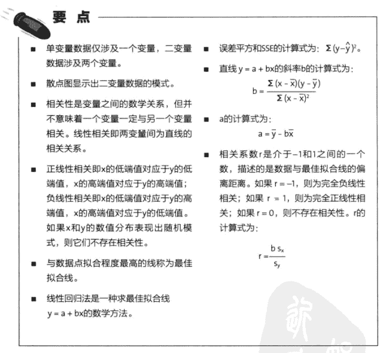
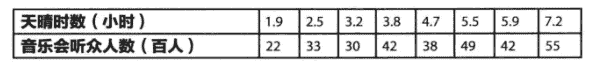

# 基本概念



# PYTHON实现

**数据**


```
# 求平均数
def list_mean(l):
    sum=0
    for i in l:
        sum+=i
    return sum/len(l)   
# 计算b值
def cal_b(l1,l2):
    x1=list_mean(l1)
    y1=list_mean(l2)
    sum1=0
    sum2=0
    for i in range(len(l1)):
        sum1=(l1[i]-x1)*(l2[i]-y1)
        sum2=(l1[i]-x1)**2
    return sum1/sum2
# 计算a值
def cal_a(l1,l2):
    x1=list_mean(l1)
    y1=list_mean(l2)
    b=cal_b(l1,l2)
    return y1-b*x1
# 计算r值
import math
def cal_r(l1,l2):
    x1=list_mean(l1)
    y1=list_mean(l2)
    sum1=0
    sum2=0
    n=len(l1)
    for i in range(n):
        sum1+=(l1[i]-x1)**2
        sum2+=(l2[i]-y1)**2
    s1=math.sqrt(sum1/(n-1))
    s2=math.sqrt(sum2/(n-1))
    return cal_b(l1,l2)*s1/s2
```