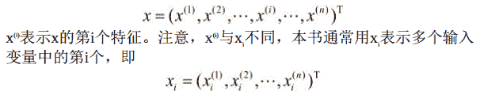
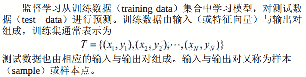
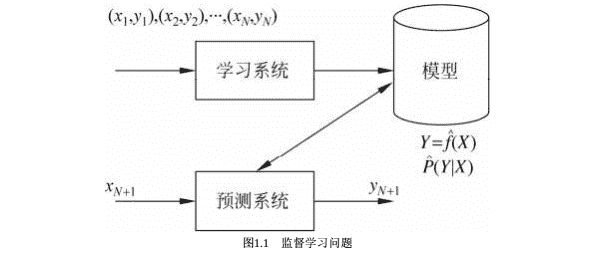
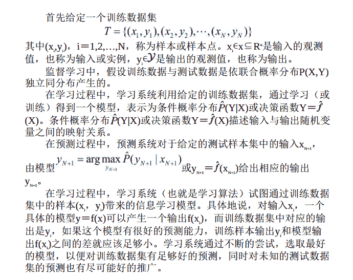

# 基本概念

```
监督学习的任务
```

监督学习的任务是学习一个模型， 使模型能够对任意给定的输入， 对其相应的输出做出一个好的预测。
**注意**：这里的输入、 输出是指某个系统的输入与输出， 与学习的输入与输出不同 。

```
输入空间、 特征空间与输出空间
```

在监督学习中， 将输入与输出所有可能取值的集合分别称为`输入空间`与`输出空间`。
1\. 输入与输出空间可以是有限元素的集合， 也可以是整个欧氏空间。
2\. 输入空间与输出空间可以是同一个空间， 也可以是不同的空间，但通常输出空间远远小于
输入空间。

每个具体的输入是一个实例（instance） ， 通常由特征向量（feature vector） 表示。 这时， 所有特征向量存在的空间称为`特征空间`（feature space） 。
1\. 特征空间的每一维对应于一个特征。
2\. 有时假设输入空间与特征空间为相同的空间， 对它们不予区分；
3\. 有时假设输入空间与特征空间为不同的空间， 将实例从输入空间映射到特征空间。
4\. 模型实际上都是定义在特征空间上的。

```
数据的数学表示
```

在监督学习过程中， 将输入与输出看作是定义在输入（特征） 空间与输出空间上的随机变量的取值。
1\. 输入、 输出变量用大写字母表示， 习惯上输入变量写作X， 输出变量写作Y。
2\. 输入、 输出变量所取的值用小写字母表示， 输入变量的取值写作x， 输出变量的取值写作y。
3\. 变量可以是标量或向量， 都用相同类型字母表示。 除特别声明外， 向量均默认为列向量， 输入实例x的特征向量记作



```
预测任务的分类
```

输入变量X和输出变量Y有不同的类型， 可以是连续的， 也可以是离散的。
人们根据输入、 输出变量的不同类型， 对预测任务给予不同的名称：
1\. 输入变量与输出变量均为连续变量的预测问题称为`回归问题`；
2\. 输出变量为有限个离散变量的预测问题称为`分类问题`；
3\. 输入变量与输出变量均为变量序列的预测问题称为`标注问题`。

```
联合概率分布
```

监督学习假设输入与输出的随机变量X和Y遵循联合概率分布P(X,Y)。
1\. P(X,Y)表示分布函数， 或分布密度函数。 注意， 在学习过程中， 假定这一联合概率分布存在， 但对学习系统来说， 联合概率分布的具体定义是未知的。
2\. 训练数据与测试数据被看作是依联合概率分布P(X,Y)独立同分布产生的。
3\. 统计学习假设数据存在一定的统计规律，X和Y具有联合概率分布的假设就是监督学习关于数据的基本假设。

```
假设空间
```

1.  监督学习的目的在于学习一个由输入到输出的映射， 这一映射由模型来表示。
2.  换句话说， 学习的目的就在于找到最好的这样的模型。
3.  模型属于由输入空间到输出空间的映射的集合， 这个集合就是假设空间。
4.  假设空间的确定意味着学习范围的确定。
5.  监督学习的模型可以是概率模型或非概率模型， 由条件概率分布P(Y|X)或决策函数Y=f(X)表示， 随具体学习方法而定。
6.  对具体的输入进行相应的输出预测时， 写作P(y|x)或Y=f(x)。

```
监督学习
```

监督学习利用训练数据集学习一个模型， 再用模型对测试样本集进行预测。 由于在这个过程中需要训练数据集， 而训练数据集往往是人工给出的， 所以称为监督学习。 监督学习分为学习和预测两个过程， 由学习系统与预测系统完成。可用图1.1来描述：

