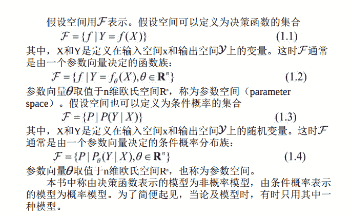
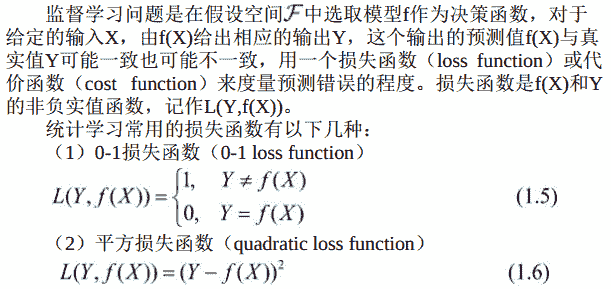
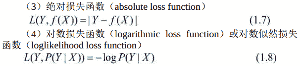
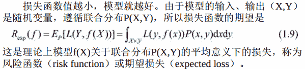
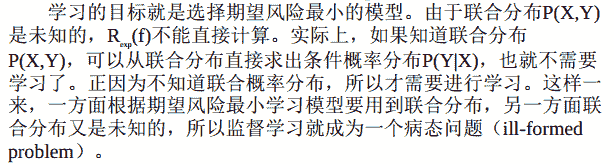
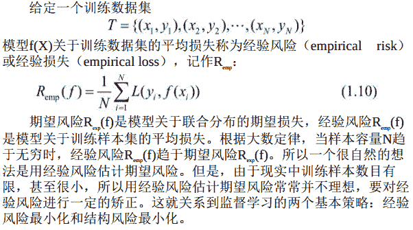
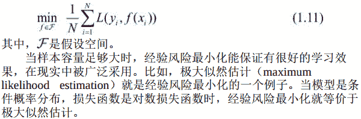
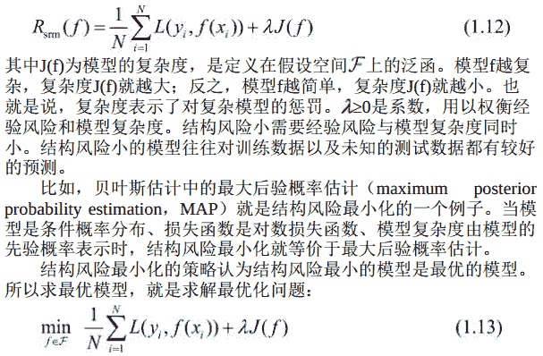

统计学习方法都是由模型、 策略和算法构成的。
即统计学习方法由三要素构成， 可以简单地表示为：**方法＝模型＋策略＋算法**

# 模型

1.  统计学习首要考虑的问题是学习什么样的模型。
2.  在监督学习过程中， 模型就是所要学习的条件概率分布或决策函数。
3.  模型的假设空间包含所有可能的条件概率分布或决策函数。
    例如， 假设决策函数是输入变量的线性函数， 那么模型的假设空间就是所有这些线性函数构成的函数集合。 假设空间中的模型一般有无穷多个。
    

# 策略

有了模型的假设空间， 统计学习接着需要考虑的是按照什么样的准则学习或选择最优的模型。 统计学习的目标在于从假设空间中选取最优模型。
首先引入损失函数与风险函数的概念。
1\. `损失函数`度量模型一次预测的好坏
2\. `风险函数`度量平均意义下模型预测的好坏

```
损失函数
```




```
风险函数或期望损失
```




```
经验风险或经验损失
```



```
经验风险最小化
```

在假设空间、 损失函数以及训练数据集确定的情况下， 经验风险函数式（1.10） 就可以确定。 经验风险最小化（empirical riskminimization， ERM） 的策略认为：
**经验风险最小的模型是最优的模型。**
根据这一策略， 按照经验风险最小化求最优模型就是求解最优化问题：

但是， 当样本容量很小时， 经验风险最小化学习的效果就未必很好， 会产生后面将要叙述的“`过拟合`(over-fitting)”现象。

```
结构风险最小化
```

结构风险最小化（structural risk minimization， SRM） 是为了防止过拟合而提出来的策略。 结构风险最小化等价于正则化（regularization） 。
结构风险在经验风险上加上表示模型复杂度的正则化项（regularizer） 或罚项（penaltyterm） 。
在假设空间、 损失函数以及训练数据集确定的情况下， 结构风险的定义是：

这样， 监督学习问题就变成了经验风险或结构风险函数的最优化问题（1.11） 和（1.13） 。 这时经验或结构风险函数是最优化的目标函数。

# 算法

**算法是指学习模型的具体计算方法。**

统计学习基于训练数据集，根据学习策略， 从假设空间中选择最优模型， 最后需要考虑用什么样的计算方法求解最优模型。

这时， 统计学习问题归结为最优化问题， 统计学习的算法成为求解最优化问题的算法。

如果最优化问题有显式的解析解， 这个最优化问题就比较简单。 但通常解析解不存在， 这就需要用数值计算的方法求解。

如何保证找到全局最优解， 并使求解的过程非常高效， 就成为一个重要问题。

统计学习可以利用已有的最优化算法， 有时也需要开发独自的最优化算法。

统计学习方法之间的不同， 主要来自其模型、 策略、 算法的不同。 确定了模型、 策略、 算法， 统计学习的方法也就确定了。 这也就是将其称为统计学习三要素的原因。