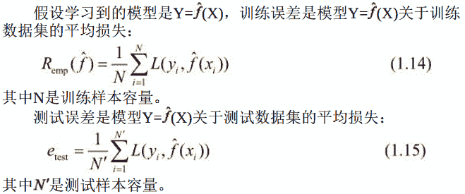
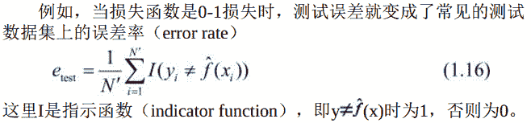
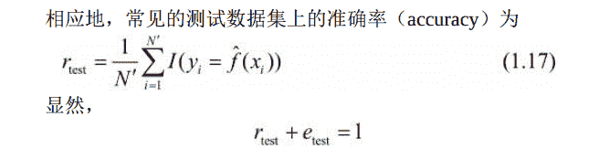
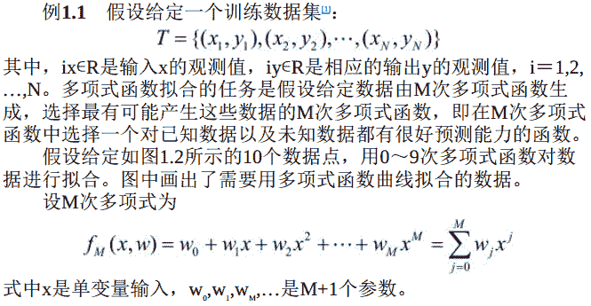
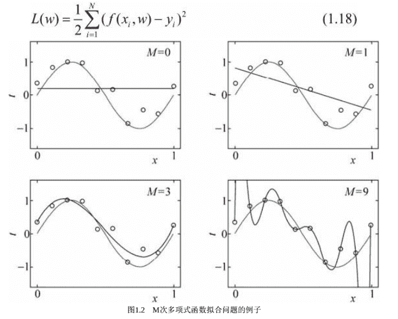
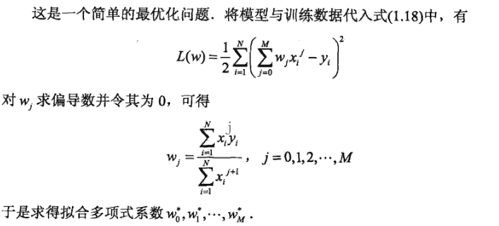
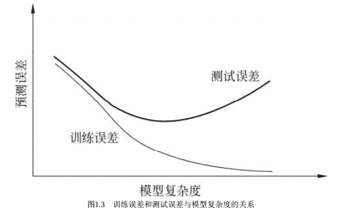

# 基本概念

```
训练误差与测试误差
```

统计学习的目的是使学到的模型不仅对已知数据而且对未知数据都能有很好的预测能力。

不同的学习方法会给出不同的模型。

当损失函数给定时， 基于损失函数的模型的`训练误差`（training error） 和模型的`测试误差`（test error） 就自然成为学习方法评估的标准。

**注意：**统计学习方法具体采用的损失函数未必是评估时使用的损失函数。 当然， 让两者一致是比较理想的。



训练误差的大小， 对判断给定的问题是不是一个容易学习的问题是有意义的， 但本质上不重要。

测试误差反映了学习方法对未知的测试数据集的预测能力， 是学习中的重要概念。

显然， 给定两种学习方法， 测试误差小的方法具有更好的预测能力， 是更有效的方法。

通常将学习方法对未知数据的预测能力称为`泛化能力`（generalizationability）

```
过拟合与模型选择
```

当假设空间含有不同复杂度（例如， 不同的参数个数） 的模型时， 就要面临模型选择（model selection） 的问题。

我们希望选择或学习一个合适的模型。

如果在假设空间中存在“真”模型， 那么所选择的模型应该逼近真模型。 具体地， 所选择的模型要与真模型的参数个数相同， 所选择的模型的参数向量与真模型的参数向量相近。

如果一味追求提高对训练数据的预测能力， 所选模型的复杂度则往往会比真模型更高。 这种现象称为`过拟合`（over-fitting） 。

过拟合是指学习时选择的模型所包含的参数过多， 以致于出现这一模型对已知数据预测得很好， 但对未知数据预测得很差的现象。 可以说模型选择旨在避免过拟合并提高模型的预测能力。

下面， 以多项式函数拟合问题为例， 说明过拟合与模型选择。 这是一个回归问题。

解决这一问题的方法可以是这样的． 首先确定模型的复杂度， 即确定多项式的次数； 然后在给定的模型复杂度下， 按照经验风险最小化的策略， 求解参数， 即多项式的系数， 具体地， 求以下经验风险最小化：


图1.2给出了M＝0， M＝1， M＝3及M＝9时多项式函数拟合的情况。

如果M＝0， 多项式曲线是一个常数， 数据拟合效果很差。
如果M＝1， 多项式曲线是一条直线， 数据拟合效果也很差。
如果M＝9， 多项式曲线通过每个数据点， 训练误差为0。
从对给定训练数据拟合的角度来说， 效果是最好的。

但是， 因为训练数据本身存在噪声， 这种拟合曲线对未知数据的预测能力往往并不是最好的， 在实际学习中并不可取。 这时过拟合现象就会发生。
这就是说， 模型选择时， 不仅要考虑对已知数据的预测能力， 而且还要考虑对未知数据的预测能力。

当M＝3时， 多项式曲线对训练数据拟合效果足够好， 模型也比较简单， 是一个较好的选择．

在多项式函数拟合中可以看到， 随着多项式次数（模型复杂度）的增加， 训练误差会减小， 直至趋向于0， 但是测试误差却不如此，它会随着多项式次数（模型复杂度） 的增加先减小而后增大。 而最终的目的是使测试误差达到最小。 这样， 在多项式函数拟合中， 就要选择合适的多项式次数， 以达到这一目的。 这一结论对一般的模型选择也是成立的。

图1.3描述了训练误差和测试误差与模型的复杂度之间的关系。当模型的复杂度增大时， 训练误差会逐渐减小并趋向于0； 而测试误差会先减小， 达到最小值后又增大。

当选择的模型复杂度过大时， 过拟合现象就会发生。 这样， 在学习时就要防止过拟合， 进行最优的模型选择， 即选择复杂度适当的模型， 以达到使测试误差最小的学习目的。
