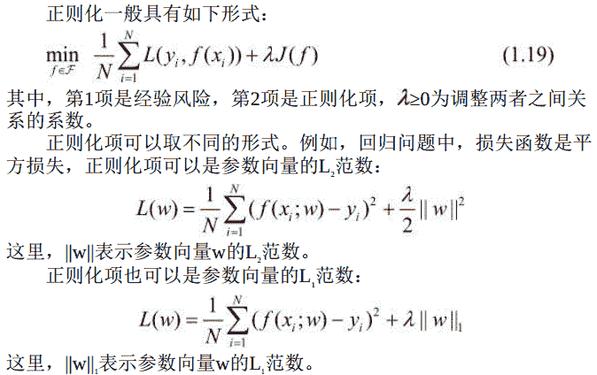

# 基本概念

两种常用的模型选择方法： 正则化与交叉验证。

```
正则化
```

模型选择的典型方法是正则化（regularization） 。 正则化是`结构风险`最小化策略的实现， 是在经验风险上加一个`正则化项`（regularizer） 或`罚项`(penalty term)。

正则化项一般是模型复杂度的单调递增函数， 模型越复杂， 正则化值就越大。 比如， 正则化项可以是模型参数向量的范数。

第1项的经验风险较小的模型可能较复杂（有多个非零参数） ，这时第2项的模型复杂度会较大。

正则化的作用是选择经验风险与模型复杂度同时较小的模型。

正则化符合奥卡姆剃刀（Occam’s razor） 原理。

奥卡姆剃刀原理应用于模型选择时变为以下想法： 在所有可能选择的模型中， 能够很好地解释已知数据并且十分简单才是最好的模型， 也就是应该选择的模型。 从贝叶斯估计的角度来看， 正则化项对应于模型的先验概率。可以假设复杂的模型有较小的先验概率， 简单的模型有较大的先验概率。

```
交叉验证
```

另一种常用的模型选择方法是交叉验证(cross validation)。

如果给定的样本数据充足， 进行模型选择的一种简单方法是随机地将数据集切分成三部分， 分别为训练集（training set） 、 验证集（validation set） 和测试集（test set） 。

训练集用来训练模型， 验证集用于模型的选择， 而测试集用于最终对学习方法的评估。

在学习到的不同复杂度的模型中， 选择对验证集有最小预测误差的模型。 由于验证集有足够多的数据， 用它对模型进行选择也是有效的。

但是， 在许多实际应用中数据是不充足的。 为了选择好的模型，可以采用交叉验证方法。

交叉验证的基本想法是重复地使用数据； 把给定的数据进行切分， 将切分的数据集组合为训练集与测试集， 在此基础上反复地进行训练、 测试以及模型选择。

```
简单交叉验证
```

简单交叉验证方法是： 首先随机地将已给数据分为两部分， 一部分作为训练集， 另一部分作为测试集（例如， 70%的数据为训练集，30%的数据为测试集）

然后用训练集在各种条件下（例如， 不同的参数个数） 训练模型， 从而得到不同的模型； 在测试集上评价各个模型的测试误差， 选出测试误差最小的模型。

```
S折交叉验证
```

应用最多的是S折交叉验证（S-fold cross validation） ， 方法如下：
1\. 首先随机地将已给数据切分为S个互不相交的大小相同的子集；
2\. 然后利用S-1个子集的数据训练模型， 利用余下的子集测试模型；
3\. 将这一过程对可能的S种选择重复进行； 最后选出S次评测中平均测试误差最小的模型。

```
留一交叉验证
```

S折交叉验证的特殊情形是S＝N， 称为留一交叉验证（leave-oneout cross validation） ， 往往在数据缺乏的情况下使用。 这里， N是给定数据集的容量。