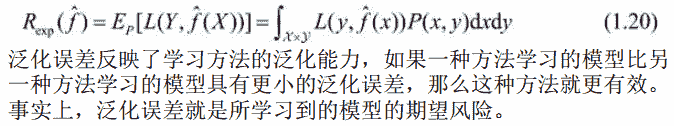
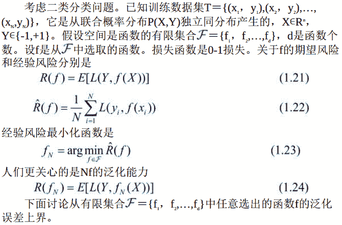
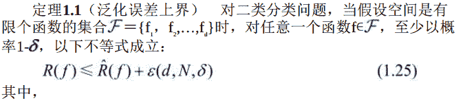
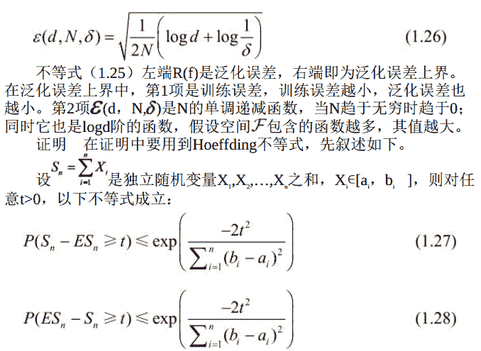
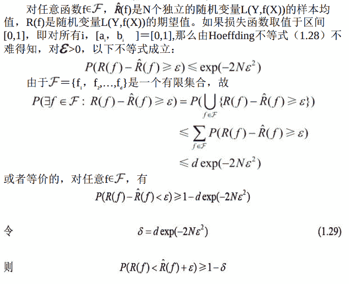
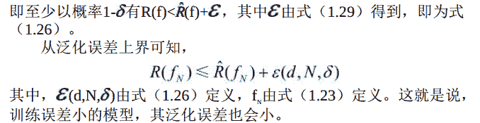

# 基本概念

```
泛化能力
```

学习方法的`泛化能力`（generalization ability） 是指由该方法学习到的模型对未知数据的预测能力， 是学习方法本质上重要的性质。

现实中采用最多的办法是通过测试误差来评价学习方法的泛化能力。 但这种评价是依赖于测试数据集的。 因为测试数据集是有限的， 很有可能由此得到的评价结果是不可靠的。 统计学习理论试图从理论上对学习方法的泛化能力进行分析。

```
泛化误差
```




```
泛化误差上界
```

学习方法的泛化能力分析往往是通过研究泛化误差的概率上界进行的， 简称为`泛化误差上界`（generalization error bound） 。

具体来说， 就是通过比较两种学习方法的泛化误差上界的大小来比较它们的优劣。

泛化误差上界通常具有以下性质：
1.它是样本容量的函数， 当样本容量增加时， 泛化上界趋于0；
2\. 它是假设空间容量（capacity） 的函数， 假设空间容量越大， 模型就越难学， 泛化误差上界就越大。

下面给出一个简单的泛化误差上界的例子： 二类分类问题的泛化误差上界。





以上讨论的只是假设空间包含有限个函数情况下的泛化误差上界， 对一般的假设空间要找到泛化误差界就没有这么简单， 这里不作介绍。