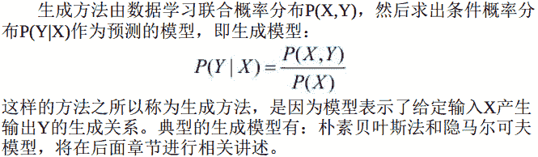

# 基本概念

监督学习的任务就是学习一个模型， 应用这一模型， 对给定的输入预测相应的输出。 这个模型的一般形式为决策函数：Y＝f(X)或者条件概率分布：P(Y|X)

监督学习方法又可以分为`生成方法`（generative approach） 和`判别方法`（discriminative approach） 。

所学到的模型分别称为`生成模型`（generative model） 和`判别模型`（discriminative model） 。

```
生成方法
```



```
判别方法
```

判别方法由数据直接学习决策函数f(X)或者条件概率分布P(Y|X)作为预测的模型， 即判别模型。

判别方法关心的是对给定的输入X，应该预测什么样的输出Y。 典型的判别模型包括： k近邻法、 感知机、 决策树、 逻辑斯谛回归模型、 最大熵模型、 支持向量机、 提升方法和条件随机场等。

```
生成方法和判别方法的比较
```

1.在监督学习中， 生成方法和判别方法各有优缺点， 适合于不同条件下的学习问题。
2.生成方法的特点： 生成方法可以还原出联合概率分布P(X,Y)， 而判别方法则不能；
3.生成方法的学习收敛速度更快， 即当样本容量增加的时候， 学到的模型可以更快地收敛于真实模型；
4.当存在`隐变量`时，仍可以用生成方法学习， 此时判别方法就不能用。