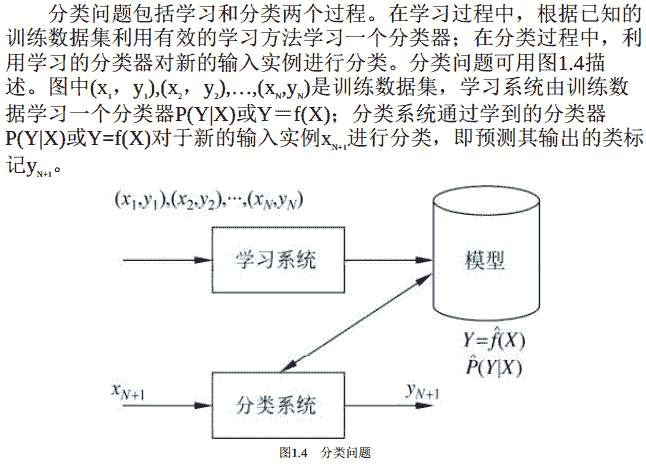
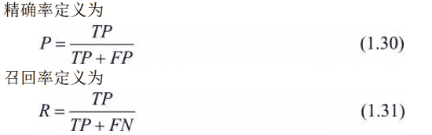
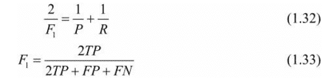

```
分类问题
```

在监督学习中， 当输出变量Y取有限个离散值时， 预测问题便成为`分类问题`。
这时， 输入变量X可以是离散的， 也可以是连续的。

```
分类器
```

监督学习从数据中学习一个分类模型或分类决策函数， 称为`分类器`（classifier） 。

```
分类
```

分类器对新的输入进行输出的预测（prediction） ， 称为`分类`（classification） 。
可能的输出称为`类`（class） 。 分类的类别为多个时， 称为`多类分类问题`。

```
分类的过程
```



```
评价分类器性能的指标
```

```
分类准确率
```

评价分类器性能的指标一般是`分类准确率`（accuracy） ， 其定义是： 对于给定的测试数据集， 分类器正确分类的样本数与总样本数之比。 也就是损失函数是0-1损失时测试数据集上的准确率（见公式（1.17） ） 。

```
精确率（precision） 与召回率（recall）
```

对于二类分类问题常用的评价指标是`精确率`（precision） 与`召回率`（recall） 。

通常以关注的类为`正类`， 其他类为`负类`， 分类器在测试数据集上的预测或正确或不正确， 4种情况出现的总数分别记作：

1.  TP——将正类预测为正类数；
2.  FN——将正类预测为负类数；
3.  FP——将负类预测为正类数；
4.  TN——将负类预测为负类数。



```
F1值
```

此外， 还有F1值， 是精确率和召回率的`调和均值`， 即

精确率和召回率都高时， F1值也会高。

```
可用于分类的统计学习方法
```

许多统计学习方法可以用于分类， 包括k近邻法、 感知机、 朴素贝叶斯法、 决策树、 决策列表、 逻辑斯谛回归模型、 支持向量机、 提升方法、 贝叶斯网络、 神经网络、Winnow等。

```
分类的应用
```

分类在于根据其特性将数据“分门别类”， 所以在许多领域都有广泛的应用。 例如，

1.  在银行业务中， 可以构建一个客户分类模型， 对客户按照贷款风险的大小进行分类；
2.  在网络安全领域， 可以利用日志数据的分类对非法入侵进行检测；
3.  在图像处理中， 分类可以用来检测图像中是否有人脸出现；
4.  在手写识别中， 分类可以用于识别手写的数字；
5.  在互联网搜索中， 网页的分类可以帮助网页的抓取、 索引与排序。

```
分类的应用实例
```

·文本分类(text classification)。 这里的文本可以是新闻报道、 网页、 电子邮件、 学术论文等。

1.  类别往往是关于文本内容的， 例如政治、 经济、 体育等；
2.  也有关于文本特点的， 如正面意见、 反面意见；
3.  还可以根据应用确定， 如垃圾邮件、 非垃圾邮件等。

`文本分类`是根据文本的特征将其划分到已有的类中。 输入是文本的特征向量， 输出是文本的类别。

通常把文本中的单词定义为特征， 每个单词对应一个特征。

单词的特征可以是二值的， 如果单词在文本中出现则取值是1， 否则是0；
也可以是多值的， 表示单词在文本中出现的频率。

直观地， 如果“股票”“银行”“货币”这些词出现很多，这个文本可能属于经济类， 如果“网球”“比赛”“运动员”这些词频繁出现， 这个文本可能属于体育类。