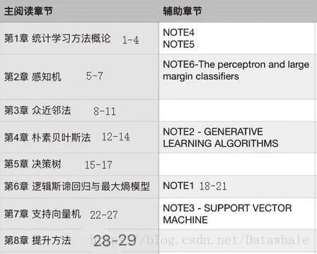

## 组队的初衷

组队的初衷很`简单`，找到一群互相督促和共进，一起解决机器学习路上的问题和难点的队友。

当然`最终的目的`只有一个：系统地学习机器学习理论，而不只是一个调包侠。

## 定期清退三天打鱼者

考虑到不是每个人都能抽出时间`坚持学习`，其次也不是每个人都有基础`学的下去`，所以会每周进行`清退`，来筛选出`能坚持学习且能学的下去`的小伙伴，这也是建群和大家进群的`初衷`：找到一群互相督促和共进，一起解决机器学习路上的问题和难点的小伙伴。

## 计划及安排

如果你决心`务实地`学习机器学习理论并且满足上车条件：

1.  渴望真正掌握机器学习理论或想从事相关岗位
2.  有一定的数学基础（本科学习过高数，线代和概率论）
3.  有互助共享共促的意愿
4.  你愿意和我们一起通过学习经典教材《统计学习方法》来深入学习机器学习理论

那么我们看下具体的发车说明：

**1.学习教材**：
机器学习入门圣经，李航的《统计学习方法》

**2.辅助资料**：
1.统计学习方法知乎参考读物
[https://zhuanlan.zhihu.com/p/36378498](https://zhuanlan.zhihu.com/p/36378498)
2.吴恩达机器学习笔记
[https://pan.baidu.com/s/17X3m8dtuASoUZCk1F3MDBw](https://pan.baidu.com/s/17X3m8dtuASoUZCk1F3MDBw)
3.CS229中文翻译
[https://github.com/Kivy-CN/Stanford-CS-229-CN](https://github.com/Kivy-CN/Stanford-CS-229-CN)

**3.进度安排**：
每一章内容和预计的学习天数

`注：`NOTE对应的是吴恩达的机器学习

**4.进度记录**：
我们在石墨文档（进群分享）记录自己的每日学习进度。

**5.提出问题和难点**：
如果有不懂的问题可以贴到疑问小本上，我们可以相互解答，共同克艰。

**6.组队**
1\. 加微信**bigjing2012**，自我介绍+学习背景
2\. 我们不是服务提供商，只是一群`靠自己`学习，互相督促的伙伴，**不能坚持自学的话，请勿加微信！**

`注`:预备群暂时没有开通石墨文档权限，我们会将预备群表现好的拉到正群。`表现好`主要参考两个维度：
一是能提问（说明有学习和思考）
二是能帮忙解决问题

`另外`需要将学习进度以及问题发到群中，作为参考依据

**所以**，可以开始你的机器学习之路了