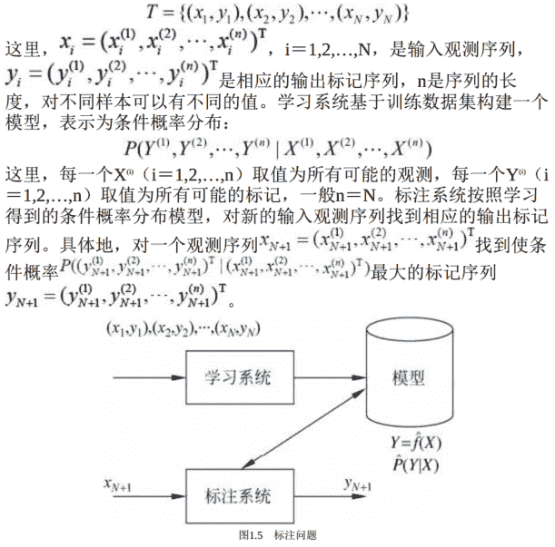

```
标注
```

标注（tagging） 也是一个监督学习问题。

可以认为标注问题是分类问题的一个推广， 标注问题又是更复杂的结构预测问题的简单形式。

标注问题的输入是一个`观测序列`， 输出是一个`标记序列`或状态序列。

标注问题的目标在于学习一个模型， 使它能够对观测序列给出标记序列作为预测。 `注意`， 可能的标记个数是有限的， 但其组合所成的标记序列的个数是依序列长度呈指数级增长的。

```
标注的过程
```

标注问题分为学习和标注两个过程（如图1.5所示） 。 首先给定一个训练数据集


```
评价标注模型的指标
```

评价标注模型的指标与评价分类模型的指标一样， 常用的有标注准确率、 精确率和召回率。 其定义与分类模型相同。

```
标注常用的统计学习方法
```

标注常用的统计学习方法有： 隐马尔可夫模型、 条件随机场。

```
标注问题的应用
```

标注问题在信息抽取、 自然语言处理等领域被广泛应用， 是这些领域的基本问题。

例如， 自然语言处理中的词性标注（part of speechtagging） 就是一个典型的标注问题：

给定一个由单词组成的句子， 对这个句子中的每一个单词进行词性标注， 即对一个单词序列预测其对应的词性标记序列。

举一个信息抽取的例子。

从英文文章中抽取基本名词短语（basenoun phrase） 。 为此， 要对文章进行标注。 英文单词是一个观测， 英文句子是一个观测序列， 标记表示名词短语的“开始”、 “结束”或“其他”（分别以B， E， O表示） ， 标记序列表示英文句子中基本名词短语的所在位置。

信息抽取时， 将标记“开始”到标记“结束”的单词作为名词短语。

例如， 给出以下的观测序列， 即英文句子， 标注系统产生相应的标记序列， 即给出句子中的基本名词短语。

输入： At Microsoft Research,we have an insatiable curiosity and the
desire to create new technology that will help define the computing
experience。
输出： At/O Microsoft/B Research/E,we/O have/O an/O insatiable/B
curiosity/E and/O the/O desire/BE to/O create/O new/B technology/E
that/O will/O help/O define/O the/O computing/B experience/E。