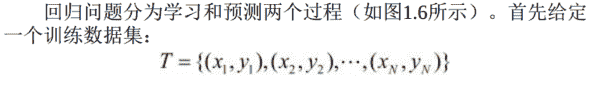
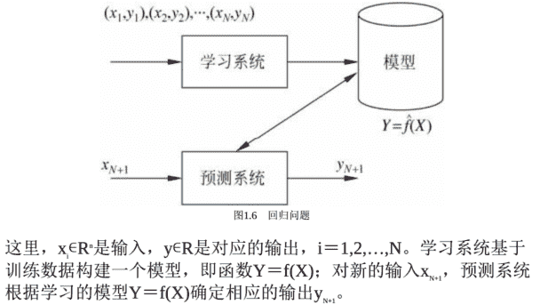

```
回归
```

回归（regression） 是监督学习的另一个重要问题。

回归用于预测输入变量（自变量） 和输出变量（因变量） 之间的关系， 特别是当输入变量的值发生变化时， 输出变量的值随之发生的变化。

回归模型正是表示从输入变量到输出变量之间映射的函数。

回归问题的学习等价于函数拟合： 选择一条函数曲线使其很好地拟合已知数据且很好地预测未知数据（参照1.4.2节） 。

```
回归的过程
```




```
回归问题的分类
```

回归问题按照输入变量的个数， 分为一元回归和多元回归；
按照输入变量和输出变量之间关系的类型即模型的类型， 分为线性回归和
非线性回归。

回归学习最常用的损失函数是平方损失函数，
在此情况下， 回归问题可以由著名的最小二乘法（least squares） 求解。

```
回归问题的应用
```

许多领域的任务都可以形式化为回归问题，

比如， 回归可以用于商务领域， 作为市场趋势预测、 产品质量管理、 客户满意度调查、 投资风险分析的工具。

作为例子， 简单介绍股价预测问题。

假设知道某一公司在过去不同时间点（比如， 每天） 的市场上的股票价格（比如， 股票平均价格） ， 以及在各个时间点之前可能影响该公司股价的信息（比如， 该公司前一周的营业额、 利润） 。

目标是从过去的数据学习一个模型， 使它可以基于当前的信息预测该公司下一个时间点的股票价格。

可以将这个问题作为回归问题解决。

具体地， 将影响股价的信息视为自变量（输入的特征） ， 而将股价视为因变量（输出的值） 。

将过去的数据作为训练数据， 就可以学习一个回归模型， 并对未来的股价进行预测。 可以看出这是一个困难的预测问题， 因为影响股价的因素非常多， 我们未必能判断到哪些信息（输入的特征） 有用并能得到这些信息。

# 学习回顾

1． 统计学习是关于计算机基于数据构建概率统计模型并运用模型对数据进行分析与预测的一门学科。
统计学习包括监督学习、 非监督学习、 半监督学习和强化学习。
2． 统计学习方法三要素——模型、 策略、 算法， 对理解统计学习方法起到提纲挈领的作用。
3． 本书主要讨论监督学习， 监督学习可以概括如下： 从给定有限的训练数据出发， 假设数据是独立同分布的， 而且假设模型属于某个假设空间， 应用某一评价准则， 从假设空间中选取一个最优的模型， 使它对已给训练数据及未知测试数据在给定评价标准意义下有最准确的预测。
4． 统计学习中， 进行模型选择或者说提高学习的泛化能力是一个重要问题。 如果只考虑减少训练误差， 就可能产生过拟合现象。 模型选择的方法有正则化与交叉验证。 学习方法泛化能力的分析是统计学习理论研究的重要课题。
5． 分类问题、 标注问题和回归问题都是监督学习的重要问题。本书中介绍的统计学习方法包括感知机、 k近邻法、 朴素贝叶斯法、决策树、 逻辑斯谛回归与最大熵模型、 支持向量机、 提升方法、 EM算法、 隐马尔可夫模型和条件随机场。 这些方法是主要的分类、 标注以及回归方法。 它们又可以归类为生成方法与判别方法。