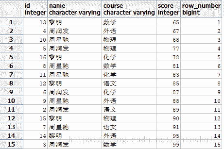
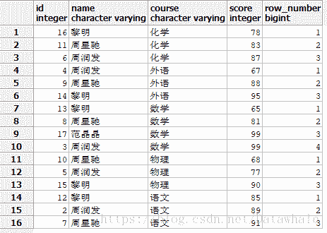
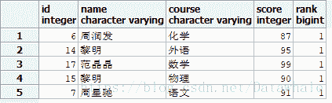
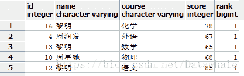

## 语法

```
row_number() over( [partition by col1] order by col2[desc]) 
```

1.  row_number() 为返回的记录定义各行编号
2.  pritition by 分组
3.  order by 排序

## 实例

[实例数据来源](https://blog.csdn.net/luojinbai/article/details/45078809)，利用pgAdmin数据库实践

**建表**

```
create table student(id serial,name character varying,course character varying,score integer);
```

**插入数据**

```
insert into student (name,course,score) values('周润发','语文',89); 
insert into student (name,course,score) values('周润发','数学',99); 
insert into student (name,course,score) values('周润发','外语',67); 
insert into student (name,course,score) values('周润发','物理',77); 
insert into student (name,course,score) values('周润发','化学',87); 
insert into student (name,course,score) values('周星驰','语文',91); 
insert into student (name,course,score) values('周星驰','数学',81); 
insert into student (name,course,score) values('周星驰','外语',88); 
insert into student (name,course,score) values('周星驰','物理',68); 
insert into student (name,course,score) values('周星驰','化学',83); 
insert into student (name,course,score) values('黎明','语文',85); 
insert into student (name,course,score) values('黎明','数学',65); 
insert into student (name,course,score) values('黎明','外语',95); 
insert into student (name,course,score) values('黎明','物理',90); 
insert into student (name,course,score) values('黎明','化学',78);
```

**根据分数排序**

```
select *,row_number() over(order by score desc) from student;
```



**根据科目分组，按分数排序**

```
select *,row_number() over(partition by course order by score desc) from student;
```


**获取每个科目最高分(用子查询，降序)**

```
select * from(select *,row_number() over(partition by course order by score desc)rank from student)t where rank=1;
```


**获取每个科目最低分**

```
select * from(select *,row_number() over(partition by course order by score )rank from student)t where rank=1;
```

