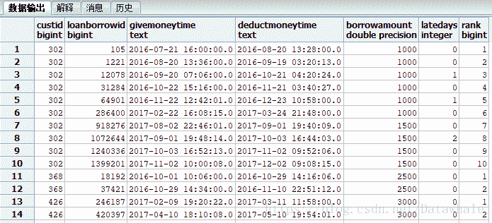

## 任务

用credit.loanborrow（用户借款表）中的数据，加工出以下字段：

1.  custid
2.  custwholeinfoid
3.  loanborrowid (就是credit.loanborrow表的id)
4.  givemoneytime (还款时间)
5.  deductmoneytime (扣款时间)
6.  latedays (逾期天数，借款30天以上未还款就算逾期)
7.  borrowamount (借款金额)
8.  rank （用户借款次数）

`注：`
loanborrow表记录的是用户每一笔借还款。
需要注意的是表里面还包含了一些放款失败的数据，
即用户在app上发起借款，但实际银行卡未收到钱的情况。
每一次放款/还款用status这个字段记录，status=2表示放款成功，status=4表示还款成功。

## SQL实现

```
select
custid ,
credit.loanborrow.id as loanborrowid ,
givemoneytime,
deductmoneytime ,
borrowamount,
case when s.latedays < 0 then 0 else s.latedays end,
row_number() over(partition by custid order by givemoneytime) as rank
from credit.loanborrow
join
(
select id,
--to_date(deductmoneytime,'yyyy-mm-dd')- to_date(givemoneytime,'yyyy-mm-dd') - 30 as latedays
date(deductmoneytime)-date(givemoneytime) - 30 as latedays
from 
credit.loanborrow
)s
on credit.loanborrow.id = s.id and status in (2,4)
```

