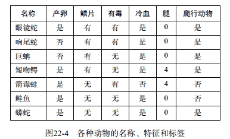
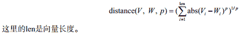
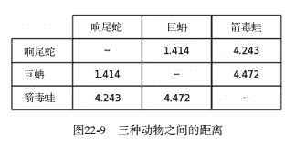
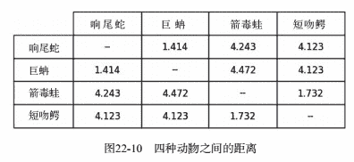
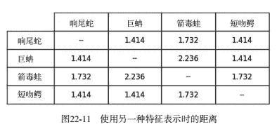

**机器学习**
当计算机科学家说起机器学习时，他们通常指的是进行一种训练，通过这种训练可以编写能自动学会根据数据隐含模式进行合理推断的程序。
基本范式如下：

*   观察一组实例，通常称为训练数据，它们可以表示某种统计现象的不完整信息；
*   对观测到的实例进行扩展，并使用推断技术对扩展过程建模；
*   使用这个模型对未知实例进行预测。

**机器学习算法**
机器学习的算法数不胜数，但所有方法都试图建立一个模型来对现有实例进行归纳。所有方法都具有以下3个部分：

*   模型的表示；
*   用于评估模型优度的`目标函数`；
*   一种`优化方法`，可以通过学习找出一个模型，使目标函数值最小化或最大化。

一般来说，机器学习算法可以分为监督式学习方法和无监督式学习方法。

**监督式学习**
在监督式学习中，我们先从一组成对的特征向量和值开始。目标是从这些特征向量和值中推导出某种规则，以预测与未知的特征向量所对应的值。

回归模型为每个特征向量关联一个实数。
分类模型为每个特征向量关联一组数量有限的标签/类。

**非监督式学习**
在非监督式学习中，我们被给定一个没有标注的特征向量集合。非监督式学习的目标就是发现特征向量集合中的隐含模式。一般来说，非监督式机器学习方法可以分为两种，一种是聚类方法，另一种是隐变量模型学习方法。

**隐变量**
隐变量的值不能直接观测到，但可以通过其他可观测的变量的值推测出来。例如，大学的招生负责人可以根据学生的中学成绩和在标准测试中的表现等一系列观测值，推测出申请者是一个优秀学生（隐变量）的概率。

**聚类**
聚类将实例集合划分为多个子集（称为“簇”），使得同一子集中的实例之间的相似度大于与其他子集中的实例的相似度。

## 特征向量

**信噪比**
有用输入和无关输入的比值。例如，约会时，信号就是你约会对象的声音，噪声就是其他声音。

**特征工程**
特征工程的目的就是将现有数据中可以作为信号的特征与那些仅是噪声的特征区分开来。

特征工程的失败会导致糟糕的模型。当数据的维度（即特征的数量）相对于样本量来说比较大时，特征工程就具有较高的失败风险。

成功的特征工程是一个抽象过程，它可以将大量的可用信息缩减为可以用于归纳的信息。举例来说，如果你的目标是学习一个模型，用来预测某个人是否容易患心脏病，那么有些特征就可能是与之高度相关的，比如年龄。而其他特征就可能没那么重要，比如这个人是否是左撇子。

可以使用`特征消除技术`自动识别特征集合中那些最可能有用的特征。例如，在监督式学习中，我们可以选择那些与实例的标签具有`最强相关性`的特征。但是，如果我们初始选择的特征不是有用特征的话，这些特征消除技术就几乎起不了什么作用。
假设在处理心脏病实例时，我们在初始特征集合中包括了身高和体重，那就可能出现这样的情况。尽管身高和体重都不能对心脏病具有较高的预测能力，但是身体质量指数（BMI）却是一个非常好的特征。虽然BMI可以通过身高
和体重计算出来，但是这个关系（以千克为单位的体重除以以米为单位的身高的平方）太复杂了，现有的机器学习技术还不能自动地找到这个关系。成功的机器学习过程经常需要一些领域的专家来对特征进行设计。

在非监督式学习中，这个问题更为棘手。我们通常会根据自己的直觉选择那些可能会与我们要寻找的结构相关的特征，但依靠直觉确定那些具有潜在相关性的特征是有问题的。

## 距离度量


在上图中，我们使用了4种二元特征和1种整数特征来描述动物。假设想使用这些特征计算两种动物之间的相似度，例如，看看响尾蛇与巨蚺更相似，还是与箭毒蛙更相似。

完成这种比较的第一步是，将每种动物的特征转换为一个数值序列。

如果令True = 1、False = 0，可以得到如下特征向量：

```
Rattlesnake: [1,1,1,1,0]
Boa constrictor: [0,1,0,1,0]
Dart frog: [1,0,1,0,4]
……
```

比较数值向量的相似度有很多种方法，最常用的比较`等长向量`的方法是基于`闵可夫斯基距离`进行操作：

参数p至少为1，它定义了度量向量V和W之间距离时要经过的路径类型。

p=2的闵可夫斯基距离是`欧式距离`。
p=1的闵可夫斯基距离是`曼哈顿距离`

**闵可夫斯基距离**

```
def minkowskiDist(v1, v2, p):
    """假设v1和v2是两个等长的数值型数组
       返回v1和v2之间阶为p的闵可夫斯基距离"""
    dist = 0.0
    for i in range(len(v1)):
        dist += abs(v1[i] - v2[i])**p
    return dist**(1/p)
```

**Animal类**
将两种动物之间的距离定义为两种动物对应的特征向量之间的欧氏距离。

```
class Animal(object):
    def __init__(self, name, features):
        """假设name是字符串； features是数值型列表"""
        self.name = name
        self.features = pylab.array(features)
    def getName(self):
        return self.name
    def getFeatures(self):
        return self.features
    def distance(self, other):
        """假设other是Animal类型的对象
           返回self与other的特征向量之间的欧氏距离"""
        return minkowskiDist(self.getFeatures(),other.getFeatures(), 2)
```

**建立动物彼此之间距离的表格**

```
def compareAnimals(animals, precision):
    """假设animals是动物列表， precision是非负整数
       建立一个表格，表示每种动物之间的欧氏距离"""
    #获取行标签和列标签
    columnLabels = []
    for a in animals:
        columnLabels.append(a.getName())
    rowLabels = columnLabels[:]
    tableVals = []
    #计算动物之间的距离
    #对每一行
    for a1 in animals:
        row = []
        #对每一列
        for a2 in animals:
            if a1 == a2:
                row.append('--')
            else:
                distance = a1.distance(a2)
                row.append(str(round(distance, precision)))
        tableVals.append(row)
    #生成表格
    table = pylab.table(rowLabels = rowLabels,\
                        colLabels = columnLabels,\
                        cellText = tableVals,\
                        cellLoc = 'center',\
                        loc = 'center',\
                        colWidths = [0.2]*len(animals))
    table.scale(1, 2.5)
    pylab.savefig('distances')
    pylab.show('distances')
```

table函数会生成一张像表格一样的图。

*   关键字参数rowLabels和colLabels提供了表格中行和列的标签（本例中是动物名称）。
*   关键字参数cellText提供了表格中各个单元格的值。在本例中， cellText与tableVals进行了绑定， tableVals是一个由字符串列表组成的列表，其中的每个元素都是一个列表，对应表格中一行单元格的值。
*   关键字参数cellLoc指定文本在每个单元格中的位置
*   关键字参数Loc指定表格本身的位置。本例中使用的最后一个关键字参数是colWidth，它绑定了一个浮点数列表，给出了表格中每列的宽度（单位为英寸）。代码table.scale(1, 2.5)告诉PyLab将单元格的水平宽度保持不变，但是将垂直高度放大2.5倍（为了美观）。

```
rattlesnake = Animal('rattlesnake', [1,1,1,1,0])
boa = Animal('boa\nconstrictor', [0,1,0,1,0])
dartFrog = Animal('dart frog', [1,0,1,0,4])
animals = [rattlesnake, boa, dartFrog]
compareAnimals(animals, 3)
```



```
alligator = Animal('alligator', [1,1,0,1,4])
animals.append(alligator)
compareAnimals(animals, 3)
```


你可能会非常惊讶，短吻鳄与箭毒蛙之间的距离要明显小于它与响尾蛇和巨蚺之间的距离。

问题的根源在于，不同类型的特征有不同的取值范围。只有腿的数量范围是0~4，其余所有特征都是0或1。这说明计算欧氏距离时，腿的数量这个特征获得了太大权重。如果将这个特征也转换为二元特征，即动物没有腿时的值为0，其他情况为1，我们再来看看情况如何。

当然，只使用二元特征有时也存在问题。这个问题很常见，一般的解决方法是对特征进行缩放，使得每个特征都均值为0，标准差为1。