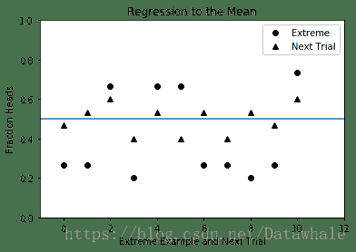
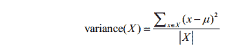
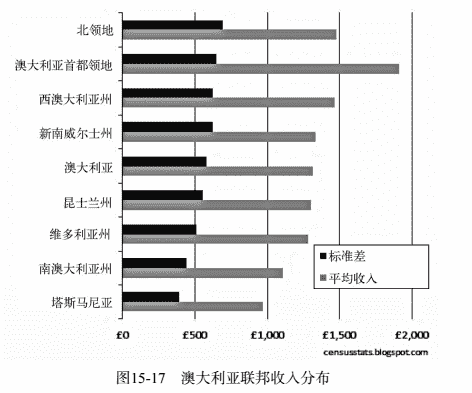
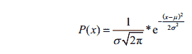
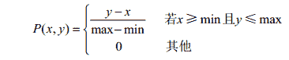
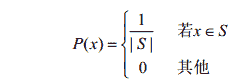
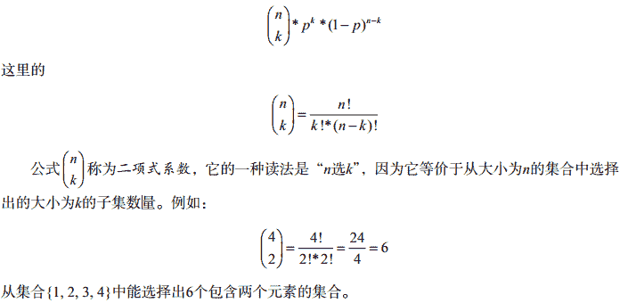

## 随机程序

**掷骰子**

```
import random
def rollDie():
    """返回一个1~6的随机整数"""
    return random.choice([1,2,3,4,5,6])
def rollN(n):
    result = ''
    for i in range(n):
        result = result + str(rollDie())
    print(result)
```

```
>>>rollN(5)
31441
```

*   random.choice接受一个非空序列作为参数，然后返回一个从序列中随机选择的元素。
*   random中几乎所有函数都以random.random为基础，它会生成一个**0.0~1.0**的随机浮点数。

**相互独立**
在随机过程中，如果一个事件的结果不会影响另一个事件的结果，我们就称这两个事件是相互独立的。

## 计算简单概率

**概率**
一般来说，当我们讨论具有某种特性的结果的概率时，实际上是想知道在所有结果中，具有这种特性的结果占多少比例。这就是概率取值范围在0~1的原因。

**独立概率的乘法法则**
举例来说，考虑两个独立事件A和B。如果A发生的概率是1/3， B发生的概率是1/4，那么A和B同时发生的概率就是(1/3) × (1/4)。

## 统计推断

**统计推断的指导原则**
一个从总体数据中随机抽取的样本往往可以表现出与总体相同的特性。

**抛硬币**

```
def flip(numFlips):
    """假设numFlips是一个正整数"""
    heads = 0
    for i in range(numFlips):
        if random.choice(('H', 'T')) == 'H':
            heads += 1
    return heads/numFlips
def flipSim(numFlipsPerTrial, numTrials):
    """假设numFlipsPerTrial和numTrials是正整数"""
    fracHeads = []
    for i in range(numTrials):
        fracHeads.append(flip(numFlipsPerTrial))
    mean = sum(fracHeads)/len(fracHeads)
    return mean
```

*   numTrials表示进行实验的次数，numFlipsPerTrial表示每次实验的次数
*   函数flip可以模拟抛掷一个均匀的硬币numFlips（numFlipsPerTrial）次，然后返回正面向上的比例。
*   对于每次抛掷，它都会调用random.choice((‘H’, ‘T’))随机地返回一个’H’或’T’。

```
>>>flipSim(10, 1)
0.8
>>>flipSim(10, 100)
0.484
>>>flipSim(100, 100000)
0.4997
```

**大数定律**
这个定律说明，在独立可重复的实验中，如果每次实验中出现某种特定结果的实际概率为p，那么实验次数接近无穷大时，出现这种结果的比例与实际概率p之间的差收敛于0。

值得注意的是，大数定律并不意味着如果预期行为出现偏差，那么这些偏差会在未来被相反的偏差“扯平”，尽管太多的人都是这样认为的。这种对大数定律的滥用称为`赌徒谬误`。

**均值回归**
如果出现一个极端的随机事件，那么下一个随机事件很可能就不是极端的。

如果你将一个均匀的硬币抛了6次，每次都是正面向上，那么均值回归就意味着如果再抛6次硬币，结果就非常可能接近3次正面向上这个期望值。而不是像赌徒谬误那样，认为在下一个抛掷序列中，正面向上的概率要小于反面向上的概率。

**演示均值回归**

*   函数regressToMean首先生成numTrials次实验，每次实验抛掷硬币numFlips次。
*   然后，它找出所有正面向上比例小于1/3或大于2/3的实验，将这些极端值以圆点的形式绘制在图中。此后，对于其中每个圆点，找
    出紧随其后的那次实验，并以三角形的形式将其结果绘制在圆点正下方。

```
import pylab
def regressToMean(numFlips, numTrials):
    #获取每次实验（抛掷numFlips次硬币）中正面向上的比例
    fracHeads = []
    for t in range(numTrials):
        fracHeads.append(flip(numFlips))
    #找出具有极端结果的实验，以及这些实验的下一次实验
    extremes, nextTrials = [], []
    for i in range(len(fracHeads) - 1):
        if fracHeads[i] < 0.33 or fracHeads[i] > 0.66:
            extremes.append(fracHeads[i])
            nextTrials.append(fracHeads[i+1])
    #绘制结果
    pylab.plot(range(len(extremes)), extremes, 'ko', label = 'Extreme')
    pylab.plot(range(len(nextTrials)), nextTrials, 'k^', label = 'Next Trial')
    pylab.axhline(0.5)
    pylab.ylim(0, 1)
    pylab.xlim(-1, len(extremes) + 1)
    pylab.xlabel('Extreme Example and Next Trial')
    pylab.ylabel('Fraction Heads')
    pylab.title('Regression to the Mean')
    pylab.legend(loc = 'best')
    pylab.show()
```



*   图中的横线使用函数axhline生成，正好位于0.5处，表示期望的均值。
*   函数pylab.xlim设置了X轴的范围。函数调用pylab.xlim(xmin, xmax)可以设置当前图中X轴的最小值和最大值。函数调用pylab.xlim()则会返回一个由当前图中X轴的最小值和最大值组成的元组。函数pylab.ylim的工作方式也是一样的。
*   如果一个实验得到了极端结果，那么紧跟在它后面的实验结果一般会比上次的极端结果更靠近均值

**方差**
方差是一种测量方式，用来表示可能出现的不同结果的分散程度。一个数值集合的方差X可以定义为：

这里的|X|是集合中元素的数量， μ是均值。
通俗地说，方差描述了集合中接近于均值的数值的比例。

**标准差**
一个数值集合的标准差是方差的平方根。尽管它包含的信息与方差完全相同，但标准差更容易解释，因为它与原始数据的单位是一致的。

举例来说，相对于“总体的平均身高是70英寸，方差为16平方英寸”，我们更容易理解“总体的平均身高是70英寸，标准差为4英寸”这种表达。

**实现方差与标准差**

```
def variance(X):
    """假设X是一个数值型列表。
       返回X的方差"""
    mean = sum(X)/len(X)
    tot = 0.0
    for x in X:
        tot += (x - mean)**2
    return tot/len(X)
def stdDev(X):
    """假设X是一个数值型列表。
       返回X的标准差"""
    return variance(X)**0.5
```

**变异系数**
当我们比较具有不同均值的数据集合时，变异系数比标准差更合适。

*   一般来说，变异系数的值如果小于1，就可以认为方差很小。
*   与标准差相比，变异系数的主要优点是，它可以用来比较具有不同均值的数据集合的离散程度。

```
def CV(X):
    mean = sum(X)/len(X)
    try:
        return stdDev(X)/mean
    except ZeroDivisionError:
        return float('nan')
```


如果使用标准差作为衡量收入不平等的方式，那么塔斯马尼亚地区的收入不平等性看似显著小于ACT（澳大利亚首都特区）地区。但是，如果看一下变异系数（ACT为0.32，塔斯马尼亚为0.42），就可以得到完全相反的结论。

这并不是说变异系数总是比标准差更有用处：

*   如果均值接近于0，那么均值的一个微小改变就会导致变异系数发生非常大（但不一定有意义）的变化。而且均值为0时，变异系数是没有意义的。
*   还有，标准差可以用来构造置信区间，变异系数则不能。

## 分布

**直方图**
直方图表示的是一种**频率分布**，它告诉我们一个随机变量的取值落在某个范围内的频繁程度。

**概率分布**
概率分布给出一个随机变量取值在某个范围内的概率，并以此反映相对频率。

根据随机变量是离散型的还是连续型的，概率分布可以分成两类：`离散型概率分布`和`连续型概率分布`。

**离散型随机变量**
离散型随机变量的取值是一个有限集合，如掷骰子的结果；

**连续型随机变量**
连续型随机变量的取值可以是无限的，可以是两个实数之间的任意一个实数。例如，汽车的行驶速度可以在0英里/小时和最大行驶速度之间。

**离散型概率分布**
离散型概率分布很容易描述，因为变量取值是有限的，所以只要简单列出每个值的概率即可描述这种分布。

**连续型概率分布**
连续型概率分布则更复杂一些。因为有无限多个可能的取值，且连续型随机变量取某个特定的值的概率通常为0。

例如，汽车的行驶速度正好为81.3457283英里/小时的概率大概就是0。

数学家们喜欢用`概率密度函数`（probability density function）来描述连续型概率分布，并经常将其缩写为PDF。 PDF描述了一个随机变量位于两个数值之间的概率。

你可以将PDF看作定义在X轴上随机变量的最小值与最大值之间的一条曲线。（有时候， X轴是无限长的。）如果假设x1和x2是随机变量的两个值，那么随机变量取值在x1和x2之间的概率就是x1和x2之间的曲线下面积。

**正态分布**
正态分布（又称高斯分布）由以下概率密度函数定义：


*   这里的μ表示均值， σ表示标准差， e是欧拉数（大约为2.718）。
*   如果你不想学习这个公式也没有问题，只需记住正态分布在均值处达到最大值，并在均值两侧对称地减小，逐渐趋近于0。
*   正态分布具有良好的数学特性，它可以由两个参数完全确定：均值和标准差（公式中仅有的两个参数）。知道这两个值就等于知道了整个分布。正态分布的形状有点像钟，所以有时又被称为`钟形曲线`。
*   函数random.gauss(mu, sigma)，这个函数会从一个均值为mu、标准差为sigma的正态分布中随机返回一个浮点数。
*   正态分布的一个良好特性是均值和标准差的独立性。举例来说，大约68.27%的数据都位于距均值1个标准差的范围内，大约95.45%的数据位于距均值2个标准差的范围内，大约99.73%的数据位于距均值3个标准差的范围内。人们有时将这种情况称为68-95-99.7法则，但更多时候将其称为`经验法则`。通过定义正态分布的公式可以计算曲线下的面积，从而推导出经验法则。

**证明经验法则**
SciPy库包含了很多科学家和工程师经常使用的数学函数。

函数scipy.integrate.quad求一个函数在两个点之间的积
分的近似值，有3个必需的参数和一个可选的参数：

*   一个要进行积分的函数或方法（如果这个函数有多个参数，就按照第一个参数进行积分）
*   表示积分下限的数值
*   表示积分上限的数值
*   一个可选的元组，为要进行积分的函数提供所有参数，第一个参数除外

quad函数`返回`一个由两个浮点数组成的元组，其中第一个浮点数是积分的近似值，第二个浮点数是对结果中绝对误差的一个估计值。

举个例子，假设我们想计算一元函数abs在区间0~5的积分。

```
>>>import scipy.integrate
>>>print(scipy.integrate.quad(abs, 0, 5))
(12.5, 1.3877787807814457e-13)
```

**证明**

```
import scipy.integrate
def gaussian(x, mu, sigma):
    factor1 = (1.0/(sigma*((2*pylab.pi)**0.5)))
    factor2 = pylab.e**-(((x-mu)**2)/(2*sigma**2))
    return factor1*factor2
def checkEmpirical(numTrials):
    for t in range(numTrials):
        mu = random.randint(-10, 10)
        sigma = random.randint(1, 10)
        print('For mu =', mu, 'and sigma =', sigma)
        for numStd in (1, 2, 3):
            area = scipy.integrate.quad(gaussian, mu-numStd*sigma,mu+numStd*sigma,(mu, sigma))[0]
            print(' Fraction within', numStd, 'std =',round(area, 4))

checkEmpirical(3)
```

运行代码，会输出完全符合经验法则的结果：

```
For mu = -5 and sigma = 3
 Fraction within 1 std = 0.6827
 Fraction within 2 std = 0.9545
 Fraction within 3 std = 0.9973
For mu = 8 and sigma = 2
 Fraction within 1 std = 0.6827
 Fraction within 2 std = 0.9545
 Fraction within 3 std = 0.9973
For mu = -5 and sigma = 1
 Fraction within 1 std = 0.6827
 Fraction within 2 std = 0.9545
 Fraction within 3 std = 0.9973
```

**置信区间**
经验法则经常被用来得到置信区间。对于一个未知的值，我们不应该估计出一个单一的值，而是应该使用置信区间提供一个可能包含这个未知值的范围，以及这个未知值落入这个范围的确定程度。

例如， 一项政治民意调查显示，在95%的置信水平下，候选人会得到52% ± 4%的选票（也就是说，置信区间为8个单位）。这就是说，民意调查分析者相信，候选人得到48%~56%的选票的可能性为95%。 将置信区间和置信水平结合起来，就可以表示估计值的可靠程度。提高置信水平几乎总是会使置信区间变大。

**连续型和离散型均匀分布**

**均匀分布**
假设你想在一个车站搭乘公共汽车，汽车每15分钟一班。如果没有按照发车时间表到达车站，那么你的预期等待时间就是一个0~15分钟的均匀分布。

均匀分布可以是离散型的，也可以是连续型的。

**连续型均匀分布**
连续型均匀分布也称为`矩形分布`，它的特点是所有长度相同的区间都具有相同概率。

我们可以使用一个参数完全描述出连续型均匀分布的特性，即它的范围（也就是最小值和最大值）。如果可能取值的范围是min~max，那么一个值落入x~y的概率可以由以下公式给出：

调用random.uniform(min, max)可以生成一个连续型均匀分布的值，它会返回在min和max之间随机选择的一个浮点数。

**离散型均匀分布**
离散型均匀分布描述的是，结果不是连续的而且每个结果发生的概率完全相同的情况。

例如，掷出一个均匀的骰子时， 6个数字出现的可能性都是一样的。但结果在1~6的实数范围内却不是均匀分布的，大多数的值——比如2.5——出现的可能性是0，而少数值——比如3——出现的概率是1/6。我们可以使用下面的公式来完整地描述离散型均匀分布：

这里的S是可能出现的结果的集合， |S|是S中的元素数量。

**二项式分布与多项式分布**

**分类变量**
只能在一个离散集合中取值的随机变量称为分类变量，也称名义变量或离散变量。

**二项式分布**
如果分类变量只可能有两个值（如成功或失败），那么这时的概率分布就称为二项式分布。

可以将二项式分布理解为n次独立实验中正好成功k次的概率。如果单次实验成功的概率为p，那么n次独立实验中正好成功k次的概率可以由以下公式给出：


**多项式分布**
多项式分布是二项式分布的推广，用来描述取值多于两个的分类数据。如果在n次独立实验中，每次实验都存在m个具有固定概率的互相排斥的结果，那么这时候适用于多项式分布。多项
式分布可以给出各种结果的任何一种组合发生的概率。

**指数分布和几何分布**

**指数分布**
指数分布非常常见，它经常用来对两次输入的时间间隔进行建模。例如，汽车进入高速公路的间隔时间和访问网页的时间间隔。

**指数衰减**
指数衰减经常用半衰期来描述，即初始值衰减到50%所需的时间。独立的项目也可以有半衰期。例如，一个药物分子的半衰期就是指它被清除的概率达到0.5所需的时间。

**指数增长**
指数增长是指数衰减的反义词。指数增长也很常见，复利的计算、游泳池中水藻的生长、原子弹中的链式反应等，都是指数增长的例子。

**几何分布**
几何分布是指数分布的离散模拟，经常用于描述在第一次成功（或第一次失败）之前所需的独立尝试次数。

**本福德分布**
本福德定律定义了一种十分奇怪的分布。令S是一个大的十进制数集合，那么每个非0数字出现的第一位的概率是多少？大多数人会认为应该是1/9。在人造数据集中（如伪造实验数据或者
进行金融欺诈），这个想法通常是对的。

但在自然产生的数据集中，这个想法一般是错的，它们服从一种由本福德定律预测的分布。对于一个十进制数的集合，如果第一位数字是d的概率符合P(d) = log10(1 + 1/d)，就称它满足
本福德定律。

举例来说，根据这个定律，首位数字是1的概率大约有30%！令人震惊的是，很多实际数据集都符合这个定律。