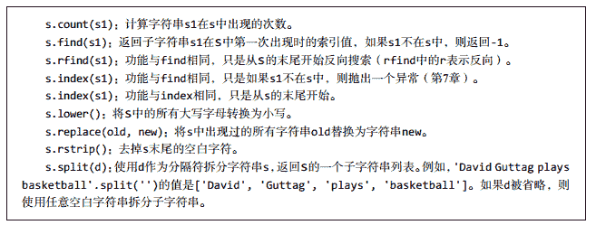

## 题目描述

请实现一个函数：

*   将一个字符串中的每个空格替换成“%20”。

例如，当字符串为We Are Happy.则经过替换之后的字符串为We%20Are%20Happy。

## 理解

*   如何对字符串进行替换操作
    先看看字符串中有哪些常用方法
    
    观察到s.replace(old,new)可以对字符串进行替换，所以自然想到了我们的解题思路1

## 解题思路

**思路1**

```
class Solution:
    # s 源字符串
    def replaceSpace(self, s):
        return s.replace(" ","%20") 
```

**思路2**
如果不用方法呢？可以尝试遍历替换

方法1

```
class Solution:
    # s 源字符串
    def replaceSpace(self, s):
        s_new=""
        for i in s:
            if i==" ":
                i="%20"
            s_new+=i
        return s_new 
```

方法2

```
class Solution:
    # s 源字符串
    def replaceSpace(self, s):
        s = list(s)
        for i in range(len(s)):
            if s[i]==" ":
                s[i]="%20"
        return "".join(s) 
```

[关于join的用法](https://www.cnblogs.com/hokky/p/8479991.html)

**思路3**
如果不新建列表或者空字符串怎么解决呢？毕竟重新分配空间是一种浪费