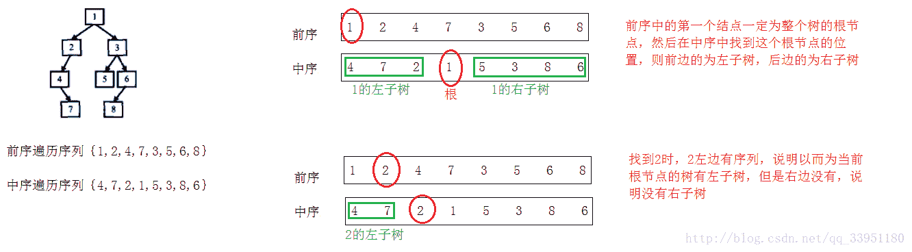

## 题目描述

*   输入某二叉树的前序遍历和中序遍历的结果
*   请重建出该二叉树
    假设输入的前序遍历和中序遍历的结果中都不含重复的数字。例如输入前序遍历序列{1,2,4,7,3,5,6,8}和中序遍历序列{4,7,2,1,5,3,8,6}，则重建二叉树并返回。

```
class TreeNode:
    def __init__(self, x):
        self.val = x
        self.left = None
        self.right = None
```

## 理解

*   二叉树的遍历（参考：[二叉树遍历](https://baike.baidu.com/item/%E4%BA%8C%E5%8F%89%E6%A0%91%E9%81%8D%E5%8E%86/9796049?fr=aladdin)，[重建二叉树](https://blog.csdn.net/qq_33951180/article/details/72790549)）

    *   前序遍历（NLR）
        遍历顺序为（根-左-右），每次读取的第一个值一定是根节点，这样我们可以在中序遍历的序列中找到当前的根节点的位置。
    *   中序遍历（ LNR）
        遍历顺序为（左-根-右），当确定了一个根节点后，其左边序列就是这个根节点的左子树，右边序列就是其右子树。
    *   后序遍历（ LRN）
        遍历顺序为（左-右-根）



*   [Python实现二叉树遍历](https://www.cnblogs.com/freeman818/p/7252041.html)

## 解题思路

**思路1**

*   前序遍历的第一个值一定为根节点，对应于中序遍历中间的一个点。在中序遍历序列中，这个点左侧的均为根的左子树，这个点右侧的均为根的右子树。
*   利用递归，分别取前序遍历[1:i+1]和中序遍历的[:i]对应与左子树继续上一个过程，取前序遍历[i+1:]和中序遍历[i+1:]对应于右子树继续上一个过程，最终得以重建二叉树。
*   i是中序序列中pre(0)所在位置，也就是中序序列中根的位置

```
class TreeNode:
    def __init__(self, x):
        self.val = x
        self.left = None
        self.right = None
class Solution:
    def reConstructBinaryTree(self, pre, mid):
        if len(pre) == 0:
            return None
        if len(pre) == 1:
            return TreeNode(pre[0])
        else:
            res = TreeNode(pre[0])
            res.left = self.reConstructBinaryTree(pre[1: mid.index(pre[0]) + 1], mid[: mid.index(pre[0])])
            res.right = self.reConstructBinaryTree(pre[mid.index(pre[0]) + 1: ], mid[mid.index(pre[0]) + 1: ])
        return res
```

附其他人写的代码：

```
class Solution:
    def reConstructBinaryTree(self, pre, tin):
        if pre==[]:
            return None
        val = pre[0]
        idx = tin.index(val)
        ltin = tin[0:idx]
        rtin = tin[idx+1:]
        lpre = pre[1:1+len(ltin)]
        rpre = pre[1+len(ltin):]
        root = TreeNode(val)
        root.left = self.reConstructBinaryTree(lpre,ltin)
        root.right = self.reConstructBinaryTree(rpre,rtin)
        return root
```