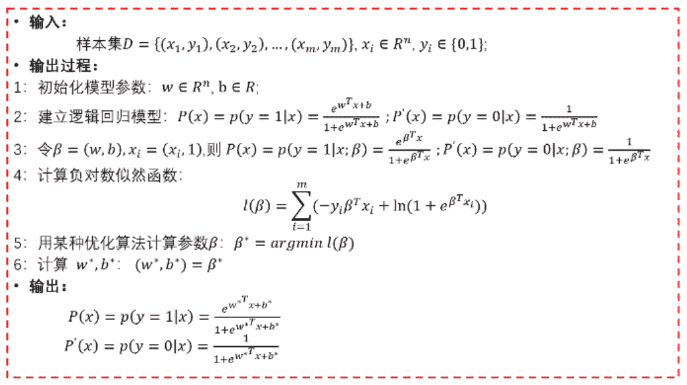
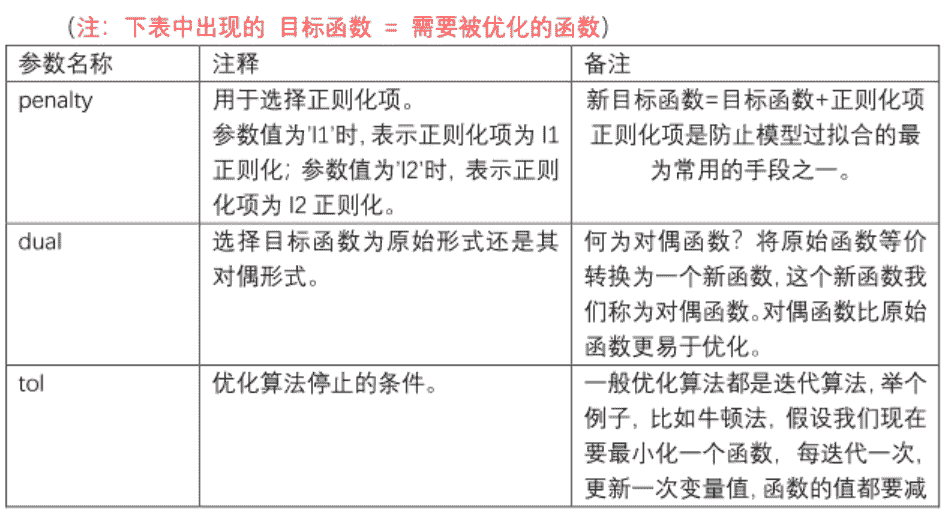
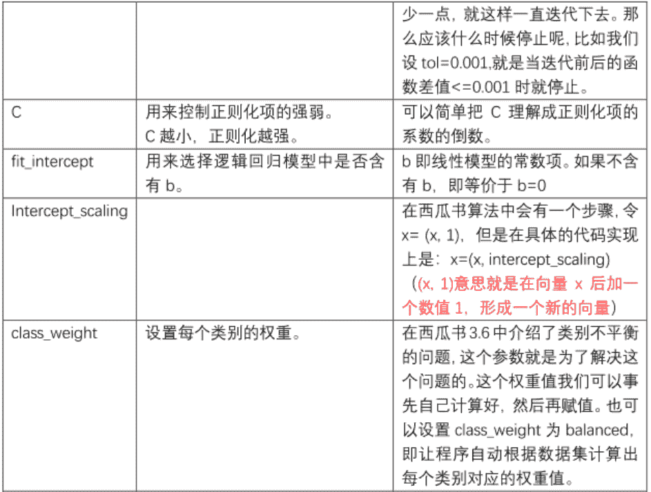
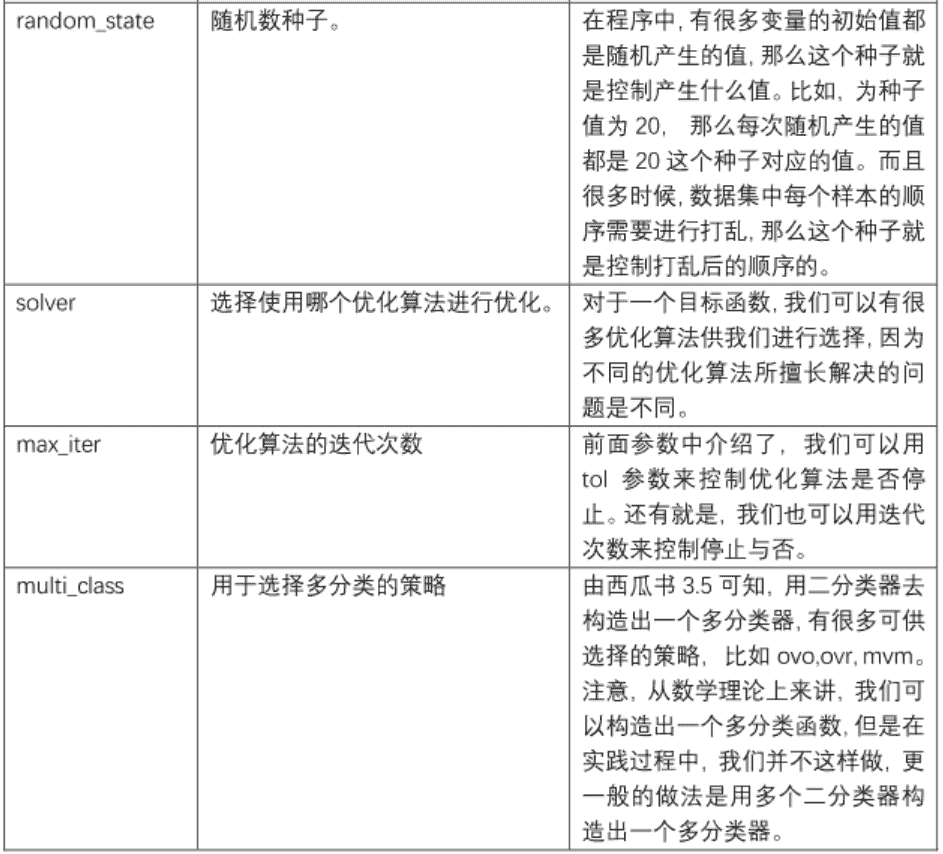
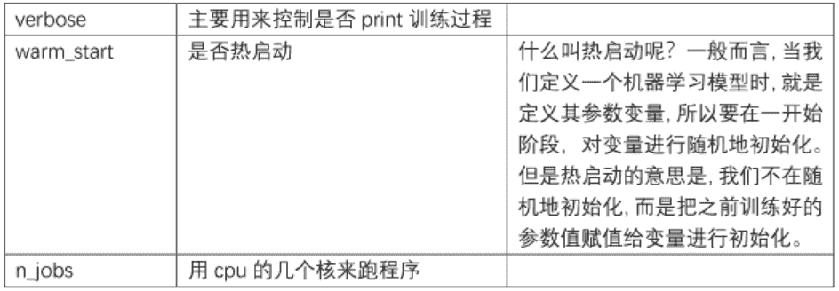

## 作业1

**描述逻辑回归算法**

## 作业3

**整理逻辑回归参数**

*   [参考链接1-博客](https://blog.csdn.net/jark_/article/details/78342644)
*   [参考链接2-sklearn文档](http://scikit-learn.org/stable/modules/generated/sklearn.linear_model.LogisticRegression.html#sklearn.linear_model.LogisticRegression.decision_function%20%E9%80%BB%E8%BE%91%E5%9B%9E%E5%BD%92)
    
    
    
    