## 问题

**Q1 如果我想分析一下文本分类错误的原因，应该从哪些方面入手？**

*   可以去分析一下哪个类别错误率高，然后看看这个类别的是否不平衡，针对这个类别看看能不能进行改进。
*   还有就是数据量过少，或是数据质量较差(比如人为标注的样本可能类别是不正确的)，都会影响到模型的学习。
*   因为分类错误这个受特征和模型的参数影响也很大，这可以从这两个方面考虑一下。

**Q2 为什么Bagging难以提升朴素贝叶斯分类器的性能？**

*   朴素贝叶斯分类器，主要是依靠数据集的这些样本用极大似然的方法估计总体分布，所以当然是数据集越大越好。
*   而Bagging每个基学习器只抽取一部分样本，自然训练出来的朴素贝叶斯分类器很差，所以集成后也基本不太可能有大的提升。

**Q3 为什么我用LinearSVC做基分类器的时候，不管是Bagging还是Adaboost都和单个分类器一模一样呢，增加分类器个数结果也完全不变**

*   一般模型的上限由特征决定，而你的几个模型的特征可能相同，所以会相似。
*   而Bagging并不一定比单模型好啊，bagging每个基模型都只用了一部分数据，基分类器比较弱啊，所以有可能在基分类器的基础上提升很小。
*   但是，如果是完全10个完全不认识的人做10个模型，最后将10个结果结果进行投票决定，那么这个肯定是比单模型有提升的，因为你们10个模型都好而不同。但是bagging无法保证这一点。

**Q5 3.15是什么意思啊？y不应该是等于e的（W.tx＋b）次方吗**

3.15的意思就是 g(y)是一个线性模型，而y不是，所以称为广义线性模型。而这里的函数g并不一定是ln,所以y不应该等于e的***

**Q6 logisticRegression的对偶形式会讲解吗，或者有参考资料数学公式吗吗。我在运行课程代码的时候讲dual设置为False，结果训练了4倍的正常时间，不理解是为啥。**

哈哈，这个你就发现了一个问题了吧，设置为True就会变快，那就对了。因为对偶函数比原函数更易于优化，到后边的svm你就会发现了。但是这个函数包里具体用的什么对偶形式，我现在还不是很清楚。

**Q7 处理异常值过程中（这里单指某个连续字段），我对训练集大于95%分位数的值用95%分位数去代替，那么做预测时对测试集做异常值处理应该怎么操作呢？**
**1）是用测试集95%分数值去替代大于测试集95%分数的值吗？**
**2）还是用训练集95%分数去替换测试集中大于训练集95%分位数的数呢？**
**另外，如果在数据清理过程，是应该先处理缺失值还是先处理异常值（离群点）**

*   第一个问题，如果在处理异常值时，不考虑类别信息的话，是要训练集和测试集放到一起进行统计处理的。如果你要考虑类别信息的话，只能处理训练集。
*   第二个问题，如果空缺值不处理也不影响剔除离群点，那么可以先剔除离群点，反之要补全空缺值。其实，有时候这些影响没有那么大，还得具体问题具体看，不用纠结哈。

**Q8 西瓜书第152页关于西瓜密度值的条件概率，应该是假定密度取值服从正态分布，通过训练数据集估计出了西瓜样本均值和方差，然后用这个估计出的均值和方差反过来计算好瓜中出现密度为0.697的西瓜的概率和坏瓜中出现密度为0.697的西瓜的概率。问题是，为什么这两个概率算出来大于1？**

*   这个是概率密度，而不是概率。

**Q9 在softmax回归那节中，logistic回归的代价函数写为以下形式是怎么来的呢？可否列出推导过程?**
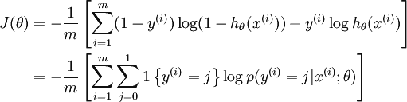
**西瓜书中以对数似然函数作为目标函数是代价函数吗？**
**代价函数和损失函数是一回事吗？**

*   这个代价函数(损失函数)是直接写出来的，对于分类问题的代价函数，这个式子是经典的公式，是一种经典的代价函数。

**Q10 3.6类别不平衡的3.48公式，我有点困惑，为什么这样就可以实现3.47的效果呀**

假设一个数据集有正例和反例两类样本，并且正类远少于反类，此时，如果让我们的学习器去学习，那么学完的学习器必定会完全偏向反例，即学习器对正例几乎没有啥预测能力。此时，我们应该把学习器的决策人为的偏向正例些，那么应该偏多少呢？就是要除以(m+/m-)，以使学习器在判别时偏向正例些。

**Q11 公式3.11怎么推到公式3.12的？我对3.12这个公式表达的意思以及下面的一段话机器不能理解**

将3.11带入3.3，经过简单变形就可以得到3.12。下面的意思就是，解3.10那个线性方程组，当方程的个数少于未知数个数的情况时，即不满秩，这样方程组的解就不唯一。

**Q12 p61的第一行的后面两个式子代表什么意思？不明白所谓的求和符号∑i所代表的协方差矩阵长什么样。**

协方差矩阵是个矩阵，矩阵的每个元素值就是两个属性之间的协方差。书中讲的将样本点投影到直线上，即映射到了另外一个空间，形成了一个新的坐标。所以书中提到的的两类样本的协方差我也不确定是不是协方差矩阵的意思，你可以自己考虑一下。
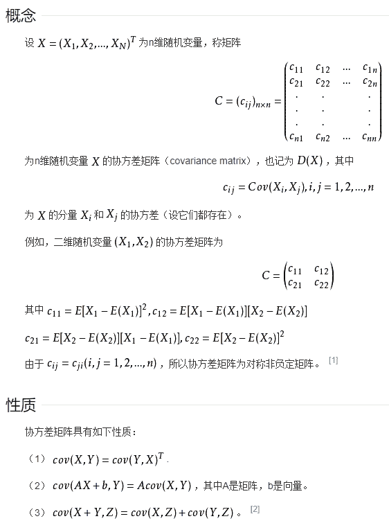

**Q13 我使用yolo3训练一个图像分类时,它的loss值降到某一个值，后又上升很大然后又开始下降，如此反复是什么原因**

原因很多，可能学习率过大，可能网络结构有问题。正常训练时，训练集的loss是一直下降的，除了一开始阶段。

**Q14 调用sklearn中的LogisticRegression时，可以调整学习率吗？**

不可以，逻辑回归中没有调整学习率这个参数

**Q15 arg是表示什么意思？**

argmin意思就是 取 函数值最小时的 w b值

**Q 16 闭式解怎么理解呢**
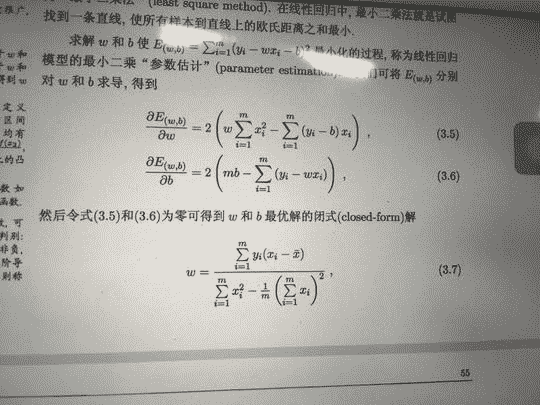
闭式解，另一种叫法是 解析解，与数值解对应。平时我们做题解时，严格根据各个公式进行推理计算，就是在求解析解，也是精确解。而数值解，一般是用计算机用迭代法求近似解。

**Q17 想请问一下3.9这个公式是怎么得到的**
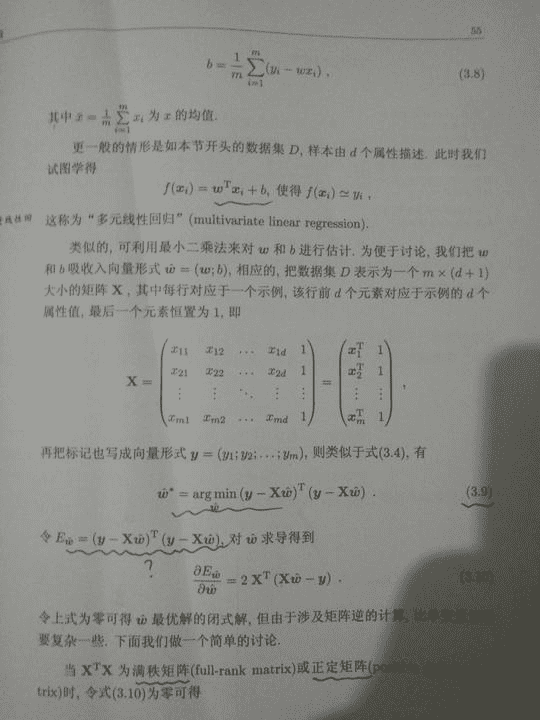
就是差的平方和，写成了矩阵形式，类似3.4形式

**Q18 这里的3.9和3.10是怎么得出来的？涉及矩阵的什么性质吗？谢谢。**
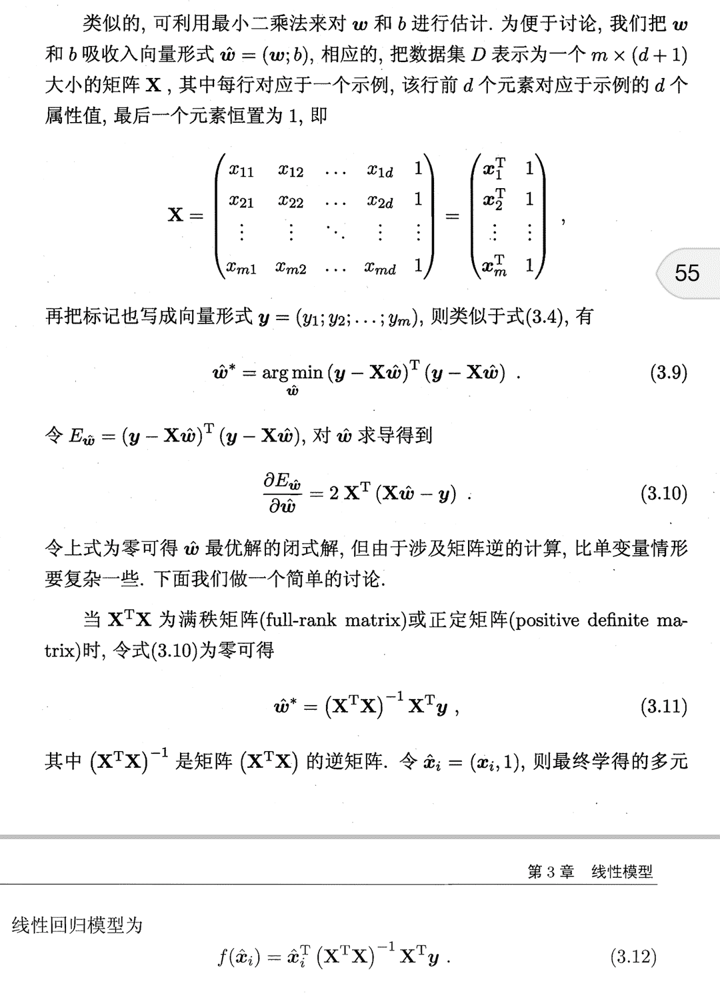
不涉及，就是用矩阵的形式表达出来比较简洁，就是差平方的和啊，和3.4类似的

**Q19 西瓜书59页3.27，我推导不出书上的形式，是我哪里错了？**
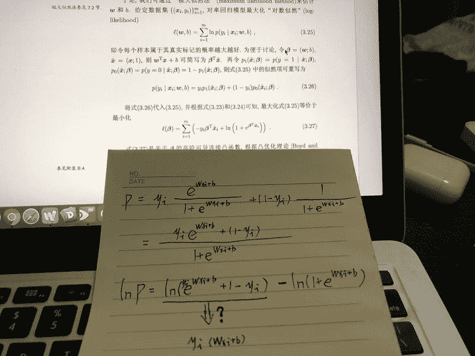
yi只能取0或1，然后就可以立即推出来了

**Q20 请问3.26这个式子是怎么来的？是期望吗？**
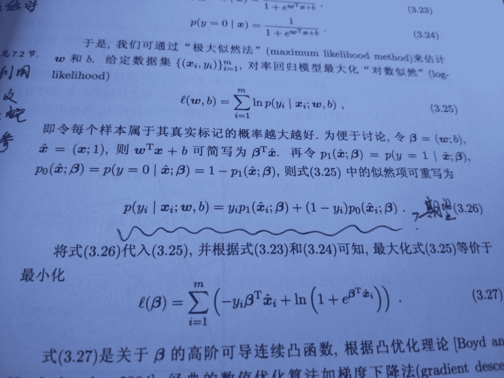
不是期望，就是两个式子合成一个式子表达

**Q21 直接用逻辑回归做模型，那么输出也是二分类啊，您给解释一下，如果由二分类变成多分类，也应该有一对多或者其他的处理吧**
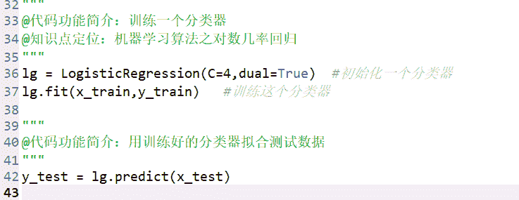
这个函数包内部自己实现了构造多分类器，相关策略你看一下西瓜书3.5

**Q22 这里的输入属性数目只有一个，是说只有一个自变量一个因变量，这个简单的情形是指一元线性回归吗？**
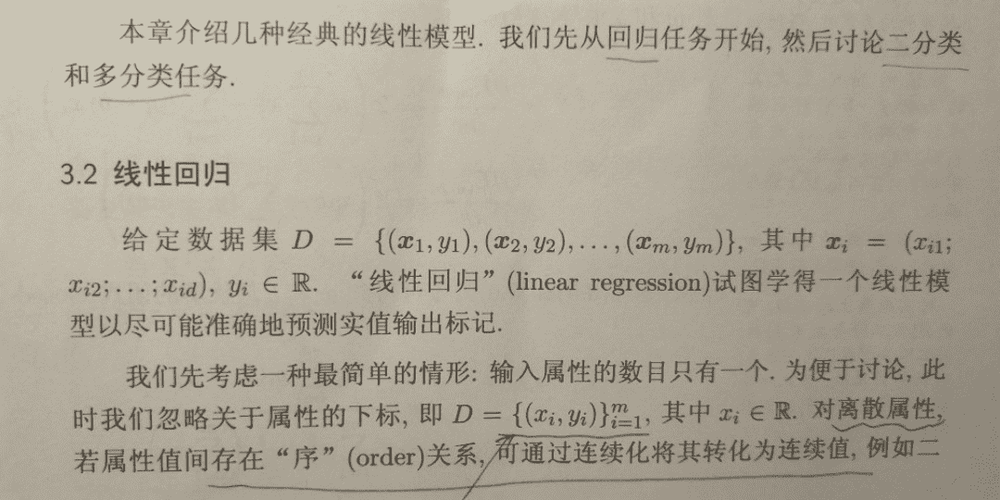
是的

**Q23 请问这个Ex啥意思**

E代表期望，x代表随机变量

**Q24 您能将3.22推导3.23，3.24的过程写下来吗？**

3.18经过简单变形得3.23，由 p(y=0|x)=1-p(y=1|x)可得3.24

**Q25 sklearn里的逻辑回归中的优化函数后面的一项是怎么来的，没看懂**
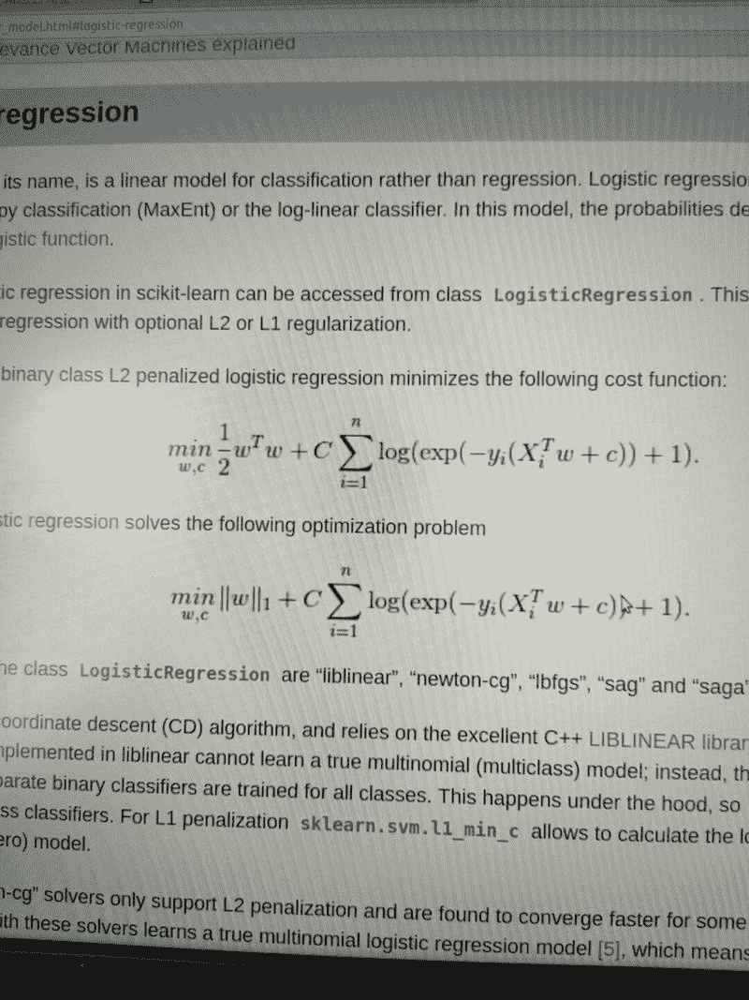
如图
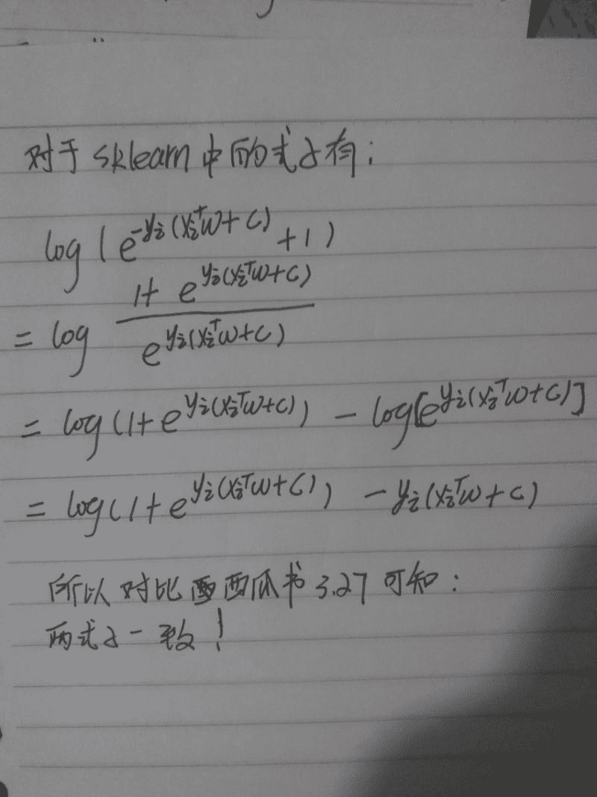

## 分享

**S1 看到了 逻辑回归 中 参数dual，对偶形式，因此查看源码发现其本质应该是调用了 liblinear 的实现。接下来发现了其推导过程好复杂。用到了牛顿法等。有兴趣的可以推导一下**

[查看地址](https://tminka.github.io/papers/logreg/minka-logreg.pdf)

**S2 与非的个人博客分享**

*   [Softmax 回归和西瓜书第 3 章线性模型 3.6 节内容](https://segmentfault.com/a/1190000016127002)
*   [机器学习算法——西瓜书学习记录 [1]](https://segmentfault.com/a/1190000016091382)

**S3 theodore的个人公众号文章分享**

[一文搞懂决策树算法](https://mp.weixin.qq.com/s/Cf6dfiazZGNxYmRhbdRsLw)

**S4 周彦君3.5,3.10的推导**
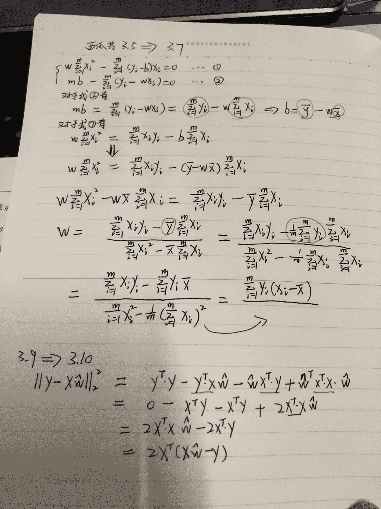

**S5 小闹钟的笔记**
[西瓜书第三章部分公式推导笔记](http://view.zsxq.com/view/5b8357b12540ed22802f6d53)

**S6 Arya的笔记**
[《机器学习》周志华-读书笔记](https://alisaben.github.io/2018/08/18/%E3%80%8A%E6%9C%BA%E5%99%A8%E5%AD%A6%E4%B9%A0%E3%80%8B%E5%91%A8%E5%BF%97%E5%8D%8E-%E8%AF%BB%E4%B9%A6%E7%AC%94%E8%AE%B0/)