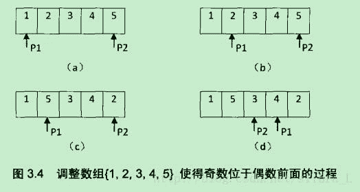

## 题目描述

*   输入一个整数数组，实现一个函数来调整该数组中数字的顺序
*   使得所有的奇数位于数组的前半部分，所有的偶数位于数组的后半部分
*   并保证奇数和奇数，偶数和偶数之间的相对位置不变。

## 理解

*   [合并两个列表](https://blog.csdn.net/saw1990/article/details/50507510)
*   [list与array互相转换](https://blog.csdn.net/lql0716/article/details/52807493/)

## 解题思路

**思路1**

```
class Solution:
    def reOrderArray(self, array):
        odd = []
        even = []
        for i in array:
            if i%2==1:
                odd.append(i)
            else:
                even.append(i)
        return odd + even
```

或者简写为

```
class Solution:
    def reOrderArray(self, array):
        odd = [i for i in  array if i&1]
        even = [j for j in array if not j&1]
        return odd + even
```

**思路2**

*   不考虑奇数和奇数，偶数和偶数之间的相对位置不变这一条件
*   采用两指针分别从首尾出发，当头指针遇到一个偶数，并且尾指针遇到一个奇数时，交换两指针的数字，直到两指针相遇。时间复杂度为O(n)，(类似于快排)
    

```
class Solution:
    def reOrderArray(self, array):
        n = len(array)
        head = 0
        tail = n - 1
        while head < tail:
            while array[head]%2 != 0:
                head += 1
            while array[tail]%2 == 0:
                tail -= 1
            array[head], array[tail] = array[tail], array[head]
            head += 1
            tail -= 1
```