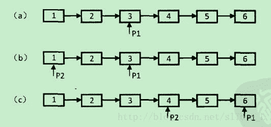

## 题目描述

*   输入一个链表，输出该链表中倒数第k个结点。

## 理解

*   [链表详解](https://facert.gitbooks.io/python-data-structure-cn/3.%E5%9F%BA%E6%9C%AC%E6%95%B0%E6%8D%AE%E7%BB%93%E6%9E%84/3.21.%E5%AE%9E%E7%8E%B0%E6%97%A0%E5%BA%8F%E5%88%97%E8%A1%A8%EF%BC%9A%E9%93%BE%E8%A1%A8/)
*   [python数据结构之链表](https://www.cnblogs.com/king-ding/p/pythonchaintable.html)

## 解题思路

**[思路1](https://blog.csdn.net/slibra_L/article/details/78176540)**

*   确定链表种结点个数lenth
*   倒数第k个结点就是第length-k+1个结点
*   需要考虑代码鲁棒性

    *   链表是否为空—头结点不存在
    *   k<=0
    *   链表长度小于k

```
class Solution:
    def FindKthToTail(self, head, k):
        if head==None or k<=0:
            return None
        length = 1
        node = head
        while node.next!=None:
            length+=1
            node = node.next
        if k>length:
            return None
        for i in range(length-k):
            head = head.next
        return head
```

**[思路2](https://blog.csdn.net/slibra_L/article/details/78176540)**

*   设置2个指针，第一个指针走k步之后，第二个指针开始从头走，这样两个指针之间始终相隔k，当指针1走到链表结尾时，指针2的位置即倒数k个节点 。
    
*   思路推广：寻找中间节点, 两个指针一起, 第一个指针每次走两步, 第二个指针每次走一步, 快指针指到尾部, 慢指针正好指到中间

```
class Solution:
    def FindKthToTail(self, head, k):
        if head==None or k<=0:
            return None
        p1 = head
        p2 = head
        for i in range(k-1):
            if p1.next == None:
                return None
            else:
                p1=p1.next
        while p1.next!=None:
            p1=p1.next
            p2=p2.next
        return p2
```

或者

```
class Solution:
    def FindKthToTail(self, head, k):
        if not head or not k:
            return None
        p1 = head
        p2 = head
        for i in range(k-1):
            if not p1.next:
                return None
            p1=p1.next
        while p1.next:
            p1=p1.next
            p2=p2.next
        return p2
```