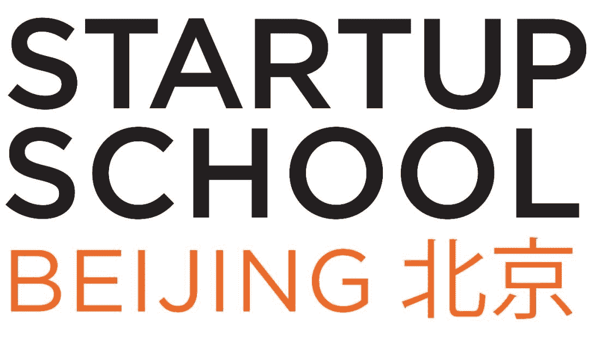

> 为了更好地与中国的创业公司交流，硅谷创业孵化器 Y Combinator（YC）首次登陆中国，并于 5 月 19 日在清华大学举办“Startup School 北京”。
> 
> “Startup School 北京”活动当天， YC 主席 Sam Altman、Airbnb 创始人、Strikingly 创始人、Stripe 创始人、中国的 Raven Tech 创始人都出席本次活动，并与现场 300 位创业者分享创业理念和心得。
> 
> 过往参加过“Startup School”的嘉宾包含 Facebook 的创始人、LinkedIn 的创始人等。Startup School 是创始人开启创业之旅的第一站，在这里你将学到如何创建和运营一个成功科技公司。
> 
> YC 方面表示： “自 2013 年第一支创业团队从 YC 毕业后，越来越多的中国团队从 YC 启航和毕业。YC 认为中国是目前发展速度最快的科技生态体系和大型创新中心，越来越多的创业公司在中国诞生，因此 YC 非常希望有机会可以与中国的创业者交流，帮助并推动创业者的创业进程。”
> 
> 为了本次活动的顺利举办，YC 选择了自己孵化的第一支中国团队 Strikingly 作为联合主办方，参与活动的策划和执行。同时，清华大学也作为另一个联合主办方提供了场地和支持。

*   [课程主页](http://ycofficial.sxl.cn/)
*   [视频](https://vzan.com/live/tvchat-693524?jumpitd=1&shareuid=0&v=636715742338001139)
*   [下载（m3u8 格式）](http://oss-vod.vzan.cc/live/131709193915640302.1526724135.m3u8)