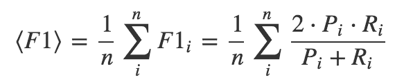

## 比赛内容

此次比赛，达观数据提供了一批长文本数据和分类信息，希望选手动用自己的智慧，结合当下最先进的NLP和人工智能技术，深入分析文本内在结构和语义信息，构建文本分类模型，实现精准分类。

## 评分规则

*   评分算法
    binary-classification

*   评分标准
    采用各个品类[F1指标](https://www.cnblogs.com/weedboy/p/7072010.html)的算术平均值，它是Precision 和 Recall 的调和平均数。
    
    其中，Pi是表示第i个种类对应的Precision， Ri是表示第i个种类对应Recall。

## 数据

**数据内容**

数据包括train_set和test_set两份csv文件

```
train_set.csv
```

此数据集用于训练模型，每一行对应一篇文章。文章分别在“字”和“词”的级别上做了脱敏处理。共有四列：

*   第一列是文章的索引(id)
*   第二列是文章正文在“字”级别上的表示，即字符相隔正文(article)
*   第三列是在“词”级别上的表示，即词语相隔正文(word_seg)
*   第四列是这篇文章的标注(class)。
    注：每一个数字对应一个“字”，或“词”，或“标点符号”。“字”的编号与“词”的编号是独立的！

```
test_set.csv
```

*   此数据用于测试。数据格式同train_set.csv，但不包含class。
    注：test_set与train_test中文章id的编号是独立的。

**数据大小**

*   原始数据
    训练集：(102277, 4)
    测试集：(102277, 3)

*   TfidfVectorizer处理后对article和word进行拼接
    训练集：(102277, 12503911)
    测试集：(102277, 12503911)

[数据下载地址](https://pan.baidu.com/s/17UjEEcB2taT_HvU1FC1bCQ#list/path=%2F)