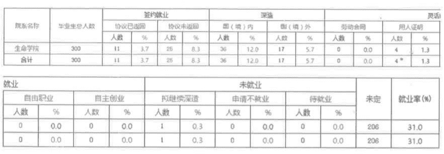
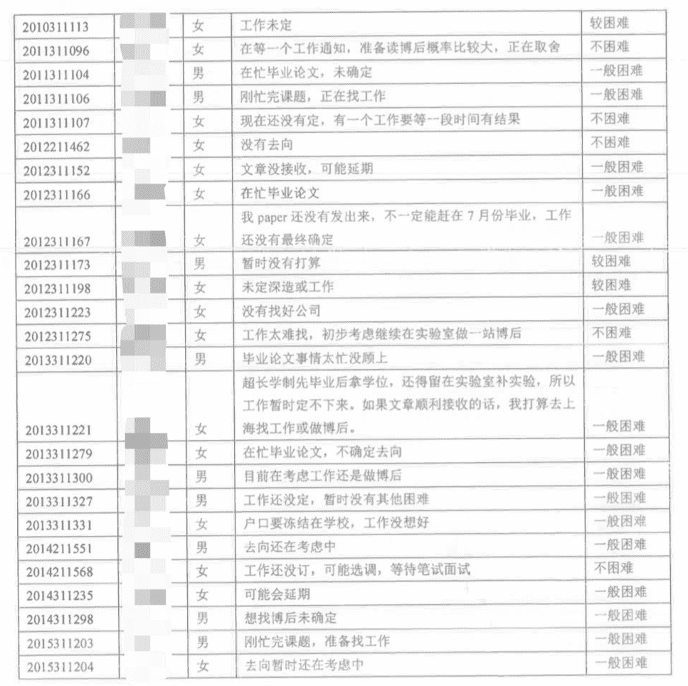
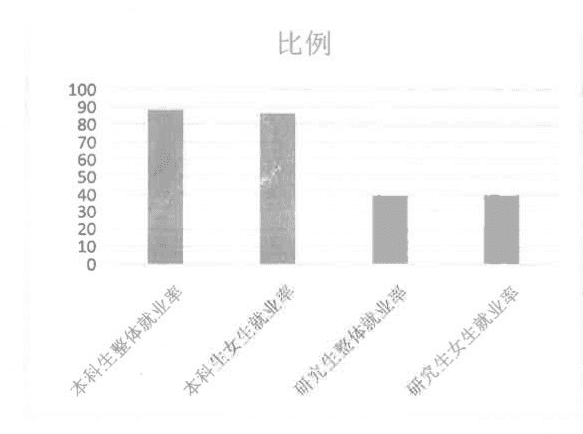
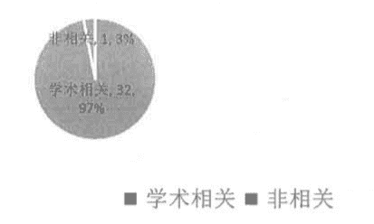
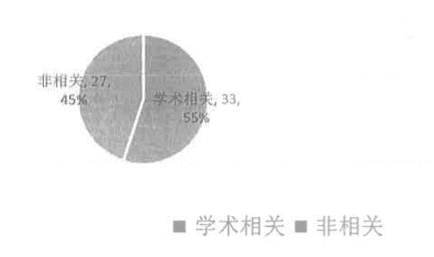

时间：20170406

## 一、截至目前生命学院整体就业情况

### 1.1 系统就业率



### 1.2 实际排查就业率

```
(60+92)/(68+230)=51.06% 
```

## 二、本科生就业排查

2017 届本科生 68 人，已确定去向 60 人（已登记去向 32 人）

### 2.1 确定去向的 60 人中

*   国内深造 35 人（清华大学；深圳研究生院；北京大学等）
*   国外深造 23 人（Yale 耶鲁大学；Johns Hopkins 约翰霍普金斯大学；Univ Oxford 牛津大学等）
*   国内就业 1 人（■■■就职互联网企业）
*   拟继续深造 1 人（■■■先结业明年毕业）

### 2.2 未确定去向的 8 人中

*   拟继续深造 5 人（■■■■■■■■■■在申请出国还未定；■■■■■■■正在申请 CLS 准备面试）
*   拟就业 2 人
*   待定 1 人（■■■可能延期）

## 三、研究生就业排查

2017 届研究生 230 人，已确定去向 92 人（已登记去向 60 人）

### 3.1 确定去向的 92 人中

*   国外深造 17 人（马普研究所；华盛顿大学；德克萨斯大学西南医学中心；加州大学-旧金山；MSKCC 斯隆-凯特琳癌症纪念医院等）
*   国内深造 22 人（清华大学；北京大学；中国人民解放军军事医学科学院附属医院；北京协和医院；清华大学深圳研究生院等）
*   就业 51 人（中共河北省委组织部；首都医科大学附属北京儿童医院；中国科学院上海生命科学研究院；清华大学附属实验学校；中关村发展集团股份有限公司；国家知识产权局专利局等）
*   定向 2 人（青海大学、塔里木大学）

## 3.2 未确定去向的 138 人中

*   可能会延期 29 人
*   拟继续深造 48 人（正在找博后）
*   拟就业 36 人（正在找工作中）
*   待定 25 人（不确定能否毕业及去向未定）



## 四、女生就业统计

*   2017本科生 68 人，已落实去向 60 人，比例 88.23%；女生 29 人，已落实去向 25 人，比例 86.20%
*   2017研究生 230 人，已落实去向 92 人，比例 40%；女生 13 人，已落实去向 45 人，比例 39.8%



## 五、学术就业率

2017 届本科生 68 人，根据已登记去向人数 33 人，共中深造及学术就业人数 32 人，比例 97%



2017 届研究生 230 人，根据已登记去向人数 60 人，共中深造及学术就业人数 33 人，比例 55%



## 六、少数民族就业率

*   2017 届本科生 68 人，少数民族 5 人，家庭一般困难 1 人，并已落实去向；
*   2017 届研究生 230 人,少数民族 16 人，其中硕士 4 人，博士 12 人，家庭困难 0 人，已落实去向 4 人

## 七、生命学院就业工作的重点、难点和特色

### 7.1 重点

*   困难学生-组织进行就业实践或实习，重点指导、重点■■■
*   离校未就业毕业生-离校后仍然关注积极联系，咨询现状■■■

### 7.2 难点

*   科研压力较大，择业时间较短，找工作不积极
*   女博土生就业考虑方面较多，对户籍等有要求

### 7.3 特色

*   学术就业比例高
*   充分调动校友积极性和主动性，积极参与到在校生的职业规划工作

## 八、就业引导及辅导情况

### 8.1 就业引导

*   师兄师姐面对面-校友交流活动（共计三场，覆盖医疗、教育、创业领域）
*   院系专场招聘会（共计五场，生物专业对口医疗企业）

### 8.2 职业辅异

*   201609 新生迎新说明会
*   201609 新生集中入学教育
*   201703 毕业生就业去向说明会

## 九、2017 届就业工作计划落实情况

*   结合科学可行的工作计划与实事求是的工作总结，树立健全的就业工作制度
*   建立健全的毕业生数据库，建立多通路的就业信息发布渠道，加强沟通交流
*   坚持“学术为主、兼顾其他”的就业引导理念，结合社会实践与就业引导
*   扩大宜传力度，抓好每学期就业动员会、座谈会，做好就业信息推广工作，与企业达成合作意向，精选对口企业，举办专场招聘会
*   邀请知名学者开展各类就业引导讲座，开展校友交流活动

> [原件（密码：pric）](https://link.zhihu.com/?target=https%3A//pan.baidu.com/s/1kz7NeC3-VKvrbqlskWRAlg)
> 
> 由[匿名用户](https://www.zhihu.com/question/28347460)分享
> 
> 另见知乎收藏[逐梦气功界](https://www.zhihu.com/collection/105513774)