> 原文：[A Comprehensive Survey of Graph Embedding: Problems, Techniques and Applications (arxiv 1709.07604)](https://arxiv.org/abs/1709.07604)
> 
> 译者：[飞龙](https://github.com/wizardforcel)
> 
> 协议：[CC BY-NC-SA 4.0](http://creativecommons.org/licenses/by-nc-sa/4.0/)
> 
> 自豪地采用[谷歌翻译](https://translate.google.cn/)

## 一、引言

图自然存在于各种各样的现实世界场景中，例如，社交媒体网络中的社交图/扩散图，研究领域中的引用图，电子商务区中的用户兴趣图，知识图等。这些图的分析提供了如何充分利用隐藏在图中的信息，因此在过去的几十年中受到了极大的关注。 有效的图分析可以使许多应用受益，例如节点分类 [1]，节点聚类 [2]，节点检索/推荐 [3]，链接预测 [4]等。例如，通过分析基于的构建图。在社交网络中的用户交互（例如，在Twitter中转发/评论/关注），我们可以对用户进行分类，检测社区，推荐朋友，并预测两个用户之间是否会发生交互。

尽管图分析是实用且必不可少的，但是大多数现有的图分析方法具有高计算和空间成本。 许多研究工作致力于有效地进行昂贵的图分析。 示例包括分布式图数据处理框架（例如，GraphX [5]，GraphLab [6]），新的节省空间的图存储，它可以加速 I/O 和计算成本[7]，等等。

除了上述策略之外，图嵌入提供了一种有效的方法来解决图分析问题。 具体而言，图嵌入将图转换为保存图信息的低维空间。 通过将图表示为（或一组）低维向量，图算法可以有效地计算。 存在不同类型的图（例如，同构图，异构图，属性图等），因此图嵌入的输入在不同场景中变化。 图嵌入的输出是表示图（或整个图）的一部分的低维向量。 图1展示了以不同粒度将图嵌入2D空间的玩具示例。 即，根据不同的需要，我们可以将节点/边/子结构/整图表示为低维向量。 有关不同类型的图嵌入输入和输出的更多详细信息，请参见第3节。

在21世纪初期，图嵌入算法主要是通过假设数据位于低维流形中，来减少非关系数据的高维度。 给定一组非关系高维数据特征，基于成对特征相似性构建相似性图。 然后，图中的每个节点被嵌入到低维空间中，其中连接的节点彼此更接近。4.1 节介绍了这一系列研究的例子。。 自2010年以来，随着图在各个领域的激增，图嵌入的研究开始以图作为输入并利用辅助信息（如果有的话）来促进嵌入。 一方面，它们中的一些专注于将图的一部分（例如，节点，边，子结构）（图1（b）- 1（d））表示为一个向量。 为了获得这种嵌入，他们要么采用最先进的深度学习技术（第 4.2 节），要么设计一个目标函数来优化边重建概率（第 4.3 节）。 另一方面，还有一些工作集中在将整个图嵌入一个向量，用于图级应用（图 1（e））。 图核（第 4.4 节）通常旨在满足此需求。

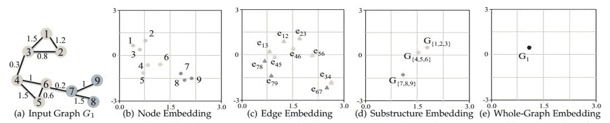

**图1：**将图嵌入具有不同粒度的2D空间的玩具示例。

图嵌入问题与两个传统的研究问题有关，即图分析[8]和表示学习[9]。 特别是，图嵌入旨在将图示为低维向量，同时保留图结构。 一方面，图分析旨在从图数据中挖掘有用信息。 另一方面，表示学习获得数据表示，使得在构建分类器或其他预测变量时，更容易提取有用信息[9]。 图嵌入在两个问题上重叠，并侧重于学习低维表示。 请注意，我们在此综述中区分了图学习和图嵌入。 图表示学习不要求学习的表示是低维的。 例如，[10]将每个节点表示为向量，其维数等于输入图中的节点数。 每个维度表示节点与图中每个其他节点的测地距离。

将图嵌入低维空间并非易事。 图嵌入的挑战取决于问题设定 ，包括嵌入输入和嵌入输出。 在本综述中，我们将输入图分为四类，包括同构图，异构图，辅助信息 图和非关系数据图 。 不同类型的嵌入输入携带不同的信息来保留在嵌入空间中，因此对图嵌入的问题提出了不同的挑战。 例如，当仅嵌入具有结构信息的图时，节点之间的连接是要保留的目标。 但是，对于具有节点标签或属性信息的图，辅助信息从其他视角提供图属性，因此在嵌入期间也可以考虑。 与给定和固定的嵌入输入不同， 嵌入输出是任务驱动的。 例如，最常见的嵌入输出类型是节点嵌入，其将邻近节点表示为类似向量。 节点嵌入可以使节点相关的任务受益，例如节点分类，节点聚类等。然而，在某些情况下，任务可能与图的更高粒度有关，例如，节点对，子图，整个图。 因此，在嵌入输出方面的第一个挑战，是为感兴趣的应用找到合适的嵌入输出类型。 我们对四种类型的图嵌入输出进行了分类，包括节点嵌入，边嵌入，混合嵌入和整图嵌入 。 不同的输出粒度对于“良好”嵌入具有不同的标准并且面临不同的挑战。 例如，良好的节点嵌入保持嵌入空间中的相邻节点的相似性。 相反，良好的整图嵌入将整个图示为向量，从而保持图级相似性。

在不同问题设定中面临的挑战的观察中，我们通过基于问题设定和嵌入技术对图嵌入文献进行分类，提出了两种图嵌入工作的分类法。 这两种分类法对应于图嵌入中存在的挑战以及现有研究如何应对这些挑战。 特别是，我们首先介绍图嵌入问题的不同设置以及每个设置中面临的挑战。 然后，我们描述现有研究如何在他们的工作中应对这些挑战，包括他们的见解和技术解决方案。

请注意，虽然已经有了一些图嵌入的综述（[11,12,13]），但它们有以下两个限制。 首先，他们通常只提出一种图嵌入技术的分类。 他们都没有从问题设定的角度分析图嵌入工作，也没有总结每个环境中的挑战。 其次，现有的图嵌入综述仅涉及有限数量的相关工作。 例如，[11]主要介绍了十二种代表性的图嵌入算法，[13]只关注知识图嵌入。 此外，没有分析每种图嵌入技术背后的洞察力。 对现有图嵌入工作的全面回顾，以及对每种嵌入技术的洞察力的高级抽象，可以促进该领域的未来研究。

下面，我们总结了本次综述的主要贡献。

我们提出了基于问题设定的图嵌入分类法，并总结了每个环境中面临的挑战。 我们是第一个基于问题设定对图嵌入工作进行分类的综述，它为理解现有工作带来了新的视角。

我们提供了图嵌入技术的详细分析。 与现有的图嵌入综述相比，我们不仅研究了更全面的图嵌入工作集，而且还总结了每种技术背后的见解。 与简单地列出过去如何解决图嵌入相反，总结的见解回答了为什么可以以某种方式解决图嵌入的问题。 这可以作为未来研究的深刻见解。

我们系统地对使用图嵌入的应用进行分类，并将应用划分为节点相关，边相关和图相关。 对于每个类别，我们提供详细的应用场景作为参考。

我们建议了图嵌入领域的四个有前途的未来研究方向，包括计算效率，问题设定，解决方案技术和应用。 对于每个方向，我们对其在当前工作中的缺点（不足）进行全面分析，并提出未来的研究方向。

本次综述的其余部分安排如下。 在第二节中，我们介绍理解图嵌入问题所需的基本概念的定义，然后提供图嵌入的形式问题定义。 在接下来的两节中，我们提供了两种图嵌入分类法，其中分类法结构如图 2 所示。第 3 节基于问题设定比较了相关工作，并总结了每个设置中面临的挑战。 在第 4 节中，我们基于嵌入技术对文献进行分类。抽象出每种技术背后的见解，并在最后提供不同技术的详细比较。 之后在第 5 节中，我们将介绍图嵌入的应用。 然后，我们在第六节中将讨论中未来的四个研究方向，并在第七节结束本综述。

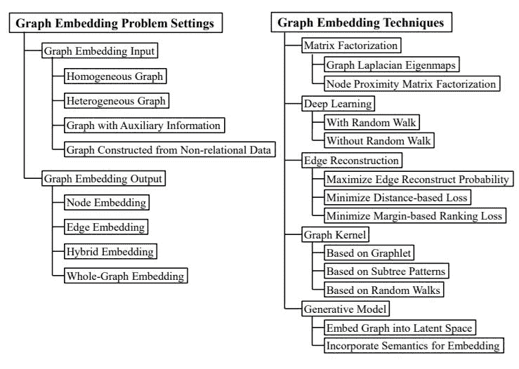

**图 2：**根据问题和技术的图嵌入分类法。

## 二、问题形式化

在本节中，我们首先介绍图嵌入中基本概念的定义，然后提供图嵌入问题的正式定义。

### 符号和定义

本综述中使用的符号的详细说明见表 1 。

**表1：**本文中使用的符号。

| 符号 | 说明 |  |
| --- | --- | --- |
|  | 集合的基数 |  |
|  = 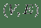 | 带有节点  和边  的图  |  |
|  =  | 图  的子结构，其中 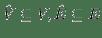 |  |
|  ，  | 节点 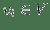 和连接  和  的边  |  |
|  | 接邻矩阵  |  |
|  | 矩阵 A 的第 i 行向量 |  |
| 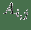 | 矩阵 A 的第 i 行第 j 列 |  |
|  ，  | 节点  类型和边  的类型 |  |
|  ，  | 节点类型集和边类型集 |  |
|  | 节点  的k个最近邻居 |  |
| 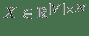 | 特征矩阵，每行 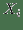 是  的  维向量 |  |
|  ，  ，  | 节点  ，边  和结构  的嵌入 |  |
|  | 嵌入的维度 |  |
| `<h, r, t>` | 知识图三元组，具有头部实体  ， |  |
|  | 尾部实体  以及他们之间的关系  |  |
|  ，  | 节点  和  之间的一阶和二阶邻近度 |  |
|  | 信息级联 |  |
|  | 拥有级联  的级联图 |  |

图是  = ，其中 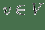 是一个节点， 是一个边。 关联节点类型的映射函数 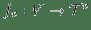 和边类型的映射函数 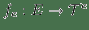。

 和  分别表示节点类型和边类型的集合。 每个节点  属于一种特定类型，即 。 同样，对于 ，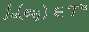。

同构图  =_  是一个图，满足 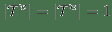。 中的所有节点属于单一类型，所有边都属于单一类型。

异构图  =  是一个图，满足 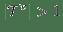 和/或 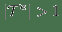。

知识图  =  是一个有向图，其节点是实体 ，边是主体 - 属性 - 客体三元组。形式为（ 头部实体 ， 关系，尾部实体）的每个边（表示为 ）表示关系  来自实体  到实体 。

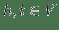 是实体， 是关系。 在本综述中，我们将  称作知识图三元组。 例如，在图 3 中，有两个三元组： 和 。 请注意，知识图中的实体和关系通常具有不同的类型[14,15]。因此，知识图可以被视为异构图的实例。

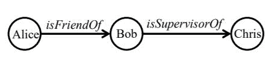

**图3：**知识图的玩具示例。

通常采用以下邻近度量来量化要在嵌入空间中保留的图属性。 一阶邻近度是仅由边连接的节点之间的局部成对相似性。 它比较节点对之间的直接连接强度。 从形式上看，

节点  和节点  之间的一阶邻近度是边  的权重，即 。

如果两个节点由具有较大权重的边连接，则它们更相似。 表示节点  和  之间的一阶邻近度， 我们有 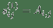。 让 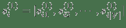 表示  和其他节点的一阶邻近度。 以图 1（a）中的图为例， 和  的一阶邻近度是边的权重 ，表示为 。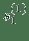 记录  和图中的其他节点的边的权重，即 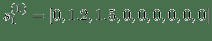。

二阶邻近度比较节点的邻域结构的相似性。 两个节点的邻域越相似，它们之间的二阶邻近度越大。从形式上看，

节点  和 之间的二阶邻近度  是  的邻居_ _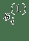 和  的邻居 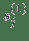 的相似度。

再次，以图[1（a）](#fig:ig)为例： 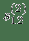 是  和 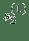 的相似度。 如前所述，  并且 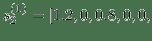 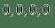。 让我们考虑余弦相似度 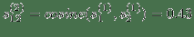 和 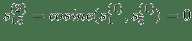。 我们可以看到  和  之间的邻近度等于零， 和  没有任何共同邻居。  和  有一个共同的邻居 ，因此他们的二阶邻近度  大于零。

可以同样定义更高阶的邻近度 。 例如，节点  和  之间的 K 阶邻近度是 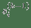 和 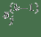 的相似度。 请注意，有时高阶邻近度也使用其他一些指标来定义，例如 Katz Index，Rooted PageRank，Adamic Adar 等[11]。

值得注意的是，在一些工作中，一阶和二阶邻近度是基于两个节点的联合概率和条件概率凭经验计算的。 更多细节将在 4.3.2 中讨论。

图嵌入：给定图的输入  = ，以及嵌入的预定义维度  （），图嵌入的问题是，将  转换为一个  维空间，其中尽可能保留图属性。可以使用诸如一阶和更高阶邻近度来量化图特性。每个图都表示为  维向量（对于整图）或一组  维向量，每个向量表示图的一部分的嵌入（例如，节点，边，子结构）。

图1显示了嵌入图的玩具示例  。 给定一个输入图（图[1（a）](#fig:ig) ），图嵌入算法用于将节点（图[1（b）](#fig:ne) ）/边（图[1（c）](#fig:ee) ），子结构（图[1（d））](#fig:se) ）/整图（图[1（e）](#fig:we) ）转换为2D向量（即2D空间中的点）。 在接下来的两节中，我们分别基于问题设定和嵌入技术，对图嵌入文献进行分类，提供了两种图嵌入分类法。